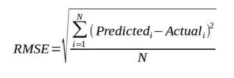

# 如何利用 Python 中的机器学习预测客户终身价值

> 原文：<https://blog.devgenius.io/how-to-predict-customer-lifetime-value-using-machine-learning-in-python-4066344d0ab0?source=collection_archive---------1----------------------->

## 使用 python、pandas 和 scikit-learn 和 RFM 分析的深入教程。


詹·西奥多在 [Unsplash](https://unsplash.com?utm_source=medium&utm_medium=referral) 上的照片

# **简介**

你有没有遇到过一大堆顾客，却不知道该怎么对待他们？

了解你的顾客的行为对于充分利用他们的惠顾是必不可少的。今天，我们可以利用大量可用的数据来预测每个客户在某段时间内会给公司带来多少价值。

预测客户未来价值的能力在以下方面很有用:

*   提供数据驱动的客户级指标，帮助实施将影响业务的前瞻性决策。
*   通过添加另一个维度来执行客户细分，从而丰富客户数据库。
*   可以进一步预测客户在不同产品类别上的花费。
*   让企业更多地了解客户的偏好，让他们在技术上更好地迎合他们。

在本教程中，使用在此处找到的[、](https://www.kaggle.com/datasets/marian447/retail-store-sales-transactions)ka ggle 数据集，我们将采取以下步骤:

*   收集并整合我们的数据。
*   使用一种称为递归 RFM(近期-频率-货币值)的技术将我们的数据集转换为丰富的要素。
*   拟合一个可以根据这些数据进行预测的模型。

我用来做教程的笔记本可以在这里[找到](https://colab.research.google.com/drive/1vmb2SxEhotciv6agNqSBVjGfcQCt1rVn?usp=sharing)。

# **步骤 1:收集数据**

对于我们的客户数据，我们基本上只需要 3 列:客户标识符、交易日期/时间和交易值，我们也可以引入其他功能，但您应该确保在功能工程步骤中按客户聚集它们。我们可以使用日期来提取星期几、月份、小时和所有与每笔交易相关的基于时间的特征。如果有不同类别的交易，也可以引入这些列。

```
import pandas as pd**# Load transaction data from CSV**
df = pd.read_csv(data_path) # path to your data**# Convert Date column to date-time object**
df.Date = pd.to_datetime(df.Date)df.head(10)
```

**输出**


输出

# 步骤 2:特征工程


## 新近性、频率和货币价值(RFM)

[RFM](https://farapaper.com/wp-content/uploads/2018/08/Fardapaper-Discovering-recency-frequency-and-monetary-RFM.pdf) 是一种以有意义的方式量化客户的方法，在对客户特定的交易数据进行任何分析时，可以作为一个很好的基准。

*最近度*、*频率*和*货币价值*捕捉客户最近一次交易的时间、他们返回业务的频率以及每位客户的平均销售额。我们可以通过使用任何其他可用特征(如毛利润、年龄、成本保持)或其他预测特征(流失风险或情绪分析)来增加这一点。我们将在下面讨论如何计算每一项。

其工作方式是，我们可以将训练数据拆分为一个 ***观测*** 期和一个 ***未来*** 期。如果我们想预测一个客户在一年中会花多少钱，我们会将*期的长度设置为一年，其余的时间将归入**(如下所示)。***

****

**观察到的/未来的分裂**

**这允许我们使用在*期间计算的特征来拟合模型，以回归在 ***未来*** 期间花费的金额。***

```
****# Data before cut off**
**observed** = df[df[date_col] < cut_off**# Data after cut off**
**future** = df[
(df[date_col] > cut_off) &
(df[date_col] < cut_off + pd.Timedelta(label_period_days, unit='D'))]**
```

**这里我们引入截止值的概念。这就是 ***观察到的*** 周期结束的地方，并定义了我们应该在什么日期之前计算我们的特征。**

*   ****最近:**自最近交易以来的时间(小时/天/周)。我们需要设定一个截止值来计算最近的时间。比如:*截止日期后多少天他们做了一笔交易？***

```
****# Copy transactions**
cut_off = df.Date.max()
recency = df[df.Date < cut_off].copy()**# Group customers by latest transaction**
recency = recency.groupby(customer_id_column)[date_column].max()recency = (max_date - recency).dt.days).reset_index().rename(
columns={date_column:'recency'})**
```

*   ****频率:**客户进行交易的不同时间段的数量。这将使我们能够跟踪客户进行了多少交易，以及交易发生的时间。我们还可以保留从截止日期开始计算这些指标的做法，因为这在以后会很方便。**

```
****# Copy transactions**
cut_off = df.Date.max()
frequency = df[df.Date < cut_off].copy()**# Set date column as index**
frequency.set_index(date_column, inplace=True)
frequency.index = pd.DatetimeIndex(frequency.index)**# Group transactions by customer key and by distinct period
# and count transactions in each period**
frequency = frequency.groupby([customer_id_column, pd.Grouper(freq="M", level=date_column)]).count()**# (Optional) Only count the number of distinct periods a transaction # occurred. Else, we will be calculating total transactions in each # period instead.**
frequency[value_column] = 1 # Store all distinct transactions**# Sum transactions**
frequency = frequency.groupby(customer_id_column).sum().reset_index().rename(
columns={value_column : 'frequency'})**
```

*   ****货币价值**:平均销售额。这里我们简单地计算每个客户所有交易的平均销售额。我们可以通过在最后一步中取*的总和而不是 ***的平均值*** 来额外添加一个“TotalAmountSpent”特征。***

```
****# Copy transactions**
cut_off = df.Date.max()
value = df[df.Date < cut_off].copy()**# Set date column as index**
value.set_index(date_column, inplace=True)
value.index = pd.DatetimeIndex(value.index)**# Get mean or total sales amount for each customer**
value = value.groupby(customer_id_column[value_column].mean().reset_index()
.rename(columns={value_column : 'value'})**
```

*   ****年龄:**第一次交易后的时间。对于此功能，我们只需找到每个客户第一次交易后的天数。同样，我们需要一个截止日期来计算截止日期和第一笔交易之间的时间。**

```
**cut_off = df.Date.max()
age = df[df.Date < cut_off].copy()**# Get date of first transaction**
first_purchase = age.groupby(customer_id_column)[date_column].min().reset_index()**# Get number of days between cut off and first transaction**
first_purchase['age'] = (cut_off - first_purchase[date_column]).dt.days**
```

**我们可以用下面的函数将所有这些函数包装在一起:**

```
****def customer_rfm(data, cut_off, date_column, customer_id_column, value_column, freq='M'):**cut_off = pd.to_datetime(cut_off)**# Compute Recency**
recency = customer_recency(data, cut_off, date_column, customer_id_column)**# Compute Frequency**
frequency = customer_frequency(data, cut_off, date_column, customer_id_column, value_column, freq=freq)**# Compute average value**
value = customer_value(data, cut_off, date_column, customer_id_column, value_column)**# Compute age**
age = customer_age(data, cut_off, date_column, customer_id_column)**# Merge all columns**
return recency.merge(frequency, on=customer_id_column).merge(
on=customer_id_column).merge(age, on=customer_id_column)**
```

**理想情况下，这可以在特定时间段内捕获关于客户保持度*的信息。这可能看起来像这样:***

```
****Customer_ID   recency    frequency            value       age**                                     1                 131            1         8.145000       131                      2                  69            1         7.770000        69                       3                 121            1         3.640000       121                      5                   4            4        14.672500       100**
```

**对于标签，我们只需合计每个客户在 ***未来*** 期间的消费金额。**

```
**labels = future.groupby(id_col)[value_col].sum()**
```

**在某些情况下，对整个数据集执行一次这种操作并拟合一个模型来预测标签可以产生可容忍的准确性。但是，如果你仔细观察，你可能会问:*如果在观察期间发生了有趣的事情呢？*问哪个问题才是正确的。简单地对数据集进行一次这样的操作会忽略数据中的所有季节性，并且只查看一个特定的标签时段。这里我们介绍一下我所说的，**递归 RFM** 。**

****递归 RFM****

**预测客户在某段时间内的终身价值的问题可以简化为简单地预测他们在未来*期间将花费多少。让我们应用到目前为止我们所知道的 RFM，并通过数据集进行循环。***

***假设数据在年初从左边开始。我们将选择一个频率(例如，一个月)并遍历数据集，从***【o】***计算我们的特征，并从 ***未来(f)生成我们的标签。这个想法是递归地计算这些特征，以便模型了解客户的行为如何随时间变化。******

****

**观察的(o)，未来的(f)**

**对于算法的这一部分，我们将首先获取数据集跨度中每个间隔的日期，并使用这些日期中的每个日期作为计算 RFM 要素和标注的截止日期。再次重申，在我们的示例中，我们选择了 1 个月的频率。**

**对于每个截止日期( **co** ):**

*   **计算截止前( **i** → **co** )所有行的 RFM 特征**
*   **计算截止日期和截止日期后一个月之间( **i** )行的标签(**co**→**I**→**co**+**频率**)**
*   ****外部连接**基于客户 ID 创建数据集的功能和标签，以填充未进行任何交易的客户。**

**连接循环中的所有数据集。**

**这在下面的代码中实现:**

```
****def recursive_rfm(data, date_col, id_col, value_col, freq='M', start_length=30, label_period_days=30):****# Resultant list of datasets**
dset_list = []**# Get start and end dates of dataset**
start_date = data[date_col].min() + pd.Timedelta(start_length, unit="D")end_date = data[date_col].max() - pd.Timedelta(label_period_days, unit="D")**# Get dates at desired interval**
dates = pd.date_range(
start=start_date, end=end_date, freq=freq
data[date_col] = pd.to_datetime(data[date_col]
)for cut_off in dates:
 **# split by observed / futur**e
   observed = data[data[date_col] < cut_off
   future = data[
                  (data[date_col] > cut_off) &
                  (data[date_col] < cut_off + pd.Timedelta(
                   label_period_days,  unit='D'))
                ]
 **# Get relevant columns**
   rfm_columns = [date_col, id_col, value_col]
   _observed = observed[rfm_columns]  **# Compute features from observed**
   rfm_features = customer_rfm(
        _observed, cut_off, date_col, id_col, value_col
   ) **# Compute labels from future**
   labels = future.groupby(id_col)[value_col].sum() **# Outer join features with labels to ensure customers 
   # not in observed are still recorded with a label of 0** dset = rfm_features.merge(
        labels, on=id_col, how='outer'
   ).fillna(0)
   dset_list.append(dset)**# Concatenate all datasets**
full_dataset = pd.concat(dset_list, axis=0)
res = full_dataset[full_dataset.recency != 0].dropna(axis=1, how='any')return resrec_df = recursive_rfm(data_for_rfm, 'Date', 'Customer_ID', 'Sales_Amount')**
```

**既然我们已经生成了数据集，我们就可以开始建模和预测了！我们现在需要做的就是对我们的结果数据进行洗牌和执行训练/测试分割。我们将 80%用于培训，20%用于测试。**

```
**from sklearn.model_selection import train_test_splitrec_df = rec_df.sample(frac=1) **# Shuffle****# Set X and y**
X = rec_df[['recency', 'frequency', 'value', 'age']]
y = rec_df[['Sales_Amount']].values.reshape(-1)**# Set test ratio and perform train / test split**
test_size = 0.2
X_train, X_test, y_train, y_test = train_test_split(X, y, test_size=test_size, random_state=42, shuffle=True)**
```

# ****第三步:模型****

**当谈到数据科学时，机器学习(及其包含的所有内容)只是一种用于估计变量之间关系的技术。为您的数据找到合适的模型是为您的用例获得最佳结果的另一个旅程。数据科学的真正价值在于使用这些技术在现实世界中做出明智的决策。**

**对于这个例子，我们将尝试一个随机森林回归器，因为它们的实现是即插即用的，所以很容易直接尝试。**

```
**from sklearn.ensemble import RandomForestRegressor**# Initialize and fit model on train dataset**
rf = RandomForestRegressor().fit(X_train, y_train)**
```

**一旦拟合，我们可以在数据框架中查看我们对测试集的预测。**

```
**from sklearn.metrics import mean_squared_error**# Create Dataframe and populate with predictions and actuals
# Train set**
predictions = pd.DataFrame()
predictions['true'] = y_train
predictions['preds'] = rf.predict(X_train)**# Test set**
predictions_test = pd.DataFrame()
predictions_test['true'] = y_test
predictions_test['preds'] = rf.predict(X_test)**# Compute error**
train_rmse = mean_squared_error(predictions.true, predictions.preds)**0.5test_rmse = mean_squared_error(predictions_test.true, predictions_test.preds)**0.5print(f"Train RMSE: {train_rmse}, Test RMSE: {test_rmse}")**
```

**输出:**

```
****Train RMSE**: 10.608368028113563, **Test RMSE**: 28.366171873961612**
```

**由于我们有一个回归任务，让我们使用均方根误差(RMSE)作为我们的误差度量，它将分别针对训练数据和测试数据的预测进行计算。这通过以下公式计算:**

****

**均方根误差方程**

**测试 RMSE 约为 28.4，这意味着我们对未知数据的预测误差约为 28.40 美元。此外，我们的列车 RMSE 明显低于我们的测试 RMSE，表明过度拟合。换句话说，它过于依赖训练数据来进行预测，并且正在努力根据它以前从未见过的数据进行预测。对于一个人来说，这类似于“封闭思维”，他需要学会在数据中寻找关系，这些关系可以概括为看不见的数据。绘制出我们的结果，我们可以看到有一些改进的余地。**

****

**预计支出与实际支出**

**在这个阶段，我们可能会执行一些超参数调优，或者尝试不同的模型，看看什么对我们的数据表现最好。像 H2O 汽车公司这样的工具可以让你为一项任务尝试 10 种甚至 100 种车型。**

# **结论**

**尽管如此，我们发现了一种以有意义的方式量化客户的方法，这种方法也可以用于其他任务，包括客户细分或流失风险。我们能够在工程数据上拟合一个机器学习模型，以预测客户在给定时间段内的支出。这只是使用客户数据来提高客户参与度和忠诚度的众多方法之一，尤其是在与上述任务一起使用的情况下。**

**非常感谢您阅读我的文章，请务必关注我，了解我即将发布的文章。我正在计划一个完整的系列，强调以有洞察力和强有力的方式利用客户数据的不同方式。**