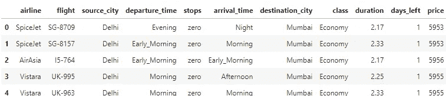
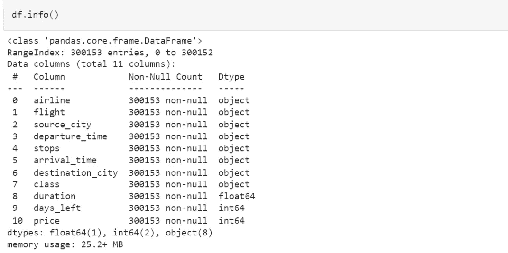
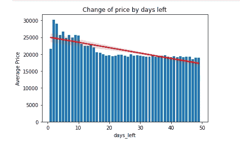
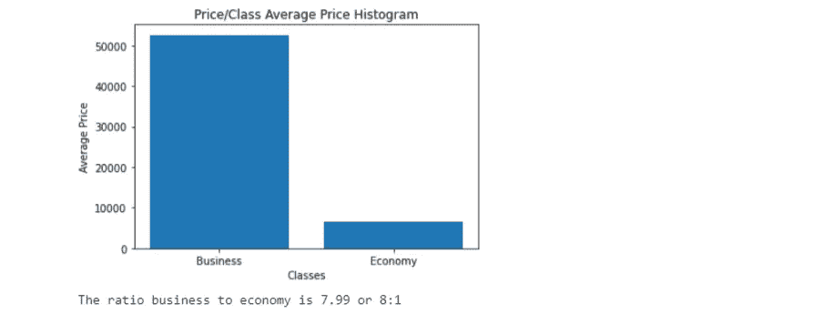
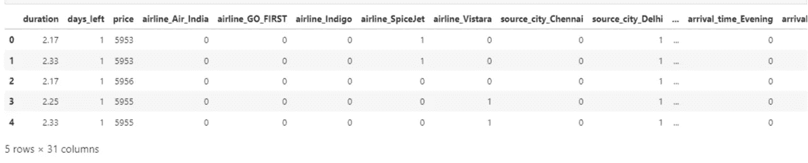
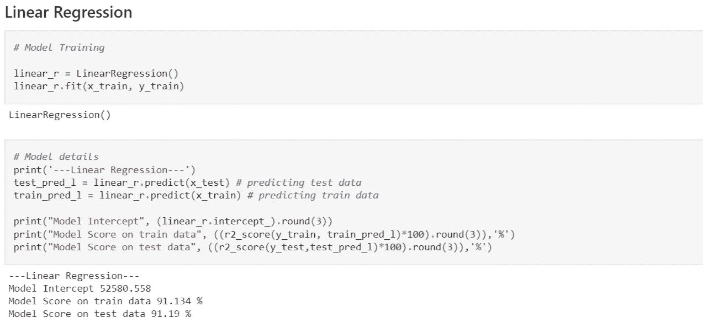
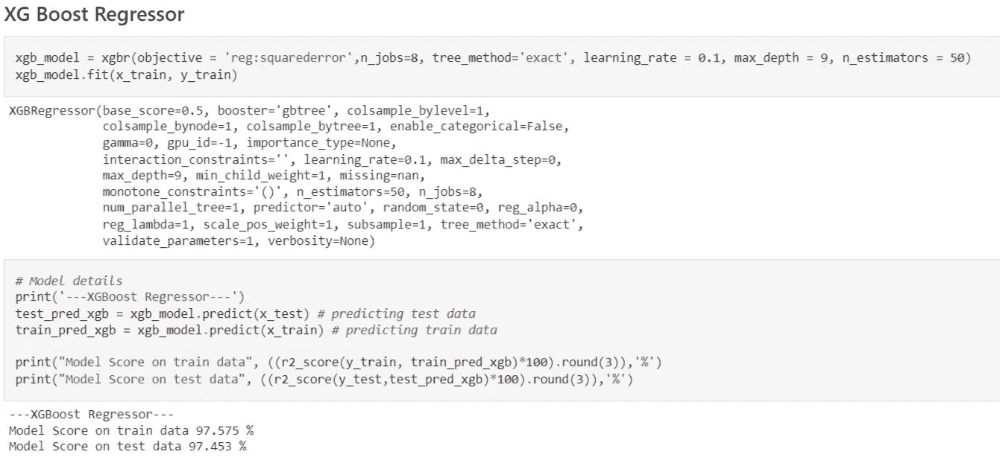

# 如何用 Python 预测航班价格(XGBoost，线性回归…)

> 原文：<https://blog.devgenius.io/how-to-predict-flight-prices-with-python-xgboost-linear-regression-be2ea731595e?source=collection_archive---------6----------------------->

## 逐步建立你自己的机器学习算法来预测航班价格。数据探索、可视化、数据预处理以及最终建模(训练和预测)。

图片来自[pexels.com](https://www.pexels.com/search/airbus/)

我在 Kaggle(眨眼脸)上看到了这个[数据集](https://www.kaggle.com/datasets/shubhambathwal/flight-price-prediction)，我对自己说，为什么不用它来构建一些东西，以增加我的机器学习知识，所以我开始了，下面是它是如何进行的。

# 数据探索

为了处理数据集，你需要加载并理解它，这就是 python [Pandas](https://pandas.pydata.org/docs/index.html) 包的用武之地。用熊猫读取 python 中的 CSV 数据集就像*data = PD . read _ CSV(' filename . CSV ')一样简单。当数据集被读取时，它看起来像这样*

我在这个项目中使用的其他一些 pandas 数据探索函数包括 **info()** ， **describe()** ， **isnull()。**对我来说幸运的是，数据集是干净的，所以我不必做任何丢失数据处理和其他相当容易的事情，所以不要害怕。

运行中的函数 info()，参见 [GitHub](https://github.com/munas-git/flight-price-prediction/blob/main/flight-price-prediction.ipynb) 上的其余代码。

上面，您可以看到 info()函数在工作，它向我们显示了数据表列、非空值的数量以及它们的数据类型。了解您正在处理的数据类型很重要，以防将来对您的模型进行数据操作。完成上一步后，我对各种属性进行了分组，如出发时间、航空公司、出发前剩余天数和其他一些属性，然后将它们可视化，以了解这些属性中的每一个如何影响机票的平均成本。

# 数据可视化

表示价格变化与出发前剩余天数关系的条形图，参见 [GitHub](https://github.com/munas-git/flight-price-prediction/blob/main/flight-price-prediction.ipynb) 上的其余代码。

从上面可以看出，离出发的天数越多，机票价格就越便宜。这一点很重要，因为现在我们知道这是我们将要构建的回归模型的一个关键独立变量。

上图中，你可以看到经济舱机票的平均价格比商务舱机票便宜很多。注意这一点也很重要，因为现在我们知道类对成本有着巨大的影响，我们知道对于我们将要构建的回归模型来说，它也是一个需要注意的关键独立变量，这一过程对其他属性重复进行。你可以在 GitHub 上看到其余的可视化效果。

# 数据预处理

数据预处理是机器学习中的一个关键步骤，因为数据可能以模型无法接受的格式出现。该数据集包含分类数据，大多数模型不接受分类数据，因此我将在这里通过将分类数据转换为 pandas 虚拟数据(ML 模型可以轻松处理的整数格式的数据)来处理，然后在最终将模型拟合到数据之前，将数据拆分为训练集和测试集。

已处理数据表

上图中，你可以看到预处理数据的最终产品，这些数据将被分为模型的*训练*和*测试*组。注意到表格的变化了吗？列已展开，以前类别列中的每个唯一字符串现在已被拆分为单独的列，1 表示是/真，而 0 表示否/假。要了解这是如何做到的，请访问 [GitHub repo](https://github.com/munas-git/flight-price-prediction/blob/main/flight-price-prediction.ipynb) ，而要了解什么熊猫虚拟数据更好，请访问[*PD . get _ dummies()*](https://pandas.pydata.org/docs/reference/api/pandas.get_dummies.html)*。*

## 模型(训练和预测)

训练线性回归模型

上面是用于训练线性回归模型的代码片段，您可以在图像的底部看到，模型对训练和测试数据的预测分数分别为 91.1%和 91.2%，这是很好的分数，并且相差不远，因此我们可以说我们的模型没有过度拟合，但我肯定可以得到更好的分数，所以我继续将数据拟合到 XGBoost 模型。

训练 XGBoos 回归模型

上面是用于训练 XGBoost 回归器模型的代码片段，您可以在图像的底部看到，模型对训练和测试数据的预测分数分别为 97.54%和 97.45%，这是很好的分数，并且相差不远，因此我们可以说我们的模型没有过度拟合。

和往常一样，请随意查看其余的[源代码](https://github.com/munas-git/flight-price-prediction/blob/main/flight-price-prediction.ipynb)，以便更深入地理解这项工作。如果您喜欢阅读，请关注更多数据科学文章，留下评论和赞。

谢谢，下次再见。