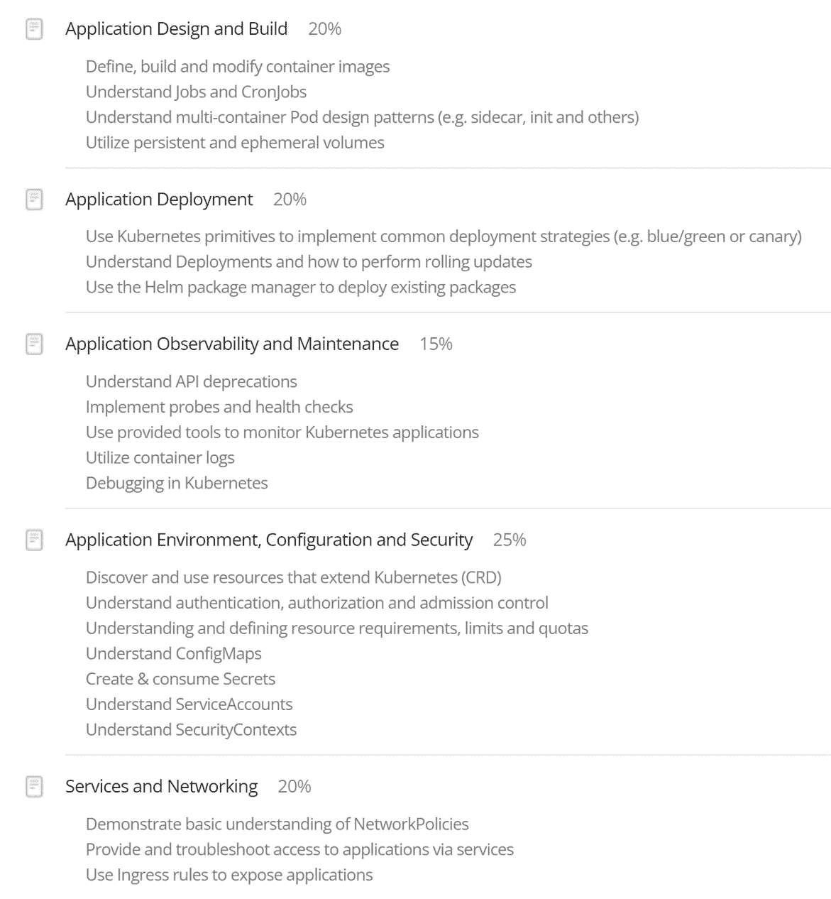
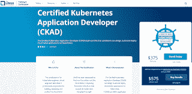
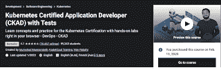

# 如何准备和通过 CKAD 认证考试

> 原文：<https://blog.devgenius.io/how-to-prepare-and-clear-ckad-certification-exam-4dc87345110a?source=collection_archive---------14----------------------->

# 背景

对我来说，新的一年是在愉快的气氛中开始的。前几天我通关了**认证 Kubernetes 应用开发者(CKAD)** 认证。这是我第二次试图通过考试。是我目前为止回答的最好的在线认证考试。这篇文章是关于我的考试经验以及如何准备考试。我也分享一些可能对考试本身有帮助的信息。

# 考试课程

考试完全是动手操作。没有选择题。我们得到了一组 6 个不同的 Kubernetes 集群。每个集群都有不同的配置，这些问题与在 Kubernetes 环境中设计和开发云原生应用程序有关。评估了五个不同的广泛领域，如下所示。这些包括

*   应用程序设计和构建 20%
*   应用程序部署 20%
*   应用程序可观察性和维护 15%
*   应用环境、配置和安全性 25%
*   服务和网络 20%

考试由 **Linux 基金会**与**云计算原生计算基金会(CNCF)** 合作进行。你可以在 [Linux 基础培训网站](https://training.linuxfoundation.org/certification/certified-kubernetes-application-developer-ckad/)了解更多关于考试的信息。

测试持续时间为 **2 小时**，最低及格分数为 **66%** 。证书有效期为 **3 年**。如果您第一次尝试未能过关，您将获得 **1 次免费重考**。

# 备考参考

我喜欢在准备任何认证时使用多种资源。对于 CKAD，我也参考了多种信息来源。这里是我使用的不同参考的快速列表。

# Kubernetes 文档

我们被允许在考试期间参考 Kubernetes 的文件。这就像一场开卷考试。以下链接有助于 Kubernetes 入门和理解不同的概念。

*   kubernetes docs—[https://kubernetes.io/docs/home/](https://kubernetes.io/docs/home/)
*   Kubernetes.io 任务—[https://kubernetes.io/docs/tasks/](https://kubernetes.io/docs/tasks/)
*   kubectl cheat sheet—[https://kubernetes.io/docs/reference/kubectl/cheatsheet/](https://kubernetes.io/docs/reference/kubectl/cheatsheet/)

# 电子学习课程

除了 Kubernetes 文档，我还通过注册电子学习课程来补充知识。网上有很多课程。几乎每个电子教学平台都会有一门或多门与 CKA 考试准备相关的课程。有些还提供模拟测试。我参加了 CKAD 考试以及来自 Linux 基金会的 Kubernetes 基础知识包。

[Kubernetes 认证应用开发者(CKAD)考试](https://www.udemy.com/course/certified-kubernetes-application-developer/)由 **Mumshad Mannambeth** 在 Udemy 上进行，也是最受欢迎的课程之一。

我喜欢这个课程内容的细节和深度。每个主要课题之后都有动手实验或小型测试。这门课充满了与实际考试相关的技巧和窍门。

# Github Repos

以下是我发现有用的 Github 库列表

*   CKAD 练习—[https://github.com/dgkanatsios/CKAD-exercises](https://github.com/dgkanatsios/CKAD-exercises)
*   CKAD 资源—[https://github.com/lucassha/CKAD-resources](https://github.com/lucassha/CKAD-resources)
*   https://github.com/NileshGule/ckad-exam-prep 尼勒什·古乐 CKAD 考试准备
*   **Ahmet Alp Balkan Kubernetes 网络政策方案—[https://github.com/ahmetb/kubernetes-network-policy-recipes](https://github.com/ahmetb/kubernetes-network-policy-recipes)**

# **博客**

**这些博客文章为备考和考试提供了有用的技巧**

*   **与 kubectl 一起快—[https://faun . pub/be-fast-with-kube CTL-1-18-ckad-cka-31be 00 ACC 443](https://faun.pub/be-fast-with-kubectl-1-18-ckad-cka-31be00acc443)**
*   **如何搞定 Kubernetes 认证考试—[https://www . infoworld . com/article/3631108/how-to-nail-the-Kubernetes-certification-exams . html](https://www.infoworld.com/article/3631108/how-to-nail-the-kubernetes-certification-exams.html)**
*   **code fresh Kubernetes cheat sheet—[https://code fresh . io/Kubernetes-tutorial/Kubernetes-cheat-sheet/](https://codefresh.io/kubernetes-tutorial/kubernetes-cheat-sheet/)**
*   **CKAD 实战挑战系列—[https://code burst . io/kubernetes-CKAD-weekly-challenges-overview-and-tips-7282 b36a 2681 tips](https://codeburst.io/kubernetes-ckad-weekly-challenges-overview-and-tips-7282b36a2681Tips)**

# **当心打折**

**你会发现在黑色星期五，网络星期一，圣诞节，新年，排灯节，开斋节等打折。在学习课程和实际考试中利用这些折扣。**

# **学习命令式命令**

**由于 2 小时的时间限制，您需要快速完成与完成考试相关的任务。虽然您可以从 Kubernetes 文档中复制并粘贴 yaml，但是编辑它可能需要一些时间。测试将有特定的需求，比如用特定的名称命名 Kubernetes 对象，并将它们部署到特定的名称空间。通常，Kubernetes 文档将在默认名称空间中部署对象。如果您知道如何使用命令式命令，将会节省您不少时间。这些命令的输出可以通过管道传输到 yaml 文件，然后您可以进行所需的修改，而不是从头开始手工制作完整的 yaml。**

**与 CKA 考试相比，我发现 CKAD 中的问题很长。每个问题都有更多的子任务。你最终会解决更多的子任务，你需要非常快。**

# **学习基本的 vi 或 nano 编辑器命令**

**测试环境是基于 Linux 的。如果你和我一样是从 Windows 后台过来的，你需要熟悉 vi 或者 nano 代码编辑器。熟悉编辑文件和命令，如删除代码行，导航到特定行，更新单词，保存文件等。**

**这里有一个方便的[备忘单](https://www.cs.cmu.edu/~15131/f17/topics/vim/vim-cheatsheet.pdf)，我发现它可以更有效地与 vi 编辑器一起工作。**

# **练习，练习，练习**

**无论谁通过了 CKA、CKAD 或 CKS 考试，都会告诉你练习是备考中最重要的部分。如果您不知道如何使用 kubectl 处理 Kubernetes 资源或对象，那么您将无法通过这个测试。完成同一项任务可能有多种方式。你需要找到一个时间效率最高的。**

# **书签特定链接**

**用书签标记 Kubernetes 文档中的链接有助于快速找到资源。我建议不要给顶级页面做书签，而是给特定的部分做书签，以避免在冗长的页面中滚动查找信息。**

# **实践考试**

**如果您在 2021 年 6 月之后预订 Kubernetes 相关认证考试，您将可以访问来自 [Killer.sh](https://killer.sh/ckad) 的实践考试。这次考试给你两次机会来做同样的测试。该环境提供 36 个小时，并提供答案以及详细的步骤说明，以帮助您更好地准备真正的测试。**

# **考试期间的小贴士**

*   **使用外接显示器(推荐)，*最小化屏幕切换***
*   **可以使用外部键盘和鼠标**
*   **启用 kubectl 自动完成**
*   **创建别名(开始测试前)**
*   **更新 vimrc /编辑器配置文件**
*   **时间管理**
*   **使用命令式命令(**巨大的时间节省****
*   **使用复印功能代替打字**
*   **使用记事本功能快速记笔记**
*   **标记要审阅的问题**
*   **不要在一个问题上花太多时间(**平均 5-6 分钟**)**
*   **任务完成后验证解决方案**

# **bash 配置文件中的别名**

**我在 bash 概要文件中添加了以下别名，以减少输入 kubectl 命令的次数**

*   **别名 cls =清除**
*   **别名 kg='k get '**
*   **别名 kgpo='kg po '**
*   **别名公斤号= '公斤号'**
*   **别名 kdes='k describe '**
*   **别名 kaf='k apply -f '**
*   **别名 kdf='k delete -f '**

**除了这些别名，我还导出了一些方便的命令**

*   **export do=' —预演=client -o yaml '**
*   **export fg = '—force—grace-period = 0 '**

# **vi 编辑器设置**

**最后但同样重要的是，我还更新了 vi 编辑器的设置，这样当我们在编辑器中切换时，文本可以正确地对齐/缩进。这也有助于我们从 Kubernetes 文档中复制和粘贴代码片段。**

# **Youtube 视频**

**这篇文章中提到的所有话题在 Youtube 视频中都有更详细的解释。**

# **结论**

**CKAD 认证旨在衡量 Kubernetes 开发人员的技能。如果您不知道如何构建和部署部署在 Kubernetes 集群上的云原生应用程序，那么这个认证不适合您。考前好好练习。共有 17 个不同权重的问题。希望这篇帖子对以后准备考试的人有所帮助。**

**直到下一次，激情编码，精益求精。**

***原载于 2022 年 1 月 5 日 https://www.handsonarchitect.com**[*。*](https://www.handsonarchitect.com/2022/01/how-to-prepare-and-clear-ckad.html)***