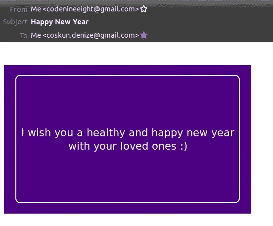

# 如何用 Python 准备和发送你的新年信息卡

> 原文：<https://blog.devgenius.io/how-to-prepare-and-send-your-new-year-message-card-with-python-6ad4a8d01d00?source=collection_archive---------8----------------------->

## 用 Python 告别 2020


[杰米·斯特里特](https://unsplash.com/@jamie452?utm_source=medium&utm_medium=referral)在 [Unsplash](https://unsplash.com?utm_source=medium&utm_medium=referral) 上拍摄的照片

如果你是一个喜欢给朋友或家人发新年信息卡的人，也许这次你想通过编程来实现。让我们开始…

## 准备您的环境

我们需要创建一个虚拟环境，然后开始将依赖项与系统的其余部分隔离开来。

*   如果您使用 pip

```
python -m venv env
source env/bin/activate
pip install yagmail
```

*   如果您使用 pipenv

```
pipenv install yagmail
pipenv shell
```

`[yagmail](https://pypi.org/project/yagmail/)`是一个 Python 包，用于与 Gmail 帐户交互，使发送电子邮件更容易。

## 实施和解释

该计划将有命令行参数和交互模式的支持。

将有 6 个命令行参数，其中四个具有默认值。

*   `-f`发件人邮件地址
*   `-t`收件人邮件地址。多个邮件地址可以用一个文件给出，也可以用逗号分隔。
*   `-s`邮件主题，默认值为“圣诞快乐”
*   `-m`消息正文
*   `-b`背景色。您可以使用不带#前缀的颜色名称或代码。
*   `-c`文字颜色。此外，边框将采用这种颜色。

下面是从命令行获取这些参数的函数。

如果程序在没有参数的情况下执行，它将进入交互模式。否则，它将从参数中获取值。入口点函数如下所示。

交互模式将通过以下功能逐一询问用户所需或可选的参数来处理。如果用户在没有输入值的情况下按 enter 键，将使用括号中显示的默认值。

在获取参数的过程中，首先用下面的`MessageHeader`类构造消息头。

由于允许多个收件人，`to_email`实例变量由逗号分隔的字符串、文件或单个邮件地址构成。

然后，将使用`MessageContent`类获取参数，通过如下的`construct_html_message`方法将消息构造为 HTML。

背景、文本和边框颜色根据给定的参数进行更新。

最后，将使用`send_email`方法发送 HTML 构造的消息。

# 例子

*   使用带有默认主题、背景和文本颜色的参数

```
python new_year_message_automator.py -f codenineeight@gmail.com -t coskun.denize@gmail.com -m "I wish you a healthy and happy new year :)"
```


第一个示例结果的作者截图

*   使用带有自定义主题和背景颜色的参数

```
python new_year_message_automator.py -f codenineeight@gmail.com -t coskun.denize@gmail.com -m "I wish you a healthy and happy new year with your loved ones :)" -s "Happy New Year" -b indigo
```



第二个示例结果的作者截图

*   使用默认文本颜色进行交互


作者对第三个示例输入的截屏


第三个示例结果的作者截图

你可以在这里找到完整的代码。

当然，它可以进行更多的定制，变得更加健壮。是出于好意写的:)

借此机会祝你新年快乐。

谢谢你的时间。