# 如何在 AWS Lambda 中处理媒体？(FFMPEG)

> 原文：<https://blog.devgenius.io/how-to-process-media-in-aws-lambda-ffmpeg-f53491cf8768?source=collection_archive---------0----------------------->

上周，我接到一个新任务，我需要为图像和视频制作缩略图。对于 Python 来说，这是一项非常简单的任务。但作为一名解决方案架构师，我注意到一直在呼叫视频以供播放，而没有人从呼叫中获得任何额外的好处，这让我担心计费问题(S3 呼叫、数据传输和其他小事)。是的，你可以在浏览器上或者用 CloudFront 缓存链接，如果你用的话。但是这些是 API，它遵循无服务器结构。嗯，另一组场景是我可以减少检索这些媒体的费用。其中之一是，如果上传的是视频，就把它缩短。酷，但是，怎么做？

我以前经常使用 FFMPEG，我喜欢它，也喜欢它给我带来的好处。我用它来拍摄上传视频的小版本。FFMPEG 是一个基于二进制的工具，这意味着，它需要以正确的方式编译，以让托管服务器的操作系统理解如何处理。

我们都知道 Lambda 的局限性，以及它会带来怎样的痛苦。所以，我们将使用层！

我知道我说了很多，让我们开始吧:

# 编译资源:

首先，编译你的资源。

如果你不熟悉这个过程，请跳到我之前的文章，看一看。

我将在这里使用一些步骤，使文章在步骤方面有意义。

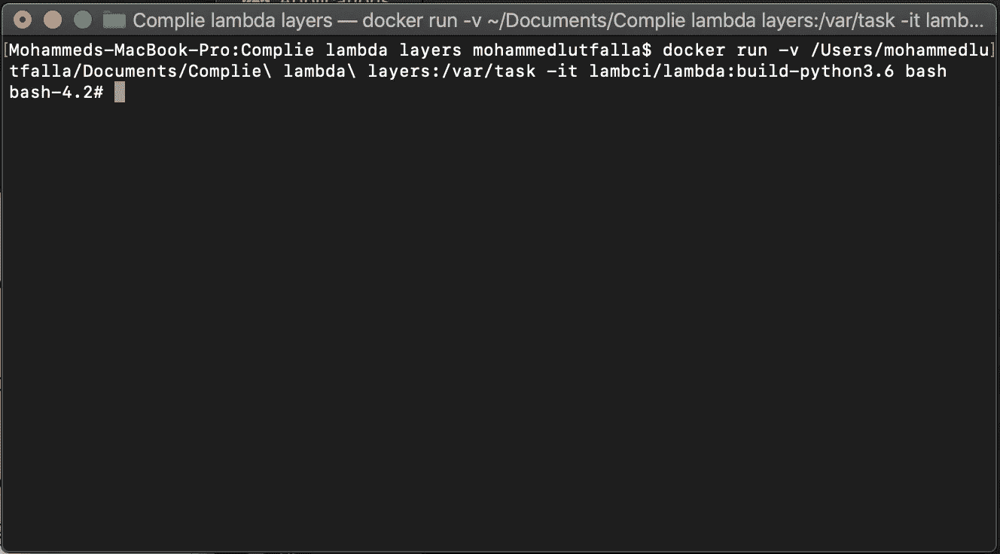

连接到具有 Lambda 环境的 Docker 模板。它几乎就像是其操作系统的克隆版。

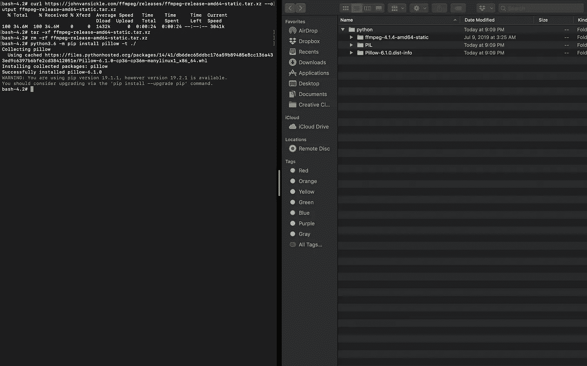

根据图片，让我描述一下我做了什么:

1-我访问了 Docker 图像。

2-我制作了一个目录，并将其命名为 python(这是 AWS layers 推荐给你的 python 层命名的名称)

3-输入 Python 目录。

4-我下载了 ffmpeg 的可执行版本。你可以在这个[链接](https://johnvansickle.com/ffmpeg/)上找到。

5-解压缩文件，并将 ffmpeg 和 ffprobe 放入主目录(python 根文件)。注意:确保你给了这两个文件在 Lambda 中执行的适当权限。

6-安装所需的资源。

如你所见，我编译了 Pillow (Python 图像库)，你可以用它来处理图像。这样做的原因是为了告诉你，它建议所有的 Lambda 资源都必须为它编译，一些依赖项可能是基于二进制的，并可能导致函数中的错误。

完成这些步骤后，您应该拥有以下文件:

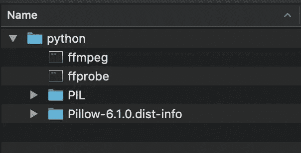

压缩目录，并为下一步做好准备，这是使层。

# 开始在云上准备资源:

访问 AWS 控制台并导航至 S3:

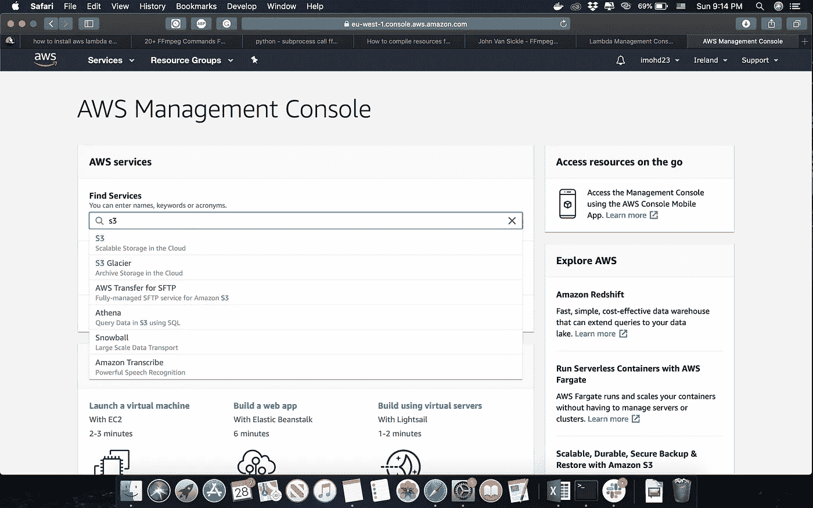

你应该有一个桶，这样你就可以上传层。

> 注意:任何大于 50mb 的层必须上传到 S3，复制链接，我们将需要它。
> 
> 注意:任何层解压缩后必须小于 250mb，否则，层不会被创建。

让我们创建一个存储桶:

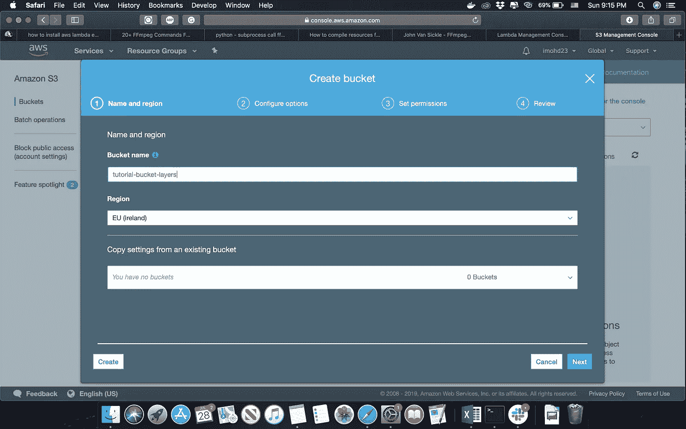

下一步，上传图层:

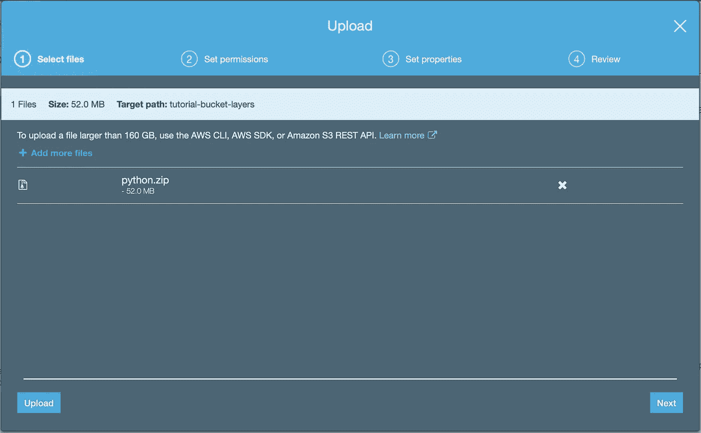

> 注意:文件不应该是公共的，如果 IAM 用户有权限访问这些特性\工具(S3，Lambda)，那么，你就处于有利位置。

文件上传后，复制链接。

导航到 Lambda:

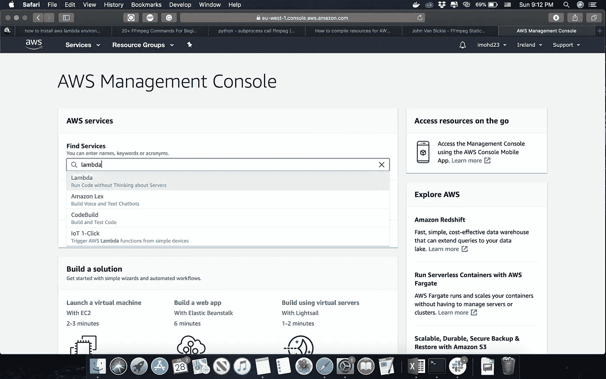

在屏幕左侧，单击图层:

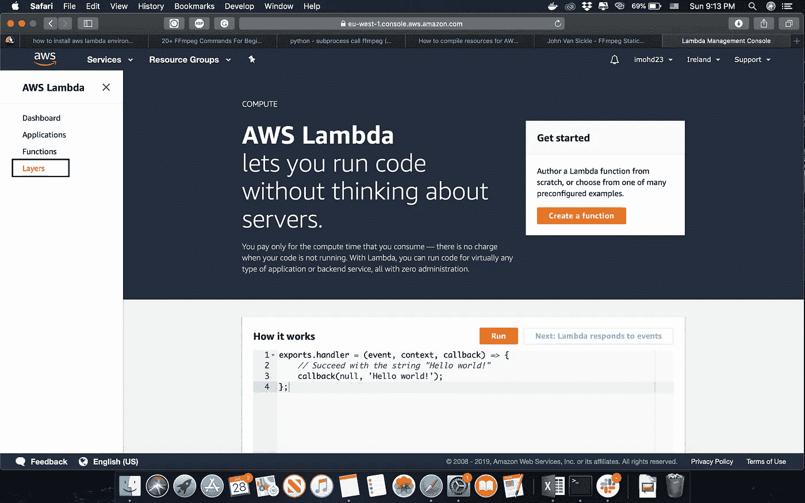

点击创建新层，并填写以下表格:

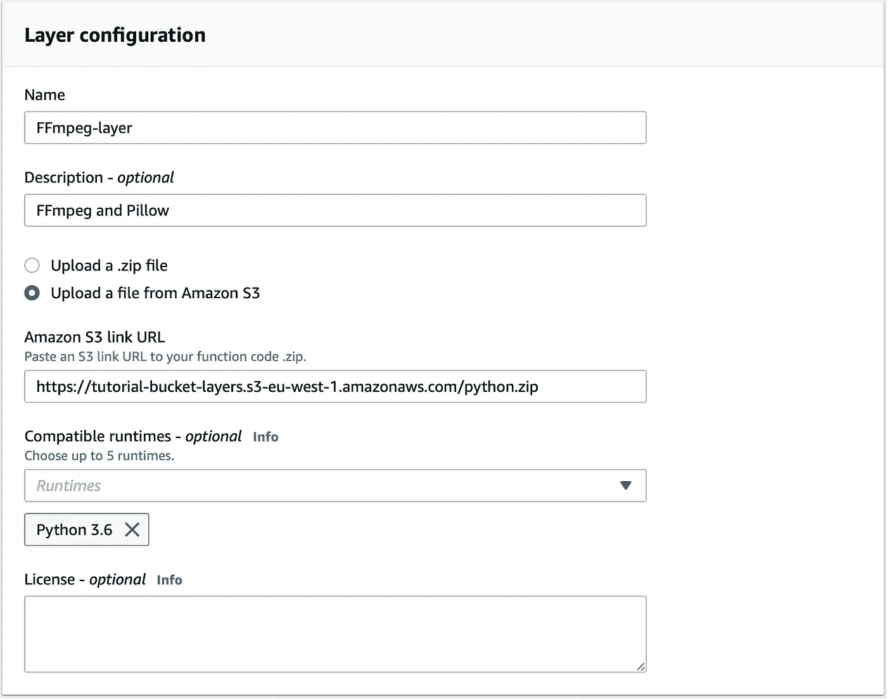

1-给它一个名称

2-强烈建议为您的图层编写描述，因为同一图层可能有不同的版本。

3-单击第二个选项并粘贴链接。

4-指定兼容的运行时，因为它对您跟踪版本很重要。

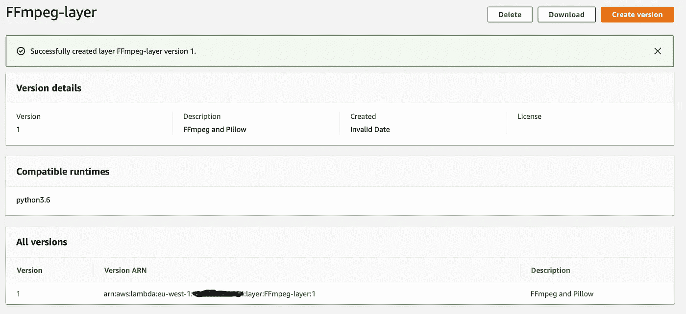

酷，我们准备好开始编码了:

> 免责声明:我知道下面的代码不是完美的代码，或者人们可能会争论它，这只是为了证明该过程是有效的和工作的。

让我们进入 Lambda 函数并开始编码:

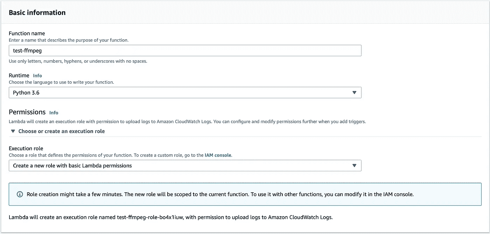

我已经创建了函数并为它选择了运行时，我用的是 Python3.6。

> 注意:当你处理媒体甚至文件时，你需要确保你的函数有正确的权限集，我更新了这个函数的角色，使其具有读写 S3 的能力。

正如你在下图中注意到的，我做的第一件事是将图层链接到函数。

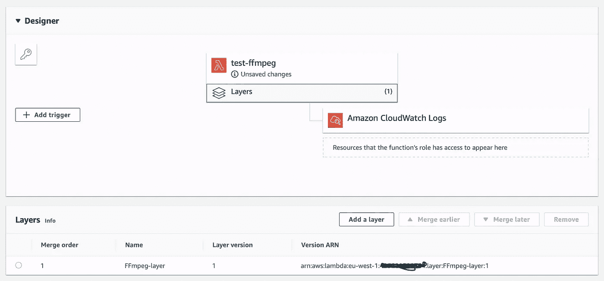

这是我从 S3 下载视频的代码片段，在第 7 秒时从视频中截取一帧并保存为 png，然后上传到 S3。

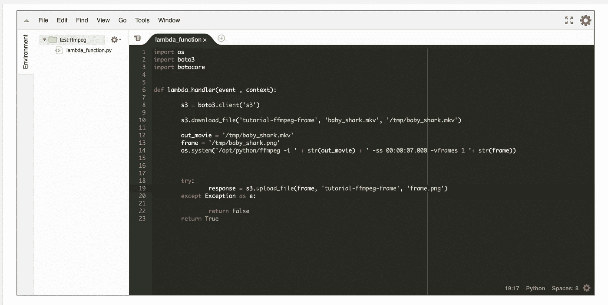

> 注意:如果您不熟悉 Lambda，/tmp 是 Lambda 中的可写目录。

正如你所猜测的，是的，它成功了！

# 结论和一些提示:

这种方式非常适合我，是的，你可以增强它，但对于 Lambda 和无服务器世界的新来者来说，这是一个很好的起点。

我有一些笔记和建议给你:

1-给这个函数所有可用的资源(超时和内存)，在你的场景中测试它，然后优化它，原因是看它实际上用了多少来处理你的媒体。你有不同的场景。因此，将应用不同的超时和 CPU/GPU/互联网使用。

2-如果你像我一样，使用了使用 ffmpeg link *imageio* 的库，你必须在你的代码中声明 ffmpeg 路径，否则，lambda 看不到它，在这种情况下，它在 */opt/python* 中。

3-另外，如果你要使用这些库，在压缩和上传之前，确保 ffmpeg 和 ffprobe 是可执行的。我面对这个问题。

4-使用 S3 下载/上传媒体，尽量不要将其作为文件返回，同一地区服务之间的数据传输是零美元。

快乐的无服务器处理！