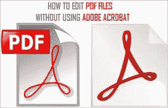

# 如何用 Python 处理 PDF 文件

> 原文：<https://blog.devgenius.io/how-to-process-pdf-files-with-python-61e0d9e62e7?source=collection_archive---------5----------------------->

*合并多个 PDF 文件，拆分一个 PDF 文件，转换成 PNG*



来自[https://www . tech bout . com/WP-content/uploads/2014/12/edit-pdf-files-without-use-adobe-acrobat . png](https://www.techbout.com/wp-content/uploads/2014/12/edit-pdf-files-without-using-adobe-acrobat.png)

最近我在做一个 RPA 项目，需要处理多个 PDF 文件。主要涉及四项任务:

1.  将多个 PDF 文件合并成一个文件。
2.  将多页 PDF 文件拆分为多个单页 PDF 文件。
3.  将 PDF 文件(单页或多页)转换为 PNG 文件。
4.  使用 OCR 将 PNG 文件转换为文本。

最终目的是根据内容重命名扫描的 PDF 文件。我将在这里介绍解决前 3 个任务的步骤，对于 OCR 部分，有许多可用的选项，但请记住，其中许多选项不能很好地处理中文字符，例如 Tesseract，即使安装了中文简体库，最终结果也很差，无法使用。

如果没有 Python，我们必须使用 Adobe Acrobat Professional 来合并和拆分 PDF 文件，或者找到一些冒着丢失安全信息风险的在线服务。但是我们可以很容易地用 Python 实现这一点，零成本，最大限度地提高安全性和效率。

# 找到合适的包装

我最初尝试了我用来填写 PDF 表格的软件包`pdfrw`，但是它不适合阅读扫描的 PDF 文档。经过一番搜索，我找到的包是`pymupdf`([https://github.com/pymupdf/PyMuPDF](https://github.com/pymupdf/PyMuPDF))，它服务于我在这里的所有目的，包括合并、拆分 PDF 文件，以及将每一页转换成 PNG 文件。

要安装`pymupdf`，你需要做的就是`pip install pymupdf`，然而你实际上需要`import fitz`才能使用它，这是一件奇怪的事情，因为你需要记住两个不同的包名。我使用的技巧是在导入行后面留下一个注释:

```
import fitz # pip install pymupdf
```

# 合并多个 PDF 文件

要合并多个 PDF 文件，首先需要使用`fitz.open()`创建一个空白的 PDF 文件，然后在将每个 PDF 文件插入新文件后保存。

假设您将所有的 PDF 文件及其完整路径存储在一个列表`pdf_files`中，下面 3 行代码实现了上述目的:

```
*with* fitz.open() *as* doc:
    *for* pdf_file *in* pdf_files:
        doc.insert_pdf(fitz.open(pdf_file), from_page=0, to_page=-1, rotate=-1, show_progress=True, final=True)
    doc.save(save_as)
```

# 分割多页 PDF 文件

要分割一个多页的 PDF 文件，思路几乎和前面的练习一样，你只需要打开一个现有的 PDF 文件，然后一页一页地插入一堆新文件。

以下 9 行代码实现了上述目的:

```
*with* fitz.open(pdf_file) *as* doc:
    digits = len(str(doc.page_count))
    *for* i, page *in* enumerate(doc):
        page_id = f'{{:0{digits}}}'.format(i+1)
        file_name = f'{os.path.split(pdf_file)[1][:-4]}_p{page_id}.pdf'
        file_name = os.path.join(save_to, file_name)
        *with* fitz.open() *as* doc_tmp:
            doc_tmp.insert_pdf(doc, from_page=i, to_page=i, rotate=-1, show_progress=False)
            doc_tmp.save(file_name)
```

第二和第四行计算总页数，如果少于 10 页，则在文件名后添加一个`_p1`到`_p9`，如果有 10 到 99 页，则在`_p99`后添加一个`_p01`，依此类推。如果您想在需要手动或通过代码访问文件名时保持文件名有序，这是一个更好的做法。

# 将 PDF 文件转换为 PNG 文件

上面解决了逐页访问 PDF 文件的问题，我们只需要使用下面的代码将一个页面转换成 PNG 文件:

```
trans = fitz.Matrix(1.0, 1.0).prerotate(0) # *zoom_x, zoom_y* pm = page.get_pixmap(matrix=trans, alpha=False)
pm.save(png_file)
```

结合前面的枚举页面练习，我们有以下完整的代码:

```
*with* fitz.open(pdf_file) *as* doc:
    digits = len(str(doc.page_count))
    *for* i, page *in* enumerate(doc):
        *if* doc.page_count>1:
            page_id = f'{{:0{digits}}}'.format(i+1)
            file_name = f'{os.path.split(pdf_file)[1][:-4]}_p{page_id}.png'
        *else*:
            file_name = f'{os.path.split(pdf_file)[1][:-4]}.png'
        png_file = os.path.join(save_to, file_name)
        trans = fitz.Matrix(1.0, 1.0).prerotate(0) # *zoom_x, zoom_y* pm = page.get_pixmap(matrix=trans, alpha=False)
        pm.save(png_file)
```

如果有多个页面，第 4 到第 8 行代码为 PNG 文件名生成一个后缀，否则只生成带有`.png`扩展名的原始 PDF 文件名。

# 改进的余地

你可以把上面的代码包装成函数，甚至是一个类，让它们更容易被访问。

您还可以探索其他领域，例如，您可以提取 TOC、注释等。使用`pymupdf`包从 PDF 下载。