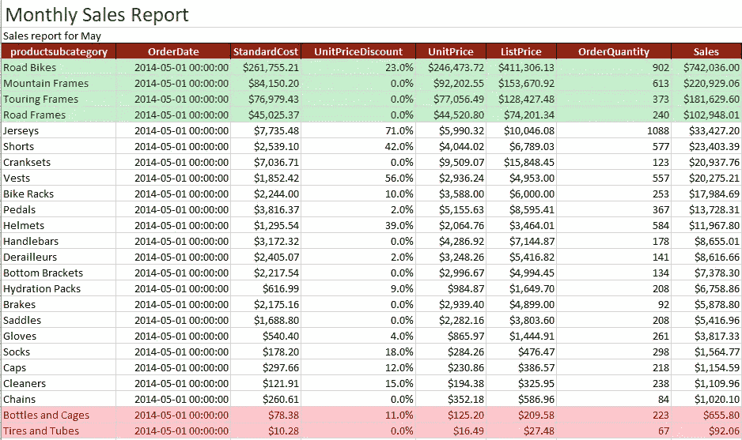
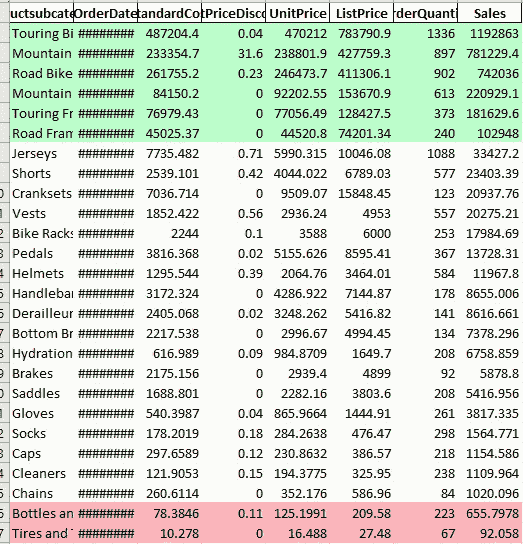

# 如何使用 Python 生成美观、格式良好的 Excel 报表

> 原文：<https://blog.devgenius.io/how-to-produce-beautiful-well-formatted-excel-reports-using-python-fd87146a1e0e?source=collection_archive---------1----------------------->

**使用 Python、XlsxWriter、Excel**



使用 Python 格式化 Excel 报表

假设我们收到一个从系统中提取数据的请求。我们开发一个查询，为给定的请求生成一个有效的结果集。我们将数据导出到 Excel 中，并准备好与最终用户共享。我们的任务完成了，对吧？不完全是。任何有经验的数据分析师都会告诉你，演示很重要。当创建和共享报告时，基础知识是不够的。我们希望在专业且格式良好的报告中分享我们的发现。

Pandas 库使从数据框架生成 Excel 输出变得轻而易举。但是，当将数据导出到 Excel 时，保留格式时，它确实有一些缺点。假设我们对数字进行格式化，并对数据帧应用条件格式。当它被导出到 Excel 输出时，并非所有的格式都会被保留。我们可以利用 Python 中的 *XlsxWriter* 模块来设计格式良好的 Excel 报表。

我们将关注以下主题。

*   如何将条件格式应用于 Pandas dataframe？
*   如何使用 *XlsxWriter* 生成格式良好的 Excel 输出
*   比较两个输出

视频教程可以在 YouTube 上找到。

我们将介绍两种方法，首先，我们将对数据帧应用条件格式，并将其输出到 excel。在第二种方法中，我们将利用 *XlsxWriter* 模块。[这里的](https://www.youtube.com/watch?v=uCqqGsEsIL4)是一个介绍 *XlsxWriter 的教程。*我们将利用本教程中的脚本，并在此基础上使用 Python 编写 Excel 中的条件格式。

```
import pandas as pd
import xlsxwriter
#
url = "[https://github.com/hnawaz007/pythondataanalysis/blob/main/AutomateExcelReports/AdvWorksData.xlsx?raw=true](https://github.com/hnawaz007/pythondataanalysis/blob/main/AutomateExcelReports/AdvWorksData.xlsx?raw=true)"
# read from url
df=pd.read_excel(url, sheet_name='Sheet1')
category_sales = df.groupby(['productsubcategory','OrderDate'])[['StandardCost','UnitPriceDiscount','UnitPrice','ListPrice','OrderQuantity','Sales']].sum().sort_values(by='Sales', ascending = False).reset_index()
dsf= category_sales[(category_sales['OrderDate'] == '2014-05-01')]
dsf.head()
```

**方法一**

我们定义了一个基于条件突出显示数据帧行的函数。我们检查该值是否小于 1000，然后定义红色，对于大于 10000 的值定义绿色，对于所有其他值定义灰色。我们返回每一行的背景。我们将这个函数应用于我们的数据框架，并将其导出到 excel。

```
**def** highlight_rows(row):
    value **=** row**.**loc['Sales']
    **if** value **<** 1000:
        color **=** '#FFB3BA' *# Red*
    **elif** value **>** 100000:
        color **=** '#BAFFC9' *# Green*
    **else**:
        color **=** '#FCFCFA' *# Grey*
    **return** ['background-color: {}'**.**format(color) **for** r **in** row]
# apply the function to dataframe
dt **=** dsf**.**style**.**apply(highlight_rows, axis**=**1)
# export to excel
dt**.**to_excel("report.xlsx", index**=False**)
```

这会产生如下所示的 Excel 输出。我们的数据是导出的，但是，它看起来并不吸引人，需要一些调整才能使用。报告应该吸引人，平易近人。它应该提供上下文，并且应该让用户很容易使用其中提供的信息。



为了设计出吸引人的高质量输出，我们使用了 *XlsxWriter* 。我们创建一个新闻 Excel 工作簿和工作表。通过访问工作表对象，我们可以设置输出的样式。

```
writer **=** pd**.**ExcelWriter(r'G:\\test\\enhancedoutput.xlsx', engine**=**'xlsxwriter')
dsf**.**to_excel(writer, index**=False**, sheet_name**=**'report')
*#*
workbook **=** writer**.**book
worksheet **=** writer**.**sheets['report']
*#Now we have the worksheet object. We can manipulate it* 
worksheet**.**set_zoom(90)
```

使用 *XlsxWriter* 我们为我们的报告设置一个标题和副标题。这为读者提供了上下文。我们格式化单元格、标题并应用条件格式来吸引用户的注意。

```
header_format **=** workbook**.**add_format({
        "valign": "vcenter",
        "align": "center",
        "bg_color": "#951F06",
         "bold": **True**,
        'font_color': '#FFFFFF',
         'border' : 1, 
         'border_color': ''*#D3D3D3'*
    })*#add title*
title **=** "Monthly Sales Report "
*#merge cells*
format **=** workbook**.**add_format()
format**.**set_font_size(20)
format**.**set_font_color("#333333")
*#*
subheader **=** "Sales report for May"
worksheet**.**merge_range('A1:AS1', title, format)
worksheet**.**merge_range('A2:AS2', subheader)
worksheet**.**set_row(2, 15) *# Set the header row height to 15*
*# puting it all together*
*# Write the column headers with the defined format.*
**for** col_num, value **in** enumerate(dsf**.**columns**.**values):
    *#print(col_num, value)*
    worksheet**.**write(2, col_num, value, header_format)
```

我们利用数字格式使其易于阅读和理解。

```
*# Add a number format for cells with money.*
currency_format **=** workbook**.**add_format({'num_format': '$#,##0.00'})
percent_fmt **=** workbook**.**add_format({'num_format': '0.0%'})
*# Numbers formatting*
worksheet**.**set_column('C:C', 12, currency_format)
worksheet**.**set_column('E:E', 12, currency_format)
worksheet**.**set_column('F:F', 12, currency_format)
worksheet**.**set_column('H:H', 12, currency_format)
*# Percent formatting*
worksheet**.**set_column('D:D', 20, percent_fmt)*# Light red fill with dark red text.*
lessthanthousand **=** workbook**.**add_format({'bg_color':   '#FFC7CE','font_color': '#9C0006'})
worksheet**.**conditional_format('A4:H27', {'type':     'formula','criteria': '=$H4<1000','format':   lessthanthousand})
*# add borders*
worksheet**.**conditional_format('A4:H27', {'type':  'formula','criteria': '=$H4<1000','format':   full_border})
```

这将生成一个易于阅读和理解的格式良好的报告。它为读者提供上下文，并以专业和精心设计的方式传达信息。一份好的报告需要准确的信息和优秀的设计。


XlsxWriter 输出

**结论**

*   我们已经使用带有条件格式的 Pandas 创建了 Excel 报表输出。
*   我们已经使用 Python 和 *XlsxWriter* 成功应用了条件格式。
*   我们使用 *XlsxWriter* 制作了一个格式良好的 Excel 输出
*   完整的代码可以在[这里](https://github.com/hnawaz007/pythondataanalysis/blob/main/AutomateExcelReports/Excel%20Conditional%20Formatting.ipynb)找到