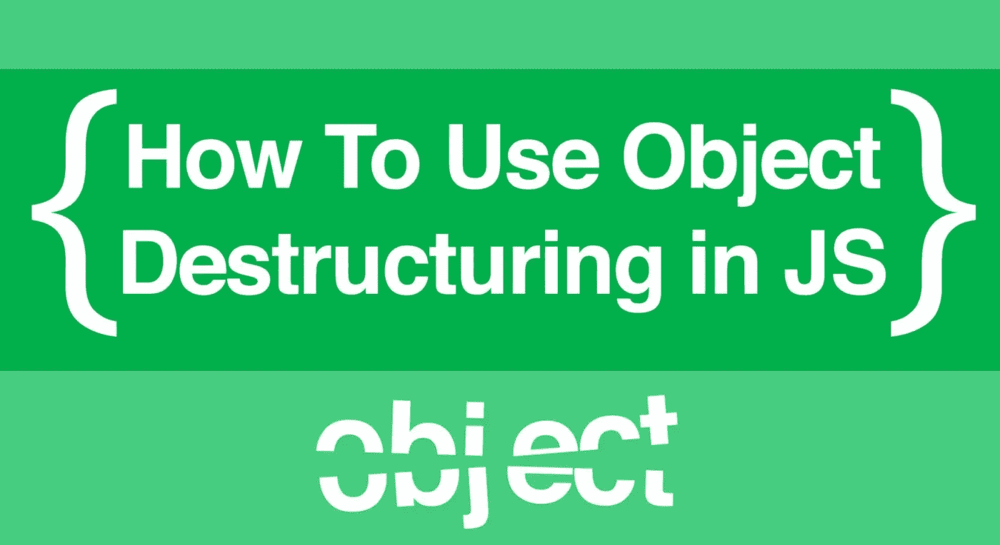
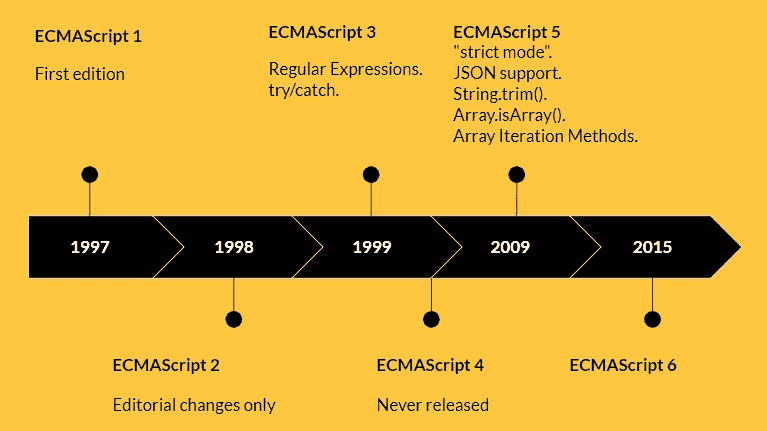

# 如何析构 Javascript 对象和安全时间！

> 原文：<https://blog.devgenius.io/how-to-properly-destructure-javascript-objects-and-safe-time-560b564271eb?source=collection_archive---------1----------------------->


照片来自 [Unsplash](https://unsplash.com/s/photos/destructure)

在某些时候，在编码时，我们发现自己经常使用点符号来引用对象属性。例如:

```
const toDo = {
task: "Code Everyday for atleast 1 hour, Thank me later.",
saveTime:"do the above and save time",
}//common practice way of refering to keys
console.log(toDo.task); //result: Code Everyday for atleast 1 hour, Thank me later.
```

在本文中，您将学习如何轻松地析构对象和访问对象属性。



# 现代 Javascript 中的对象析构

现代 Javascript (ECMAScript 2015)为您提供了一种更好的方法来访问对象属性，就像访问变量一样。



图片来自 goconqr.com

> “ECMAScript 2015 或 ES2015 是对 JavaScript 编程语言的重大更新**。这是该语言自 2009 年标准化的 ES5 以来的首次重大更新。因此，ES2015 通常被称为 ES6。”[**javasciptutorial.net**](https://www.javascripttutorial.net/es6/#:~:text=ECMAScript%202015%20or%20ES2015%20is,of%20JavaScript%20up%20to%20ES5.)**

# 如何析构基本对象

我将通过应用对象析构来访问上面的 **toDo 对象的属性:**

```
const toDo = {
task: "Code Everyday for atleast 1 hour, Thank me later.",
saveTime:"do the above and save time",
}//best practice: object destructuringconst {task, saveTime } = toDo;console.log(task);//result: Code Everyday for atleast 1 hour, Thank me later. 
```

运行以上代码后，您就可以从代码中的任何地方像访问变量一样访问属性了。

# 如何析构嵌套对象

如果我们的 toDo 对象中有嵌套对象怎么办？在这种情况下，您可以简单地执行以下操作:

> *忽略“嵌套”鸡蛋*😊


照片来自[freepik.com](https://www.freepik.com/premium-photo/colorful-easter-egg-nest-with-computer-keyboard-mobile-phone-wooden-table-happy-easter_23876505.htm)

```
/days object is nexted in toDo object
const toDo = {
task: "Code Everyday for atleast 1 hour, Thank me later.",
saveTime:"do the above and save time",
days: {dayOne:"monday", dayTwo:"Tuesday"},}//best practice: object destructuringconst {task, saveTime, days:{dayOne,dayTwo} } = toDo;console.log(dayOne);//result: monday.
```

运行上面的代码后，您可以从代码中的任何地方访问作为变量的 dayOne 或 dayTwo 嵌套属性。

这样，您可以访问更深层次的嵌套对象。 ***试试这个，在评论区告诉我。***

# 如何析构丢失的嵌套对象

如果你遇到一种情况，你想析构一个不存在的对象属性，你会怎么做？

实现这一点似乎类似于使用括号符号为 Javascript 对象分配新属性。例如:

```
const toDo = {};//assigning a property
toDo["task"] = "Code Everyday for atleast 1 hour, Thank me later."
```

让我们这样做:

```
const toDo = {
task: "Code Everyday for atleast 1 hour, Thank me later.",
saveTime:"do the above and save time",
}//defining a nested object, daysconst {task, saveTime, days:{dayOne} = "monday" } = toDo;console.log(dayOne);//result: monday.
```

它看起来和你相似吗？当然不是。我们基本上初始化了对象。

# 结论

Javascript 对象析构是一种更好的访问对象属性的方式，而不必一直引用对象。

我在我的 ReactJs 项目中使用了很多对象析构，这为我节省了很多时间。

请继续关注更多关于用 Javascript 节省时间的文章。

希望这对你有帮助，请在评论区告诉我你的想法。

PS:在推特上和我联系[Onwuka Victor](https://medium.com/u/cc9aec29d436?source=post_page-----560b564271eb--------------------------------)@ mro vos