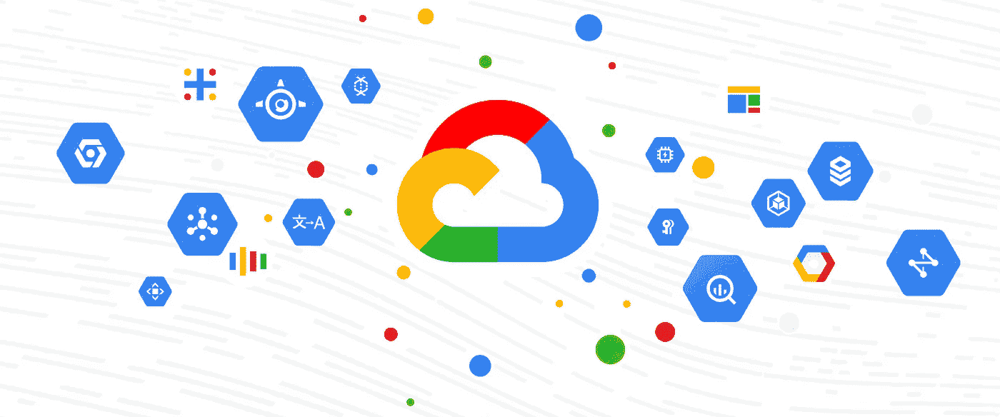
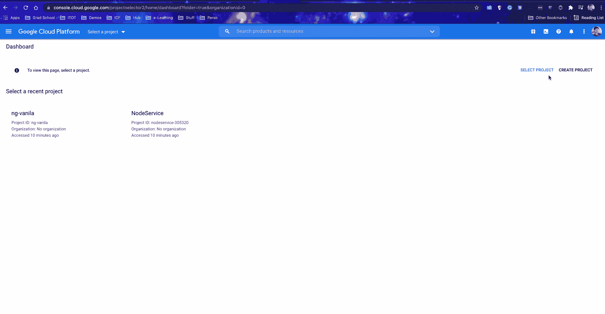
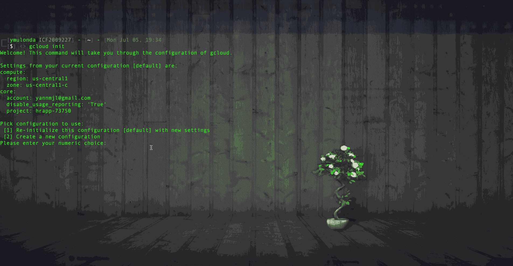
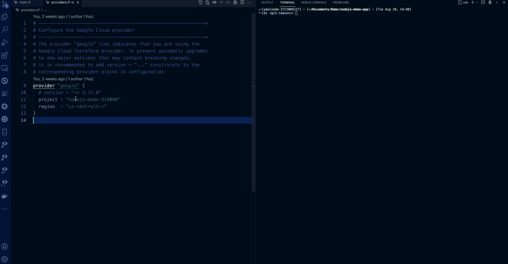
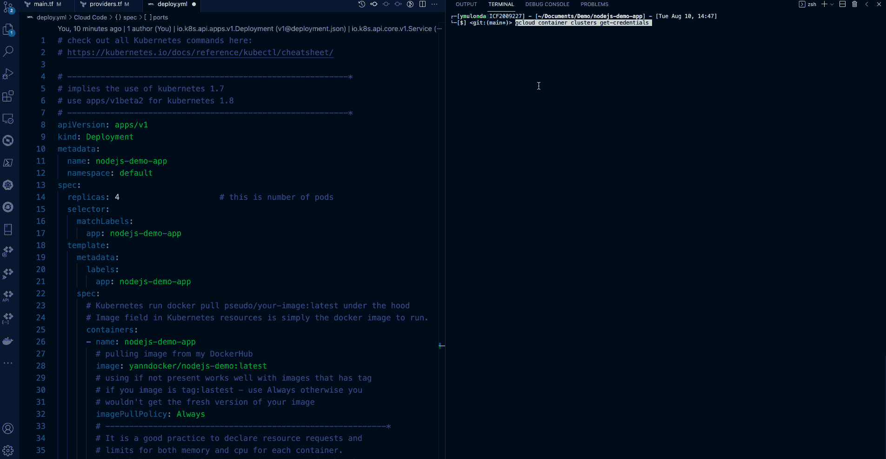
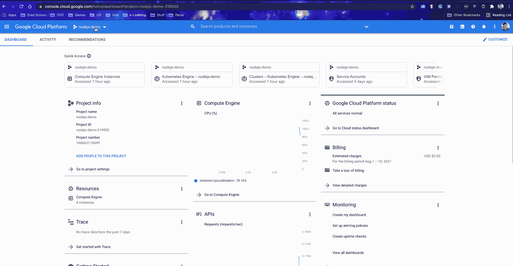
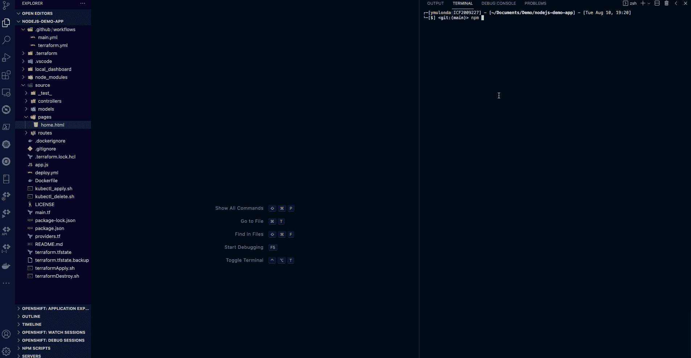

# 使用 Docker、Kubernetes、Terraform 和 GitHub 操作部署到 GCP

> 原文：<https://blog.devgenius.io/how-to-provision-configure-deploy-to-google-cloud-platform-97dbbe36fcde?source=collection_archive---------0----------------------->

调配、配置和部署到 Google 云平台



图片来源:[cloud.google.com](https://cloud.google.com/blog/products/gcp/last-month-today-april-on-gcp)

> **先决条件:**
> 
> *本演示要求对 Google Cloud Plaftform、Docker、Kubernetes、terraform 和 Github 操作有基本的了解、理解和熟悉。本教程演示是我发布的关于构建和部署 NodeJS 应用程序的一系列演示的下一个演示。我强烈建议您先完成这两个教程，然后再开始学习:

*   [如何用 Docker & GitHub Actions](/how-to-build-and-run-a-nodejs-app-with-docker-github-actions-59eb264dfef5?source=---------6----------------------------) 构建并运行 NodeJS 应用
*   [如何使用 Docker](/how-to-deploy-to-kubernetes-heroku-using-docker-c2556a9584df?source=---------5----------------------------) 部署到 Kubernetes & Heroku

因此，假设您已经开发了一个新的很酷的 NodeJS 应用程序，无论是按照我的教程还是其他方式。你现在想运行部署应用到[谷歌云平台](https://cloud.google.com/) (GCP)。

在本教程中，我将演示如何从我的 Mac 上在 GCP 上部署和运行应用程序。首先，让我们在 macOS 上安装 [gcloud 命令行工具](https://cloud.google.com/sdk/docs/cheatsheet)

## 在 MacOS 上安装 gcloud

运行以下 brew 命令:

```
brew install --cask google-cloud-sdk
```

我用的是 Zsh 终端。 [Z shell](https://en.wikipedia.org/wiki/Z_shell) (Zsh)是构建在 bash(MAC OS 的默认 shell)之上的 Unix shell 所以我需要运行下面的命令才能使用 *gcloud* 命令行:

```
source "$(brew --prefix)/Caskroom/google-cloud-sdk/latest/google-cloud-sdk/path.zsh.inc"source "$(brew --prefix)/Caskroom/google-cloud-sdk/latest/google-cloud-sdk/completion.zsh.inc"
```

命令授权 SDK 工具使用您的用户帐户凭证访问 Google Cloud Platform，并设置默认的 SDK 配置。

```
gcloud init
```

按照所有的提示，从那里开始！



设置一个适合您所在位置的默认计算区域( [GCP 地区和区域](https://cloud.google.com/compute/docs/regions-zones))，我将我的设置为 us-central1:

```
$ gcloud config set compute/region us-central1
```

设置适用于该区域的默认计算区域:

```
$ gcloud config set compute/zone us-central1-c
```

验证配置设置:

```
$ gcloud config list
```

> 更多命令行，请查看[g cloud 命令行工具备忘单](https://cloud.google.com/sdk/docs/cheatsheet)

我们想做的第一件事是测试你实际上可以从你的 mac 运行命令来为你的 google cloud 提供资源。让我们继续，在 GCP 内部调配一台虚拟机(VM)。在您的终端中使用以下 gcloud 命令启动一个装有 Ubuntu 20.04 发行版的虚拟机:

```
$ gcloud compute instances create demo-vm1\
    --image-family ubuntu-minimal-2004-lts  \
    --image-project ubuntu-os-cloud \
    --boot-disk-size 10GB \
    --machine-type f1-micro
```



耶！现在，您已经完成所有设置，可以从 mac 正确连接和创建 GCP 上的资源了。您可以继续删除我们刚刚创建的虚拟机。

# 使用 Terraform 进行调配和配置

现在我们已经设置了 gcloud SDK，可以创建资源了。让我们用部署 NodeJs 应用程序所需的资源来配置我们在云上的项目。

此时，我假设您已经先完成了这些教程:

*   [如何使用 Docker & GitHub Actions](/how-to-build-and-run-a-nodejs-app-with-docker-github-actions-59eb264dfef5?source=---------6----------------------------) 构建并运行 NodeJS 应用
*   [如何使用 Docker](/how-to-deploy-to-kubernetes-heroku-using-docker-c2556a9584df?source=---------5----------------------------) 部署到 Kubernetes & Heroku

您已经为演示应用程序设置了 docker 图像、GitHub 操作作业和 Kubernetes 部署。现在我们需要:

*   创建一个集群，我们将在其中部署我们的应用程序 Kubernetes 部署
*   设置防火墙以便能够访问互联网上的应用程序。

让我们在 GCP 项目中使用 Terraform 来供应和配置这些资源。为此，我们需要在 ***main.tf*** 和 ***providers.tf*** 文件中设置 terraform 模板。

> **阅读注释，了解文件中每一行的作用**

用于创建集群和设置节点端口防火墙的 terraform main.tf 模板

> **现在让我们初始化地形**

如果你在你的工作站上使用 terraform，就像我在这个演示中一样；您需要通过运行以下命令，使用[用户应用程序默认凭证](https://cloud.google.com/sdk/gcloud/reference/auth/application-default)进行身份验证:

```
$ gcloud auth application-default login
```

然后通过运行以下命令初始化 terraform:

```
$ terraform init
```

初始化完成后，运行以下命令在 GCP 上创建资源:

```
$ terraform apply -auto-approve
```



使用 terraform 在 GCP 上初始化和创建资源的屏幕截图

> **部署 kubernetes 部署**

现在我们已经创建了集群。让我们进入集群并运行 Kubernetes 部署命令:

首先，让我们通过运行以下命令连接到集群:

```
$ gcloud container clusters get-credentials <your clusterName>
```

然后，运行 Kubernetes 部署:

```
$ kubectl apply -f <yourDeploy.yml file>$ kubectl get all         # view al the kubernetes resources
$ kubectl get nodes       # view nodes
$ kubectl get pods        # view pods
$ kubectl get services    # view services
$ kubectl get events      # view all event in the cluster
```

部署完成后，复制粘贴您的服务外部 IP 地址，并导航到您的浏览器以访问您的演示应用程序，如下所示:



Kubernetes 部署到 GCP 集群的屏幕截图

> **重要提示:**
> 
> 对于一个实际的项目，需要进行额外的设置，您可以从您的 Kubernetes 部署模板为您的集群设置一个静态外部 IP 地址，并设置一个适当的 DNS，用户可以从互联网访问我们的应用程序。

## ***用 Github 动作设置 CI/CD 管道***

现在我们可以按预期部署我们的应用程序了。让我们通过设置 CI/CD 管道以部署到 GCP 来自动化这一过程。这是一个非常简单的 GitHub 动作，允许你部署到 Google Could Plaftrofm。动作详情可以在这里找到: [***设置 gcloud GitHub 动作***](https://github.com/marketplace/actions/set-up-gcloud-cloud-sdk-environment)

那么，让我们从下面开始:

1.  转到 google cloud 上的项目，创建*[***服务帐户***](https://cloud.google.com/iam/docs/creating-managing-service-accounts#iam-service-accounts-create-console)*
2.  *将以下秘密添加到您的 GitHub 项目回购设置中:GCP _ 项目和 GCP _ 凭证*

**

***GCP 凭证是您在步骤 1** 中创建的服务帐户的 JSON 密钥内容*

*我的 GitHub actions 工作是这样的:*

> *重要提示:您需要正确设置您的部署。*
> 
> *-运行 ***kubectl apply*** 将无法更新或重新创建您的资源。*
> 
> *-强制替换、删除，然后重新创建资源，但这将导致服务中断。*

*让我们对我们的应用程序进行一些修改，推送更改代码，并观察您的 CI/CD 管道的运行情况:*

**

***CI/CD 管道正在运行***

> *你可以在这里查看完整的演示代码: [github repo](https://github.com/YannMjl/nodejs-demo-app) 。*
> 
> *如果您喜欢这一点，您可能还会喜欢:“ [**使用 Terraform**](/provisioning-vs-configuration-management-with-terraform-4bf07b9c79db) 进行供应和配置管理”*

> *干杯！！！*