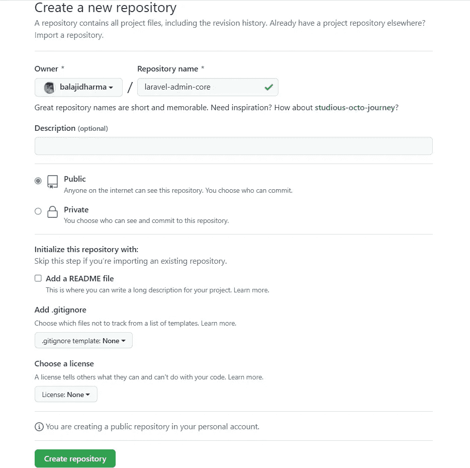
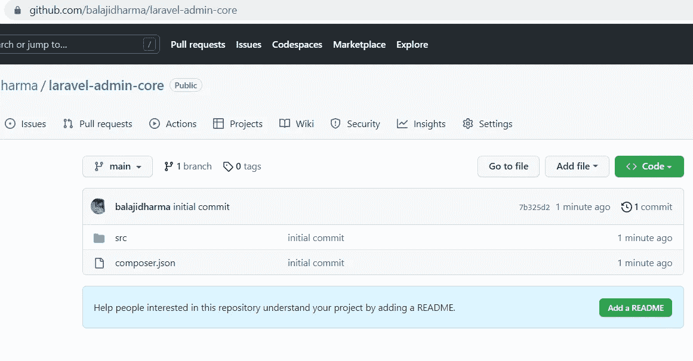
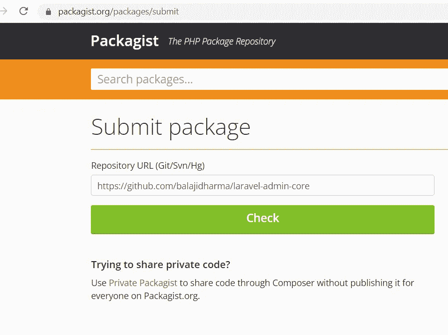
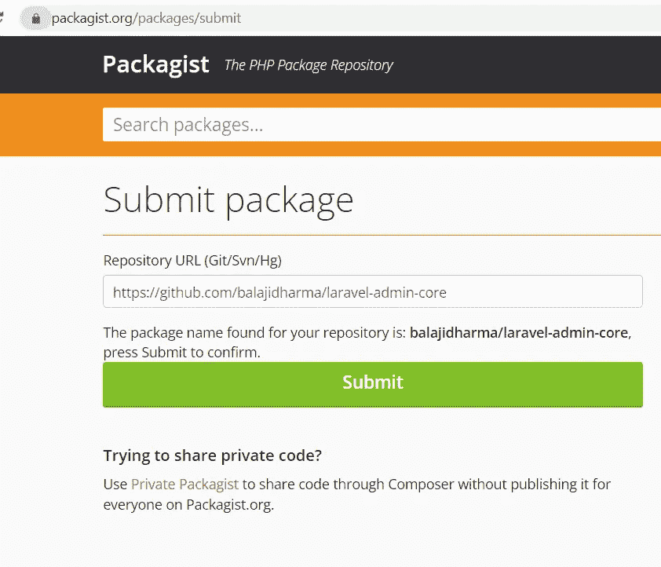
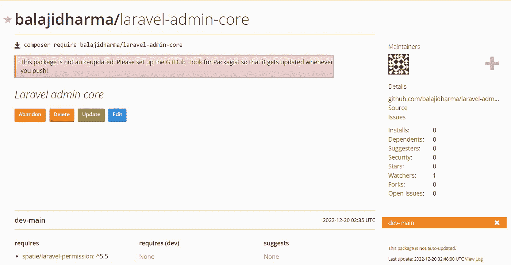
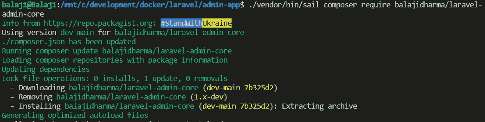
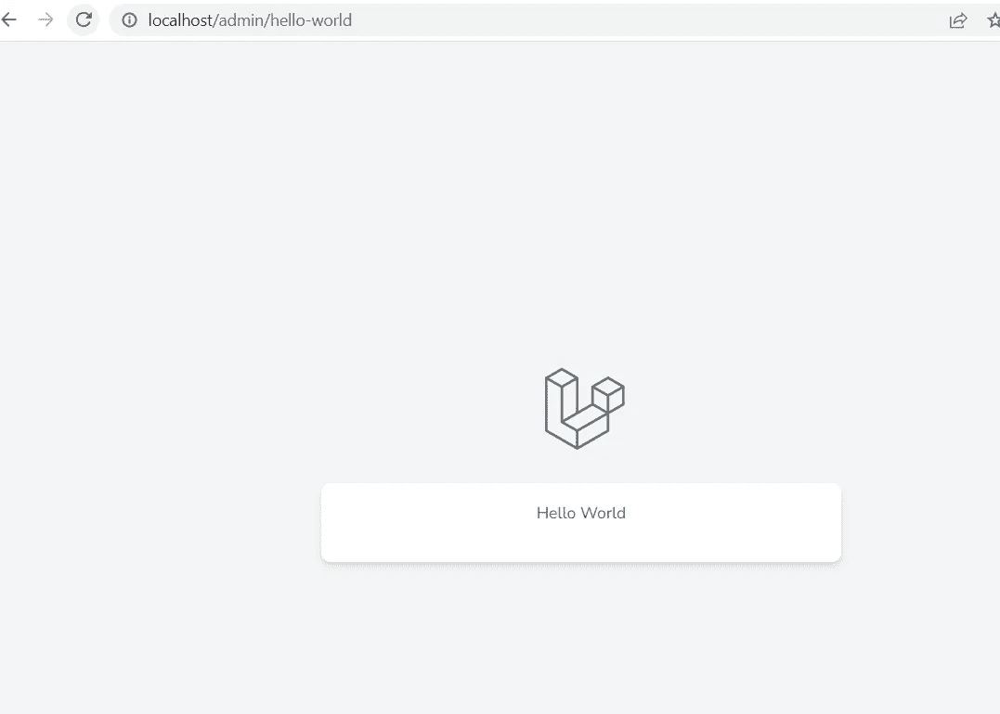

# 如何在 Packagist 上发布自己的 Laravel 软件包

> 原文：<https://blog.devgenius.io/how-to-publish-your-own-laravel-package-on-packagist-ac9a084502ab?source=collection_archive---------7----------------------->

## Laravel 从头开始创建管理面板——第 20 部分


由 [CHUTTERSNAP](https://unsplash.com/@chuttersnap?utm_source=medium&utm_medium=referral) 在 [Unsplash](https://unsplash.com?utm_source=medium&utm_medium=referral) 上拍摄的照片

我们已经在最后的[部分](https://medium.com/dev-genius/how-to-create-your-own-laravel-packages-2b68da22506a)创建了 Laravel 包。在这一部分中，我们将在[packagest](https://packagist.org/)上发布 Laravel 包。

这是 [**从头开始创建管理面板**](/laravel-create-an-admin-panel-from-scratch-part-1-installation-8c11dae7e684) 系列的第 20 部分。 [**基础 Laravel 管理面板**](https://github.com/balajidharma/basic-laravel-admin-panel) 达到 100+下载量和 50+星。也特别感谢 [**开发天才**](https://blog.devgenius.io/) 博客团队发布我的博客。

所以基于包的方法是扩展管理面板特性的最好方法之一。请随意分享您将管理面板移至下一步的方法。

## 在 GitHub 上创建一个新的资源库

转到 GitHub 来[创建](https://github.com/new)一个存储库页面，并为 Laravel 包创建一个新的存储库。



## 将 GitHub 存储库添加到 Laravel 包中

现在我们要将创建的 GitHub 存储库添加到我们的 Laravel 包中。转到终端上的 Laravel 包文件夹，执行以下命令

`packages\balajidharma\laravel-admin-core`

```
git init

git remote add origin https://github.com/balajidharma/laravel-admin-core.git

git add .

git commit -m "initial commit"

git branch -M main

git push -u origin main
```

在推送变更之后，验证您的存储库是否已经更新了最新的代码。



## 在 Packagist 上创建一个帐户

如果你没有账户，去找包装商注册。您也可以使用 GitHub 帐户登录。

## 在 Packagist 上提交包裹

在 Packagist 上创建帐户后，转到[提交包](https://packagist.org/packages/submit)页面。添加您的存储库 URL 并选中“检查”按钮。



在验证给定的存储库之后，它将显示 submit 按钮。



成功提交后，页面将重定向到您的包裹页面。



你应该遵循[如何更新软件包？](https://packagist.org/about#how-to-update-packages)修复自动更新包问题的步骤。

## 测试包

我们已经在 Packagist 上发布了我们的软件包。现在可以使用 composer 安装这个包了。

```
composer require balajidharma/laravel-admin-core
```

现在，我们将删除管理项目中的存储库路径符号链接。

```
diff --git a/composer.json b/composer.json
index 6927ff8..6f87f7c 100644
--- a/composer.json
+++ b/composer.json
@@ -4,12 +4,22 @@
     "description": "The Baic Laravel Admin Panel - Laravel Admin Boilerplate",
     "keywords": ["framework", "laravel", "boilerplate", "admin panel"],
     "license": "MIT",
-    "repositories": [
-        {
-            "type": "path",
-            "url": "packages/balajidharma/laravel-admin-core",
-            "options": {
-                "symlink": true
-            }
-        }
-    ],
     "require": {
         "php": "^8.0.2",
         "guzzlehttp/guzzle": "^7.2",
         "laravel/framework": "^9.19",
         "laravel/sanctum": "^2.14.1",
         "laravel/tinker": "^2.7",
-        "balajidharma/laravel-admin-core": "@dev",
         "spatie/laravel-permission": "^5.5"
     },
     "require-dev": {
```

删除存储库路径设置后，转到 WSL 终端，使用`composer require`安装包

```
./vendor/bin/sail composer require balajidharma/laravel-admin-core
```



现在加载我们的测试页面 URL[http://localhost/admin/hello-world](http://localhost/admin/hello-world)



我们已经成功地为 Laravel 管理面板创建了 [Laravel 管理核心](https://github.com/balajidharma/laravel-admin-core)包。

所以我们需要将我们的核心功能转移到这个包中。之后，我们需要为新特性创建新的包。

Laravel 管理面板可在[https://github.com/balajidharma/basic-laravel-admin-panel](https://github.com/balajidharma/basic-laravel-admin-panel)获得。安装管理面板并分享您的反馈。

感谢您的阅读。

敬请关注更多内容！

*跟我来*[***balajidharma.medium.com***](https://balajidharma.medium.com/)。

上一部分—第 19 部分:[如何创建自己的 Laravel 包](https://medium.com/dev-genius/how-to-create-your-own-laravel-packages-2b68da22506a)

下一部分—第 21 部分: [Laravel 创建一个基于数据库的菜单包](https://medium.com/dev-genius/laravel-creates-a-database-based-menu-package-d67706bf53ec)