# 如何在 GitHub 上发布你的静态网站

> 原文：<https://blog.devgenius.io/how-to-publish-your-static-website-on-github-c7797a1d8cfd?source=collection_archive---------2----------------------->

## 免费在 GitHub 上托管一个静态网站


照片由[格式](https://www.pexels.com/@format-380633?utm_content=attributionCopyText&utm_medium=referral&utm_source=pexels)发自[像素](https://www.pexels.com/photo/photo-of-imac-near-macbook-1029757/?utm_content=attributionCopyText&utm_medium=referral&utm_source=pexels)

GitHub 为我们提供了免费发布任何静态网站的机会。也许你想分享你的简历网站，或者你有一个 HTML，CSS 和 JavaScript 项目，你想展示给人们。使用 GitHub 可以很容易地免费完成。在本文中，我将讨论如何做到这一点。

# 先决条件

*   您必须拥有 GitHub 帐户。
*   您必须在机器上安装 git，并且知道基本的 git 命令。

开设一个 GitHub 账户相当容易。只需去 github.com，点击注册并创建一个账户。

要在你的 windows 机器上安装 git，你可以遵循这个教程

[](https://phoenixnap.com/kb/how-to-install-git-windows) [## 如何在 Windows 上安装 Git {分步教程} - PhoenixNAP

### Git 是一个广泛使用的开源软件跟踪应用程序，用于跨不同团队和…

phoenixnap.com](https://phoenixnap.com/kb/how-to-install-git-windows) 

在 Linux 和 Mac 上大多数情况下都应该安装 git。如果您的 Linux 或 Mac 机器上还没有安装 git，那么请遵循本教程

[](https://www.linode.com/docs/guides/how-to-install-git-on-linux-mac-and-windows/) [## 如何在 Linux、Mac 或 Windows 上安装 Git

### Git 是由 Linus Torvalds 为 Linux 内核开发设计和开发的。Git 提供对非线性的支持…

www.linode.com](https://www.linode.com/docs/guides/how-to-install-git-on-linux-mac-and-windows/) 

# 创建 GitHub 存储库

点击 GitHub 主页顶部的加号，然后点击**新建库**。

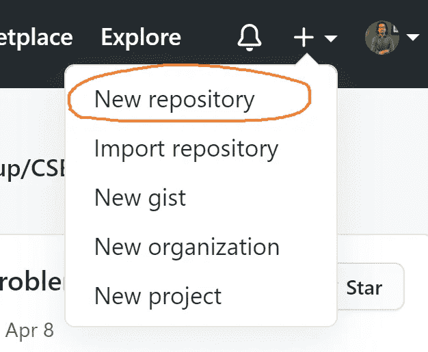

之后会出现新的一页。在这里，您应该为您的存储库取一个合适的名称。确保您的存储库是公开的。看看下面的例子——

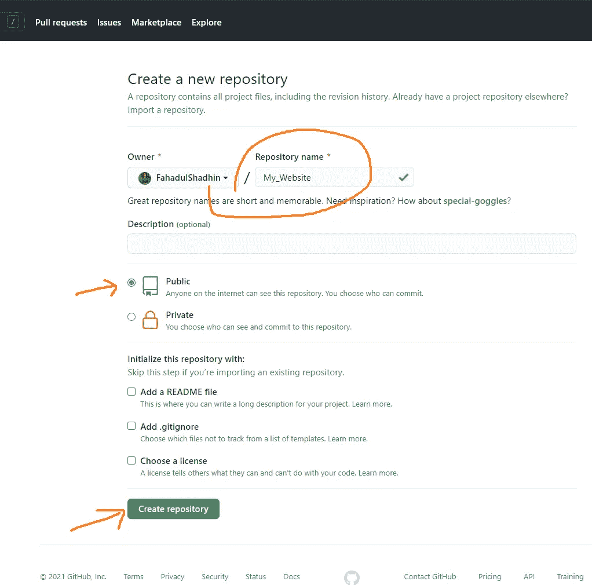

给出一个存储库名称，确保选中 public，然后点击**创建存储库**。描述是可选的。所以你现在可以离开了。

现在，GitHub 上创建了一个空存储库。GitHub 现在将显示设置存储库的基本说明。

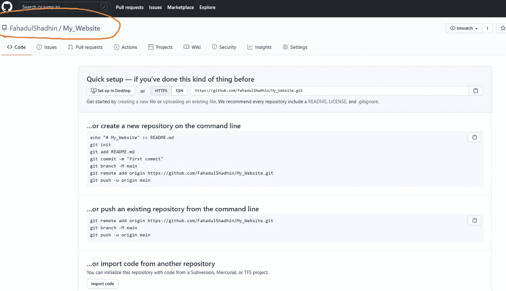

按照说明，您将能够将您的项目文件上传到这个存储库中。为此，您必须熟悉基本的 git 命令。让我告诉你步骤。

# 将项目上传到 GitHub

在 GitHub 上创建了一个存储库之后，现在是时候上传存储库中的项目文件了。

我为这篇文章创建了一个名为 **my_website** 的虚拟项目，它包含三个文件:一个`index.html`文件、一个`style.css`文件和一个`script.js`文件。

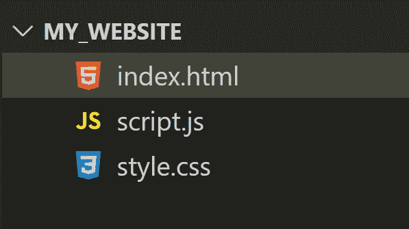

您的项目可以有多个 HTML、CSS 和 JavaScript 文件。您的项目中也可以有图像。但是要确保在项目的根目录下有一个名为 index.html**的 HTML 文件。这个将作为你网站的主页。GitHub 将在你的库的根目录下搜索一个**index.html**。你不能用其他的名字。**

现在从您的项目目录中打开 git bash 并运行这个命令—

```
git init
```

这将在您的项目目录中初始化一个空的 git 存储库。

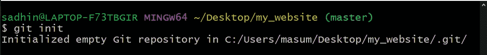

现在运行以下命令来查看状态—

```
git status
```

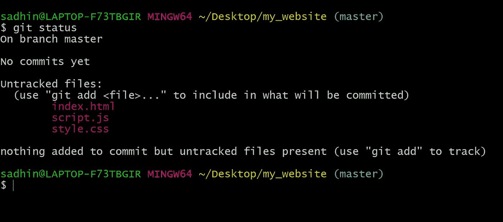

您将看到您的项目文件以红色突出显示。这表示文件未被跟踪。您需要使用以下命令将文件添加到 git 存储库中—

```
git add .
```

它将添加您所有未跟踪的文件。

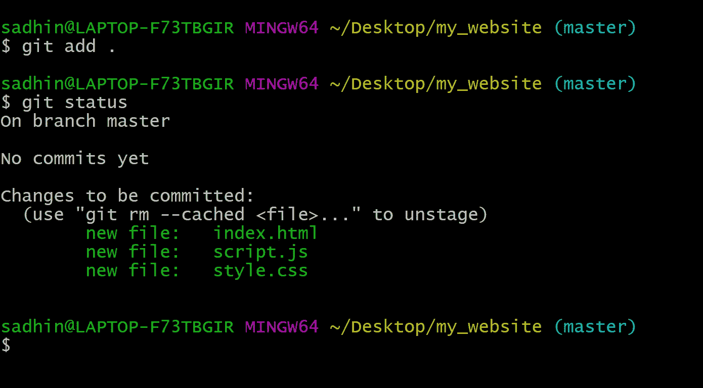

现在所有文件都以绿色突出显示。这意味着所有文件都被添加到 git 存储库中。您需要使用此命令提交您所做的更改—

```
git commit -m “initial commit”
```

您可以将任何合适的消息放在双引号内。如果您再次运行`git status`命令，您将看到一条消息`nothing to commit, working tree clean`。这意味着您的更改被提交到 git 存储库。

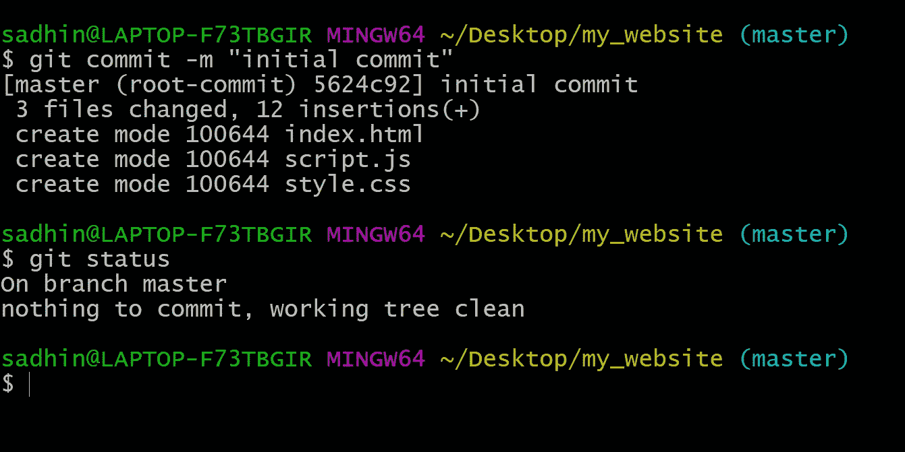

这个存储库位于您的本地机器中。现在你需要在 GitHub 上推送项目。现在回到您的说明页面。从指令中复制这个命令，并从 git bash 中运行它—

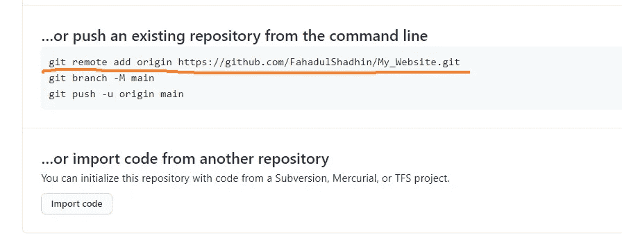

现在，您的远程存储库被添加到本地 git 存储库中。

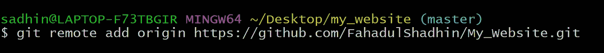

在指令中，GitHub 告诉你创建一个名为 **main** 的分支。然后推到这个**主**分支。但是可以直接推送到**主**分支。只需运行以下命令—

```
git push -u origin master
```

这时你需要从你的电脑上登录 GitHub。输入你的 GitHub 用户名和密码。

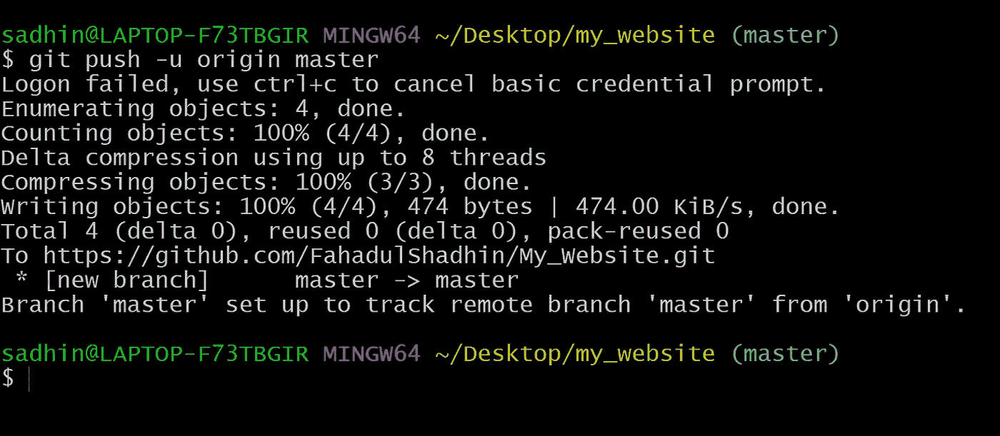

现在回到你的浏览器，刷新你的 GitHub 页面。现在，您可以在 GitHub 存储库中看到您的项目文件。这意味着您的项目已成功上传到 GitHub。

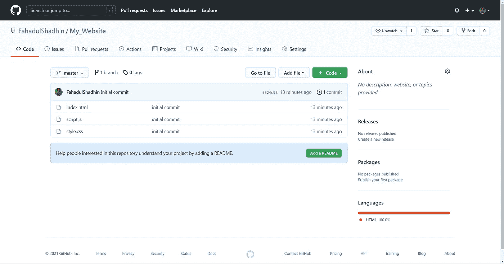

现在你可以发布你的网站了。

# 发布网站

点击存储库的**设置**。

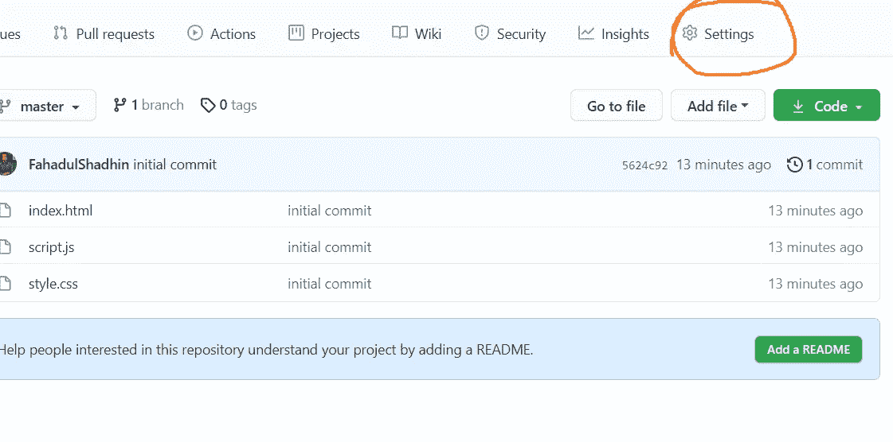

浏览设置页面，直到看到名为 **GitHub Pages** 的部分。将会有链接说“在这里检查它！”。点击它。

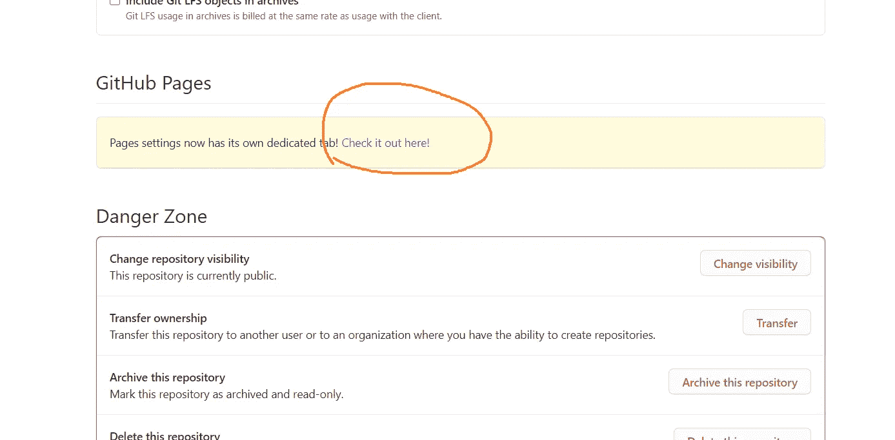

这会将您重定向到另一个页面。在这里，您必须选择一个源分支来启用您的 GitHub 页面。点击**无**。然后选择一个分支。我们在**主**分支推动我们的项目。所以你只会看到一个选项**主**。选择**主**然后点击**保存**。

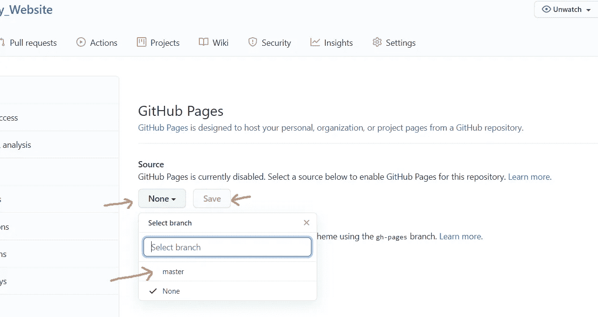

搞定了。您已经成功地在 GitHub 上发布了您的网站。GitHub 现在将向您显示网站 url。点击它，你的网站就上线了！

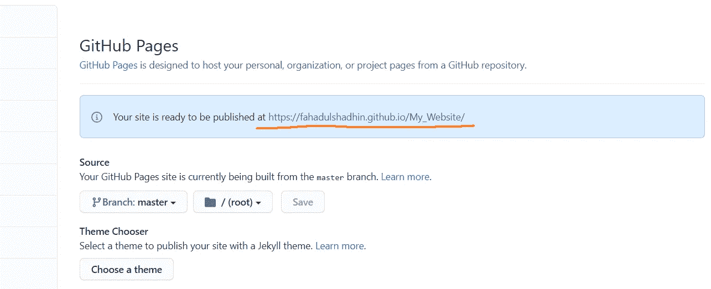

不幸的是，这不是一个自定义的网址。你必须使用 GitHub 提供给你的网址。为了使用自定义 url，您需要从其他提供域名的网站购买域名。但主要目标是免费托管您的网站，以便您可以展示您的项目。

如果您需要对您的网站进行更改，您必须将更改提交到您的 GitHub 资源库，这些更改将在您的网站上可见。

# 结论

如果你的网站足够简单，或者你只是想向其他人展示一个项目，那么把它放在 GitHub 上是个好主意。你的网站上可以有任何类型的内容。也许是你的个人网站。也许是你的简历转换成了网页。也许这是一个有趣的 JavaScript 项目。也可能是博客。只要你的网站是静态的，没有任何后台，你就可以把它放在 GitHub 上。

我希望这篇文章对你有帮助。感谢阅读。