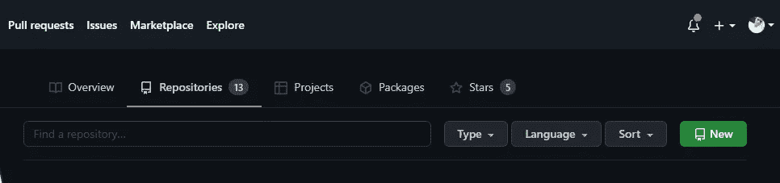
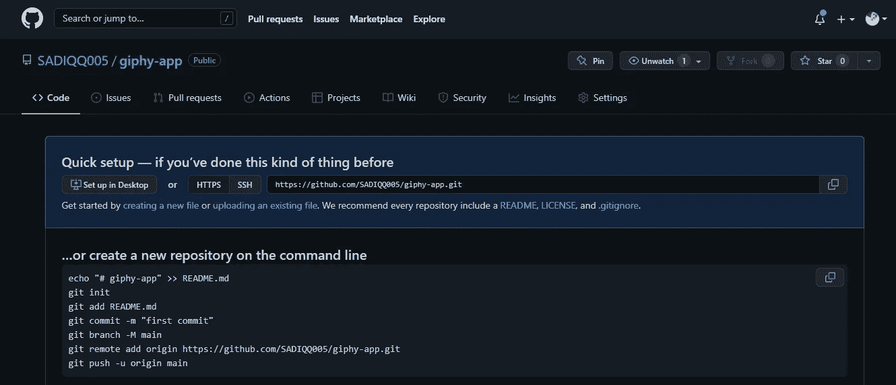
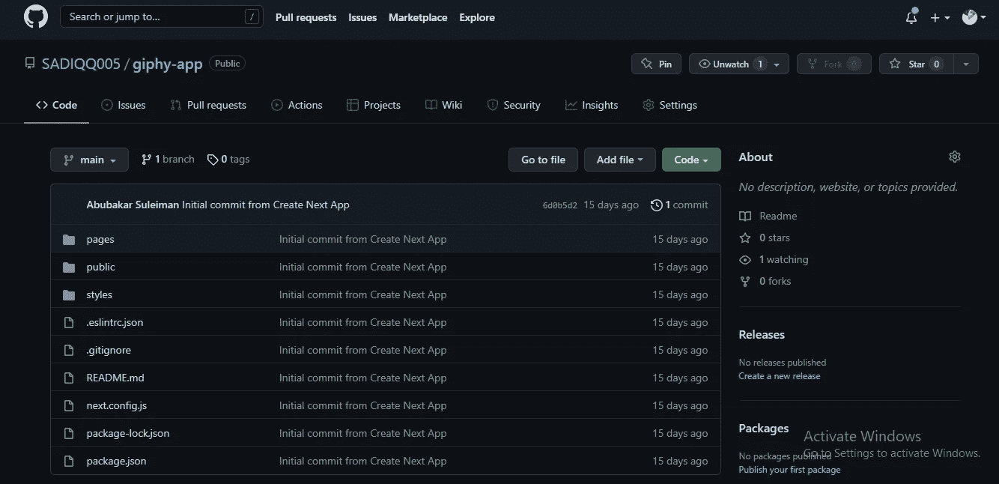

# 如何使用几个 git 命令将代码推送到 GitHub

> 原文：<https://blog.devgenius.io/how-to-push-your-code-to-github-using-few-git-commands-69171c185bf1?source=collection_archive---------10----------------------->

你是版本控制系统的新手，还是刚刚开始学习编程？你肯定想与其他开发者或者甚至是潜在的雇主分享你的代码。或者至少你想要一个更专业的地方来存储你的代码，而不是使用像 google drive 这样的东西😏。

好了，不要再看了，因为在本教程中，我将教你基本的 git 命令，它应该让你把你的代码推到 GitHub 🕺.

## 什么是 GitHub

GitHub 是一家提供基于云的 Git 存储库托管服务的营利性公司。本质上，它使得个人和团队更容易使用 Git 进行版本控制和协作。

## git 是什么

Git 是一个分布式版本控制工具，它是在 GNU 许可下发布的。Git 用于维护源代码、网页的历史和当前版本。Git 是最常用的版本控制系统。Git 跟踪您对文件所做的更改，因此您有一个已经完成的工作的记录，并且您可以在需要的时候恢复到特定的版本。Git 还使协作变得更加容易，允许多人对所有内容的修改被合并到一个源中。继续之前，在你的机器上安装 [git](https://git-scm.com/download/win) 。

所以搞清楚 git 和 GitHub 是两回事。😎

现在开始，我假设我们都有以下一些基本知识。

1.  节点. js
2.  Next.js
3.  GitHub 和 git
4.  代码编辑器我的是 [Vs 代码](https://code.visualstudio.com/Download)你可以选择使用你选择的任何一个

如果没有，别担心，我会帮你解决所有的问题。

**Node.js** 是一个开源的、跨平台的后端 JavaScript 运行时环境，运行在 V8 引擎上，在 web 浏览器之外执行 JavaScript 代码。这里下载 node.js [。将它安装到您的计算机上，您就可以开始编写 JavaScript 代码了。](https://nodejs.org/en/)

**Next.js** 是构建在 Node.js 之上的开源开发框架，支持基于 React 的 web 应用功能，如服务器端渲染和生成静态网站。查看[文档](https://nextjs.org/docs/getting-started)了解更多关于 next.js 的信息。

1.  打开你的命令行，运行 **npx create-next-app <你的项目名>** 需要一段时间才能完成。
2.  **cd <你的项目名称>**
3.  如果 Vs 代码是你最喜欢的编辑器，运行**代码。它会为你打开 Vs 代码中的项目，或者找到你的项目并用你选择的文本编辑器打开它。**
4.  您可以选择让您的项目保持原样，或者如果您够勇敢的话，我尝试通过打开 index.js 文件并删除父 div 中的所有内容来编辑它。而代之以你好世界文本现在点击保存并关闭文件。
5.  在 Vs 代码或命令行中打开终端，运行 **git init** ，为您的项目创建一个本地存储库。
6.  然后运行 **git 状态**我总是建议你在 git 上运行任何命令之前检查你的文件状态，以确保万无一失。您会注意到列出了您更改的 index.js 文件，这意味着正在等待登台。
7.  现在运行 **git add。**或者如果你想只添加一个文件 **git 添加<文件名>。**
8.  运行**git Commit-m " Commit message "**在您更改的文件上写一个小注释。这样你就可以很容易地识别你的变化。
9.  创建一个新的分支 **git checkout -b <你的分支名称>。**您现在位于该分支上，您所做的任何提交都将转到该分支。
10.  现在去 GitHub 创建一个新的 repo，你需要注册成为新用户。

点击绿色按钮表示新建

给它一个名字，你可以让它成为公共的，然后点击创建一个存储库。您应该会看到类似下图的内容。

现在回到你的终端。然后运行 **git remote add origin <链接到 GitHub repo >** 你可以从浏览器的搜索栏获得链接，或者返回 GitHub 复制链接到 HTTP。

现在进行最后一个位运行 **git push -u origin <你的分支名。**给它几分钟时间来完成。一旦完成，返回 GitHub 并刷新你的页面，你应该会看到你的代码。

我猜你现在知道如何将你的代码推送到 GitHub 了。轻松右转。

感谢您的阅读，更多内容请关注并评论。