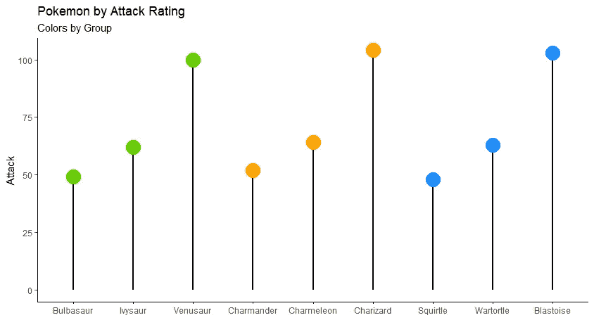

# 如何 R:棒棒糖图表

> 原文：<https://blog.devgenius.io/how-to-r-lollipop-charts-636a11f21ee3?source=collection_archive---------4----------------------->

棒棒糖图是条形图的替代物。这些可以显示一个或多个变量。

棒棒糖图表

对于本文，我们将使用来自 Kaggle 的[完整口袋妖怪数据集](https://www.kaggle.com/datasets/rounakbanik/pokemon)作为数据，R 包 ggplot 作为图表。

本文中显示的棒棒糖图的变体:

1.  基础
2.  按组显示颜色
3.  按 Y 轴数量显示颜色
4.  圆点内有标签
5.  用图像代替点
6.  比较两个变量

# 1.基本棒棒糖图表

基本的棒棒糖图是最容易制作的。它像条形图一样显示基本信息，而不是用条和点来代替。

我们可以从这个图表中清楚地看到，随着三个初级口袋妖怪(bulbasaur、charmander 和 squirtle)的发展，他们的攻击增加了很多。

上图使用的代码。

需要注意的事项:

*   我必须将**名称**字段设置为**因子**，这样它就不会将图形的顺序重置为字母顺序(参见代码的第 2 行)。
*   **geom_segment** 功能与点和 0 x 截距的连线相关。你也可以改变这些线条的颜色和尺寸，正如你看到的，我更新了尺寸，颜色也可以用同样的方式更新。
*   **几何点**功能是定义点的地方。

# 2.按组显示圆点颜色的棒棒糖图表

每个新手口袋妖怪的进化路径都被分组，我给每个点添加了那个口袋妖怪的颜色来表示它们的进化形式。妙蛙种子是绿色的，查曼德是橙色的，斯奎尔是蓝色的。现在更容易看到每个口袋妖怪的具体路径。

上图使用的代码。

需要注意的事项:

*   为了设置颜色组，我创建了一个新的 dataframe，df2，并添加了一个名为 **name_grp** 的新列。该列根据行 id 定义了组。如果它是前 3 排中的一排，与 bulbasaur 相连，那么它就是第 1 组，然后是 charmander 的第 2 组，squirtle 的第 3 组。
*   **色差**在**几何点**函数中定义。在颜色方程式中，有一个基于已创建的 name_grp 的 if 语句。如果组 1，将颜色设置为绿色，组 2 设置为橙色，组 3 设置为蓝色。

# 3.按 Y 轴数量显示颜色的棒棒糖图表

我根据 y 轴的截面设置了这个图形的颜色。如果攻击等级低于 50，则设置为黄色；如果攻击等级在 50 到 75 之间，则设置为橙色；如果攻击等级高于 50，则设置为红色。这让我们更清楚地看到哪些点比另一个高，即使它们看起来彼此接近，例如 bulbasaur vs charmander。这些看起来彼此非常接近，但是因为 charmander 是橙色的，这意味着它的攻击等级高于 50，而 bulbasaur 是黄色的，所以低于 50。

上图使用的代码。

需要注意的事项:

*   圆点的颜色是在 geom_point 函数中设置的，这次利用了 df$attack 上的 if 语句。

# 4.圆点内有标签的棒棒糖图

## 没有透明度

在这个版本的图表中，没有关于攻击等级的猜测，因为它们很容易在每个点上看到。现在我知道查曼德的攻击等级是 52，而布尔巴瑟尔是 49，斯奎尔特是 48。

上图使用的代码。

需要注意的事项:

*   为了给每个点添加标签，需要添加一个新行，即 geom_text 函数。在这里，我将标签设置为攻击等级，这样就会显示出来。
*   为了确保标签适合圆点，我将圆点的大小增加到 10。

## 透明度

对于这一个，点里面有一些透明度，周围有一个清晰的边界。这将增加点内每个标签的可读性。

上图使用的代码。

需要注意的事项:

*   为了增加透明度，需要在 geom_point 函数中添加一些东西。首先你需要添加一个填充方程，并在 alpha 中设置它，这将使颜色更加透明。然后，形状需要 21。最后，笔画是边框的大小。
*   该段进入实际攻击等级，点利用这个完全相同的点作为它的中心。正因为如此，这条线一直延伸到圆点的中心，可以透明地看到。为了解决这个问题，你需要查看点的大小，然后除以 2，然后从 geom_segment 中的 yend 方程中删除它。例如，这里点的大小是 10，一半是 5。所以在 geom_segment 中，yend = attack — 5。

# 5.用图像代替圆点的棒棒糖图表

在这里我们可以看到口袋妖怪自己的攻击等级。这有助于轻松想象每个口袋妖怪在哪里。

上图使用的代码。

需要注意的事项:

*   我从 pokemon.com 的网站上获得了每个口袋妖怪的图片。然后，我用这些图像的 url 创建了一个图像向量，按照它们在数据集中出现的顺序。
*   要将图像添加到棒棒糖图中，您需要在 r 中安装 ggimages 包，然后使用 geom_image 函数而不是 geom_point 函数，瞧！

**6。棒棒糖图—比较两个变量**

在这张图表中，我们可以清楚地看到每个口袋妖怪的攻击和防御等级，以及它们之间的比较。例如，squirtle 和它的每一种进化形态的防御等级都远远高于攻击等级。相反，查曼德的每一种进化形态的攻击力都大于防御力。根据你更关心什么，你可以选择 squirle 或 charmander 开始。

上图使用的代码。

需要注意的事项:

*   要做到这一点，你需要确保 y 和 yend 中的段引用了其中一个变量，而不是 0。对于这个，我把 y =防御，yend =攻击。
*   需要两个 geom_point 函数，每个函数通过 aes 引用自己的变量。这里我有一个带 aes(y =攻击)，另一个带 aes(y =防御)。

# 概述

我希望你们都喜欢这篇文章，并学会了如何创建各种版本的棒棒糖图表。

如果您喜欢学习棒棒糖图，您可能也喜欢在[How to R:Visualizing Distributions](https://medium.com/@nickmartin812/how-to-r-visualizing-distributions-49ea4141fb32)中学习可视化分布。