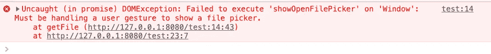
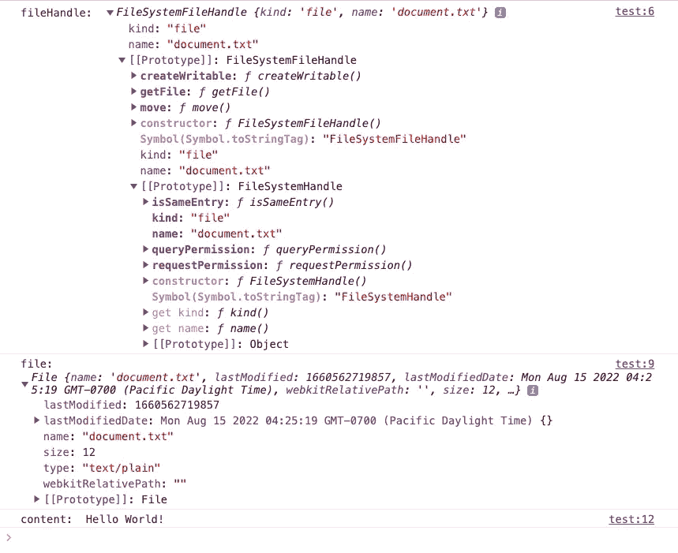
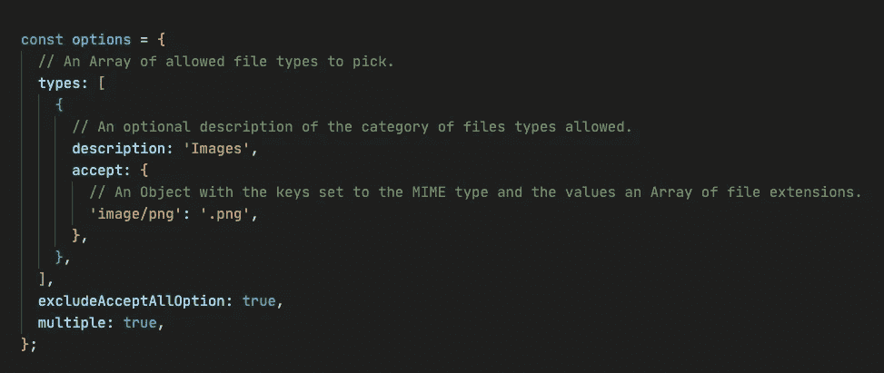
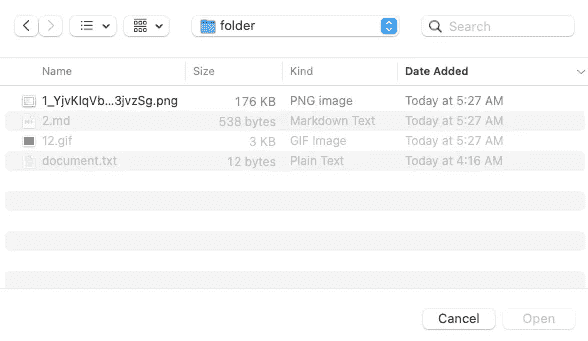
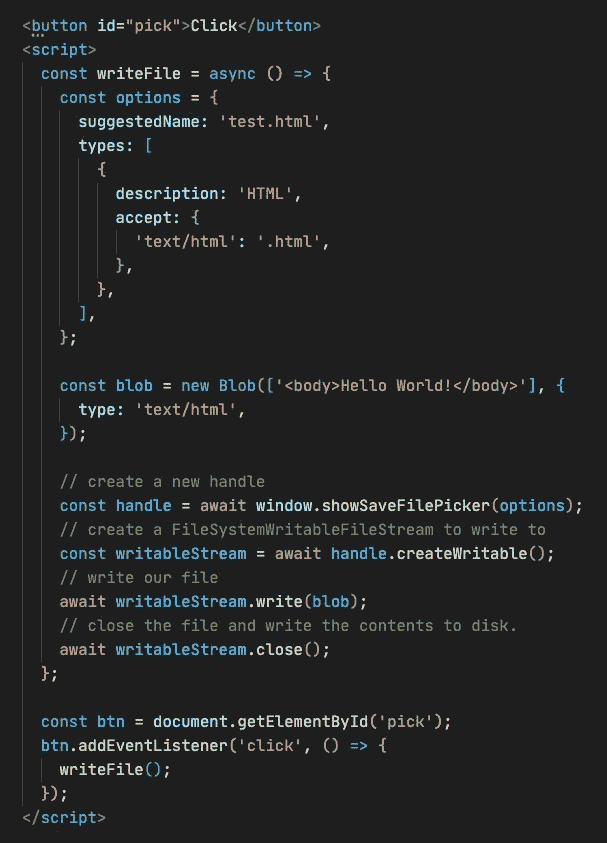
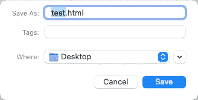
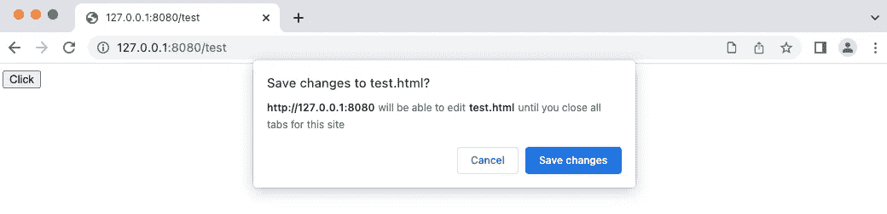
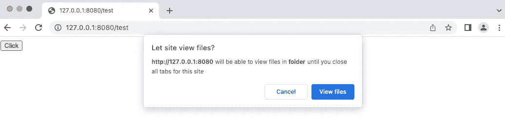
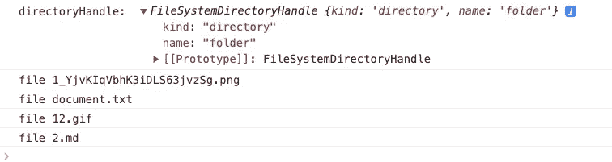
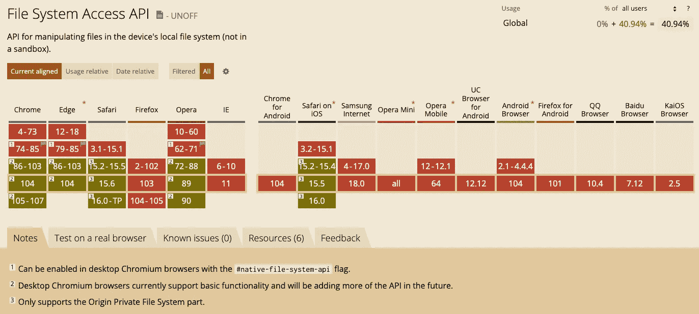

# 如何在 Web 应用程序中读写文件

> 原文：<https://blog.devgenius.io/how-to-read-and-write-files-in-a-web-application-ca52ec7e2f14?source=collection_archive---------12----------------------->

## 轻松高效地与文件交互


布雷特·乔丹在 [Unsplash](https://unsplash.com?utm_source=medium&utm_medium=referral) 上拍摄的照片

应用程序与本地文件交互是很常见的，但这在 web 应用程序中很难实现。主要是因为浏览器有保障的安全性。我们可以使用带有 IndexedDB API 的文件类型的 HTML input 元素来实现类似的东西，但这需要很多细节和精心制作。并且如果需要频繁操作，则性能可能不令人满意。

文件系统访问 API 使 web 应用程序能够轻松高效地访问文件。具体来说，它允许 JavaScript 与用户本地设备或用户可访问的网络文件系统上的文件进行交互。这个 API 的核心功能包括读取文件、写入或保存文件以及访问目录结构。

# 访问单个文件

在我们开始之前，我们需要知道文件系统访问特性只在[安全上下文](https://developer.mozilla.org/en-US/docs/Web/Security/Secure_Contexts) (HTTPS)，部分或全部[支持浏览器](https://developer.mozilla.org/en-US/docs/Web/API/File_System_Access_API#browser_compatibility)中可用。它不允许跨源，但我们可以在本地服务上测试。

要访问文件，我们可以使用`window.showOpenFilePicker`，但是它必须处理用户手势来显示文件选择器。如果我们直接调用它，它会:



以下代码允许用户从文件选取器中选择一个文件:

```
<button id="pick">Click</button>
<script>
  const getFile = async () => {
    // open file picker
    const [fileHandle] = await window.showOpenFilePicker();
    console.log('fileHandle: ', fileHandle); const file = await fileHandle.getFile();
    console.log('file: ', file); const content = await file.text();
    console.log('content: ', content); }; const btn = document.getElementById('pick');
    btn.addEventListener('click', () => {
      getFile();
    });
</script>
```

如果我们选择了一个`document.txt`文件:



细心的你可能会发现，我们在这里解构的是数组的第一项，`showOpenFilePicker`实际上会返回`[FileSystemFileHandle](https://wicg.github.io/file-system-access/#api-filesystemfilehandle)` objects 数组。我将在下面描述如何支持多个文件。

# 访问多个文件:

要访问多个文件，只需将一个选项配置传递给`showOpenFilePicker`:

```
const getFile = async () => {
  const options = {
    **multiple: true,**
  }; // open file picker
  const fileHandles = await window.showOpenFilePicker(options);
  console.log('fileHandles: ', fileHandles);
};
```

默认情况下，multiple 属性值为 false。此外，还有其他配置项可供选择。比如我们只想接受`.png`文件，那么`options`可以是这样的:



下面是 MDN 上对`[options](https://developer.mozilla.org/en-US/docs/Web/API/window/showOpenFilePicker#parameters)`更详细的描述。以下是选择的截图:



# 写入文件

我们也可以使用`Window.showSaveFilePicker()`来显示一个允许用户保存文件的文件选择器。可以用新文件名或现有文件名保存(完全覆盖)。



请参见代码中的注释。值得一提的是，除了写 blobs，还可以是简单的字符串，还可以有更高级的特性:

```
// just pass in the data (no options)
writableStream.write(data);// writes the data to the stream from the determined position
writableStream.write({ type: "write", position, data });// updates the current file cursor offset to the position specified
writableStream.write({ type: "seek", position });// resizes the file to be size bytes long
writableStream.write({ type: "truncate", size });
```

点击后截图:



我们也可以配置`[options](https://developer.mozilla.org/en-US/docs/Web/API/window/showSaveFilePicker#parameters)`来实现一些其他功能，如建议文件名等。

## 编辑现有文件

编辑现有文件与此类似:

```
const writeFile = async () => {
  const blob = new Blob(['<body>Hello World!</body>'], {
    type: 'text/html',
  }); const [fileHandle] = await window.showOpenFilePicker(options); const file = await fileHandle.getFile();
  const writableStream = await fileHandle.createWritable(); await writableStream.write(blob);
  await writableStream.close();
};
```

浏览器会提示我们是否要授权，确认后才会写:



# 访问目录

`window.showDirectoryPicker`让我们可以简单地实现这一点:

```
<button id="pick">Click</button>
<script>
  const getDir = async () => {
    const directoryHandle = await window.showDirectoryPicker();
    console.log('directoryHandle: ', directoryHandle); for await (const entry of directoryHandle.values()) {
      console.log(entry.kind, entry.name);
    }
  }; const btn = document.getElementById('pick');
  btn.addEventListener('click', () => {
    getDir();
  });
</script>
```

权限确认:



结果截图:



# 浏览器兼容性



图片来自[can use](https://caniuse.com/?search=File%20System%20Access)

# 结论

本文只是简单介绍，如果有兴趣可以参考以下资源:

[1] [文件系统访问 API](https://wicg.github.io/file-system-access/) (W3C 规范)

[2] [文件系统访问 API](https://developer.mozilla.org/en-US/docs/Web/API/File_System_Access_API) (MDN)

*感谢阅读。如果你喜欢这样的故事，想支持我，请考虑成为* [*中会员*](https://medium.com/@islizeqiang/membership) *。每月 5 美元，你可以无限制地访问媒体内容。如果你通过* [*我的链接*](https://medium.com/@islizeqiang/membership) *报名，我会得到一点佣金。*

你的支持对我来说很重要——谢谢。