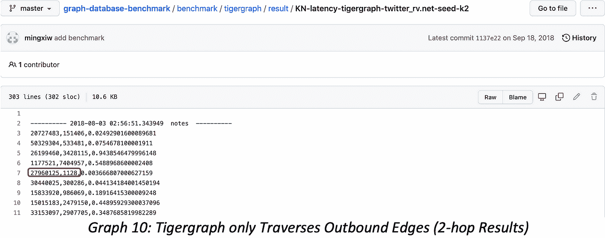

# 如何阅读图形数据库基准(下)

> 原文：<https://blog.devgenius.io/how-to-read-graph-database-benchmark-part-ii-38ac7da38768?source=collection_archive---------11----------------------->

这是[如何读取图形数据库基准系列](https://medium.com/dev-genius/how-to-read-graph-database-benchmarks-part-i-996daa830a94)的第二部分，专门用于 3 类操作的查询结果验证:

k 跳

最短路径

图形算法

让我们从 K 跳查询开始。首先，让我们明确 K-hop 的定义，有两种类型的 K-hop:

1.第 K 跳邻居，即距离源顶点正好 K 跳的邻居

2.从第一跳到第 k 跳的所有邻居

无论您正在查看哪种类型的 K-hop，有两个要点会影响查询的正确性:

A.应该使用 BFS 而不是 DFS 来实现 K-hop

B.结果重复数据删除:结果不应该包含同一跳或不同跳之间的任何重复顶点(正如我们所说的，许多图形 DBMS 确实存在这种重复数据删除问题。)

一些供应商使用 DFS 来寻找最短路径，这种方法有两个致命的问题:

A.完全错误:结果很有可能是错误的，因为 DFS 不能保证一个顶点属于最短路径上的正确跳跃(深度)。

B.低效:在大型和密集的数据集上，以 DFS 的方式遍历所有可能的路径是不切实际的，例如，Twitter-2010 有许多热点节点，它们有数百万个邻居，任何 2 跳或更深的查询都意味着天文计算的复杂性！

让我们在 Twitter-2010 中验证顶点 ID=27960125 的 1 跳结果，首先，我们从显示 8 条边(连接邻居的行)的源文件开始，但是，它的 1 跳到底是什么？

正确答案是 7！因为节点 27960125 的邻居 ID=27498091 出现了两次，因为这两个顶点之间有两条边。如果我们进行重复数据删除，我们有 7 个。

为了扩展 K-hop 查询，可以在每个边缘方向进行 K-hop，下面的截图显示了运行 K-hop 的 4 种方式:常规双向 K-hop、出站 K-hop、入站 K-hop 和与所有邻居的 K-hop。这些查询组合起来可以帮助验证任何 K-hop 查询。

如果我们与可公开访问的 Tigergraph 的 K 跳查询结果进行比较，顶点 ID=27960125 只有 6 个 1 跳邻居(如图 9 所示)，类似的计数错误在 Github 上的整个公布结果中普遍存在。

Tigergraph K-hop 问题有 3 种可能的原因:

数据建模错误:每条边只存储一次(单向的)，所以反向边遍历是不可能的

查询方法错误:K-hop 查询只是单向进行的，而不是双向的

代码实现错误:比如结果没有被重复删除，我们接下来将在多跳查询中继续检查

数据建模错误是致命的，它意味着业务逻辑将不会正确地反映在基础数据模型中。以反欺诈、AML 或 BI 场景为例，账户 A 从账户 B 接收交易，但是，系统仅存储从 A 指向 B 的边(A →B ),而不存储从 B 指向 A 的反向边(B←A ),这将导致无法追踪从账户 B 开始的交易。这显然是不可接受的。

同样，查询方法和编码逻辑的错误也很严重，查询应该是双向的而不是单向的，前者在遍历多跳时要复杂得多。存储空间使用和数据接收时间也是如此。

如果我们继续跟踪 vertex ID=27960125 的 2 跳结果，Tigergraph 的错误会变得更加引人注目，也更加难以验证。注意 Tigergraph 返回 1128 个邻居，但是存在重复的邻居，并且结果仅基于出站边。正确的 2 跳邻居数应该是 533108，这里的差是 473 倍，47300%！Tigergraph 的查询结果同时带有 3 个错误:数据建模错误、查询方法错误和重复数据删除错误。

不幸的是，Tigergraph 的问题不是一个例外，我们在 Neo4j、ArangoDB 和其他图形系统中也看到了类似的问题。例如，默认情况下，Neo4j 不会对 K-hop 结果进行重复数据消除，如果您强制它进行重复数据消除，它的运行速度将会大大降低。而且，ArangoDB 有一种最短路径查询形式，只返回一条路径，这很快，但当结果池中有许多路径时，这种方式就错得离谱了。

图 11 显示了使用 Ultipa CLI 进行 K-hop 查询的 4 种方式，这有助于轻松精确地验证查询结果。

GUI 工具可以帮助我们直观地查询数据集和结果，并与之进行交互。下面的屏幕截图显示了具有 13 个邻居的顶点的 1 跳查询结果。

如何验证上面的结果？一个简单的方法是以 BFS 方式在顶点上扩展，并且只扩展 1 层(跳)。下图显示了使用 spread()函数对主题顶点进行扩展时，它有 19 条连接边，但在删除 6 条重复边后，唯一的邻居只有 13 条。

现在让我们解决最短路径和图算法的验证问题。

我们现在知道最短路径是 K 跳查询的一种特殊形式，它有两个不同的特征:

由路径组成的高维度结果，这些路径进一步由按特定顺序组合的节点和边组成

所有路径都要返回:仅计算并返回 1 条路径是不够的。在金融欺诈检测、AML、BI 归因分析中，可能存在许多路径，仅返回一条路径是完全不可接受的。

上面的两个图表显示，在中，ID 12 和 13 之间有多条最短路径，但是，如果您按特定方向搜索，随着搜索过滤逻辑的启动，您可能会得到不同的答案。对于像这样的简单情况，您可以 grep 源文件以发现在顶点 ID 12 和 13 之间有两条双向边，如果您递归地这样做，您可以验证更复杂的查询。注意我刚才用的关键词“递归”，这正是为什么 GQL/Graph-DBMS 会成为主流，SQL/RDBMS 会逐渐消失的原因，因为 SQL 最薄弱的环节就是无法处理递归查询，而 GQL/Graph 在这一点上是自动化的。

接下来，我们以 Jaccard 相似度算法为例说明如何验证算法结果。以下图为例，要计算绿色顶点和红色顶点的 Jaccard 相似性，必须找到它们的共同邻居(2)和总邻居(5)，因此相似性= 2/5 = 0.4 = 40%。

如果集成了 Jaccard 相似度算法，直接启动就会粗制滥造出 0.4 的正确答案。如果您希望编写几行 GQL 来以一种有机的白盒方式实现它，您可以这样做:

在 Twitter-2010 中，计算任意一对顶点的 Jaccard 相似度是为了找到每个顶点的 1 跳邻居，以 ID=12 和 ID=13 为例，它们都是拥有超过 100 万邻居的热点超节点，手工验证算法结果是不切实际的。但是，只要你懂算法罩下的逻辑，就有办法分而治之。以下步骤显示了验证算法的两种方法:

1.启动 Jaccard 算法:

2.验证方法 1:使用多个 gql 实现 Jaccard 相似度算法，编码逻辑与图 17 所示相同:

3.验证方法 2:首先检查顶点 ID 12 和 13 的 1 跳邻居:

4.验证方法 2:在 ID 12 和 ID 12 之间找到所有深度正好为 2 跳的不同路径，路径的数量等于两个 ID 的公共邻居的数量:

5.验证方法 2:相似度=步骤 4 的结果/ (12 的 1 跳+ 13 的 1 跳-步骤 4 的结果)= 0.15362638

6.正如你所看到的，第二步和第五步的结果是准确的。我们知道答案是正确的。

在这一系列文章(两篇)中，我们特意向读者全面介绍了如何阅读和理解图形数据库系统的基准测试报告，以及在其中验证结果的方法。确保结果的完整和正确是非常重要的，毕竟，我们正在谈论数据智能和基础设施革命，如果像 graph DBMS 这样的颠覆性技术不能确保其数据建模或查询结果的正确性，那将毫无意义。