# 如何阅读图形数据库基准(第一部分)

> 原文：<https://blog.devgenius.io/how-to-read-graph-database-benchmarks-part-i-996daa830a94?source=collection_archive---------15----------------------->

本文的主要目标是介绍图形数据库、图形计算和分析的基本知识，帮助读者解读基准测试报告，并验证结果是否正确和合理。

# 基础知识

在任何图形数据库中，主要有两种类型的数据操作:

1.元数据操作:也称为针对顶点、边或它们的属性的操作。主要有 4 种类型的元操作，特别是凝乳(创建、更新、读取或删除)。

2.高维数据操作:通过说“高维”，我们指的是结果数据集中的高维数据结构，例如，一组顶点或边、一个路径网络、一个子图或一些混合类型的复杂的图遍历结果——本质上，不同类型的数据可以混合并组合在一批结果中，因此使得对这种结果的检查既令人兴奋又令人困惑。

高维数据操作是 graph 数据库和其他类型的 DBMS 之间的一个关键区别，我们将在整篇文章中重点研究 graph DB 的这个独特特性。

有 3 种主要类型的高维数据操作，在大多数基准测试报告中经常遇到:

1.K-hop:针对某个顶点的 K-hop 查询将产生所有从源顶点到最短路径长度正好为 K-Hop 的顶点。K-hop 查询有许多变体，例如通过某些边方向、顶点或边属性进行过滤。有一种特殊的 K 跳查询是针对整个图的所有顶点运行的，它也被认为是一种图算法。

2.路径:路径查询有很多种，最常用的是最短路径查询，此外还有基于模板的路径查询、寻圆路径查询、自动组网查询和自动展开查询等。

3.图算法:图算法本质上是元数据、K 跳、路径查询的组合。有像 degrees 这样的基本算法，但也有像 Louvain 这样的高度复杂的算法，而且就计算复杂性而言，还有非常复杂的算法，如中间中心性或全图 K-hop，特别是当 K 远大于 1 时。

大多数基准测试报告都不愿意透露高维数据操作是如何实现的，这种模糊性给读者更好地理解图形技术带来了很多麻烦。我们在此澄清，就如何遍历图形数据而言，只有 3 种类型的实现:

1.BFS(广度优先搜索):最短路径、K 跳查询通常使用 BFS 方法实现。值得澄清的是，您可以使用 DFS 来实现最短路径查找，但是在大多数现实世界的应用程序中，特别是在有大量数据的情况下，BFS 肯定比 DFS 更有效，逻辑上也更简单。

2.DFS(深度优先搜索):像圆查找、自动联网、基于模板的路径查询、随机行走等查询都希望使用 DFS 方法来实现。如果你发现很难理解 BFS 和 DFS 之间的区别，参考下图和一本关于图论的大学教科书。

3.两者的结合(BFS + DFS):存在同时应用 BFS 和 DFS 的场景，例如基于模板的 K 跳查询、定制的图算法等。

图 1 说明了 BFS 和 DFS 之间的遍历差异。简而言之，在 BFS 模式下，如果没有首先访问所有合格的第一跳邻居，则不会开始访问任何第二跳邻居，并且遍历将以这种方式继续，直到一跳接一跳地访问了所有数据(邻居)。基于这样的描述，不难看出，如果某个 K 跳或最短路径查询只返回预定义的有限数量的邻居或路径(比如 1 或 10)，那么查询实现肯定是错误的！因为您事先不知道合格邻居或路径的总数。

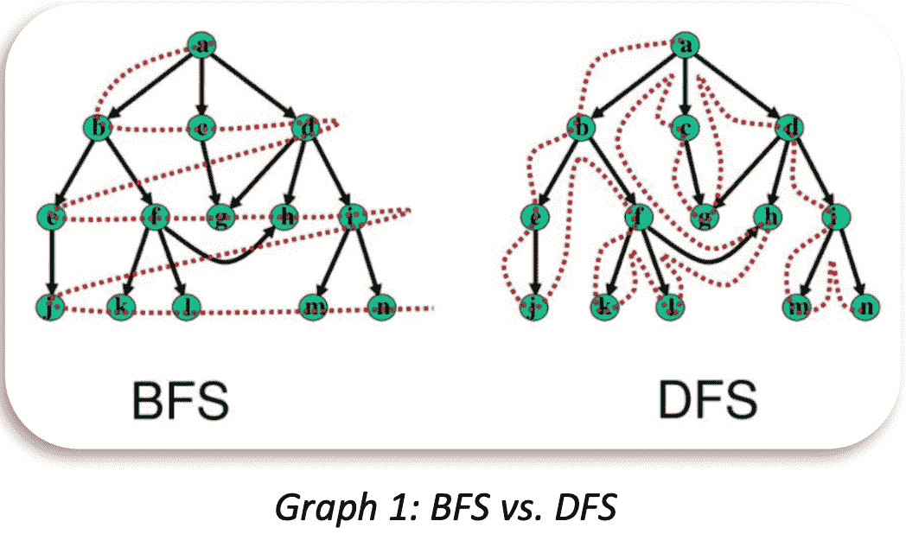

# 典型基准数据集

图形系统基准测试有 3 种类型的数据集:

1.社交或道路网络数据集:典型的社交网络数据集，如 Twitter-2010 和 Amazon0601，通常用于图形数据库基准测试。也有基于道路网络或网络拓扑的数据集用于学术基准，如加州大学伯克利分校的 GAP。

2.合成数据集:HPC(高性能计算)组织 Graph-500 已经发布了一些用于图形系统基准测试的合成数据集。国际标准化组织 LDBC(链接数据基准委员会)也使用数据生成工具来创建用于基准测试目的的合成社交网络数据集。

3.财务数据集:图表基准数据集家族的最新成员是财务数据集，主要出现在私有和面向业务的设置中，因为数据通常基于真实的交易。有几个公共数据集，如 Alimama 的电子商务数据集和 LDBC 的 FB (FinBench)数据集，该数据集正在起草中，将于 2022 年底发布(以取代 LDBC 的 SNB 数据集，该数据集在数据拓扑和复杂性方面不能反映现实世界的金融业务挑战)。

随着图形数据库和计算技术和产品的不断发展，不难看出，更多的图形数据集将会出现，并更好地反映现实世界的场景和业务挑战。

Twitter-2010(4200 万个顶点，14.7 亿条边，大小为 25GB，可从[http://an.kaist.ac.kr/traces/WWW2010.html](http://an.kaist.ac.kr/traces/WWW2010.html)下载)通常用于基准测试，我们将使用它作为一个公平的竞技场来解释如何解释基准测试报告以及如何验证报告中的结果。

在开始之前，让我们以 Twitter 数据集为例，熟悉一下图形数据建模中的一些概念:

有向图:每条边都有唯一的方向，在 Twitter 中，一条边由一个起始顶点和一个结束顶点组成，它们映射到数据文件每行上用 TAB 分隔的 2 个 id，边的意义在于它表示起始顶点(人)跟在结束顶点(人)之后。当在图形数据库中建模边时，边将被构建两次，第一次是作为开始顶点结束顶点，第二次是作为结束顶点开始反转(也称为反转边)，这是为了允许从任一方向遍历边。如果没有构造反向边，查询结果将不可避免地出错(稍后我们将向您展示如何出错)。

简单图与多图:如果在任一方向上的一对顶点之间有两条以上同类的边，则它是多图，否则它是简单图。Twitter 和所有社交网络数据集都被认为是简单的图形，因为它模拟了用户之间简单的追随关系。在金融场景中，假设用户账户是顶点，交易是边，在两个账户之间可能有许多交易，因此有许多边。一些图数据库被设计成简单图而不是多图，这将在数据建模效率和查询结果正确性方面产生许多问题。

节点-边属性:Twitter 数据除了指定的边方向之外，不携带任何节点或边属性。这与金融场景中的事务图不同，在金融场景中，节点和边都可能具有许多属性，因此可以在这些属性的帮助下进行过滤、排序、聚合和属性分析。有一些所谓的图形数据库系统不支持按节点或边属性过滤，这被认为是不切实际的，缺乏商业价值。

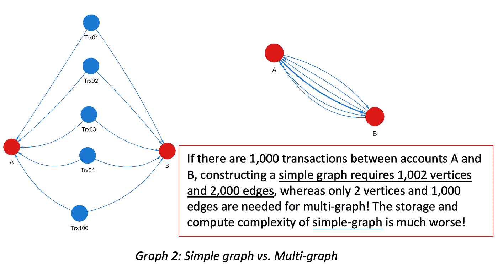

# 报告解释

一般来说，一个图形数据库基准报告至少有 5 个部分:

1)测试床/环境:软硬件环境、测试数据集等。

2)数据摄取:卷数据加载、数据库启动时间等。

3)查询性能:针对元数据、K 跳、最短路径、算法等的查询。

4)实时更新:修改图形数据的拓扑(元数据),然后查询更新的数据以验证结果。

5)功能完整性和可用性:支持 API/SDK 进行二次开发、GQL、管理和监控、系统维护工具包和灾难恢复等。

大多数基准测试报告会涵盖前 3 部分，但不会涵盖第 4 或第 5 部分—第 4 部分反映了主题数据库是否更侧重于 OLTP/HTAP 类型或 OLAP，主要区别在于处理动态变化数据集的能力。显然，如果一个图形系统声称能够支持 OLTP/HTAP，它必须允许数据随时更新和查询，而不是像 Apache Spark 那样充当静态数据仓库，或者必须先完成数据投影，然后才能像 Neo4j 那样对刚刚完成的静态投影运行查询。

# 试验台

几乎所有的图形数据库产品都构建在 X86 架构上，因为 X86–64 CPU 驱动的服务器主导了服务器市场。随着 ARM 的崛起，这种情况最近发生了变化，这是由于 ARM 过于简单的 RISC(而不是 X86 的 CISC)因此更环保的设计。如今，基于 ARM 处理器的商用 PC 服务器越来越多。然而，只有 2 家图形数据库供应商已知本机支持 ARM-64 CPU 架构，它们是 Ultipa 和 ArangoDB，而其他供应商倾向于使用虚拟化或仿真方法，这往往比本机方法慢得多。

核心硬件配置是 CPU、DRAM、外存和网络带宽。CPU 内核的数量至关重要，因为更多的内核意味着潜在的更高并行性和更好的系统吞吐量。大多数测试平台采用 16 核和 256GB 配置，但并非所有图形系统都可以利用多核来加速数据处理，例如，即使企业版 Neo4j 在并行化方面也可以利用多达 4 个 vCPU。如果另一个系统可以利用 16 个 vCPU，那么性能提升至少是 400%。

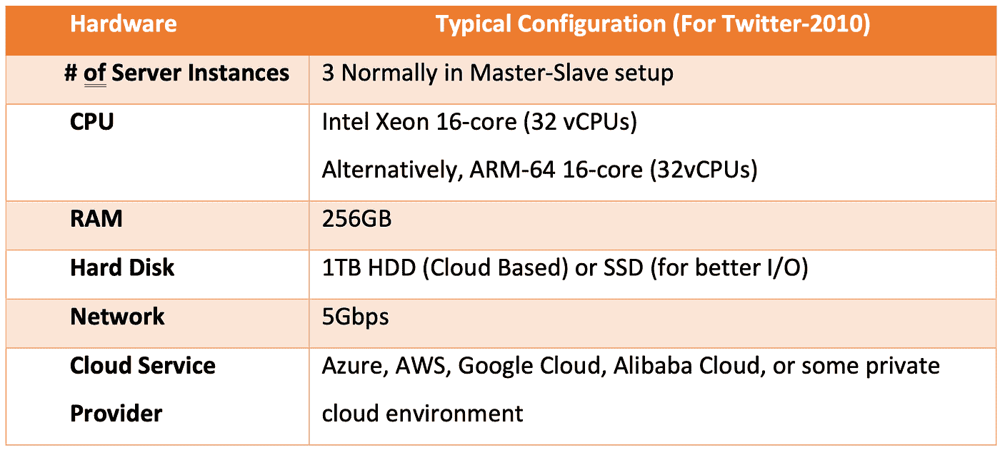

上表说明了图形系统基准测试的典型硬件配置。值得指出的是，图形数据库是计算优先，不像 RDBMS、数据仓库或数据湖系统是存储优先，计算是附属于存储引擎的二等公民。换句话说，传统的 DBMS 首先解决 I/O 密集型挑战，而 graph system 首先解决计算密集型挑战。虽然这两个挑战可能会相互交叉，这就是为什么面向性能的图形数据库应该将计算和存储设置为其一等公民。

软件环境是微不足道的，因为所有已知的图形系统都基于 Linux 操作系统，并利用容器和虚拟化技术进行封装和隔离。

# 数据摄取

数据接收有几个需要注意的指标:

数据集体积、拓扑复杂性(或密度)

摄入时间

储存空间

数据量涉及顶点和边的总数，加上复杂度(或密度)，通常使用以下公式计算(对于有向简单图):

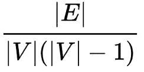

其中|V|表示顶点的总数，而|E|表示边的总数。根据这个公式，样本图的最高可能密度是 1。然而，正如我们前面指出的，大多数真实世界的图不是简单图，而是多图，这意味着任意两个顶点之间可能存在多条边，因此使用顶点与边的比率(|E|/|V|)作为“密度”指标更有意义。以 Twitter-2010 为例，其比值为 35.25(而密度为 0.000000846)。对于任何比率高于 10 的图数据集，由于指数增长的复杂性，对数据集的深度遍历带来了巨大的挑战，例如，1 跳= 10 个相邻顶点，2 跳= 100 个顶点，3 跳= 1，000 个顶点，10 跳= 10，000，000，000。

摄取时间和存储使用情况显示了图形数据库多快可以加载整个数据集，以及它在文件系统上使用了多少存储空间。显然，对于加载时间来说，越短越好。如今，存储空间不再是一个问题，因为存储非常便宜，不同的数据库系统在复制、分片、分区、规范化和其他可能影响计算效率和高可用性的技术方面可能具有非常不同的存储机制。下表显示了不同图形 DBMSes 的数据接收性能。

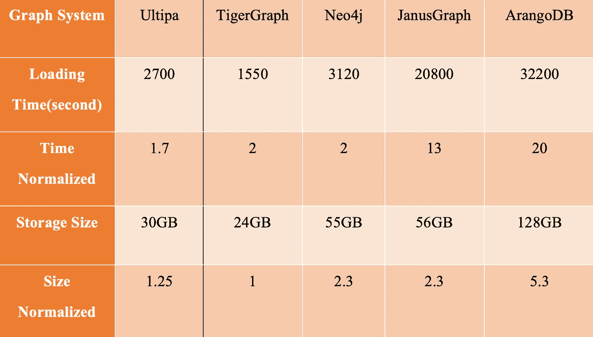

Twitter 数据集摄取时间比较(表)

请注意，Tigergraph 单向存储每条边，而不是双向存储，仅这一项就节省了 50%的存储空间，但这是不正确的。如果 Tigergraph 能够正常存储，它至少会占用 24GB。如果一个系统只单向地存储一条边，它将会为 K-hop、Path 或 algorithm 等查询生成不正确的结果，我们稍后将会谈到这一点。

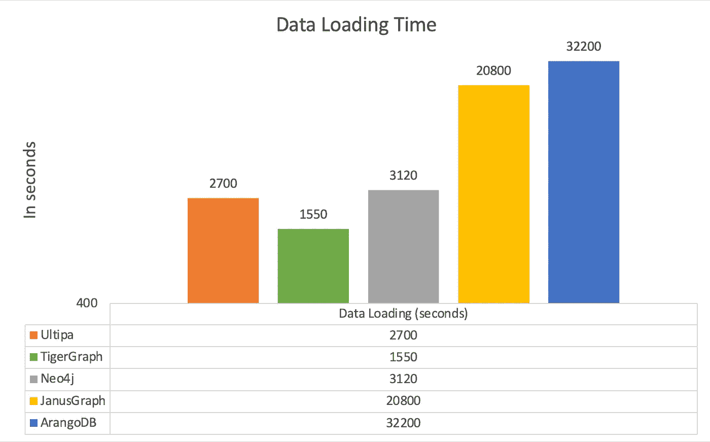

Twitter 数据集摄取时间比较(图表)

# 查询性能

主要有 3 种类型的图形查询:

1.查询邻居:也称为 K 跳

2.路径:最短路径查询通常用于简单性(易于比较)

3.算法:常用的基准算法包括 PageRank、连通域、LPA 和相似度。一些面向性能的图形数据库也对被认为更加复杂和具有挑战性的 Louvain 社区检测算法进行了基准测试

K-Hop 测量不同深度的查询延迟。以 Twitter-2010 为例，测量 1 跳和一直到 6 跳的性能是有意义的。大多数数据库可以毫无问题地处理 1-跳，但是 2-跳和更远更具挑战性，很少有系统能够返回 3-跳以上。如果一个系统可以在 10 秒内完成 6 跳(被认为是深度遍历)，它就被认为是一个实时图数据库，因为 Twitter 数据集的大多数顶点的 6 跳遍历基本上会触及所有 15 亿个边和顶点中的 95%，这相当于每秒遍历超过 1.5 亿个节点和边的计算能力。

对于任何给定的数据集和任何指定的起始顶点，K-hop 查询结果是确定的，因此所有的基准测试系统都应该返回准确的结果。K-hop 的常见错误有:

DFS 代替 DFS 进行遍历(错误实现)

无重复数据删除(冗余和不正确的结果)

部分遍历(违反了 K 跳的定义)

请注意，Ultipa Graph 是唯一一个公布其超深度遍历结果的系统，顶点的邻居距离为 23 跳，这反映了该系统实时深入穿透数据的能力，而其他系统可能需要数小时甚至数天才能完成，或者永远无法完成。

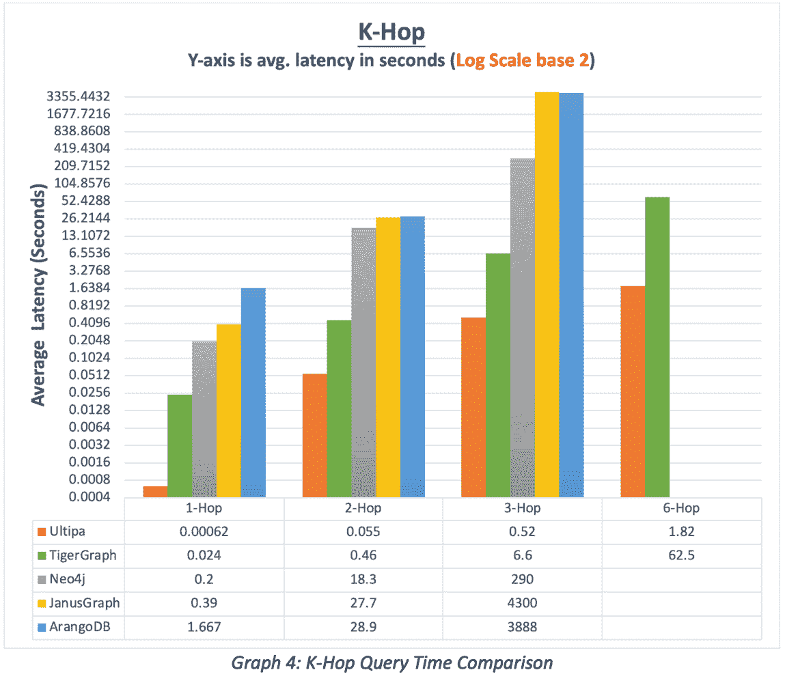

最短路径查询被认为是 K-hop 查询的一种特殊形式，不同之处在于确定了起始顶点和终止顶点，并找到了它们之间所有可能的路径。请注意，在像 Twitter-2010 这样的密集数据集中，一对顶点之间可能有数百万条最短路径。只有 3 家图形数据库供应商发布了他们针对 Twitter 的基准测试结果，但是 Ultipa 是唯一一家发布了路径确切数量的供应商，如下表所示。一些供应商返回的只有一条最短路径，这是荒谬的错误和有问题的。在许多现实场景中，如反洗钱路径、交易网络，必须尽快找到双方之间的所有最短路径。

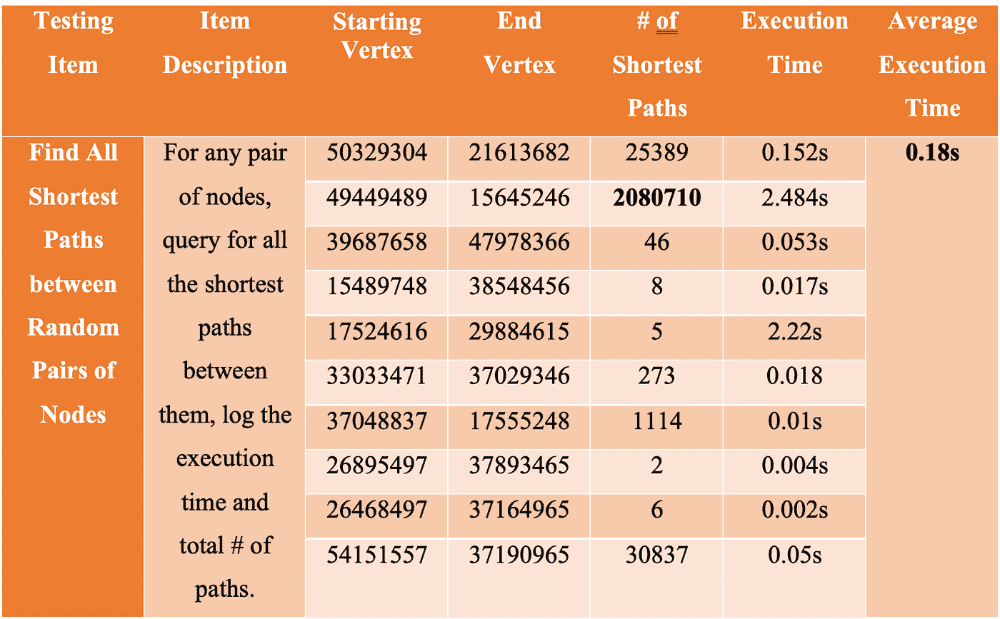

图算法体现了图 DMBS 在海量数据处理方面的计算能力。支持的图形算法的数量和运行速度直接决定了系统的性能和功能的完备性。许多图形数据库管理系统基于一些图形计算引擎或框架，它们只能处理静态数据集，一旦数据集被修改，在图形算法可以重新启动之前，必须构建新的投影(将数据加载到 DRAM 中，类似于 ETL)。这是 Apache Spark GraphX 和 Neo4j GDS 的情况，ETL 过程可能需要相当长的时间，这应该包括在算法运行时间内。

PageRank 是最著名的图形算法，它的名字来自谷歌的联合创始人拉里·佩奇。它是 web 搜索引擎的核心排序算法，也是第一个在大规模分布式系统上并行运行的算法之一，因为它具有简单的迭代逻辑和 BSP 友好的设计。算法运行结果方便地告诉每个顶点(实体)与数据集的其余部分相比的排名(重要性)。对于商业级实现，还有数据库回写、文件系统回写、流回写、结果排名等功能。

要注意的 PageRank 的两个基本特征:

PageRank 必须针对整个数据集运行，而不是部分数据集

结果应该完全排序，并根据需要返回前 N 名

我们注意到一些图形 DBMS 只计算部分数据集，这直接违反了 PageRank 的定义，即遍历整个数据集。Neo4j GDS 是一个典型的例子，如果提供的输入参数限制为 1000，则允许算法对 1000 个顶点运行。以 Twitter-2010 为例，结果将是 100%错误的，因为对 1000 个顶点运行仅占整个数据集的 0.000025%。另一方面，如果结果没有排序，那么由业务层(应用层)来进行排序，这显然是不可接受的。我们发现大多数图形 DBMS 基准测试结果都没有触及这些问题。

下表列出了 PageRank 的基准测试逻辑，以及前 10 个返回顶点的列表:

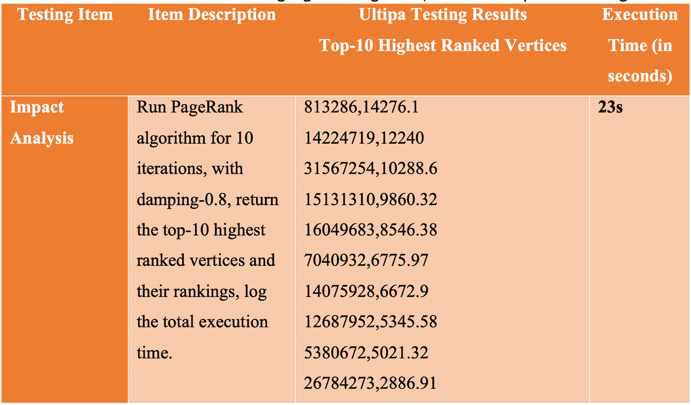

LPA (Label Propagation Algorithm)是一种经典的社区发现算法，它将预先定义的标签迭代地传播到所有顶点，直到达到稳定状态。与 Pagerank 相比，LPA 在计算上更复杂，并且返回每个顶点标签聚合的社区总数。调用 LPA 时，还有各种回写选项可供选择。

鲁汶社区检测算法在计算上比 LPA 算法更复杂，并且重复迭代所有顶点以计算整个数据集的最大模块性。很少有图形 DBMS 供应商愿意在大于 1 亿个节点和边的数据集上对 Louvain 进行基准测试。最初的 Louvain 算法是使用 C++实现的，但在一个典型的十亿级数据集上，它需要 2.5 个小时才能完成，如果用 Python 来完成，它至少需要几百个小时(几周)。Ultipa 是唯一一家在超过 10 亿的数据集上发布 Louvain 基准测试结果的供应商。

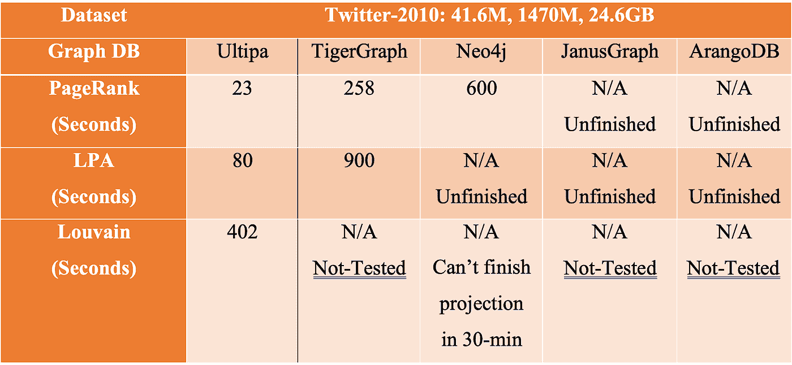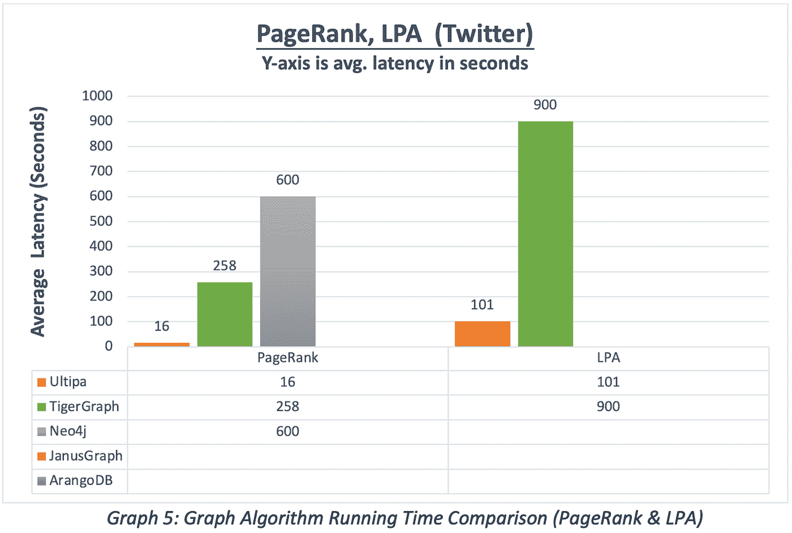

# 实时更新

图形 DBMS 中有两种类型的更新操作:

面向元数据(TP):该操作只影响元数据，如顶点、边或它们的属性字段。从传统 DBMS 的角度来看，这是一个典型的 TP 操作(ACID)。在图形 DBMS 中，这也意味着图形的拓扑发生变化，例如插入或删除节点、边，或者更改可能影响查询结果的属性。

TP+AP 操作:这是指组合操作，首先进行元数据操作，然后启动 AP 类型的查询。这在许多实时 BI 或决策制定相关的场景中很常见，例如在线欺诈检测，其中出现新的交易或贷款申请，随后是一系列基于图形的网络和行为分析。

一些图形系统使用缓存机制来预先计算和存储备用结果是很常见的，这些结果在数据内容改变后不会相应地改变。为了验证图形数据库系统是否具有更新数据内容并允许实时精确数据查询的能力，我们创建了一条连接所提供的起始顶点与其第三跳相邻顶点之一的新边，并在插入边之前和之后比较 1 到 3 到 6 跳的结果。

下表显示了边缘插入事件前后 K 跳结果的变化。如果系统没有能力处理动态变化的图形数据，K-hop 结果将保持不变(并且是错误的)。

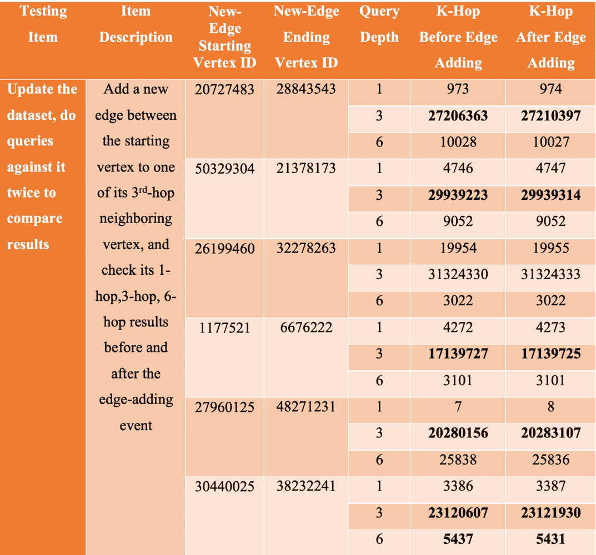

在本文的第二部分，我们将介绍验证基准测试结果的机制，请记住图形 DBMS 是白盒和可解释的人工智能，我们将在第二部分向您展示如何以白盒方式解释一切。敬请关注。