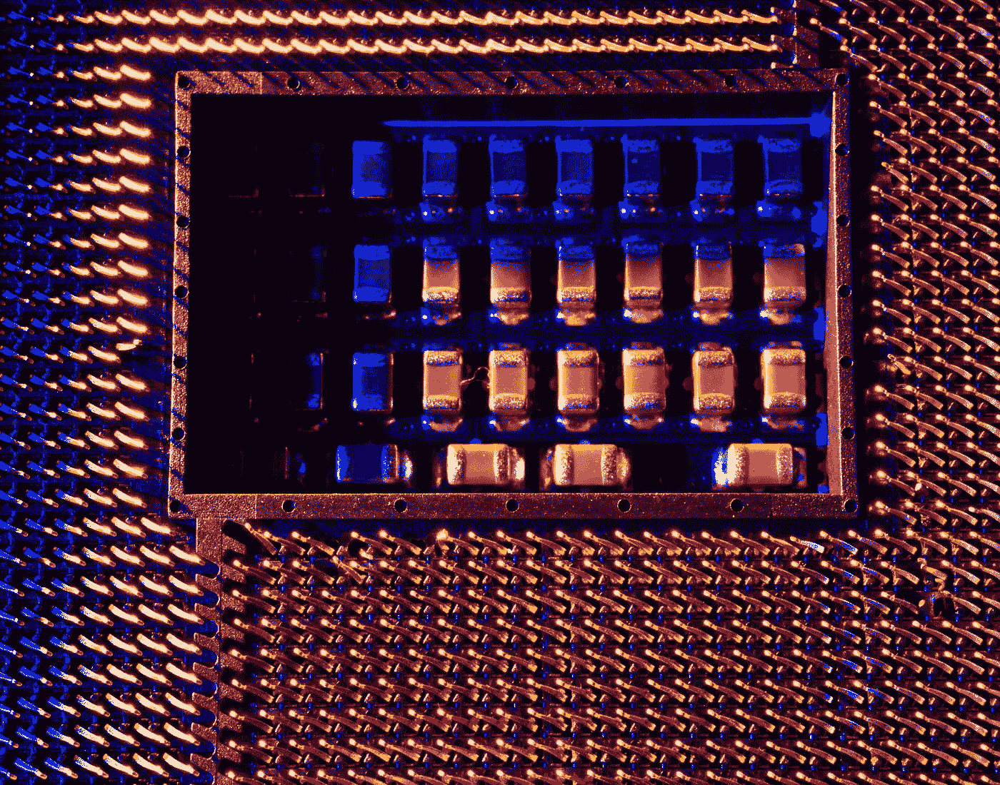

# 如何从 JavaScript 数组中移除特定元素？

> 原文：<https://blog.devgenius.io/how-to-remove-a-specific-element-from-a-javascript-array-3f19100985d3?source=collection_archive---------7----------------------->



照片由 [Michael Dziedzic](https://unsplash.com/@lazycreekimages?utm_source=medium&utm_medium=referral) 在 [Unsplash](https://unsplash.com?utm_source=medium&utm_medium=referral) 拍摄

从数组中移除一个元素是我们在 JavaScript 程序中经常做的操作。

在本文中，我们将研究如何从 JavaScript 数组中移除特定元素。

# 接合

我们可以使用数组的`splice`方法移除给定索引的数组项。

例如，我们可以写:

```
const array = [1, 2, 3];
console.log(array);
const index = array.indexOf(2);
if (index > -1) {
  array.splice(index, 1);
}console.log(array);
```

我们有一个`array`,我们想从其中删除一个项目。

我们使用`indexOf`方法来查找数组中给定项的第一个索引。

如果它返回-1 以外的任何值，则该项在数组中。

因此，如果`index`不为-1，我们用`index`和 1 调用`splice`来删除给定索引的项目。

这对于一个条目很有效，如果我们在寻找一个原始值。

# 过滤器

我们也可以使用`filter`方法返回没有给定条目的数组。

例如，我们可以写:

```
const value = 3
let arr = [1, 2, 3, 4, 5]
arr = arr.filter(item => item !== value)
console.log(arr)
```

我们在`arr`中寻找`value`，并通过使用返回`item !== value`的回调调用`filter`来移除它。

这将保留`arr`中除了`value`以外的任何值。

这将删除给定`value`的所有条目，因此比使用`indexOf`和`splice`更加通用。

它还可以处理对象，这使它更加通用。

`indexOf`不能处理对象，因为我们不能像处理`filter`那样指定回调的条件。

# 结论

我们可以很容易地从 JavaScript 数组中删除给定条件的项。