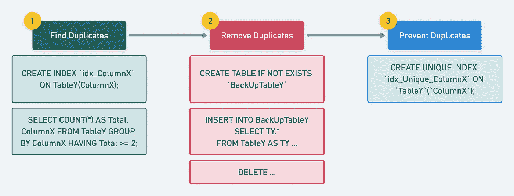

# 如何从 MySQL 中没有任何索引的 10 亿条记录中删除重复记录？

> 原文：<https://blog.devgenius.io/how-to-remove-duplicate-records-from-1-billion-records-without-any-index-in-mysql-44b15b2d0ec1?source=collection_archive---------2----------------------->

在设计应用程序、数据库和其他组件时，我们根据需求设计系统，几乎不考虑未来需求。但是，当您的应用程序增长时，有时您会吃掉健康空间，并重构内容以满足新的业务用例。

**问题陈述/所需状态:**在“TableY”的“ColumnX”上添加“唯一索引”，该“columnx”有**~ 10 亿条**记录。

**当前状态:**“columnx”包含重复记录，目前没有索引。



删除重复项

以下几个步骤有助于从**当前状态**达到**所需状态**:

# 第一步:寻找重复

如果您认为运行下面的查询可以得到重复记录的列表，那么您首先需要后退一步，考虑记录和非索引列的数量。最好不要在生产数据库中运行此查询；这可能会影响现有数据库查询的性能。

```
SELECT count(*) AS Total, ColumnX FROM TableY GROUP BY ColumnX HAVING Total >= 2;
```

**注**:带着单子过了几天才回来。

如果您考虑过上面的查询，您现在就会理解，对于现有的设置，获取重复记录的列表并不容易。我们可能需要多次运行相同的查询，以了解它包含哪些重复的记录，并且该表也是活动的，即每秒钟插入许多记录。

这就是我们的第一步，即**添加常规索引**。是的，这不需要花太多时间来完成。花了**30-60 分钟**才完成。

```
CREATE INDEX `idx_ColumnX` ON TableY(ColumnX);
```

现在，我们已经在 ColumnX 上添加了常规索引，是时候重新运行上面的查询来获得重复记录的列表了。这次需要 **< 30 分钟**。

# 第二步:删除重复项

与删除重复记录相比，查找重复记录很容易。这里涉及到很多因素关于删除哪个重复记录？诸如“LastUpdated”、“CreatedDate”、其他列上的重要信息等因素。，可能会影响对要删除的正确记录的决定。

去掉记录后你可能还是不自信，可能会有很多你以后可能需要的有价值的信息。

考虑到上述挑战，您有两个选择:

1.  **删除记录**；其他记录或它们的列不包含任何有价值的信息。
2.  或者**为重复的记录创建一个备份表**，这样你可以在将来使用它。

这样，下面是创建一个简单备份表的查询:

```
CREATE TABLE IF NOT EXISTS `BackUpTableY` (
  `ID` varchar(255) NOT NULL,
  `ColumnA` varchar(255) NOT NULL,
  `ColumnB` varchar(255) NOT NULL,
  `ColumnC` tinyint(1) NOT NULL,
  `ColumnX` varchar(255) DEFAULT NULL,
  `CreatedDate` datetime(3) NOT NULL,
  `LastUpdated` datetime(3) NOT NULL,
  PRIMARY KEY (`ID`),
  KEY `idx_ColumnX` (`ColumnX`) USING BTREE,
  KEY `idx_ColumnA` (`ColumnA`)
);
```

现在，将所有重复的记录插入上表:

```
INSERT INTO BackUpTableY
SELECT TY.*
FROM TableY AS TY
INNER JOIN
(
  SELECT
  max(LastUpdated) AS LatestUpdated,
  count(*) AS Total,
  ColumnX
  FROM TableY
  GROUP BY ColumnX
  HAVING Total >= 2
)
AS Tbl ON TY.ColumnX = Tbl.ColumnX
AND TY.LastUpdated != Tbl.LatestUpdated;
```

**注意**:我已经决定使用 INSERT with SELECT 查询中的‘last updated’列。

现在，最后一个子步骤—删除重复记录。同样，在选择其中一种方法时，您需要小心一点:

1.  用一个 DELETE 命令删除所有重复的记录:这将在那些记录范围上添加一个锁，并且可能会影响数据库的整体性能。
2.  为每个记录创建单独的 DELETE 语句，并批量运行它们:这种方法可能需要额外的工作，但是不会影响数据库的整体性能。

这两种方法各有利弊；根据您的数据集选择最适合您的方法。

# 步骤 3:添加唯一索引

一旦添加了常规索引并删除了重复记录，我们就需要最后一击来防止更多的重复记录，即添加唯一索引。

```
CREATE UNIQUE INDEX `idx_Unique_ColumnX` ON `TableY`(`ColumnX`);
```

因为 ColumnX 已经有了一个常规索引，所以添加一个惟一索引不会花费太多时间，例如大约 5 分钟。

就这样，我结束了这次学习；我希望你今天学到了一些新东西。请与更多的同事或朋友分享。最后，考虑成为[中等会员](https://zonito.medium.com/membership)。谢谢大家！