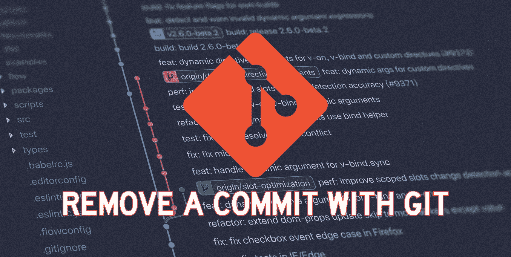

# 如何从 Git Pull 请求中删除修改或更改的文件

> 原文：<https://blog.devgenius.io/how-to-remove-modified-or-changed-files-from-a-git-pull-request-a7769e3c58da?source=collection_archive---------0----------------------->

[Yancy Min](https://unsplash.com/@yancymin) 在 [Unsplash](https://unsplash.com/photos/842ofHC6MaI) 上的原始照片；插图由 [Tremaine Eto](https://tremaineeto.com) 绘制。

当您在 Bitbucket、GitHub、GitLab、SourceForge 或其他 Git 服务器中作为服务发出 pull 请求时，您经常会遇到不需要的修改文件进入您的 PR 的情况。

现在，你想删除它的理由是充足的。这可能只是您不小心在文件或其目录上运行了`$ git add`,并且不小心添加了它。可能文件只有格式更改、换行符或空格，而这些并不需要在目标分支中出现。可能是您改变了主意，不想将修改后的文件包含在这个特定的拉请求中。

不管是什么原因，在不从项目中完全删除文件的情况下将文件从请求中提取出来的能力是非常有用的，并且是您将会一次又一次追求的——我知道我是这样做的。

本着将拉取请求限制在重要的变更上并使它们更容易被审阅者理解的精神，请继续阅读如何实现这一点的一些简单步骤。

# 确保您在源分支上

基本上，您需要确保在本地切换到创建拉请求的分支。因此，如果您在分支`feature/A`上，并且创建了一个将被合并到`master`中的拉请求，那么确保您在`feature/A`上。从命令行，您可以运行:

如果您*刚刚发出了*拉请求，那么很可能您已经在源分支上了，因此您根本不需要执行这个步骤。

一旦你到了源分支，你就可以进入下一步。

# 覆盖您希望从提取请求中删除的文件

假设您不小心修改并提交了一个名为`src/main/java/DynamoDBClient.java`的文件。

您现在可以做的是用不同的分支覆盖该文件。例如，您可以从`master`分支执行此操作，将它恢复到原来的状态。为此，请运行以下命令:

现在，如果您运行`$ git diff`，您将看到原始文件已经在本地恢复，您之前不想要的更改已经被覆盖。

# 提交和推送以删除拉请求中的更改

为了使 pull 请求正式化，现在您所要做的就是执行您通常的`$ git commit`和`$ git push`命令；分别地，您可以按以下一般格式运行它们:

# 警告

这种方法适用于很多用例，但不是所有用例。

首先，这将删除您的更改，因为您在“覆盖您希望从拉取请求中删除的文件”步骤中覆盖了它们。

其次，这种变化在 git 历史中被跟踪，并把以前的提交也留在那里，一些用例希望完全清除这种情况。

如果这些不是太大的问题，那么我发现这是清理你无意犯下的错误的最简单快捷的方法之一。

 [## 通过我的推荐链接加入媒体

### 作为一个媒体会员，你的会员费的一部分会给你阅读的作家，你可以完全接触到每一个故事…

tremaineeto.medium.com](https://tremaineeto.medium.com/membership)