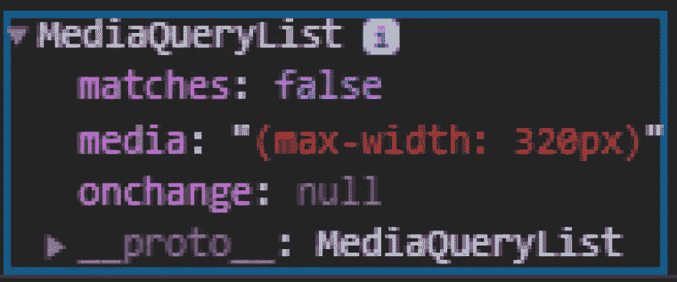
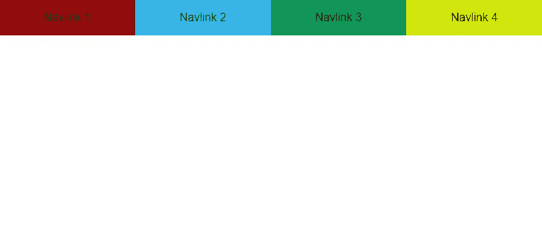
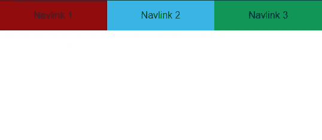

# 如何根据屏幕大小呈现不同的组件

> 原文：<https://blog.devgenius.io/how-to-render-different-components-based-on-screen-size-66f602e86859?source=collection_archive---------16----------------------->

# 介绍

我最近偶然发现了一个我以前完全没有意识到非常棒的 JS Web API。

那个 API 就是 [Window.matchMedia()](https://developer.mozilla.org/en-US/docs/Web/API/Window/matchMedia) 。

使用它，您可以根据媒体查询检查窗口大小，并且您将得到一个布尔值:如果窗口大小与您的查询匹配，则为`true`，否则为`false`。

你可以设置一个监听器来动态检查窗口是否匹配你的查询。

# 用例(不详尽)

你可能想知道为什么我们要使用这个 API。

我们已经有 CSS 媒体查询来根据页面大小改变页面的样式。

但是在某些情况下，您需要根据组件的大小来呈现不同的组件，而 CSS 在这方面帮不了您。

有时，您希望断点两侧的视图之间的样式变化非常大，您可能会发现更简单的方法是拥有两个样式不同的不同组件，然后根据窗口大小呈现它们。

让我们看一个例子来理解它。

# 普通 JavaScript 示例

我希望能够在一个苗条的项目中根据屏幕大小呈现不同的组件。

如果你不熟悉 Svelte，那是一个 JS 框架，它在一个单独的。苗条的文件，将在被发送到浏览器之前被编译。

因此，这种文件中的 CSS 和 JS 的作用域是一个 HTML 块。整体被称为一个苗条的组成部分，你可以通过周围…

该框架为 JS 增加了一些特性，但代码通常看起来像普通的 JS，而在 React 这样的框架中，由于代码的组织方式，它看起来不再像普通的 JS。

因此，我在这里给出的例子是一个用普通 JS 实现的例子，但是如果你想知道如何在 React 应用中实现该特性，请参见 [react-media](https://github.com/ReactTraining/react-media) 。reddit 帖子中推荐了这个包。我读了文档，它看起来很酷。另外是由 [react-router](https://github.com/ReactTraining/react-router) 的创作者制作的，一定要去看看。

现在，让我们来看看这个例子:

首先，我将创建两个 navbar 组件来模拟我们在基于组件的框架中的情况:

这两个导航条的唯一区别是第二个导航条多了一个导航链接。

我们会说，我们想在桌面屏幕上呈现长导航条(`Component2`)，但在移动设备上，由于屏幕的大小，我们决定删除一个导航链接(例如，我们可能会将该导航链接放在汉堡菜单中)。

所以对于移动视图，我们将渲染短导航条(`Component1`)。

为了呈现一个组件，我们将使用一个小助手在导航栏中注入 html:

现在，假设我们的断点是 600px 的宽度:大于等于被认为是桌面视图，小于等于被认为是移动视图。

我们完全有能力使用`Window.matchMedia()`:

这里，我们将查询指定为`window.matchMedia()`函数中的一个字符串，该函数返回一个类型为`MediaQueryList`的对象。

在这个对象上，您可以访问 matches 属性，它是一个布尔值，告诉您当前的窗口大小是否与您的媒体查询相匹配。

很简单。

看起来是这样的:

在这个对象上，您可以访问属性`matches`,这是一个布尔值，它告诉您当前的窗口大小是否与您的媒体查询匹配。

然而，这个例子只适用于第一次渲染。

如果我们想动态调整布局，我们可以在返回的媒体查询列表上设置一个事件监听器，类型为`change`:

所以在桌面上，它看起来像这样:

在手机上:

完整代码见[此处](https://codesandbox.io/s/windowmatchmedia-api-73p4x)。

# 结论

这就是这篇快速文章的全部内容。

我希望你发现了一个新的工具来添加到你的工具箱中，也许有一天你会需要它并使用它！

在此基础上，继续编码；)