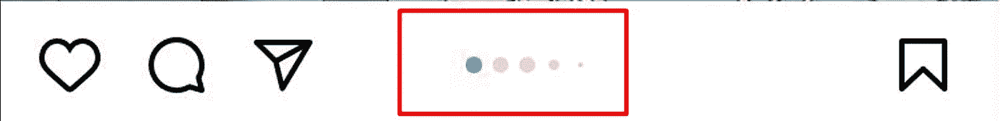

# 如何在 react 原生应用程序中渲染图像数组长度的点。

> 原文：<https://blog.devgenius.io/how-to-render-dots-based-on-that-image-array-length-has-in-your-react-native-app-76dac14763e4?source=collection_archive---------2----------------------->


今天，我将试着教你如何创建一个几乎所有社交应用程序都有的超级酷的功能，它是一个点，显示你在哪个图像上，或者有多少图像。让我们以 Instagram 为例，如果你曾经使用过 Instagram，我相信你会看到我下面的截图，你可能会考虑如何创建它，所以让我们开始构建几乎所有应用程序都在其应用程序中使用的美丽显示。



假设我们有十个图像，我们想在一个容器中渲染这个图像，想显示前五个图像的点，然后将活动点图像重置回第一个，在我们移动到第六个图像后，要做到这一点，只需在您的项目目录中创建一个名为 Image.tsx 的文件，并遵循我在下面写下的代码。

```
*Image.tsx File*imageList = [] *//Array and we have ten image link that stored here*
const [activeIndexNumber, setActiveIndexNumber] = useState(Number); *//this state will hold our active index*<Animated.View style={style.imageContainer}> *//we will wrap our container with view*
<ScrollView  *//scrollview will contain the images*
showsHorizontalScrollIndicator={false}
pagingEnabled
alwaysBounceVertical
directionalLockEnabled={true}
disableIntervalMomentum={true}
horizontal
onScroll={e => {
let slide = Math.round(
e.nativeEvent.contentOffset.x 
e.nativeEvent.layoutMeasurement.width,);
if (slide !== activeIndexNumber) {
setActiveIndexNumber(slide); *//here we will set our active index num*
}}}
>
{imageList?.map((item, index) => (<Pressable style={{ alignSelf: 'center', aspectRatio: 1.03, margin: 0, padding: 0 }} key={index}><Image style={style.imagesStyle} source={{ uri: item }} /></Pressable>))}</ScrollView><View style={{ flexDirection: ‘column’ }}> *//this view contain the dots*
  <View style={style.dotContainer}>
   {imageList.slice(0, activeIndexNumber < 5 ? 5 : imageList.length — 5).map((item, index) => {if (imageList.length !== 1) { *// if imagelist array length not 1* if (activeIndexNumber < 5) { *//if activeindex lower than five* 
  return (
    <View
     key={index}
     style={[index == activeIndexNumber ? [style.dot,{ backgroundColor: #678392},] : style.dot,]}>
    </View>);
  } else { *//if activeindex higher than five*
   return (
   <View
    key={index}
    style={[index == activeIndexNumber — 5 ? [style.dot,{ backgroundColor: #678392},]: style.dot,]}>
</View>);
}}
})}
 </View>
</View>
</Animated.View>const style = StyleSheet.create({
**imageContainer**: {
borderWidth: 1,
width: 190,
aspectRatio: 1,
borderRadius: 4,
borderColor: #000,
alignSelf: 'center',
position: 'relative',
margin: 0,
padding: 0,
},
**imagesStyle**: {
aspectRatio: 1,
resizeMode: 'contain',
alignItems: 'center',
justifyContent: 'center',
flex: 1,
alignSelf: 'center',
margin: 0,
padding: 0,
},
**dotContainer**: {
flexDirection: 'row',
justifyContent: 'center',
zIndex: 8,
elevation: 8,
position: 'absolute',
alignSelf: 'center',
bottom: 20,
},
**dot**: {
aspectRatio: 3,
width: widthPixel(18),
marginHorizontal: 2,
marginVertical: 2,
backgroundColor: constant.colorSurface,
borderRadius: 10,
borderWidth: 1,
borderColor: constant.colorFooterPartial,
position: 'relative',
zIndex: 8,
elevation: 8,
},
})
```

因此，基本上我们在代码中所做的只是从 ScrollView 的 onScroll 函数中获取活动索引，该函数渲染并包含我们的图像，这个 Scrollview 是我们的第一个容器，第二个是 dots 渲染的容器，这个视图有一个简单的逻辑，如果活动索引小于 5，就从 1 平滑地滚动到 5，我们通过给定一些样式来改变活动索引的外观，然后如果活动索引高于 5，就再次从 1 渲染回 5。遵循和实现这些代码很容易，并且会完全按照您想要的方式为您工作。

希望对你有帮助。如果是这样的话，给我一个关注和喜欢:)

检查我的其他文章。

[1-)如何在 React JS 中隐藏网站源代码？](https://medium.com/@akinkarayun/how-to-hide-website-source-code-in-react-js-77164d474324)

[2-)常见的反应本国问题及其解决方法](https://javascript.plainenglish.io/common-react-native-problems-and-solutions-22a1076e4589)

[3-)如何在你的 react 原生应用中渲染图像数组长度的点。](/how-to-render-dots-based-on-that-image-array-length-has-in-your-react-native-app-76dac14763e4)

我的链接在下面

[AKIN KARAYUN | LinkedIn](https://www.linkedin.com/in/akin-karayun-ab3239bb/)

[Akin Kara yun(devankarayun . web . app)](https://devakinkarayun.web.app/)