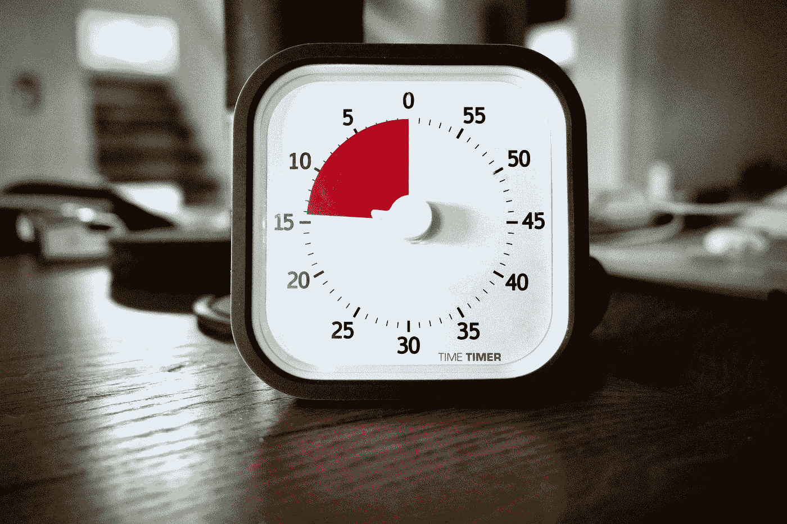

# 如何用 JavaScript 重置 setTimeout 定时器？

> 原文：<https://blog.devgenius.io/how-to-reset-the-settimeout-timer-with-javascript-b722aa4f931?source=collection_archive---------1----------------------->



拉尔夫·哈特在 [Unsplash](https://unsplash.com?utm_source=medium&utm_medium=referral) 上拍摄的照片

有时，我们想要重置`setTimeout`计时器，以便再次使用它。

在本文中，我们将看看如何用 JavaScript 重置`setTimeout`计时器。

# 使用 clearTimeout 函数

我们可以将由`setTimeout`功能创建的定时器与`clearTimeout`功能一起使用。

例如，我们可以写:

```
let timer;const runTimer = () => {
  timer = window.setTimeout(
    () => {
      document.body.style.backgroundColor = 'black'
    }, 3000);
}runTimer();document.body.onclick = () => {
  clearTimeout(timer)
  runTimer()
}
```

我们有一个`timer`变量，存储由`setTimeout`返回的计时器。

然后我们有`runTimer`函数调用`setTimeout`函数，回调函数在 3 秒后将页面变黑。

我们将返回的定时器分配给`timer`。

接下来我们调用`runTimer`3 秒后屏幕变黑。

我们还有一个分配给`document.body`的`onclick`属性的点击处理程序，用于在点击 3 秒后将屏幕变黑。

`clearTimeout`功能将重置计时器，并再次从 0 毫秒开始计数。

# 结论

我们可以用`clearTimeout`功能重置`setTimeout`功能创建的定时器。