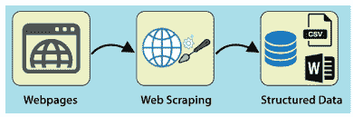
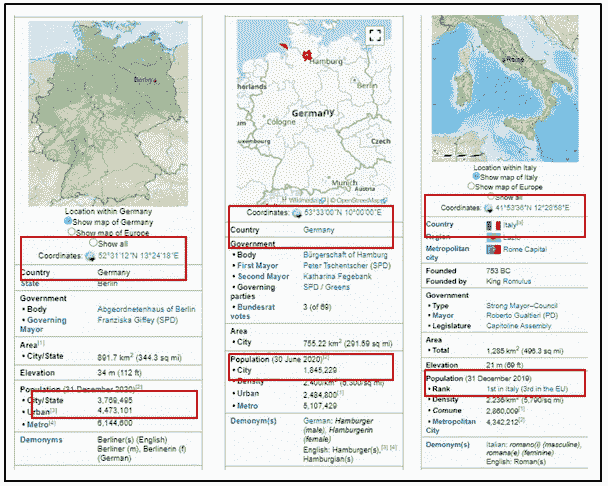
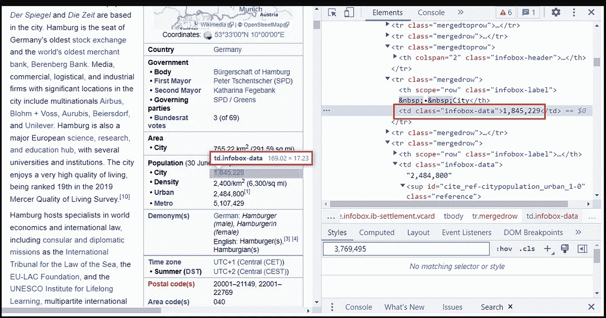
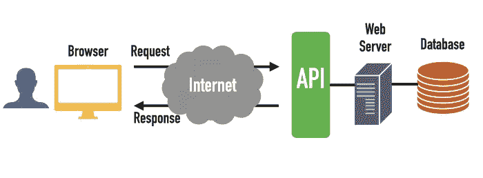

# 如何使用 web 抓取和 API 从零开始检索数据

> 原文：<https://blog.devgenius.io/how-to-retrieve-data-from-scratch-using-web-scraping-and-apis-29978413dc59?source=collection_archive---------10----------------------->

## 数据工程(初学者)

检索信息的系统对于理解数据至关重要。试想一下，如果没有谷歌或其他可用的搜索引擎，在网上获取信息会有多困难。没有信息检索方法，信息就不是知识。


图 Web 抓取和 API 概述(来源:klaviyo，已编辑)

在现代数字经济中，公司可以访问比以往任何时候都多的数据。关键业务决策可以建立在此类数据提供的情报之上。在这篇文章中，我们在数据科学训练营的讲师给了一个任务，帮助一家名为 Gans 的公司“从外部来源收集数据，这些数据可能有助于 Gans 预测电动滑板车的运动。”

初创公司 Gans 正在开发一种电动滑板车共享系统。它希望活跃在世界上人口最多的城市。每个城市都会有大量的电动滑板车停在街上，可以按分钟出租。

他们的业务是尽可能预测滑板车的运动。毫无疑问，预测建模已经提上日程，但收集额外数据是当务之急。我的目标应该是从其他来源收集信息，使甘斯能够预测电动滑板车的运动。任务是在云上建立一个数据管道并使其自动化，因为数据每天都是实时的，并且公司的每个人都可以访问。

**网页抓取**

使用机器人从网站提取信息和材料的技术被称为网络抓取。Web 抓取检索底层的 HTML 代码，并通过它检索保存在数据库中的数据。



图 2:网络抓取作为一种工具来检索非结构化数据以生成结构化数据(来源:- [LinkedIn](https://www.linkedin.com/pulse/using-web-scraping-build-awesome-data-science-project-jiaqi-cheng/?trk=articles_directory) )

Gans 要求的第一件事是收集欧洲主要城市的人口统计信息，如国家、城市、人口、纬度和经度。你可以在很多地方获得关于城市的信息，但是为了避免侵犯版权，我们选择了维基百科。



图 3:从维基百科检索到的欧洲主要城市的人口统计数据

这里我们使用逆向工程对欧洲城市的数据进行编码。为此，在特定城市的维基百科页面旁边打开网络抓取 URL。继续查找数据，然后按右键导航以进行检查。在这里，您可以找到相邻的 HTML 代码，包含诸如 id、选择器、href、class、div 等表数据。



图 4:信息背后的 HTML 代码

有多种工具可用于网页清理，如 [Scrapy](https://scrapy.org/) 、BeautifulSoup 和 [Selenium](https://www.selenium.dev/documentation/) 。我们使用了一个名为[**beautiful soup**](https://beautiful-soup-4.readthedocs.io/en/latest/)**的 Python 库，因为维基百科没有提供实用的 API。这是一个用来从 XML 和 HTML 文件中提取数据的库。它使用 Python 内置的 HTML(或 XML)解析器来分析文档。**

```
from bs4 import BeautifulSoup
url = "https://en.wikipedia.org/wiki/Berlin"
response = requests.get(url)soup = BeautifulSoup(response.content, "html.parser")
```

**我们可以利用维基百科网址的普遍性，除了城市名之外，所有的网址都是一样的。之后，我们使用在 HTML 中找到的城市名、国家名、经度、纬度和人口的 id、类和选择器来填充字典。但是，并不是所有的维基百科页面都包含高程，例如汉堡页面，这就是我在代码中使用高程的原因。“if”子句意味着我们的代码可以继续，不会在这个障碍处停止。**

```
for city in cities:
    url = f'https://en.wikipedia.org/wiki/{city}'
    r = requests.get(url)
    soup = BeautifulSoup(r.content, 'html.parser')
    response_dict = {}
    response_dict['city'] = soup.select(".firstHeading"[0].get_text()
    response_dict['country'] = soup.select(".infobox-data")[0].get_text()
    response_dict['latitude'] = soup.select(".latitude")[0].get_text()
    response_dict['longitude'] = soup.select(".longitude")[0].get_text()
    if soup.select_one('.infobox-label:-soup-contains("Elevation")'):
        response_dict['elevation'] = soup.select_one('.infobox-label:-soup-contains("Elevation")').find_next(class_='infobox-data').get_text()
    response_dict['website'] = soup.select_one('.infobox-label:-soup-contains("Website")').find_next(class_='infobox-data').get_text()
    if soup.select_one('th.infobox-header:-soup-contains("Population")'):
         response_dict['population'] = soup.select_one('th.infobox-header:-soup-contains("Population")').parent.find_next_sibling().find(text=re.compile(r'\d+'))
```

**数据保存在字典中，使得以后将其转换为数据帧更简单。然而，纬度和经度单位需要一些数据清理，这是使用我的 [**GitHub**](https://github.com/Shravantisy/Project_4_gans/blob/master/Cities_data-from-wikipedia.ipynb) 上可用的代码执行的。此外，可以使用这个代码清除整个城市数据中的任何后续错误。**

****API 的****

**API 代表**应用编程接口**。在 API 的上下文中,“应用程序”一词指任何具有独特功能的软件。接口可以被认为是两个应用程序之间的服务契约。该契约描述了两者如何使用请求和响应相互通信。**

****

**图 5: API 作为一种工具，根据请求接收数据到互联网(来源:- codingem)**

****天气 API — OpenWeatherMap****

**踏板车的使用受天气影响很大。有没有人真的想在非常寒冷或者特别潮湿的天气里驾驶踏板车？这就是为什么 gans 需要天气数据，这次我们使用了 [**OpenWeather**](https://openweathermap.org/api) 提供免费天气预报。**

**我们利用 OpenWeatherMap web API 来收集天气数据。在 OpenWeatherMap 网站上注册后，您将获得一个 API 密钥。一旦你拿到钥匙，你就可以开始利用他们的数据了。我们决定使用他们的 5 天/ 3 小时预报。**

```
city = "Hamburg"
url = f"http://api.openweathermap.org/data/2.5/forecast?q={city}&appid={API_key}&units=metric"
weather_ex= requests.get(url)
```

**您的 API 密钥后面必须跟有您所在城市的名称。如果您想确保收到公制单位的返回值，比如摄氏温度，您可以在 URL 的末尾加上“&units=metric”(默认情况下是以开尔文为单位)。代码显示您收到的响应默认为 JSON 格式(您可以通过添加模型参数将其更改为 XML 或 HTML)。**

**[**这里的**](https://openweathermap.org/forecast5) 就是一个 JSON 响应的例子。您每次都必须遍历(json['list'])并只选择您感兴趣的数据，因为您会在一天中的 5 天和 8 个不同时间收到响应。在我的 [**GitHub**](https://github.com/Shravantisy/Project_4_gans/blob/master/2_API-weather.ipynb) 页面上可以看到我们最初是如何将数据存储在字典中，然后是数据帧。**

**有时数据可能会因为下雨和下雪而丢失，因为并不总是下雨或下雪。为了避免在读取不存在的键(['rain']和['snow'])的缺失数据时出现错误，一个好的做法是将您的代码包装在“try-except”([**Github**](https://github.com/Shravantisy/Project_4_gans/blob/master/API-2-Weather(method%202).ipynb))块中，用于处理这些错误。在下面的代码['3h']中，代表每 3 小时更新一次天气。**

```
 try:
        weather_dict['rain'].append(i['rain']['3h'])
    except:
        weather_dict['rain'].append('0')
    try:
        weather_dict['snow'].append(i['snow']['3h'])
    except:
        weather_dict['snow'].append('0')
```

****展望****

**本文提供了一个简单的方法来从互联网上检索数据。维基百科在这里)使用网络抓取和 API。我们遵循这一流程向我们的合作者-企业 Gans 提供城市、位置、天气和航班数据，他们通过考虑上述因素，使用这些数据来增强他们的 eScooter 业务。**

****有用链接****

**整个项目的代码可以通过下面的链接在我的 GitHub 账户上查看。**

**[https://github.com/Shravantisy/Project_4_gans](https://github.com/Shravantisy/Project_4_gans)**