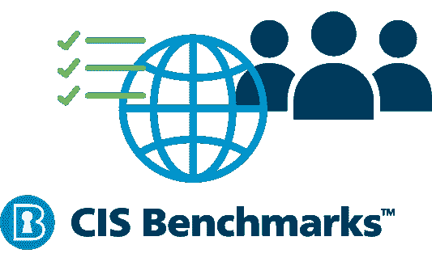
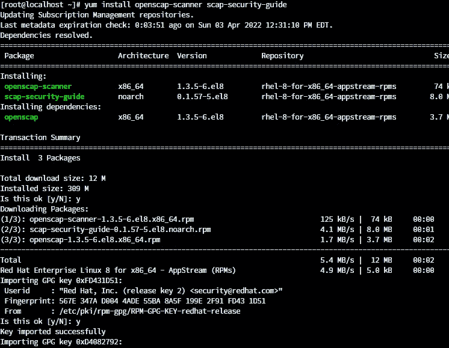
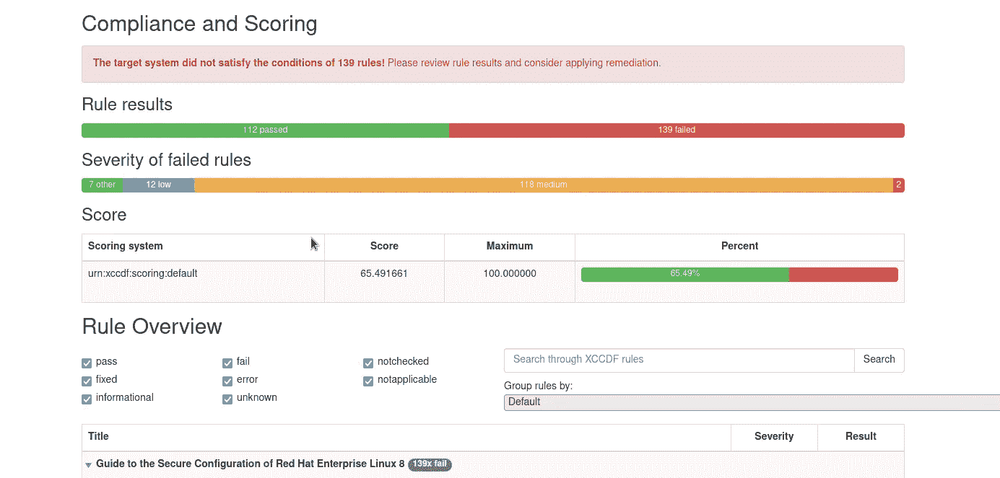
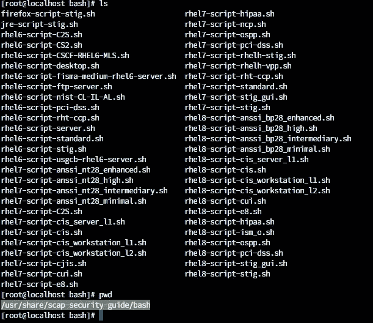
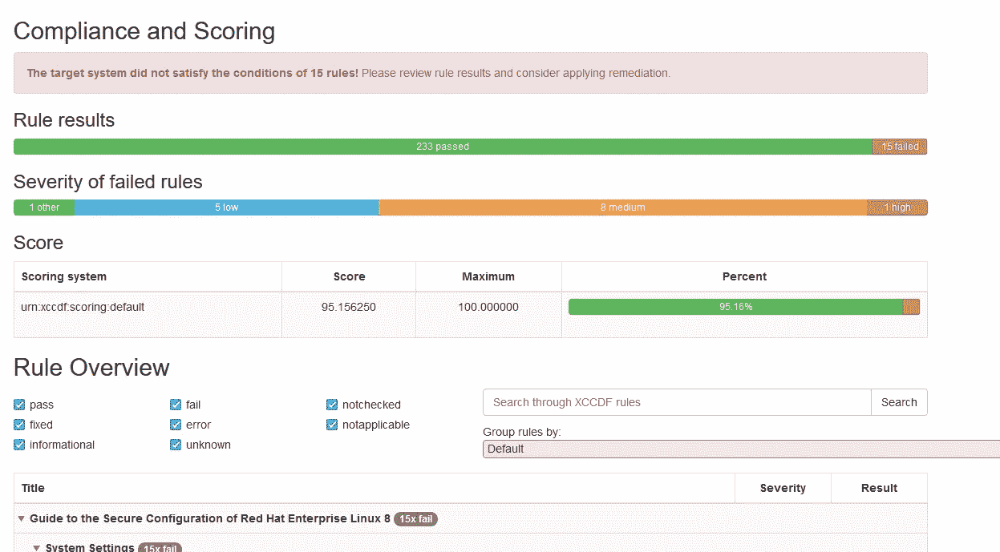

# 如何在 Linux 中运行 CIS 基准测试

> 原文：<https://blog.devgenius.io/how-to-run-cis-benchmark-in-linux-d37737f80ada?source=collection_archive---------1----------------------->



# 什么是 CIS

互联网安全中心(CIS)是一个非营利组织，致力于寻找和推广最佳实践的网络安全政策和标准。它在网络安全专家网络的支持下制定和推广 It 安全建议。服务社的成员来自广泛的背景，包括商业、政府和研究机构。

目的是合作改善网络安全，应对已知的网络威胁。CIS 通过提供各种工具、资源和计划，帮助企业和政府组织采用最佳实践 IT 治理。

CIS 标准是配置通用数字资产的最佳实践的集合。它们是由互联网安全中心(CIS)与网络安全专业人士和供应商社区合作创建的，旨在帮助企业加强数字资产的安全性。根据您的合规性和安全性要求

## **CIS 基准如何帮助您的组织**

CIS 基准是许多 IT 技术和系统的配置标准。这些系统，从桌面软件到移动设备，都是每个现代公司的重要组成部分。CIS 基准是任何 IT 治理策略的重要组成部分，因为它们提供了由专家社区开发的具体的最佳实践建议。

以下是 CIS 控制和 CIS 基准的一些示例

CSC 1:硬件资产的清点和控制
CSC 2:软件资产的清点和控制
CSC 3:持续的漏洞评估和补救
CSC 4:管理权限的受控使用
CSC 5:移动设备、笔记本电脑、工作站和服务器上硬件和软件的安全配置
CSC 6:审计日志的维护、监控和分析
CSC 7:电子邮件和 Web 浏览器保护
CSC 8:恶意软件防御
CSC 9:网络端口的限制和控制、 协议和服务
CSC 10:数据恢复能力
CSC 11:防火墙、路由器和交换机等网络设备的安全配置
CSC 12:边界防御
CSC 13:数据保护
CSC 14:基于需求的受控访问
CSC 15:无线访问控制
CSC 16:帐户监控
CSC 17:实施安全意识和培训计划
CSC 18

## 如何使用 openscap 在 Linux 中实现 CIS 兼容

在这里，我计划使用 Red hat enterprise Linux 8 来运行 CIS 合规性。

首先，我们需要在 RHEL 8 中安装 openscap 来运行以下命令。

```
yum install openscap-scanner scap-security-guide
```



然后我们可以开始扫描系统。为此，请使用以下命令

```
oscap xccdf eval --profile xccdf_org.ssgproject.content_profile_cis --results scan_results.xml --report scan_report.html /usr/share/xml/scap/ssg/content/ssg-rhel8-ds.xml
```

现在，该扫描已经生成了一份 CIS 合规性报告



根据上述报告，您可以看到它的得分约为 65%,要确保系统安全，它至少应高于 95%

## 运行合规性修正

现在我们需要转到/usr/share/scap-security-guide/bash 目录来获取修复脚本。



当你做“ ***ls*** ”目录时，它会显示补救脚本列表。这里我打算用脚本名***rhel 8-script-cis _ workstation _ L2 . sh .***

我们可以打开那个 ***。sh*** 文件，并根据自己的需要进行编辑，使其更加安全。比如设置 grub 密码等等

这不是可执行格式，因为我们需要把它转换成我们可以使用的格式

```
***chmod +x rhel8-script-cis_workstation_l2.s***
```

那就跑

```
***./rhel8-script-cis_workstation_l2.s***
```

这将根据 CIS 要求配置所有安全设置。



下面是补救后的结果。

我希望现在您已经了解了如何在 Linux 服务器中应用 CIS 合规性。