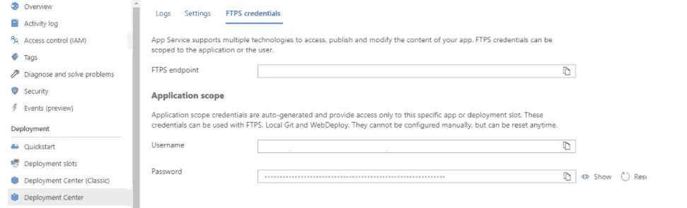
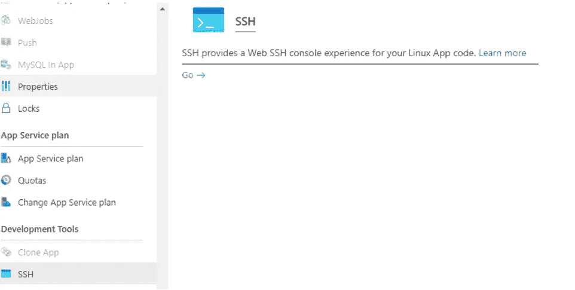
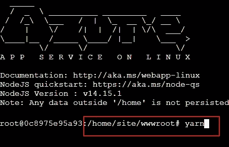
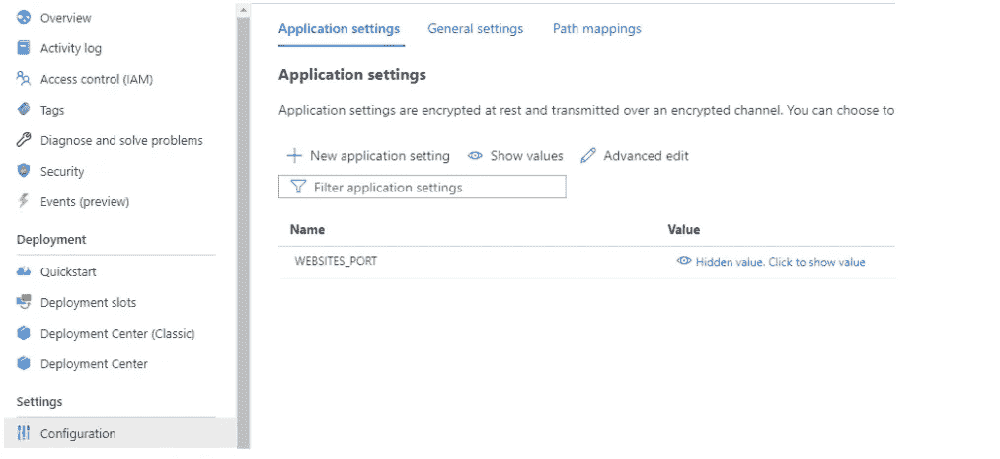
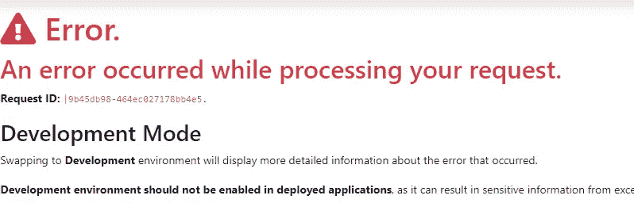

# 如何在 Azure 上运行 NextJS 应用程序

> 原文：<https://blog.devgenius.io/how-to-run-nextjs-application-on-azure-3e2716d3b831?source=collection_archive---------1----------------------->

上个月，我面临了在 Azure web 应用上运行 NextJS 的挑战。

正如我在之前的一篇博客中提到的，Azure 是一款优秀的“软件”，但是当你在安装你的“不”的路上时，你可能会经历大量的错误。NET 应用程序。

希望下面的教程能帮助你避免我的一些错误。

开始之前，有两件事需要考虑:

1)**Vercel**(NextJS 的创造者)强烈推荐使用自己的主机。这是可以理解的，因为为 NextJS 提供主机服务可能是他们的主要盈利模式。但这也意味着他们的文档没有关注其他云提供商。

2)第二个问题是缺乏关于 **Azure** 的文档。微软没有关于在 Azure 上安装 NextJs 的真正伟大的教程——我可以想象为什么。这实际上不是他们的责任。他们只是提供托管和更复杂的服务。到目前为止，支持 NextJS(和其他 Javascript 框架)还不是他们的主要目标。

嗯，我需要全力以赴才能成功。我没有找到任何工作或最新的教程。所以，我想出了以下计划:

1)使用 Linux Web 应用程序

2)利用目录“site”在启动时保持与 docker 容器连接的事实。这很重要，因为这意味着您只需手动安装一次 NextJS 服务器包。

3)然后，我们被允许部署一个构建的应用程序(路径中的所有东西。接下来除了文件夹"*缓存*"。

主要的好处是您将**加速**部署并获得一个简化的持续集成管道。您不必每次都应付“ *npm 安装/纱线*”。

让我们看看如何设置它。我假设您已经在 Azure 中创建了一个新的 Linux Web 应用程序。

1.  在 Azure portal 中，创建 FTP 凭据

2.连接到 FTP 服务器，用 NextJS 应用程序上传一个文件“package.json”。

3.然后打开 SSH

4.在那里，运行 npm install in site 或您喜欢的任何软件包管理器。

*注意*:令人惊讶的是，我不得不重复这个步骤几次，因为 SSH 偶尔会在没有任何警告的情况下断开连接。正如你所想象的，真的很令人沮丧。

5.之后，上传您构建的应用程序(通常只有“.下一个“文件夹”)

6.将“网站端口”设置为运行应用程序的端口。在较旧的教程中，您可能会看到一个名为“PORT”的设置，它的工作原理是一样的，但该设置已被弃用，并且它不被授予在未来将会工作的权限。

x)持续集成(CI)

CI 是罪魁祸首。我决定推迟在下一篇文章中阐述这个话题。这是一个可怕的经历，这就是为什么它绝对值得自己的职位:)。

**附加说明或建议:**

*   耐心点。有时重启应用程序似乎不起作用。
*   到 SSH 终端的连接经常丢失。我不得不在它结束之前运行几次纱线。
*   日志流——我真的不明白为什么日志消息有时会随机排序，而不是按照它们创建的时间来显示。所以不要被创建日期迷惑。
*   此外，您可能会遇到错误:
    *“yarn-metadata . JSON:JSON 输入意外结束”* 要修复它，只需运行:“纱线缓存干净”
*   来自 yarn 的一条臭名昭著的消息:
    *“你的网络连接似乎有问题。正在重试…"* 您可以延长 yarn 的超时时间，因此要消除该消息，请像这样调用 yarn install:
    *yarn install—network-time out 1000000*
*   最后，当您尝试打开 SSH 时，有时会看到以下消息:

这很容易，只要按下 F5 键，它通常会自动消失。

**最后**，稳住自己！留出足够的时间来完成整个过程。不幸的是，正如我现在看到的，你一定会遇到令人惊讶的 Azure 怪异之处或错误。