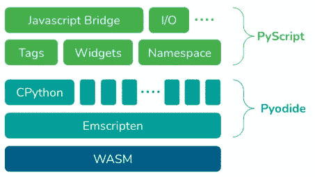

# 如何在浏览器中运行 python 代码

> 原文：<https://blog.devgenius.io/how-to-run-python-code-in-your-browser-69b4044b803a?source=collection_archive---------4----------------------->


Web 应用程序开发是一个更新的工具和技术快速涌现的领域。如今，公司对创建 web 应用程序感兴趣，以便通过交互式 web 应用程序来吸引客户，而不是通过在互联网上显示一些 HTML 页面来脱颖而出。

Javascript 是 web 编程语言中的女王，它包含了几乎所有的 web 开发工具和框架。我们可以使用 Angular、React 或原生 javascript 在几分之一秒内开发一个 web 应用程序。

Python 因其库支持而如此受欢迎，以至于大多数公司都倾向于将其作为人工智能和数据科学项目的最佳选择。

随着需求的增加，新的变化被调整以快速开发应用程序，其中不同技术的融合起着至关重要的作用。通过结合 python 和 HTML，我们可以在 HTML 页面上呈现 Python 代码。

Brython 是 Python 3 的一个实现，可用于在浏览器中运行 Python 代码。上周，Anaconda 的首席执行官王蒙杰宣布了一项名为 PyScript 的革命性技术，允许用户在浏览器中运行 python 代码。

在本文中，我们将尝试介绍 python 在 HTML 页面中的实现。

> web 开发的大动作——Brython 和 PyScript。

# 入门指南

让我们从布里森开始。

# 1.布立吞人（从前居住在不列颠的凯尔特人）

Python 框架如 Flask 和 Django 用于在服务器端渲染，而 Brython 则在客户端提供 python 代码。

 [## 布立吞人（从前居住在不列颠的凯尔特人）

### 毫无疑问，你在 HTML5 的演示中见过这样的时钟，但是，右击并查看它的源代码…

brython.info](https://brython.info/) 

Brython 是一个框架，可以用来在 HTML 页面上注入 python 代码。它的主要目标是取代 Javascript 成为 web 的脚本语言。Brython 能够与 DOM 交互，因此在脚本方面，它是一个很有前途的框架。Brython 的这种能力可以用来在浏览器中创建新的东西。

## 装置

Brython 提供 CDN 链接，可用于集成 web 应用程序。

*   在 HTML 文件中添加以下代码以添加 Brython 依赖项。

```
<script src="https://cdn.jsdelivr.net/npm/brython@3.10.5/brython.min.js"></script> 
<script src="https://cdn.jsdelivr.net/npm/brython@3.10.5/brython_stdlib.js"></script>
```

*   在 HTML 页面加载上绑定函数`brython()`。

```
<body onload=brython()>
```

*   在`<script type=”text/python”>`标签内编写 Python 代码。

```
<body onload="brython()">
   <script type="text/python"> 
      # your python code 
   </script>
</body>
```

## 第一个程序

让我们试试我们的第一个运行在客户端的 Brython 框架程序。


Brython 提供了一个在线控制台来编写和执行 python 代码。

 [## Brython 交互模式

### 布立吞人（从前居住在不列颠的凯尔特人）

交互模式 Brythonbrython.info](https://brython.info/tests/console.html?lang=en) 

您可以在您的网站上包含 python 控制台，

```
<iframe src="http://brython.info/console.html" width="800" height="400"></iframe>
```

Brython 可以与 DOM 元素以及 Highcharts、jQuery、Socket.io、Three.js 等 Javascript 库进行交互。使用 brython 库中的 ajax 调用很容易从服务器获取数据。

如果您对试用 brython 感兴趣，请查看以下存储库。

[](https://github.com/brython-dev/brython/tree/master/www) [## brython/www at master brython-dev/brython

### Brython (Browser Python)是 Python 3 的一个实现，运行在 browser - brython/www at master …

github.com](https://github.com/brython-dev/brython/tree/master/www) [](https://github.com/codemaker2015/brython-demo) [## GitHub-codemaker 2015/Brython-demo:Brython(浏览器 Python)是 Python 3…

### Brython(浏览器 Python)是运行在浏览器中的 Python 3 的实现-GitHub-codemaker 2015/brython-demo…

github.com](https://github.com/codemaker2015/brython-demo) 

# 2.PyScript

在 PyCon US 2022 期间，Anaconda 的首席执行官王蒙杰公布了一个革命性的框架——PyScript。这使得用户能够在浏览器中编写 python 代码。

[](https://github.com/pyscript/pyscript) [## GitHub - pyscript/pyscript

### PyScript 是 Scratch、JSFiddle 和其他“易于使用”的编程框架的 Pythonic 替代品，其目标是…

github.com](https://github.com/pyscript/pyscript) 

PyScript 是一个 JavaScript 框架，允许用户像 PHP 一样在 HTML 页面中嵌入 python 代码。它使用户能够在 web 应用程序上使用 python 库的强大功能，如`numpy`、`pandas`和`scikit-learn`。它还使用户能够在 web 应用程序中执行统计和人工智能计算，而不是在服务器上处理数据并将响应发送回客户端。

PyScript 建立在 [Pyodide](http://pyodide.org/) 之上。CPython 是 Pyodide 的一个基于 WebAssembly 的端口。WebAssembly 将人类可读的`.wat`文本格式语言转换成浏览器可以运行的二进制`.wasm`格式。



图片来源:[anaconda.cloud/pyscript](https://anaconda.cloud/pyscript-python-in-the-browser)

## 装置

PyScript 提供了 CDN 链接，可用于集成 web 应用程序。

*   在 HTML 文件中添加以下代码以添加 PyScript 依赖项。

```
<link rel="stylesheet" href="https://pyscript.net/alpha/pyscript.css" />
<script defer src="https://pyscript.net/alpha/pyscript.js"></script>
```

*   将 PyScript 组件如`<py-script>`和`<py-repl>`添加到 html 页面中，在浏览器中编写 python 代码片段。
*   `**<py-script>**`:包装可在网页中执行的 python 代码。
*   `**<py-repl>**`:呈现代码编辑器，允许用户在其中编写代码。

```
<py-script> 
    # your python code 
</py-script>
```

## 第一个程序

让我们试试我们的第一个运行在客户端的 PyScript 框架程序。


您可以在您的网站上包含 python 控制台，

```
<py-repl>
    print('Hello World')
</py-repl>
```

例如:


如果你有兴趣尝试一下`pyscript`，看看下面的库。

[](https://github.com/pyscript/pyscript/tree/main/pyscriptjs/examples) [## pyscript/pyscript js/main pyscript/pyscript 上的示例

### 在 GitHub 上创建一个帐户，为 pyscript/pyscript 开发做贡献。

github.com](https://github.com/pyscript/pyscript/tree/main/pyscriptjs/examples) 

感谢阅读这篇文章。

完整的源代码可以在[https://github.com/codemaker2015/python-on-browser-examples](https://github.com/codemaker2015/python-on-browser-examples)上找到

这里有一些有用的链接，

[](https://github.com/brython-dev/brython) [## GitHub-Brython-dev/Brython:Brython(浏览器 Python)是运行在…

### Brython(浏览器 Python)是 Python 3 的一个实现，运行在浏览器- GitHub - brython-dev/brython…

github.com](https://github.com/brython-dev/brython) [](https://anaconda.cloud/pyscript-python-in-the-browser) [## 蟒蛇核

### 探索我们的学习内容库，包括操作方法视频和专家见解，全部在有限时间内免费提供给…

阿纳康达.克劳德](https://anaconda.cloud/pyscript-python-in-the-browser) [](https://pyodide.org/en/stable/) [## Pyodide 版本 0.20.0

### 编辑描述

pyodide.org](https://pyodide.org/en/stable/) [](https://github.com/pyodide/pyodide/tree/main/packages) [## pyo dide/主 pyodide/pyodide 的包裹

### Pyodide 是基于 WebAssembly - pyodide/packages 的用于浏览器和 Node.js 的 Python 发行版…

github.com](https://github.com/pyodide/pyodide/tree/main/packages)