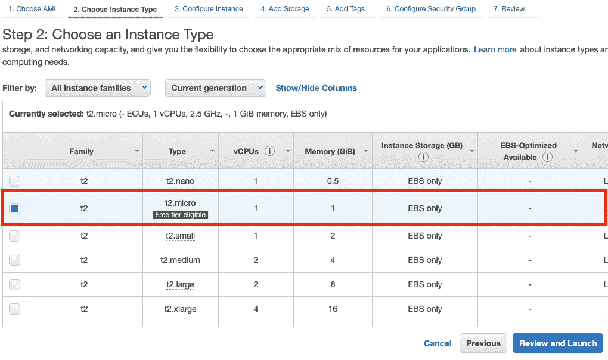

# 如何在 AWS EC2 实例中运行 Python 程序

> 原文：<https://blog.devgenius.io/how-to-run-python-program-within-aws-ec2-instance-38b1d71e9374?source=collection_archive---------0----------------------->

运行 Python 程序的初学者指南。

Python 是什么？

**Python** 是一种易于使用的编程语言，用于创建简单或复杂的程序。在本教程中，你将学习如何……
1。设置一个 AWS EC2 实例
2。在 AWS 命令行界面(CLI)中访问和使用 Python
3。在 AWS EC2 实例中运行 Python 程序

> **先决条件:**AWS 账号
> AWS 命令行接口
> Ubuntu Server 20.24
> Python
> Vim

# 步骤 1:登录您的 AWS 帐户

注册一个 [AWS 账户](https://signin.aws.amazon.com/signin?redirect_uri=https%3A%2F%2Fus-east-2.console.aws.amazon.com%2Fec2%2Fv2%2Fhome%3Fregion%3Dus-east-2%26state%3DhashArgs%2523Home%253A%26isauthcode%3Dtrue&client_id=arn%3Aaws%3Aiam%3A%3A015428540659%3Auser%2Fec2&forceMobileApp=0&code_challenge=5uqhS-n8Ndw_yaYVrNwQDirDE4WabVfyFECAyvLA7FI&code_challenge_method=SHA-256)。如果您没有帐户，但可以访问[云专家](https://acloudguru.com/)，您可以生成一个 AWS 云沙盒密钥 ID/秘密访问密钥来登录。

点击“打开沙盒”并进入匿名浏览器。

# 步骤 2:用 EC2 实例启动一个虚拟机

登录后，单击 AWS 仪表板上如下图所示的链接。

# 步骤 3:选择 Amazon 机器映像(AMI)和实例

我们将使用 Ubuntu 20.24 服务器和一个 t2 类型的实例，如下所示。

**点击查看并启动**

**点击启动完成**的设置

# 步骤 4:选择或创建密钥对

设置完成后，选择创建新的密钥对，然后单击“下载密钥对”和“启动实例”。

单击屏幕右下角的“查看实例”继续

# 步骤 5:访问 AWS CLI

您将在下一个屏幕上看到您创建的所有实例。在顶部，单击“连接”按钮，并在下一页连接以访问 AWS CLI。

# 步骤 6:更新现有包

通过输入以下命令更新现有软件包:

出现提示时，键入“y”完成更新。

# 步骤 7:创建新目录

通过输入以下命令，为我们的 Python 3 环境创建一个新目录:

创建后，通过输入以下命令切换到该目录:

我的例子

# 步骤 8:检查 AWS 实例是否有最新版本的 Python 并安装

通过输入以下命令检查最新版本:

现在，通过输入以下命令将 Python 环境安装到当前目录中:

出现提示时，键入“y”完成更新。

# 步骤 9:在您的目录中创建一个 Python 项目

我们将在这个项目中工作。要创建它，请输入:

下面应该是这样的。

现在，我们必须激活环境，然后将目录更改为项目目录。输入:

如果输入正确，您会在左侧看到您的项目名称。

# 步骤 10:使用 Vim 编写 Python 程序

输入以下命令:

点击 **ESC** 并键入 **:wq** 保存并退出 vim。

# 步骤 11:运行 Python 程序

输入命令:

你做到了祝贺你！您已经学习了如何设置 AWS EC2 实例，如何在 AWS 命令行界面中访问和使用 Python，以及如何在 AWS EC2 实例中运行 Python 程序。