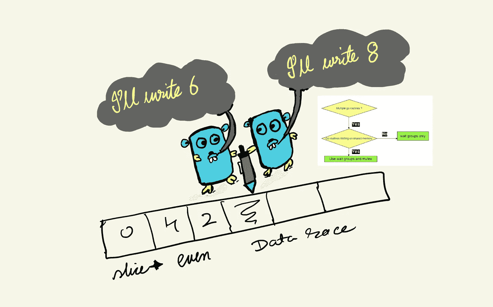
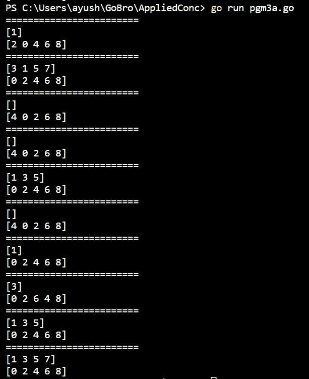
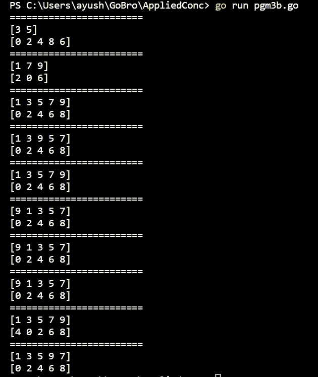
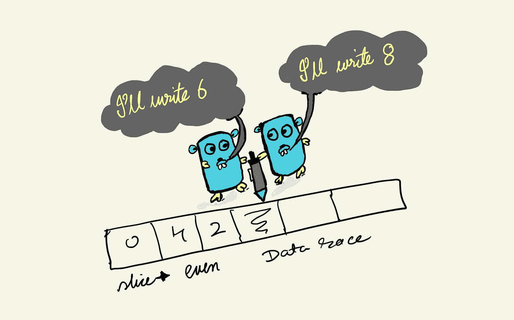
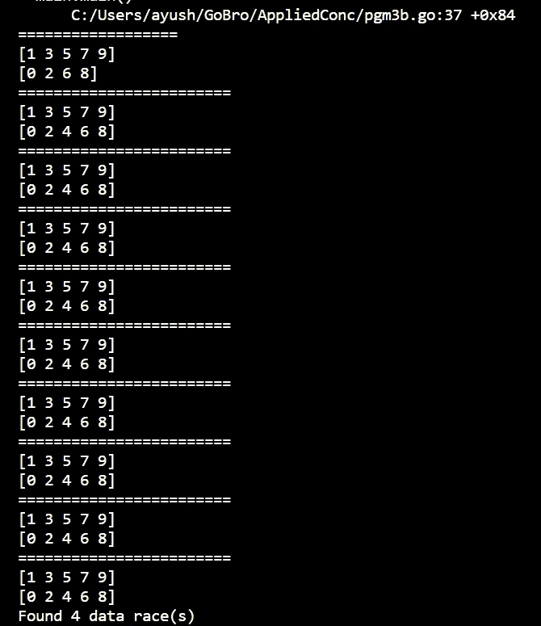
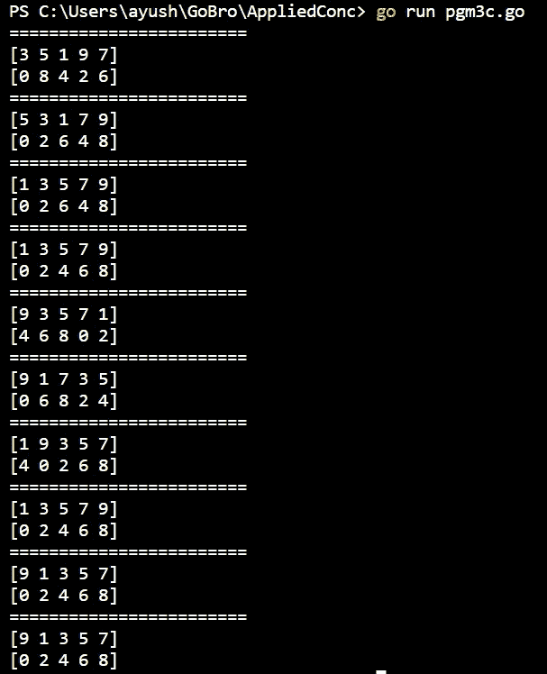
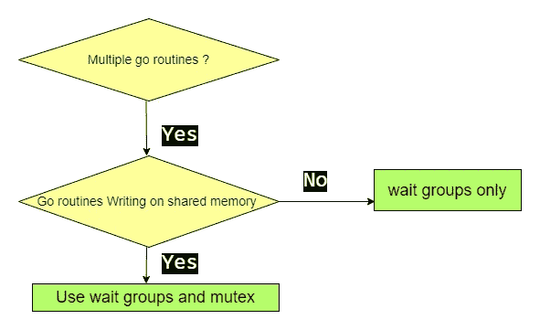

# 如何在 Golang 中安全地将数据并发追加到同一个片上？

> 原文：<https://blog.devgenius.io/how-to-safely-append-data-to-the-same-slice-concurrently-in-golang-df467e1ebc9c?source=collection_archive---------0----------------------->

在本文中，我们将通过不同的方法来实现，如等待组和互斥以及数据竞争的挑战。



Fig 简介

Aim:一个将奇数和偶数从 0 到 9 分开并附加到它们相应的片上的程序。所以我们应该有奇数=[1，3，5，7，9](任意顺序)，偶数=[0，2，4，6，8](任意顺序)。

# 仅使用 goroutines 尝试-0

背景:一个程序在启动时唯一拥有的 goroutine 是调用 main 函数的那个，因此我们称它为主 goroutine。go 语句生成新的 goroutines。go 语句是前缀为关键字 go 的常规函数或方法调用。go 语句使新形成的 goroutine 调用该函数。go 语句本身会立即结束。

在这个例子中，我们使用多个 go 例程添加到切片中。因此，我们将有一个主要的围棋例程和 10 个由匿名围棋函数创建的新围棋例程。

```
package mainimport (
 "fmt"
)func done() {var odd = make([]int, 0)
 var even = make([]int, 0)for i := 0; i <= 9; i++ {
  if i%2 == 0 {
   go func(i int) {
    even = append(even, i)
   }(i)
  } else {
   go func(i int) {
    odd = append(odd, i)
   }(i)
  }
 }
 fmt.Println(odd)
 fmt.Println(even)}func main() {
 for i := 1; i <= 10; i++ {
  fmt.Println("========================")
  done()
 }
}
```

输出:



图 1:输出

**重大问题**:

*   主 goroutine 可以完成它的执行，而不需要等待其他 go 例程(它们将把数据附加到片上)完成。因此，主 go 例程中的 print 语句会将数据仍被其他 go 例程追加的切片。
*   数据竞争(我们将在下一部分讨论)

# 带有 sync.waitgroups 的尝试-1

我们将使用 sync.waitgroups。借助 sync 包中的 WaitGroup 函数，程序可以等待特定的 goroutines。这些 Golang 同步技术会暂停程序执行，直到等待组中的 goroutines 完成运行。

简而言之，主程序将等到所有其他围棋程序完成。

工作组通知 WaitGroup。添加(1)每当循环开始时，它需要等待一个以上的 goroutine。之后，延期工作组。Done()在 goroutine 结束时提醒 WaitGroup。然后，wg。Wait()延迟执行，直到 goroutines 运行完毕。整个过程类似于在 wgAdd()中增加一个计数器，从 wg 计数器中减去。调用 done()时等待 wg 中的计数器达到 0。这是等待组工作的关键。

```
package mainimport (
 "fmt"
 "sync"
)func done() {var wg sync.WaitGroup
 var odd = make([]int, 0)
 var even = make([]int, 0)for i := 0; i <= 9; i++ {
  wg.Add(1)
  if i%2 == 0 {
   go func(i int) {
    defer wg.Done()
    even = append(even, i)
   }(i)
  } else {
   go func(i int) {
    defer wg.Done()
    odd = append(odd, i)
   }(i)
  }
 }
 wg.Wait()
 fmt.Println(odd)
 fmt.Println(even)}func main() {
 for i := 1; i <= 10; i++ {
  fmt.Println("========================")
  done()
 }
}
```

输出



图 2:输出

**现在发生了什么？**

为了确保函数的一致性，我们运行了十次。毫无疑问，它比旧的要好，但有时结果并不像预期的那样。那么原因是什么。原因是数据竞赛。

**数据竞争**:当两个或两个以上的 Goroutines 访问同一个内存位置时，其中至少有一个是写操作，它们之间没有排序，这就是所谓的数据竞争。



图 3:至少两个 go 例程并发写入时的数据竞争

更简单地说，当多个 goroutines 同时写一个片时，就会出现竞争情况。行为将是不可预测的。你需要一个互斥体。通过锁定保护追加。

我们可以通过命令 go run -race pgm3b.go 来确认这一点

**数据竞争检查的输出**:



图 4:输出(数据竞争)

# 使用 sync.waitgroups 和 mutex 的尝试-2

我们将对 sync.waitgroups 使用互斥。这不仅确保了主 go 例程等待所有其他 10 个 go 例程完成，而且还确保了在给定的时间点，只有一个 go 例程可以写入一个片。这就是互斥或者互斥的原理。附加由互斥体保护，避免脏写情况。

```
package mainimport (
 "fmt"
 "sync"
)func done() {type answer struct {
  MU   sync.Mutex
  data []int
 }var odd answer
 var even answerwg := &sync.WaitGroup{}
 for i := 0; i <= 9; i++ {
  if i%2 == 0 {
   wg.Add(1)
   go func(i int) {
    defer wg.Done()even.MU.Lock()
    even.data = append(even.data, i)
    even.MU.Unlock()
   }(i)
  } else if i%2 == 1 {
   wg.Add(1)
   go func(i int) {
    defer wg.Done()odd.MU.Lock()
    odd.data = append(odd.data, i)
    odd.MU.Unlock()
   }(i)
  }
 }wg.Wait()fmt.Println(odd.data)fmt.Println(even.data)}func main() {
 for i := 1; i <= 10; i++ {
  fmt.Println("========================")
  done()}
}
```

**输出:**



图 5:输出

这里我们可以看到没有观察到数据竞争，并且在所有 10 次迭代中输出都是一致的。这次没有数据竞赛。注意:互斥和等待组都是由 go 的同步包提供的。

**数据赛跑检查:**


图 6:输出(数据竞争检查)

# 简而言之…

每当有多个 go 例程时，使用等待组，如果这些 go 例程同时在同一个数组、片或映射上写入，则在进行写入操作时，在这个共享内存(数组/片/映射)上使用互斥体。然而，如果多个 go 例程使用共享内存进行读(而不是写)操作，那么使用等待组应该没问题。



图 8:总结流程图(我在 draw.io 上画的)