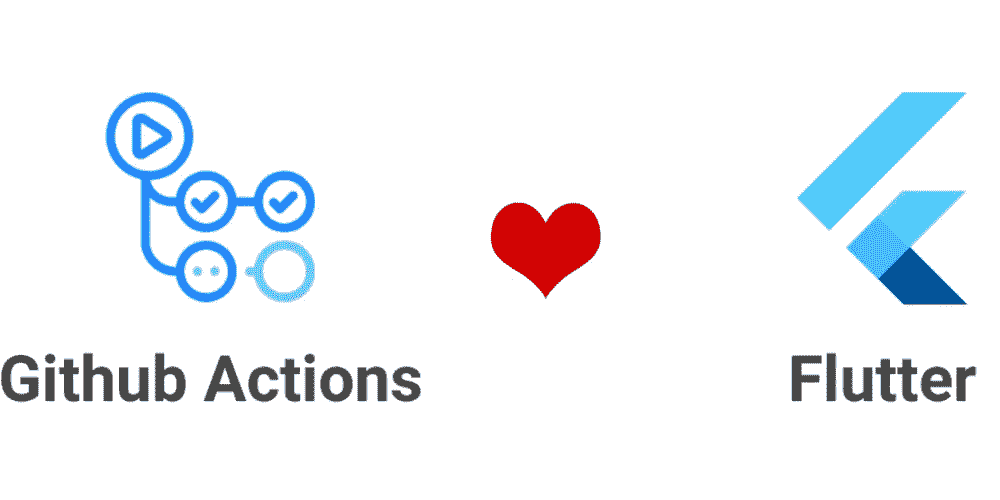
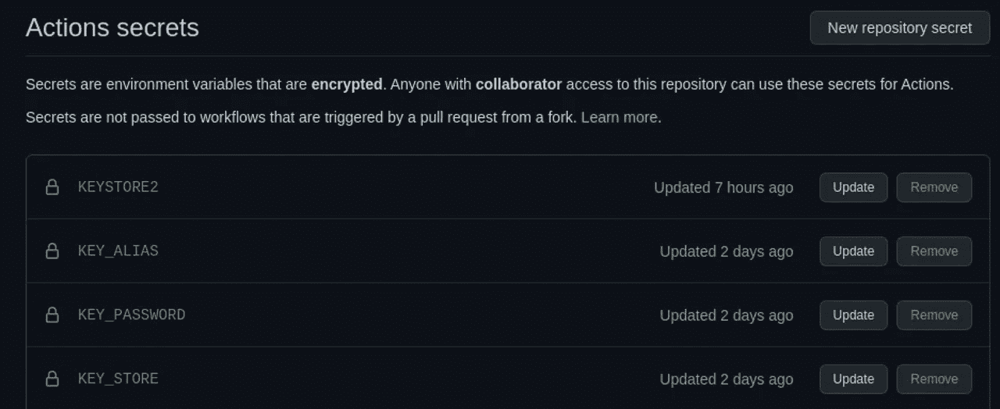
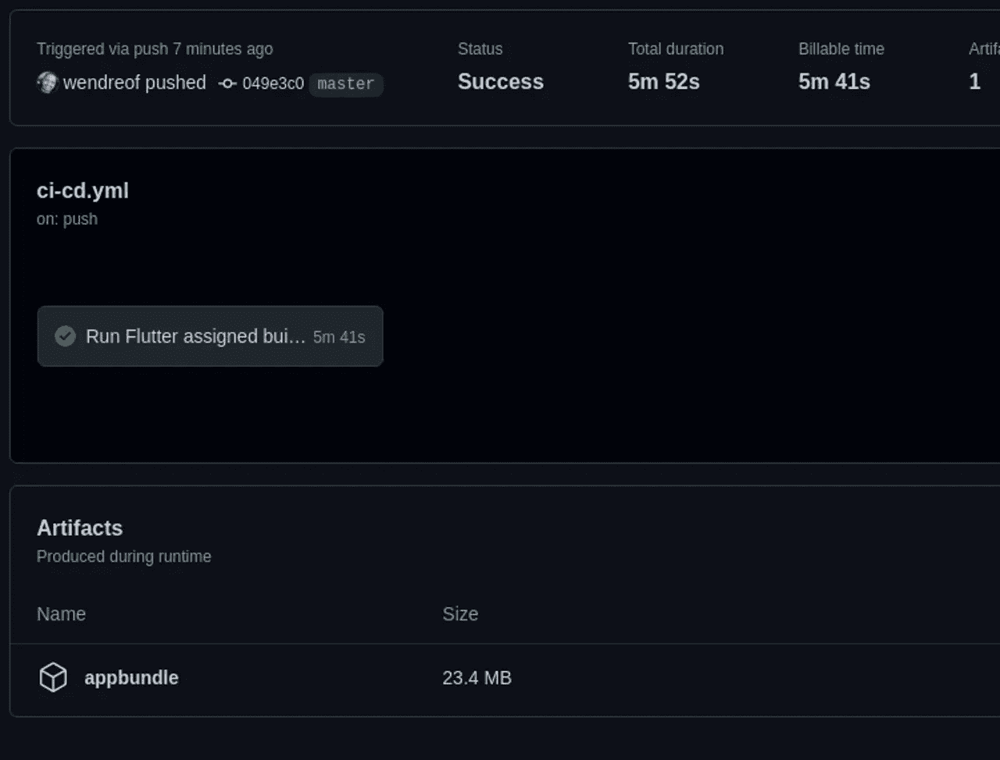
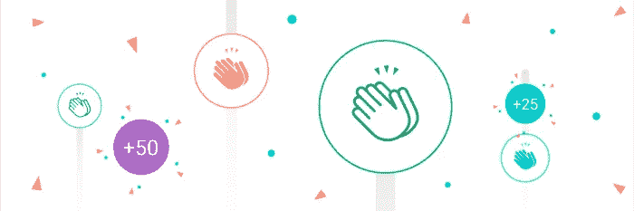

# 如何用 GitHub Actions 安全构建指定的 Flutter App

> 原文：<https://blog.devgenius.io/how-to-safely-build-assigned-flutter-app-with-github-actions-8860b1b6eef6?source=collection_archive---------1----------------------->

[https://dev . to/maverikai/actionshackathon-journey-with-github-actions-and-flutter-jnm](https://dev.to/maverikai/actionshackathon-journey-with-github-actions-and-flutter-jnm)

**→** [**我的 GitHub 简介。**](http://github.com/wendreof) **→** [**我的 LinkedIn 个人资料**](https://www.linkedin.com/in/wendreof/) **。
→把** [**Ufo 主题**](https://marketplace.visualstudio.com/items?itemName=wendreof.ufo) **放到你的 VS 代码里。**

你好，欢迎来到我的博客。今天的帖子是关于在不损害密钥密码、密钥别名、密钥存储密码以及最重要的文件 JKS 档案的情况下构建和分配一个 Flutter 应用程序。

正如您可能知道的，有很多原因我们不应该在版本控制中包括 key-store.jks，即使是在私有存储库中。所以…我面对这种情况，花了几个小时的空闲时间来做这个方法。软件开发中的一切，这只是一种方式，你可以随意改变你想要的或者你的情况需要的任何设置。

在接下来的例子中，我使用的是一个 Flutter 应用程序，因此，如果你正在使用另一个框架/平台构建 android 应用程序，一些命令会有所不同，比如构建应用程序包。

在这个帖子的总结下面:

*   1 —准备 build.gradle
*   2 —创建 CI/CD 工作流
*   3 —创建 key.properties 文件
*   4 —对 key-store.jks 进行编码
*   5 —创建秘密变量
*   6 —将 base64 密钥解码为 key-store.jks 归档并构建应用程序
*   7-创建工件
*   8-运行工作流

*从现在开始，我假设你已经有了* ***Flutter 应用*******key-Store . jks 文件，*** *可以* ***上传 appbundle*** *到* ***Play Store 控制台*** *并且能够创建一些**

***#1 —准备构建版本***

*对于该配置，我们声明它将是一个带有密钥存储数据的 key.properties，如别名、密钥和存储密码。*

***#2 —创建 CI/CD 工作流***

*现在，在您的 ci-cd.yml 上，我们声明该管道将在主和开发分支上的每个 push 和 pull 请求上运行，还声明了一些环境变量，如 Java version、Flutter channel 和 version 以及 key.properties 的路径。*

***#3 —创建 key.properties 文件***

*现在我们使用 3 个动作，并使用它们和步骤 2 中的环境变量以及其他变量来创建带有 echo 命令和一些秘密的 key.properties。别担心，我们很快就会创造秘密。*

***#4 —编码 key-store.jks** (仅在 Linux 上测试)*

*使用以下命令从 key-store.jks 归档文件生成 base64 字符串。*

***#5 —创建秘密变量***

**

*KEYSTORE2 = keybase64.txt 步骤 4 的内容。*

*KEY_ALIAS =您的别名*

*KEY_PASSWORD =您的密钥密码*

*KEY_STORE =您的密钥库密码*

***#6 —将 base64 密钥解码为 key-store.jks 存档和构建应用***

***# 7——创造神器***

*通过该操作，我们能够下载 appbundle。*

***#8 —运行工作流程***

**

*如您所见，我们的工作流程运行正常！！我们已经准备好将 appbundle 上传到 Play Console 上的某个音轨。*

*我希望你喜欢它，下一篇文章再见！*

***获取完整的脚本并给它一颗星:**[https://gist . github . com/wendre of/3d fa 1c 35 CD 0 dcb 96 c 7637 BFF 8435 Fe 02](https://gist.github.com/wendreof/3dfa1c35cd0dcb96c7637bff8435fe02)*

*感谢你阅读❤*

*所以不要为明天忧虑，因为明天自有明天的忧虑。每天都有足够多的麻烦。马太福音 6:34*

*错误或建议？用你的拍手留下评论吧！*

**

***→** [**我的 GitHub 简介。**](http://github.com/wendreof) **→**[**我的 LinkedIn 简介**](https://www.linkedin.com/in/wendreof/) **。
→把** [**Ufo 主题**](https://marketplace.visualstudio.com/items?itemName=wendreof.ufo) **拿到你的 VS 代码里。***