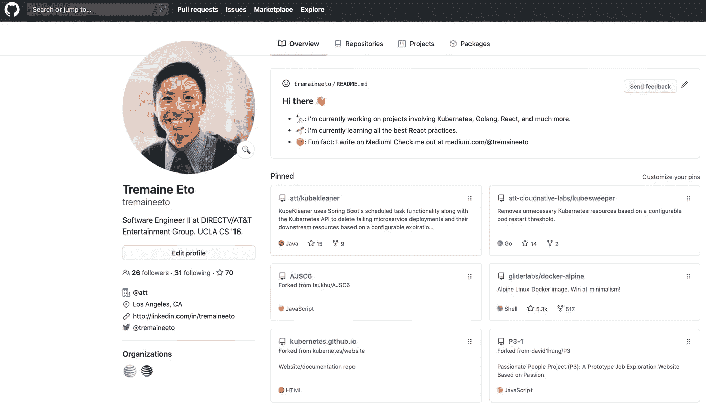
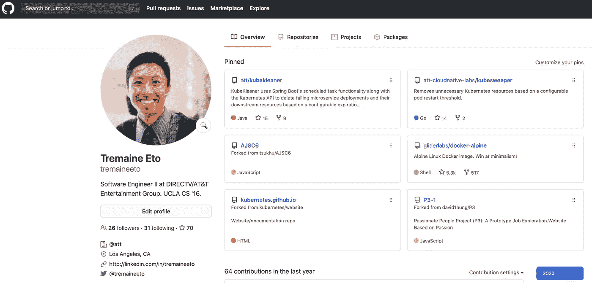
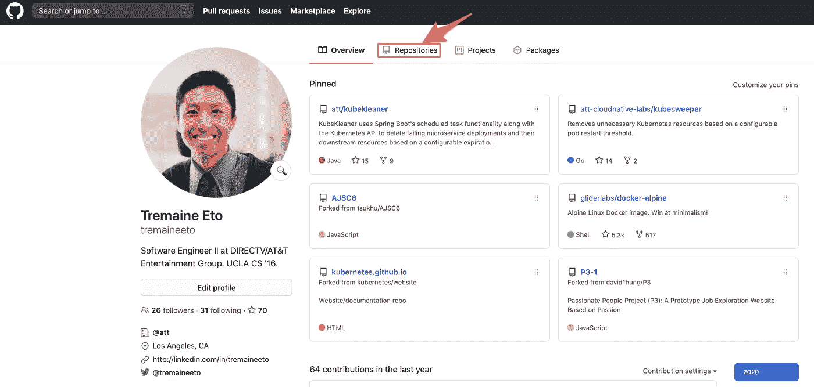
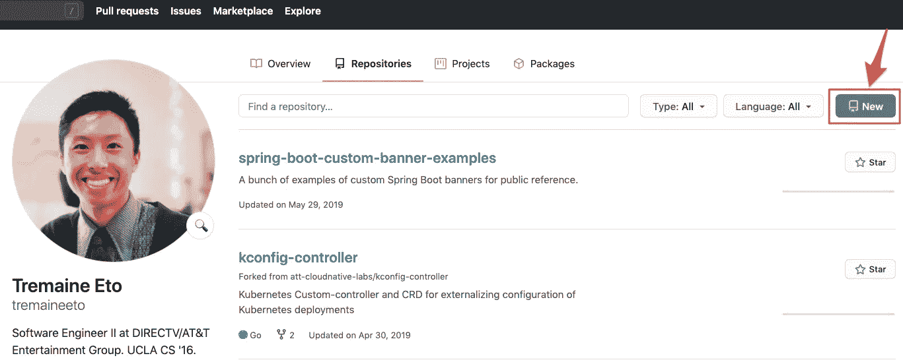
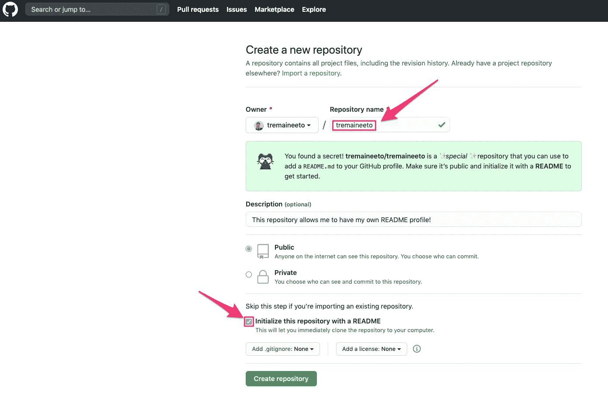
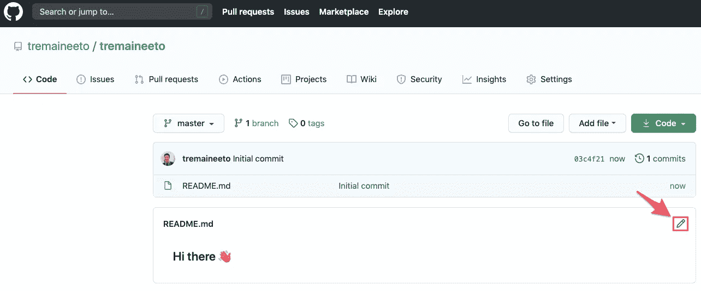
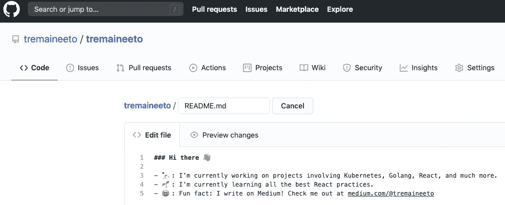

# 如何保存自述文件以显示在您的主 GitHub 个人资料上

> 原文：<https://blog.devgenius.io/how-to-save-a-readme-to-display-on-your-main-github-profile-b2153f7b20f?source=collection_archive---------20----------------------->

我的个人资料中的新自述。

5 月 27 日，GitHub 高级产品设计师 Kathy Zheng 让 Twitter 世界知道，一个用户一直在叫嚣的很酷的新功能正在开发中。

Kathy Zheng 和 Kat Fukui 的全新简介 READMEs。

据郑介绍，这个功能是由 GitHub 工程师 Mike Kavouras 实现的，它允许用户在他们的个人主页上有一个显示。截至 2020 年 7 月 8 日，该功能现已面向所有用户推出。

这篇文章将简要地向您展示如何将这个自述文件放入您的个人资料中。

# 如果你只是想在没有说明书的情况下

只需用您的 GitHub 用户名创建一个存储库作为存储库名称，然后提交一个`README.md`,包含您想在您的个人资料中显示的任何内容。

# 逐步说明

1.  转到您的个人资料。应该是`https://github.com/<yourUsernameHere>`。

2.点击`Repositories`链接。

3.点击`New`按钮。

4.这一点很重要:键入您的用户名作为存储库名称。您应该会立即看到绿色的警告框，让您知道您将激活这个新功能。此外，您应该选中该框，用自述文件初始化存储库。

5.现在您的存储库已经创建好了，点击铅笔图标来编辑`README.md`。

6.进行您认为合适的编辑，然后将您的更改提交给 master。

7.导航到您的个人资料，欣赏新功能的所有优点。

此外，您可以在命令行中使用 Git 完成上述所有步骤，或者使用 GitHub。

感谢所有为此工作的 GitHub 开发者！

 [## 通过我的推荐链接加入媒体

### 作为一个媒体会员，你的会员费的一部分会给你阅读的作家，你可以完全接触到每一个故事…

tremaineeto.medium.com](https://tremaineeto.medium.com/membership)