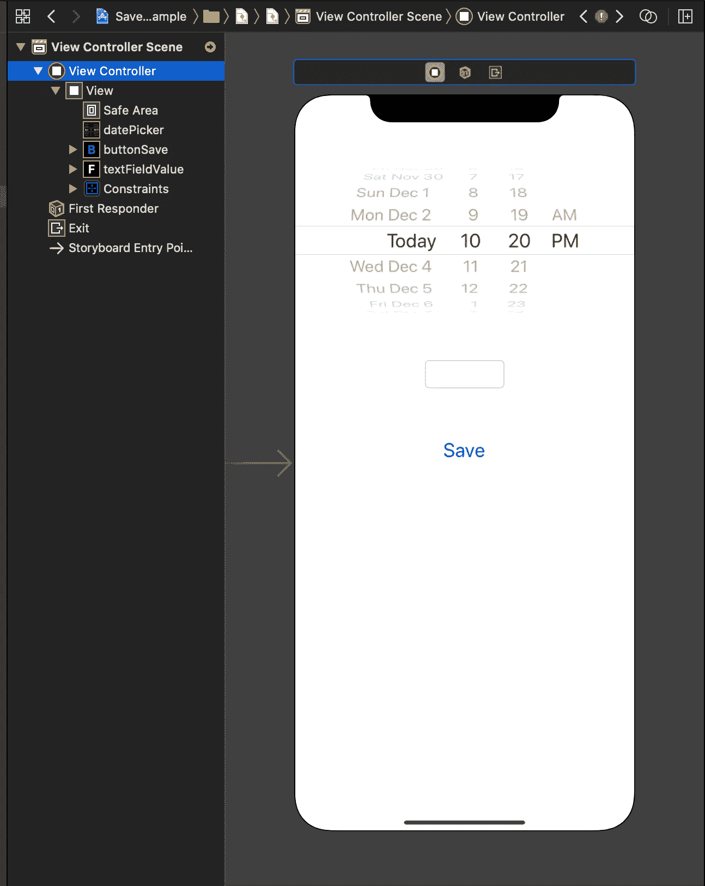

# 如何在 Swift 中将数据保存到 Apple Health

> 原文：<https://blog.devgenius.io/how-to-save-data-to-apple-health-in-swift-1a5982a4e8f3?source=collection_archive---------0----------------------->

## 学习如何将健康信息存储到 Apple Health 的教程


照片由[威廉·胡克](https://unsplash.com/@williamtm?utm_source=medium&utm_medium=referral)在 [Unsplash](https://unsplash.com?utm_source=medium&utm_medium=referral) 上拍摄

[苹果健康](https://www.apple.com/ios/health/)是 2014 年公布的健康信息学 app，随 iOS 8 或更高版本提供。HealthKit 是 iOS SDK 中包含的 API，软件开发人员使用它来创建可以保存/读取 iOS 上的 Apple Health 应用程序的应用程序。

在本教程中，我将用几行代码解释如何将数据和信息保存到 Apple Health。

# 入门指南

首先，打开 Xcode 并创建一个新项目。选择*单视图应用*。


然后创建一个新类，命名为`HealthKitAssistant`。在这里，我们把所有的方法，我们将使用保存苹果健康的数据。

进入`Main.Storyboard`文件，在顶部添加一个`DatePicker`，在中间添加一个`TextField`，在屏幕底部添加一个`Button`。



转到您的项目设置，选择`Signing & Capabilities`和`Add HealthKit`以允许您的应用程序请求用户许可，然后存储/检索健康信息。


为了访问用户信息，您需要做的最后一步是在`Info.plist`文件中添加以下键:

```
<key>NSHealthShareUsageDescription</key>
<string>"Please give us the reading permission to allow the app to work."</string>
<key>NSHealthUpdateUsageDescription</key>
<string>"Please give us the update permission to add data into Apple Health."</string>
```

# 履行

首先，我们将第一个方法添加到`HealthKitAssistant`文件中。需要使用此方法向用户请求授权，以从设备读取和写入数据:

```
public class func authorizeHealthKit(completion: @escaping (Bool, Error?) -> Swift.Void) {
        guard HKHealthStore.isHealthDataAvailable() else {
            completion(false, HealthkitSetupError.notAvailableOnDevice)
            return
        }

        guard let stepsCount = HKObjectType.quantityType(forIdentifier: .stepCount) else {
                completion(false, HealthkitSetupError.dataTypeNotAvailable)
                return
        }

        let healthKitTypesToWrite: Set<HKSampleType> = [stepsCount,
                                                        HKObjectType.workoutType()]

        let healthKitTypesToRead: Set<HKObjectType> = [stepsCount,
                                                       HKObjectType.workoutType()]

        HKHealthStore().requestAuthorization(toShare: healthKitTypesToWrite,
                                             read: healthKitTypesToRead) { (success, error) in
                                                completion(success, error)
        }

    }
```

然后我们添加一个方法来写关于 Apple Health 的步骤数据:

```
public class func saveSteps(stepsCountValue: Int,
                             date: Date,
                             completion: @escaping (Error?) -> Swift.Void) {

        guard let stepCountType = HKQuantityType.quantityType(forIdentifier: .stepCount) else {
            fatalError("Step Count Type is no longer available in HealthKit")
        }

        let stepsCountUnit:HKUnit = HKUnit.count()
        let stepsCountQuantity = HKQuantity(unit: stepsCountUnit,
                                           doubleValue: Double(stepsCountValue))

        let stepsCountSample = HKQuantitySample(type: stepCountType,
                                               quantity: stepsCountQuantity,
                                               start: date,
                                               end: date)

        HKHealthStore().save(stepsCountSample) { (success, error) in

            if let error = error {
                completion(error)
                print("Error Saving Steps Count Sample: \(error.localizedDescription)")
            } else {
                completion(nil)
                print("Successfully saved Steps Count Sample")
            }
        }

    }
```

现在在`ViewController`文件上，我们将调用`viewDidLoad`上的`authorizeHealthKit`方法。向用户显示一条提示消息，授予我们的应用对健康数据的读/写访问权限。

```
HealthKitSetupAssistant.authorizeHealthKit { (result, error) in
            if result {
                print("Auth ok")
            } else {
                print("Auth denied")
            }

        }
```

然后在`saveButton`动作上添加以下代码:

```
@IBAction func saveButton(_ sender: Any) {
        guard let value = textFieldValue.text else {
            return
        }

        HealthKitSetupAssistant.saveSteps(stepsCountValue: Int(value)!, date: datePicker.date) { (error) in
            print(error)
        }

    }
```

# 试验

我们已经准备好测试应用程序了！

运行模拟器并允许健康访问应用程序。然后，选择日期和时间。最后，在文本字段上写一个值，并点击`Save`按钮。

如果你现在打开苹果健康应用程序，你会看到一个新的步骤数据记录！

[](https://www.buymeacoffee.com/nicolidomenico)

# 完整代码

你可以在 [GitHub](https://github.com/domeniconicoli/SaveAppleHealthDataExample) 上找到更多数据类型的完整代码，一个读取数据的方法和一个删除数据的方法。

感谢您的阅读。如果你有任何问题或建议，请在评论中告诉我。