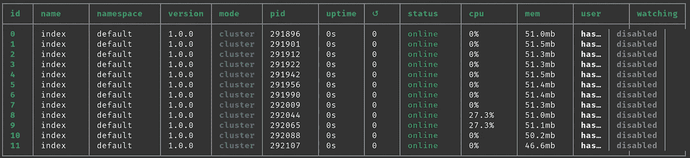
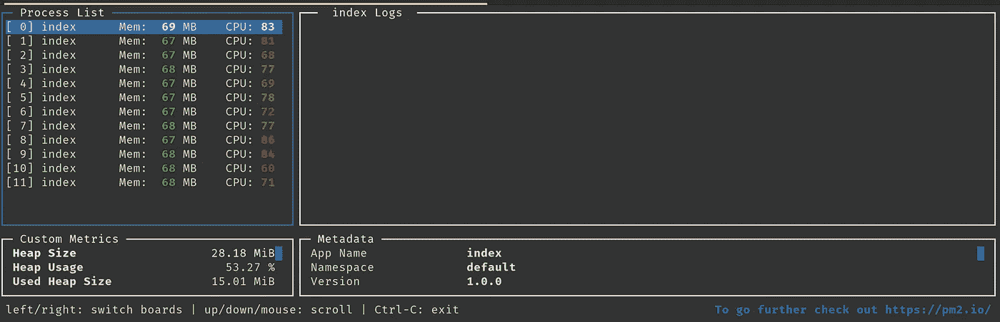

# 如何将 NodeJS 应用程序扩展到机器的所有 CPU 核心

> 原文：<https://blog.devgenius.io/how-to-scale-a-nodejs-application-a51d3e8e2d36?source=collection_archive---------0----------------------->


项目链接:【https://github.com/Joker666/NodeJS-MultiCore-Demo 

J avascript 是单线程语言，因此只有一个调用栈和一个内存堆。NodeJS 使用 Javascript 开发服务器端应用程序，并共享相同的行为。它运行在一个 CPU 内核上，无论您的机器或云中的虚拟机有多少个 CPU 内核。Javascript 的单线程特性在基于浏览器的系统中实际上是好的，但是在后端系统中就不尽如人意了，因为后端需要机器提供的所有设备来驱动，以免浪费资源。

但是 NodeJS 是用 C 构建的，C 拥有构建多线程应用程序所需的所有电池。NodeJS 创建者经过深思熟虑决定避免信号量和/或互斥锁，因为它们会给代码带来难以调试的错误和复杂性。但是 NodeJS 中的可伸缩性并不是事后才想到的，它内置于带有[集群](https://nodejs.org/api/cluster.html)模块的运行时中，该模块可以利用机器的所有 CPU 内核。

# 单核性能

让我们构建一个 NodeJS 应用程序并对其进行负载测试，看看它的性能如何。我们将使用惊人的 [Fastify](https://www.fastify.io/) 框架进行测试，因为这是一个开销非常低的简单框架。我将使用他们网站上提供的 hello world 服务器的例子。

这是一个非常简单的 fastify 应用程序，它从端口 3000 开始，并返回一个 hello world json。现在让我们运行服务器并用 [wrk2](https://github.com/giltene/wrk2) 对其进行负载测试。我有一台 12 核的机器，所以我将使用 12 个线程和 1，000 个连接运行`wrk`命令 30 秒，每秒 200，000 个请求。

```
wrk -t12 -c1000 -d30s -R200000 [http://localhost:3000/](http://localhost:3000/)
```

> 结果显示 vanilla fastify 服务器每秒可以处理大约 25000 个请求。

```
Running 30s test @ [http://localhost:3000/](http://localhost:3000/)
  12 threads and 1000 connections
  Thread Stats   Avg      Stdev     Max   +/- Stdev
    Latency    17.30s     4.94s   26.17s    58.16%
    Req/Sec     2.08k     1.66     2.09k    91.67%
  753447 requests in 30.03s, 134.37MB read
Requests/sec:  25087.51
Transfer/sec:  4.47MB
```

# 进入集群模式

版本 0.8 左右引入的集群模块可以处理一个节点进程集群。主进程可以`fork`并启动其他子进程，然后这些子进程并行运行。让我们看看它的实际效果

这里我们使用`os`模块来检测系统拥有的 CPU 内核数量。如果内核数量为 1，它只是像以前一样运行应用程序。如果它有更多的内核，它会在`cluster`模块的帮助下检测正在运行的进程是否是`Master`进程。然后，它遍历机器的 CPU 数量，并使用`cluster.fork()`方法分叉当前进程。

`fork`所做的实际上只是运行同一个程序的另一个节点进程，类似于运行`node index.js`。当子进程执行时，`cluster`模块的`isMaster`返回 false，它照常运行程序。

主进程监听我们的 HTTP 服务器端口，并在工作进程中对所有请求进行负载平衡。输出如下所示

```
server listening on 3000 and worker 280474
server listening on 3000 and worker 280473
server listening on 3000 and worker 280483
server listening on 3000 and worker 280480
server listening on 3000 and worker 280492
server listening on 3000 and worker 280503
server listening on 3000 and worker 280510
server listening on 3000 and worker 280517
server listening on 3000 and worker 280504
server listening on 3000 and worker 280533
server listening on 3000 and worker 280526
server listening on 3000 and worker 280536
```

根据系统中内核的数量，输出会因机器而异。我的系统有 12 个内核，所以它运行 12 个进程。

当我们多次访问 web 服务器时，请求将开始由具有不同进程 id 的不同工作进程处理。主人以循环的方式在工人中分配负载。

现在让我们再次进行负载测试，

```
Running 30s test @ [http://localhost:3000/](http://localhost:3000/)
  12 threads and 1000 connections
  Thread Stats   Avg      Stdev     Max   +/- Stdev
    Latency     8.86s     2.69s   15.56s    60.54%
    Req/Sec     9.19k   427.09    10.17k    70.83%
  3262051 requests in 30.00s, 581.74MB read
Requests/sec: 108729.29
Transfer/sec: 19.39MB
```

我们看到单线程 NodeJS 服务器的性能有了显著的提高。我们现在每秒能够处理 10 万个请求，几乎是以前的 4 倍。这是一个真正的收获，不需要任何外部机制，只需要内置的工具。

现在您有了一个 NodeJS 应用程序，可以在机器的所有内核中运行！

# 高可用性

当我们运行 Node server 的单个实例时，我们必须在崩溃或部署新代码时重启它。运行程序的多个进程缓解了这个问题。当一个进程崩溃时，我们可以派生一个新的进程。让我们看看它的实际效果

完整文件可在[这里](https://github.com/Joker666/NodeJS-MultiCore-Demo/blob/main/ha.js)获得。这里，我们模拟一个随机崩溃，并确保崩溃发生在一个工作进程中，而不是主进程中。如果主进程崩溃，我们仍然需要重启应用程序。但是对于子进程，我们可以在看到崩溃时再次`fork`。我们在分叉前添加条件，以确保它是一个崩溃，而不是被主杀死或断开。当我们运行它时，我们看到

```
server listening on 3000 and worker 287932
server listening on 3000 and worker 287921
server listening on 3000 and worker 287928
server listening on 3000 and worker 287922
server listening on 3000 and worker 287940
server listening on 3000 and worker 287959
server listening on 3000 and worker 287967
server listening on 3000 and worker 287984
server listening on 3000 and worker 287951
server listening on 3000 and worker 287981
server listening on 3000 and worker 287973
server listening on 3000 and worker 287952
Worker 5  has exited.
server listening on 3000 and worker 288053
Worker 1  has exited.
server listening on 3000 and worker 288064
Worker 7  has exited.
server listening on 3000 and worker 288075
Worker 14  has exited.
server listening on 3000 and worker 288086
Worker 10  has exited.
server listening on 3000 and worker 288097
```

每当一个工人离开，就会有新的工人加入。这很好，因为我们已经确保应用程序在任何崩溃的情况下都可以运行。我们确实需要找到根本原因并尽快修复，但这将使应用程序在此期间保持运行。

# 警告

使用`cluster`模块是扩展 NodeJS 应用程序的一个很好的方法，但是你需要注意一些情况。

*   **没有内存缓存:**现在我们有多个进程并行运行，我们将无法在内存中缓存和访问一些对象。因为进程之间没有共享内存。我认为这很好，因为专用缓存技术胜过内存缓存。现在，我们将被迫使用一些缓存机制，如 Redis 或 Memcache，并能够从任何进程中访问它们。
*   **无状态通信:**有状态的网络调用将不再工作，因为不能保证通信是与同一个工作者进行的。所以会话不起作用。最好选择基于无状态令牌的认证机制，如 JWT。我相信这也很好，这确实使我们的服务器无状态。

# 生产环境

基于这项技术开发的工具可以在生产环境中帮助我们，这样我们就不必做繁重的工作了。让我们探索一下这些工具中的一个， [PM2](https://pm2.io/) 。有一个企业版，但也有一个免费版本，我们可以使用。让我们从 pm2 开始最初的 fastify 例子。

```
npm i -g pm2
pm2 start index.js -i max
```

首先，我们在全球范围内安装 pm2。然后，我们运行 pm2 命令。这将使 NodeJS 应用程序达到 CPU 的最大内核数。在我的机器里我看到



因此，应用程序的 12 个实例正在加速运行。让我们再次进行负载测试

```
Running 30s test @ [http://localhost:3000/](http://localhost:3000/)
  12 threads and 1000 connections
  Thread Stats   Avg      Stdev     Max   +/- Stdev
    Latency    12.29s     3.46s   20.43s    59.21%
    Req/Sec     6.55k    52.83     6.66k    66.67%
  2305130 requests in 30.00s, 411.09MB read
Requests/sec:  76837.29
Transfer/sec:  13.70MB
```

它是在单核上运行的原始性能的 3 倍，而不是我们自己在旋转工作进程中看到的性能。如果我们在负载测试时运行`pm2 monit`,我们可以看到 pm2 没有使用 CPU 的全部能量，而是 70–80%



这也很好，因为在生产环境中，我们不希望使用 100%的 CPU，如果我们在一段持续时间内达到接近 80%的 CPU，可能会有负载平衡器规则启动另一个虚拟机。这是一个很好的设置，如果我们使用 reload 标志，pm2 可以在进程崩溃时自动重新加载。Pm2 还支持零停机部署。

# 结论

我们可以利用内置的`Cluster`模块将 NodeJS 应用程序扩展到机器的所有 CPU 核心。这实现了系统的高可用性。为了获得更好的生产级可伸缩性，我们应该研究容器和水平伸缩策略。

# 资源

*   [https://www . freecodecamp . org/news/scaling-node-js-applications-8492 BD 8 afadc/](https://www.freecodecamp.org/news/scaling-node-js-applications-8492bd8afadc/)
*   [https://blog . carbon five . com/taking-advantage-of-multi-processor-environments-in-node-js/](https://blog.carbonfive.com/taking-advantage-of-multi-processor-environments-in-node-js/)
*   https://nodejs.org/api/cluster.html