# 如何使用 Azure 批处理作业服务安排您的第一个批处理作业？

> 原文：<https://blog.devgenius.io/how-to-schedule-your-first-batch-job-with-azure-batch-job-service-c5d1c5601de4?source=collection_archive---------6----------------------->

拥有大量客户的大型应用程序的组织在后台运行多个任务，这些任务可以是从处理数据、测试新功能到处理账单等任何任务。现在，设计和角色对于用高性能计算(HPC)并行完成所有大规模工作同样重要。

Azure 批处理作业服务让您能够高效地在并行和高性能计算应用程序中运行大规模作业。您可以执行并行任务，如数据处理、图像分析、软件测试等。在本教程中，我们将了解什么是 Azure 批处理作业服务？它是如何工作的，如何用它来安排您的第一批作业？

**什么是 Azure 批处理服务？**

Azure Batch Service 是 Azure 的一项计算服务，用于对简单到大型复杂操作进行批处理。它管理超过应用程序能力的应用程序工作负载，将其划分为多个作业，然后在不同的虚拟机中并行运行这些作业。

例如，如果您需要在您的应用程序中处理大量数据，这可能会导致崩溃、昂贵的服务器成本和缓慢的速度，并且无法保证完成结果。Azure Batch Service 接受工作负载，并将其分成多个节点(虚拟机)，这些节点并行运行应用程序的不同部分。你可以说节点正在执行的任务是整个工作负载的子集。

**Azure 批量服务定价**

Azure 批处理服务没有额外的费用。您需要为正在使用的资源付费，例如虚拟机和存储。

**使用 Azure Batch Service 有什么好处？**

●它可以自动计算从单个节点到多个节点的功率扩展。

●您不必为批量服务付费，您只需为其他资源付费。

●您可以更快地管理高容量任务或大量数据。

**批量服务的用例**

Azure Batch service 可用于批量运行本质上并行且紧密耦合的应用程序。例如:

●软件测试执行

●媒体转码

● VFX 和 3D 图像渲染

●金融风险建模

●流体动力学

●多节点人工智能训练

●光学字符识别

【Azure 批处理服务是如何工作的？

它创建一个称为计算节点的虚拟机池，并在这些节点上安装您运行的应用程序。您不需要为集群或作业调度安装和管理任何额外的软件。这个我们来详细了解一下。这是一张解释 Azure 批处理服务工作原理的图片。

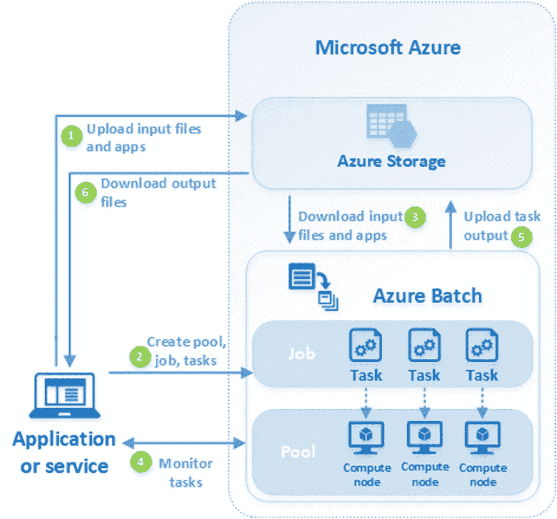

1.  文件和应用程序被上传到 Azure 存储帐户。文件数据可以是应用程序使用的任何类型，如视频、文档或图像文件。应用程序可以处理您的数据。
2.  在您的批处理帐户和作业中创建计算节点的批处理池来运行任务。这里，虚拟机是指执行任务的计算节点。当我们向作业添加任务时，该任务被设置为由计算节点执行。
3.  在任务执行之前，应用程序安装在节点上，如果还没有安装的话。此外，输入数据也被下载。从存储帐户下载完成后，任务将在分配的节点上执行。
4.  当任务运行时，您可以查询和监视它们。
5.  一旦任务完成，输出数据就会上传到 Azure storage。
6.  接下来，您可以下载处理过的数据。

**使用 Azure 批处理服务运行您的第一个批处理作业**

现在，让我们看看如何使用 Azure Batch Service 创建您的第一个批处理作业。

1.  打开您的 Azure 云门户并创建新的资源组。
2.  在门户首页搜索**批量账户**，点击**创建批量账户。**
3.  选择**资源组**并输入**批处理帐户名。**帐户名必须唯一。

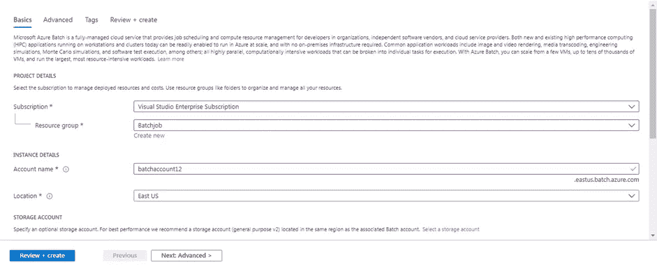

4.选择存储帐户。如果您已经有一个存储帐户，则可以选择创建一个新帐户。

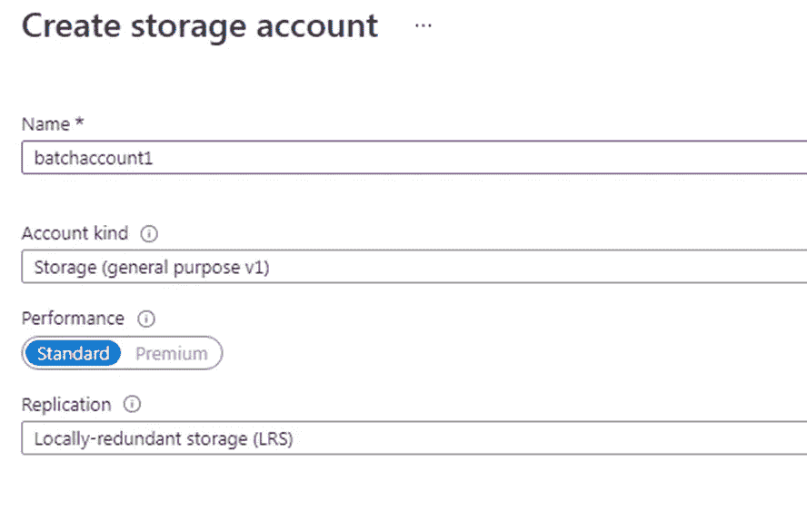

5.点击**审查+创建**，然后点击**创建。**您的批量账户将被创建。

**创建一个计算节点池**

我们已经创建了一个**批处理帐户**，现在我们将创建一个节点池，其中包含两个运行 Azure Marketplace 的 windows 服务器的节点。

1.  转到您的批处理帐户，选择**池**，然后在**添加上创建。**

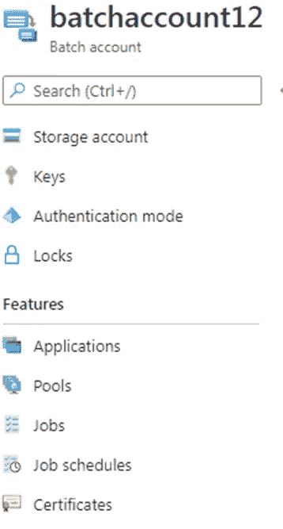

2.输入一个池 ID，它基本上类似于您的池的名称。并输入显示名称。

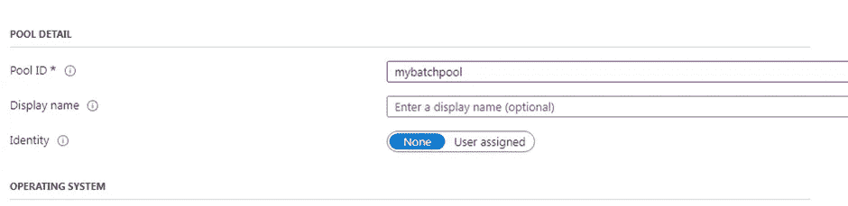

3.向下滚动，在**操作系统**部分，输入以下详细信息。

图像类型:市场

发布者:microsoftwindowsserver

报价:windowsserver

SKU:2019-数据中心-核心-小型磁盘

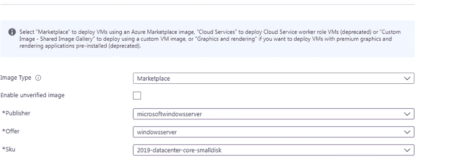

4.再次向下滚动到**节点大小**并输入以下详细信息。

节点定价层:标准 _A1_v2

目标专用节点:2

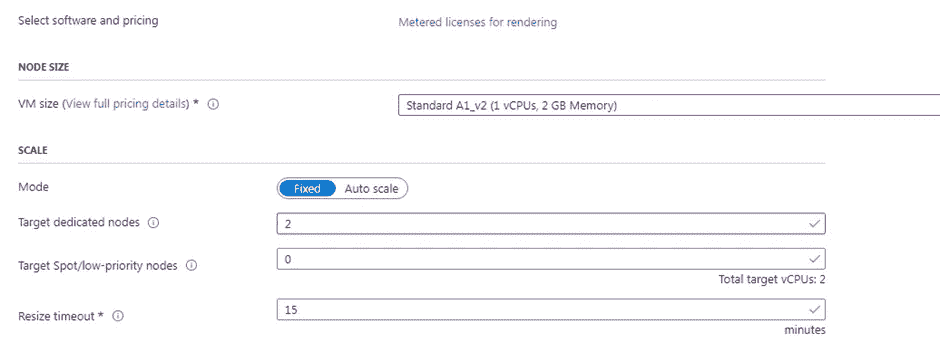

5.将作业列表保留为默认，点击**确定**创建池。将立即创建池，但在计算节点分配方面需要一些时间。同时，我们可以创建**作业**和**任务。**

**创建工作**

批处理作业就像多个任务的逻辑组。由于我们有一个池，现在让我们为它创建一个作业。

1.  转到您的**批处理帐户**，点击**工作**，然后**添加。**

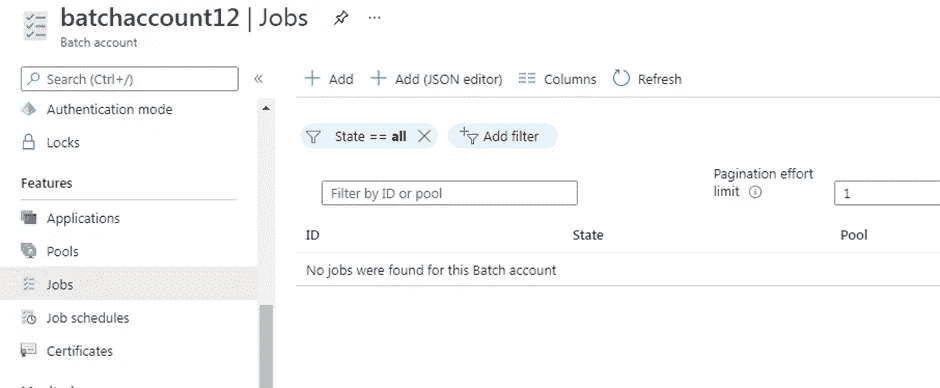

2.输入职务名称并选择您的人才库。将其他一切保留为默认，并点击**确定。**

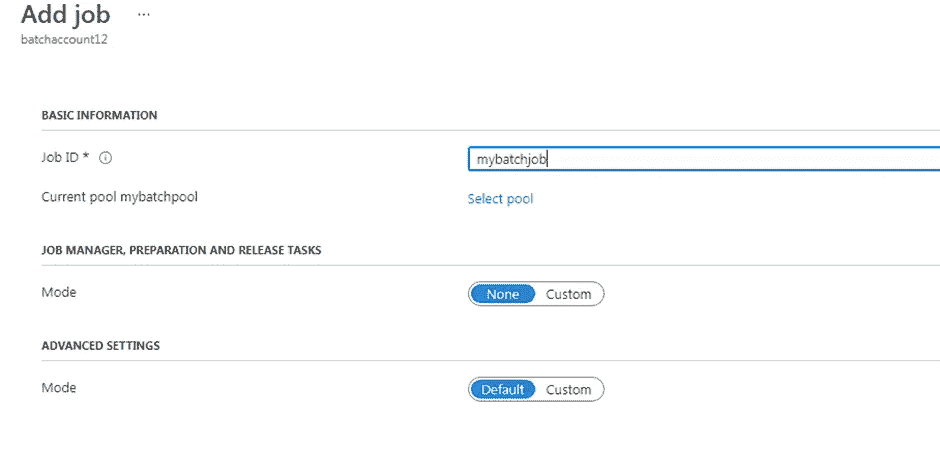

**创建任务**

在您的批处理帐户中，选择您的作业，在这里您将创建一个示例任务。通常，我们创建多个任务，但这里我们将创建两个相同的任务来运行命令行并显示批处理环境，然后等待 90 秒。

1.  选择**添加**并输入您的**任务 ID。**
2.  在命令行中输入—cmd/c“set AZ _ BATCH & time out/t 90 > NUL”

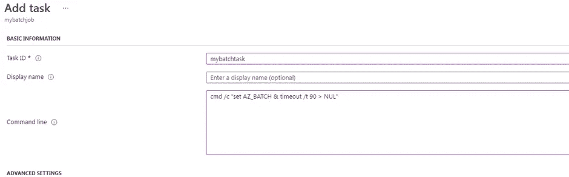

3.将其他内容保留为默认值，并点击**提交。**使用不同的任务 ID 和相同的命令行命令创建另一个任务。

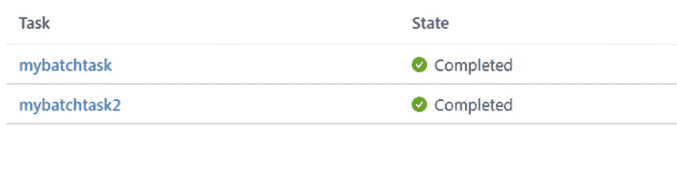

创建任务后，如果一个节点可用，那么一个任务将在其上运行，batch 将在另一个节点上启动第二个任务。要查看输出，选择一个任务，然后选择标准输出的 ***stdout.txt*** 文件。它将显示 Azure 批处理环境变量。

**结论**

当你有一个大的工作负载时，Azure Batch Service 是一个以更高的性能并行运行多个进程的好方法。在本教程中，我们看到了如何创建第一个批处理作业来显示节点的环境变量。