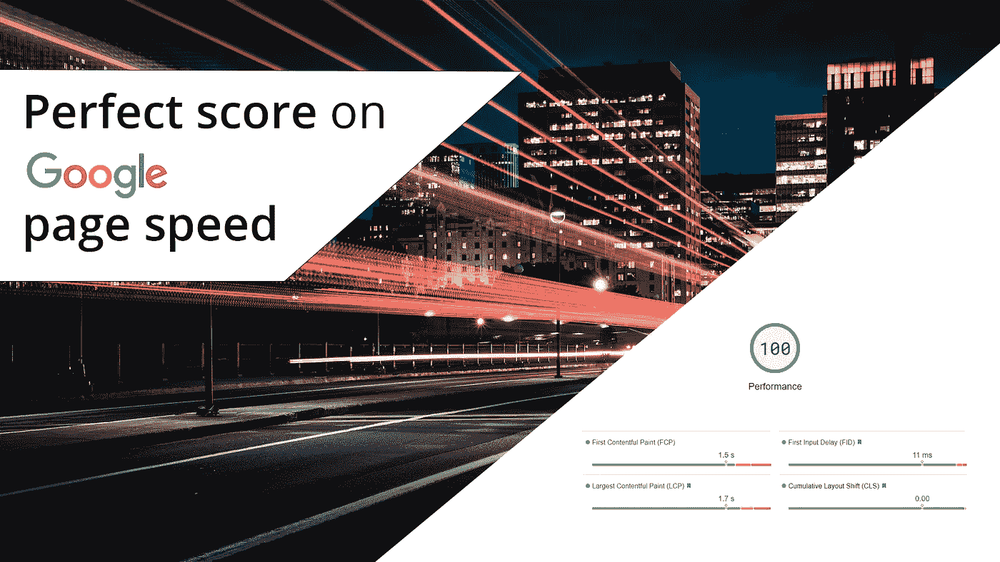
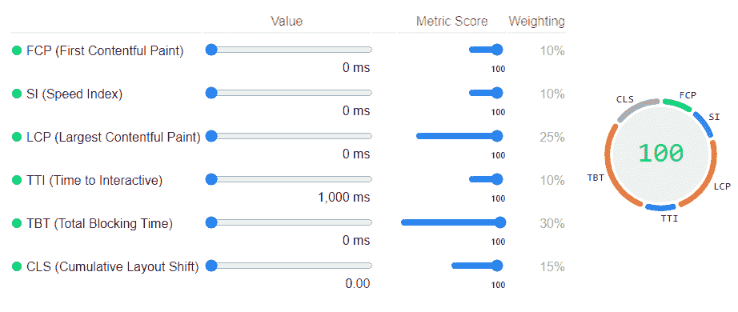
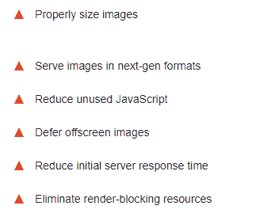
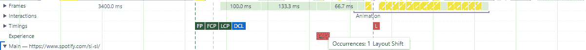

# 如何在谷歌页面速度上打 100 分！

> 原文：<https://blog.devgenius.io/how-to-score-100-points-on-google-page-speed-c0e28c34fdd0?source=collection_archive---------11----------------------->

谷歌页面速度满分

让我们来看看如何在**谷歌的页面速度上打出一个 **100** 或**接近那个**的分数。**

谷歌的页面速度分数对网站的排名和表现至关重要。所有这一切的关键是性能，我们希望我们的页面表现良好并能转化。我们通过一款出色且快速的产品做到了这一点——用户希望快速轻松地完成**工作**，他们不会等你，他们会继续前进。

**谷歌的页面速度**被分成几个**指标**在最终得分上有不同的权重。

谷歌的页面速度指标

有些人会说，即使是最大的品牌也不会得到完美的 100 分或接近完美的 100 分——但有一点是，他们不必这样做，他们已经处于其品牌发挥影响力的阶段。

我对亚马逊、spotify 和纽约时报的页面做了一些测试，它们都出现了一些问题和它们肯定可以改进的地方。

谷歌页面速度常见问题

让我们先来看看这些指标的含义，然后再来看看如何解决通常会出现的具体问题，以及页面应该遵循哪些基本准则来获得高分。

**不喜欢看书？在这里看这篇文章:**[【https://youtu.be/zPoDyvPUqbQ】T21](https://youtu.be/zPoDyvPUqbQ)

# **第一幅心满意足的画(FCP)**

这个度量表示从我们的 DOM 中呈现的第一部分内容。这可能会受到许多因素的影响，比如页面臃肿、重定向过多、请求过多以及服务器总体运行缓慢。

# **速度指数(SI)**

速度指数基本上意味着我们能以多快的速度向用户提供我们的内容。页面向用户显示第一个内容所需的时间越少，分数就越高。

# **最大含量油漆(LCP)**

最大的内容丰富的绘画意味着在用户的视口中呈现的最大元素，通常这将是一个大的图像，类似于滑块或类似的东西。我们需要确保这一要素得到快速供应。缓慢的服务器响应时间会对此指标产生巨大影响。

# **互动时间(TTI)**

这是一个度量标准，它定义了一个持续时间较长的任务完成后的时间，随后是 5 秒钟的网络和主线程不活动，这意味着页面已加载且“空闲”或“准备就绪”。

# **总阻塞时间(TBT)**

此指标显示第一次内容丰富的绘画和交互之间的时间。它通常会受到加载大量不必要的脚本、样式或嵌入的影响，这些基本上会中断页面加载流程。

# **累计布局偏移(CLS)**

它显示了页面上的任何元素由于后来加载并插入的其他元素或页面部分而移动了多少位置。这造成了不愉快的体验，被认为是一种不好的做法，因此在我们的页面速度评分中排名第三。

既然我们已经对这些指标有了一个基本的概念，以及哪些因素如何影响它们，让我们来看看谷歌页面速度的一些常见问题。

# **HTML——避免过大的 DOM 尺寸**

优化 html 大小和 DOM 深度。开发人员可能会在没有特殊原因的情况下过度复杂他们的 DOM 结构，这最终会导致巨大的 DOM 大小，这对于性能来说不是最佳的。

**如何改进的技巧:**
如果你的 DOM 仍然太大，考虑哪些元素是关键的，然后按需加载其余的元素。正如我们所知，我们需要向用户显示页面在折叠上方或在他们的视窗中的部分。如果用户还没有滚动到那个区域，我们不需要已经加载了 20 篇文章或产品。

# **减少未使用的 CSS**

要减少未使用 CSS 度量，做什么是很明显的。不要在页面上加载不必要的 CSS。

**例如:**如果你在一个电子商务网站的主页上，你不需要为你的购物车或购物清单添加 CSS。保持你的 CSS 作用于你的组件，并且只加载那些真正呈现的组件的 CSS。

**额外减小 css 大小的技巧:**
使用实用类，并用附加类处理某些 css 属性，如**。flex { display:flex；} .浮动-左{ float:left；}** 或者**。text-center { text-align:center；}** 所以我们只使用一次最冗余的属性。

# **减少未使用的 JavaScript**

答案与减少的未使用 CSS 度量相同。仅加载所呈现页面上实际需要的必要 javascript。

让我们看一下这个页面，就好像它是由不同的块或组件构建的一样。

**例子:**如果我在主页上只有一个滑块，只在主页上加载滑块的 javascript。

# **如何查看特定块以及如何处理 HTML、CSS 和 JavaScript 的通用指南**

看待网络时，要有一种基于块或组件的思维模式。尝试将每个块或组件捆绑成 3 个子块:
Html、css 和脚本。这 3 个元素对于该组件是必不可少的，对于页面上的其他任何东西都是如此。

当然，你需要有一些自我判断，以免陷入太深，开始在代码中制造冗余。找到排他性和可重用性的良好平衡。

# **消除渲染阻塞资源**

通常开发人员会将大部分的样式和脚本放在整个页面的头部，这导致了整个页面渲染过程的延迟。一般来说，除非由于某些特殊原因而另有说明，否则脚本应该包含在底部，从而让页面呈现流程快速流畅地进行。除非必要，否则不要包含太多字体。对于一些包含来说，可以利用异步的优势，或者将它们延迟到必要的时候。

# **缩小 CSS 和 JS**

正如我们所知，每个空间和字符都会占用内存空间，这会导致文件变大，这意味着需要更多的带宽来下载所有文件和渲染网站。缩小文件以压缩和保存文件大小。
scripts . js:scripts . min . js

# **缓存和 CDN**

缓存对于减轻我们服务器的负载并提升性能非常重要。经常使用但变化不大的元素可以很容易地被缓存并从缓存中提供，这肯定会给你更好的响应时间和更好的分数。

使用 CDN 来交付您的脚本、样式甚至图像可以极大地提高您的页面性能，因为这将减轻您的服务器的负载，并从本质上给予它更多的权力来分配给手头的任务。

# **优化图像**

网页图片应该在很多层面上进行优化。其中之一是格式——使用现代格式是一个难题。向支持该功能的客户提供 Webp 图像。

让我们来看一个例子，它展示了如何包含一个 webp 图像，如果有人的浏览器不支持 Webp，这个图像也将处理一个回退，它将得到一个 jpg 或 png。

既然我们已经注意到了格式，我们应该确保我们的图片大小适合需要并被压缩。Jpeg 质量水平或压缩不需要 100%的网页，大约 75%应该足够了。如果它在页面上占据的空间是 600 像素宽，那么图像应该调整到同样的宽度。如果不确定调整图像大小后的压缩，使用图像优化器来处理。我的首选是:[https://compressor.io/](https://compressor.io/)

插入图像时，应设置一些参数。始终包括宽度和高度参数，这将告诉浏览器渲染图像将占用多少空间，这将在页面 CLS 评分中发挥重要作用。拥有合适的内容大小至关重要！不要忘记不同尺寸的图像对于不同的屏幕尺寸，移动不需要与桌面上相同尺寸的图像，用媒体查询 src 集解决它。

还包括 **loading="lazy"** 参数，通过浏览器自动延迟加载图像。除了折叠上方最大的图像，可能是你的 LCP，应该加载 **loading="eager"** 属性。

# **其他如何处理图像的例子:**

我们也可以暂时使用一个占位符图像，而不是加载所有的图像。当我们有一个包含许多重复元素的页面时，比如产品盒子或新闻文章，这就派上了用场。

我们必须注意，1 个占位符图像对使用它的所有元素都有 1 个请求，所以它只是一次网络负担。有不同的技术允许我们在需要的时候处理实际的图像。

****

使用 javascript，我们可以检测元素何时在 viewport 中，并用 **data-src 中的链接替换 **src** 中的图像链接。**

# **优化 iframe**

Iframes 通常是内容过多的臃肿网站。iframe 的一个常见用途是 youtube 视频嵌入。开发人员面临着两个问题，即响应速度和膨胀——像这样的 iframes 带有大量的 includes，占用大量的带宽和网络，这会导致页面膨胀，速度变慢。

包含这两个问题的解决方案的示例解决方案:
使用具有视频 url 的数据属性的包装器元素。

这将使 iframe 根据包装元素的大小进行调整，并使用 height:0 和 padding 来保持元素的纵横比在不同的屏幕大小之间保持一致。

当元素进入 viewport 时，我们使用与之前处理图像相同的方法，从 data-video 属性中获取 url，构建一个 iframe 并将其附加到该元素中。

额外提示:您还可以放置一个占位符图像，并在单击图像时构建、附加和播放 iframe 视频。

# **如何检测和修复 CLS 问题**

累积布局偏移或 CLS 是一个常见的问题，一些开发人员很难发现它们。请注意，有可能在您的页面速度测试中检测不到任何 CLS，但它仍然会出现在页面本身上，CLS 在整个生命周期中都经过测试，将从实际用户及其体验中收集数据来确定您的页面速度分数。

chrome 浏览器本身就有一个很棒的工具。如果我们打开控制台，您会发现一个“performance”选项卡，我们可以在其中对我们的页面负载流进行真正深入的分析，并确定问题:

如果我们知道一些内容将占用多少空间，并且我们提前预留了空间，那么布局移动是最好的解决方法，这样其他元素就不会被移动而导致 UI 跳转。

# **网站网络优化**

检查您的请求，评估哪些资源是必需的，哪些可以减少、删除并在以后需要时提供。

如果你遵循这些原则，你应该在页面速度上排名靠前。

如果你喜欢的内容，请关注。如果你想了解更多关于这个话题或任何其他方面的信息，请写下你的评论。

**查看我的视频:** ****谢谢，再见！****