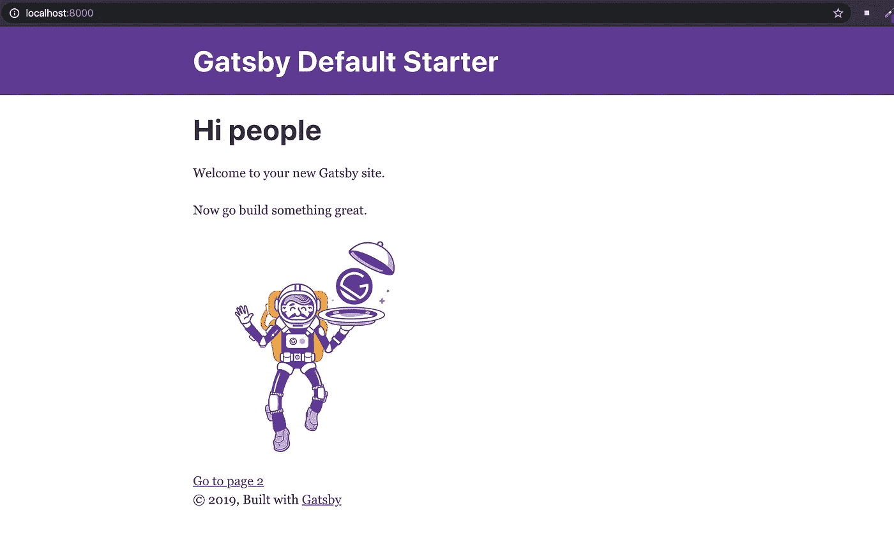
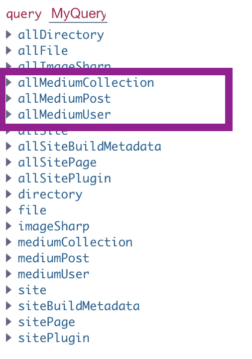
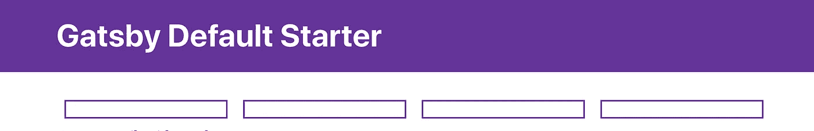

# 如何用 gatsby.js 废掉你的中型文章

> 原文：<https://blog.devgenius.io/how-to-scrap-your-medium-articles-with-gatsby-js-f35535ebc09d?source=collection_archive---------8----------------------->

你想在另一个网站上展示你的媒体文章吗？让我们把它们废弃，在一个 gatsby.js 网站上展示。

我最近开始做我的专业网站。我职业活动的一部分是写文章。我的文章大部分都是媒体上的。我希望他们留在媒体上，但我也想在我的网站上展示他们中的一些。事实证明，这很容易做到。所以，让我们开始吧:


照片由[帕特里克·福尔](https://unsplash.com/@patrickian4?utm_source=unsplash&utm_medium=referral&utm_content=creditCopyText)在 [Unsplash](https://unsplash.com/s/photos/medium-writing?utm_source=unsplash&utm_medium=referral&utm_content=creditCopyText) 拍摄

# 第一步:创建一个 Gatsby.js 启动器，并将其推送到 GitHub 上

如果您已经有了登录页面，您可以直接进入步骤 2。

和以前一样，我们将从创建一个 Gatsby.js 启动器开始。如果你还没有建立你的开发环境，你可以按照[这个步骤](https://www.gatsbyjs.org/tutorial/part-zero/)。



盖茨比启动器

一旦您完成了这些，我们将创建一个新的 gatsby 站点，并使用以下命令进行第一次运行。

```
gatsby new gatsby-site
gatsby develop
```

一旦你到了这里，你就可以打开浏览器，进入 [http://localhost:8000/](http://localhost:8000/) 查看你的网站运行情况。

# 步骤 2:安装插件

我们将使用 [gatsby-source-medium](https://github.com/jondubin/gatsby-source-rss) 插件。这不是一个官方插件，所以我们无法从 Medium 中获取所有数据:

> 用于将数据从非官方的 JSON 端点拉入 Gatsby 的源代码插件。不幸的是，JSON 端点不提供完整的故事，而只是预览。由于 Medium 的限制，只返回最近的 10 篇文章。
> 
> 来自 [gatsby-source-medium 插件文档](https://github.com/jondubin/gatsby-source-rss)

让我们从安装插件开始:

```
npm install --save gatsby-source-medium
```

并对其进行配置:

```
plugins: [
  {
    resolve: 'gatsby-source-medium',
    options: {
      username: '@mariequittelier', // Medium user name
    },
  },
]
```



现在，在您的 GraphiQL([http://localhost:](http://localhost:8000/___graphql)8000/_ _ grapql)中，您将能够查询来自 medium 的数据。API 的所有文档都在[这里](https://github.com/Medium/medium-api-docs)。

您的查询将取决于您想要什么。但是，请记住，数据是与用户相关的。**但是，你能得到什么样的数据呢？**

*   allMediumCollection:您可以获取链接到用户出版物的数据。
*   allMediumPost:那将是与用户文章相关的数据。
*   allMediumUser:许多关于用户自己的东西。

请随意使用 GraphiQl 来检查您可以提取哪些数据！

# 步骤 3:查询并创建前端

现在数据可用了，您可以调用它，然后显示它。但是让我们从调用我们的数据开始:

现在，让我们创建前端侧。为此，我们将使用样式组件。所以让我们安装它:

```
npm install --save gatsby-plugin-styled-components styled-components babel-plugin-styled-components
```

并配置插件:

```
//gatsby-config.jsmodule.exports = {
  plugins: [`gatsby-plugin-styled-components`],
}
```

我们要做的第一件事是映射我们查询的数据。目标是为每篇文章呈现一个组件:

您会注意到，每篇文章都有一个组件:



每件物品一个组件

现在，让我们添加所有我们想要的信息，并做一些造型，在这里我们祝贺你🎊 🎈 🍾。造型总是可以改进的，但至少你有一些基本的东西让你开始:


你文章的最终呈现

有两件事值得注意:链接和图片。

*   先说你文章的链接。所有中型物品均可在[https://medium.com/@AUTHOR_USERNAME/THE](https://medium.com/@YOUR_USERNAME/THE)_ ARTICLE _ SLUG 到达。你的文章是否在出版物上发表并不重要。通过此链接，您将被重定向到您的文章。
*   现在，图像。像所有大型网站一样，medium 使用 CDN 来存储媒体内容。使用检查员允许我找到它的地址【https://cdn-images-1.medium.com /YOUR _ IMAGE _ ID。

[](https://medium.com/pixboost/cdn-explained-why-when-and-how-to-use-it-for-your-website-7d360a93cc04) [## CDN 解释道。为什么，什么时候以及如何在你的网站上使用它

### CDN 代表内容交付网络。这是什么？我们真的需要它吗？先说说这种类型的重要性…

medium.com](https://medium.com/pixboost/cdn-explained-why-when-and-how-to-use-it-for-your-website-7d360a93cc04) [](https://github.com/Medium/medium-api-docs) [## 中等/中等-api-docs

### 这个存储库包含媒体 API 的文档。Medium 的 API 是基于 JSON 的 OAuth2 API。所有请求都是…

github.com](https://github.com/Medium/medium-api-docs) [](https://github.com/gatsbyjs/gatsby/tree/master/packages/gatsby-source-medium) [## 盖茨比/盖茨比

### 用于将数据从非官方的 JSON 端点拉入 Gatsby 的源代码插件。不幸的是，JSON 端点…

github.com](https://github.com/gatsbyjs/gatsby/tree/master/packages/gatsby-source-medium) 

👏如果你喜欢这篇文章，请随时给我一个掌声(或 50 个)或留下评论。

👍如果你喜欢我的作品，你可以一直跟着我。

📚还有，如果你想了解更多，可以看看那些文章:

[](https://medium.com/@mariequittelier/jamstack-how-to-do-a-contact-form-step-by-step-with-gatsby-js-netlify-and-mailgun-52d26432a5c4) [## 如何用 Gatsby.js，Netlify，Mailgun 一步步做一个联系表单

### 在这篇文章中，我将一步一步地向你展示如何用 Gatsby.js，Netlify 函数一步一步地做一个联系人表单…

medium.com](https://medium.com/@mariequittelier/jamstack-how-to-do-a-contact-form-step-by-step-with-gatsby-js-netlify-and-mailgun-52d26432a5c4) [](https://medium.com/@mariequittelier/how-to-connect-your-gatsby-js-landing-page-to-google-analytics-and-deploy-to-netlify-step-by-step-8352467583df) [## 如何将您的 Gatsby.js 登录页面连接到 Google Analytics 并逐步部署到 Netlify

### 使用谷歌分析很重要，因为它可以让你跟踪你的网站的使用情况。让我们来学习如何使用…进行设置

medium.com](https://medium.com/@mariequittelier/how-to-connect-your-gatsby-js-landing-page-to-google-analytics-and-deploy-to-netlify-step-by-step-8352467583df) [](https://medium.com/@mariequittelier/how-to-create-a-newsletter-with-mailchimp-gatsby-js-netlify-d48778d5c774) [## 如何用 Mailchimp，Gatsby.js & Netlify 创建时事通讯

### 在填写了联系表格并连接了 Google Analytics 之后，我想继续我的系列文章，讲述如何…

medium.com](https://medium.com/@mariequittelier/how-to-create-a-newsletter-with-mailchimp-gatsby-js-netlify-d48778d5c774)