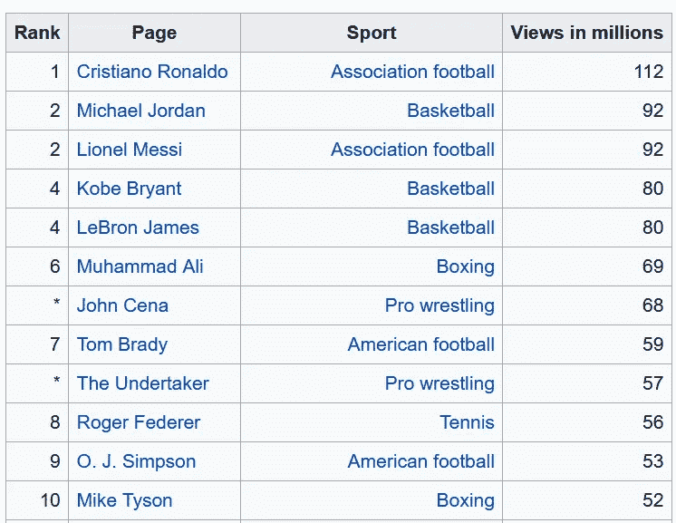
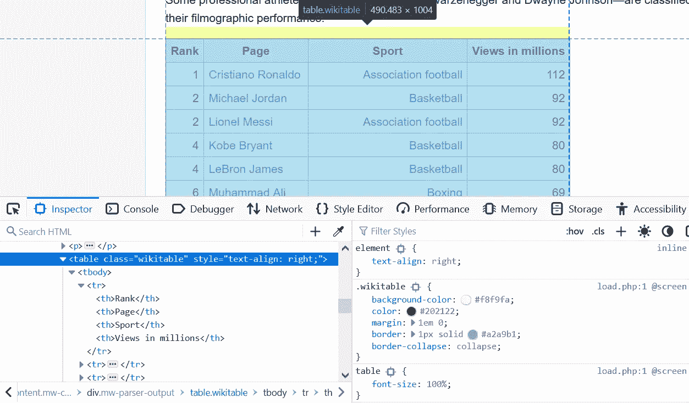
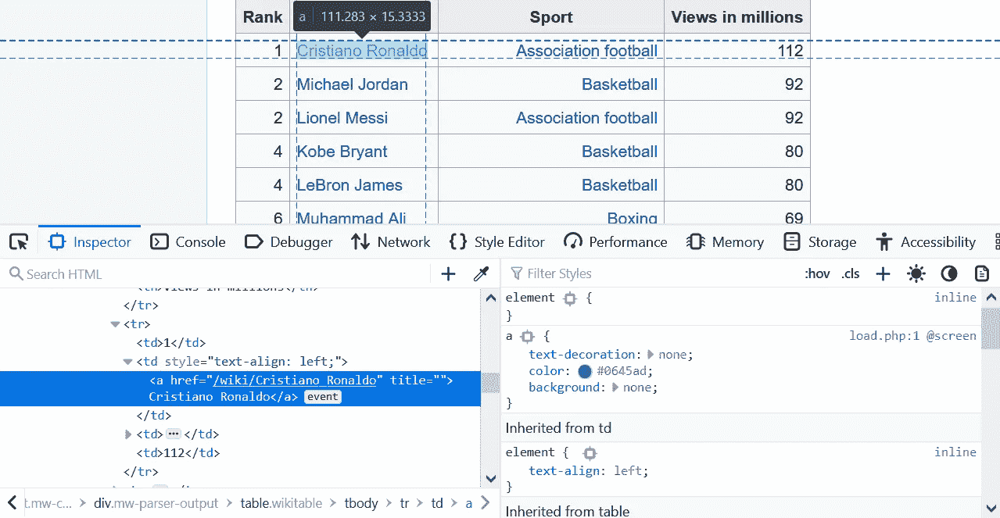
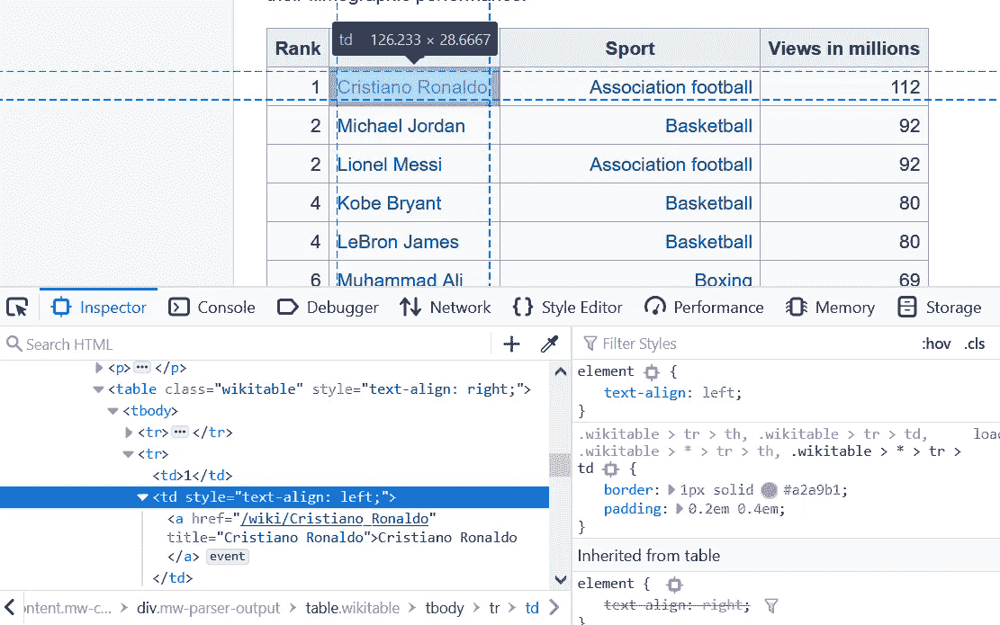
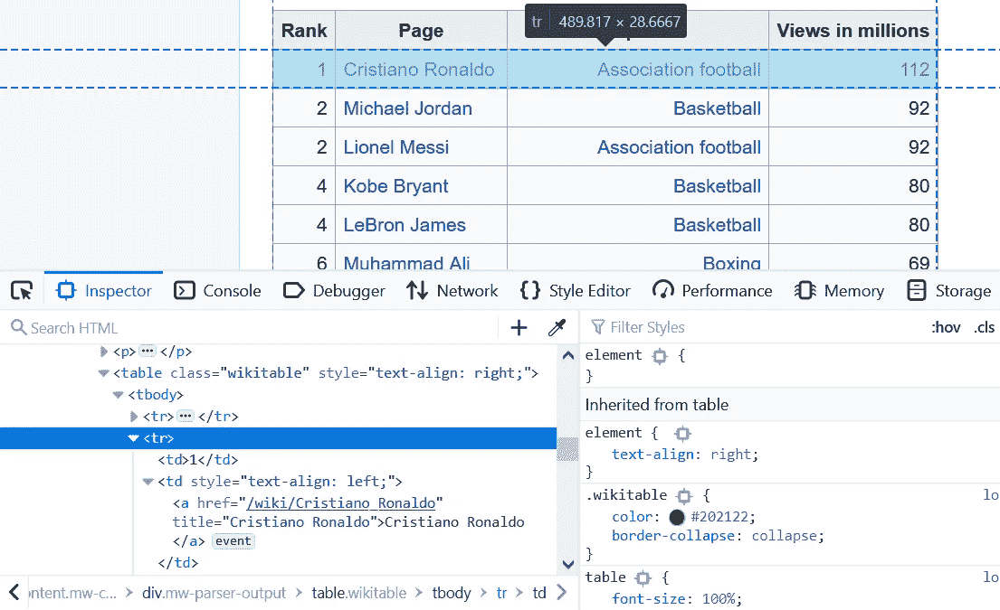
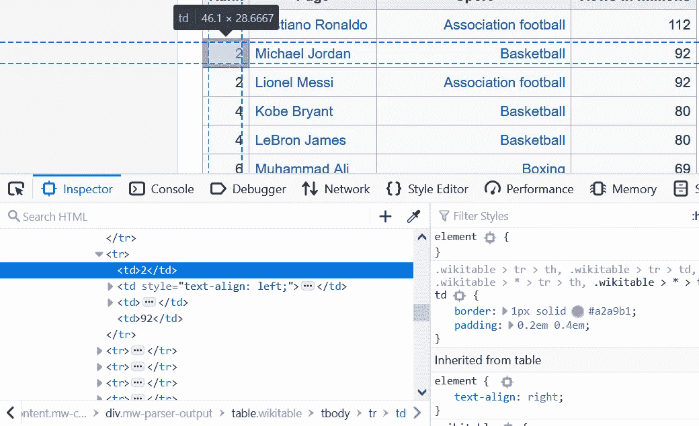
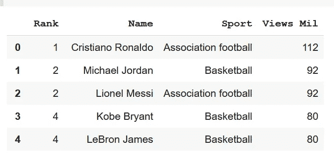

# 如何为你的 ML 项目刮一个网站

> 原文：<https://blog.devgenius.io/how-to-scrape-a-website-for-your-ml-project-c3a4d6f160c7?source=collection_archive---------4----------------------->


潘卡杰·帕特尔在 [Unsplash](https://unsplash.com?utm_source=medium&utm_medium=referral) 上的照片

不久前，我在 LearnML subreddit 上看了一个帖子。OP 需要它来为他的 ML 项目收集网页数据。

跟帖的人给出了很好的答案。主要是学习如何使用美素和硒。

但是 OP 可能不知道如何与他的 ML 项目联系起来。如果他对那些图书馆没有经验。

我已经在我的一些[数据](https://www.tobiolabode.com/blog/2020/4/21/bookstores-vs-income-data-science-project-part-1) [科学](https://www.tobiolabode.com/blog/2020/4/26/bookstore-vs-income-part-2)项目中使用了美丽素和硒。虽然不是最高级的任务，但它完成了工作。

在这篇博文中，我将向你展示如何抓取一个包含有用数据的网页，并将其转换成熊猫数据帧。

我们想把它转换成数据帧的原因。大多数 ML 库都可以处理 pandas 数据框，并且可以针对您的模型进行编辑，只需进行最小的更改。

首先，我们要在维基百科上找到一个表格，将其转换成数据帧。

在这里，我要刮出一张维基百科上点击率最高的运动员的表格。



首先，大量的工作将是导航 HTML 树以得到我们想要的表。



我们将在请求和 regex 库的帮助下使用 BeautifulSoup。

```
from bs4 import BeautifulSoupimport requestsimport reimport pandas as pd
```

这里我们从网页中提取 HTML 代码:

```
website_url = requests.get('https://en.wikipedia.org/wiki/Wikipedia:Multiyear_ranking_of_most_viewed_pages').textsoup = BeautifulSoup(website_url, 'lxml')print(soup.prettify())</a></li><li id="footer-places-disclaimer"><a href="/wiki/Wikipedia:General_disclaimer" title="Wikipedia:General disclaimer">Disclaimers</a></li><li id="footer-places-contact"><a href="//en.wikipedia.org/wiki/Wikipedia:Contact_us">Contact Wikipedia</a></li><li id="footer-places-mobileview"><a class="noprint stopMobileRedirectTog
```

我们希望从语料库中收集所有的表格。所以我们有一个更小的搜索范围。

```
wiki_tables = soup.find_all('table', class_='wikitable')wiki_tables
```

由于有大量的表格，我们需要一种方法来过滤它们。

我们知道，克里斯蒂亚诺罗纳尔多有一个锚标记，这可能是一些牌桌所独有的。



我们可以过滤那些带有文本 Cristiano Ronaldo 的锚标记的表。同时找到一些包含锚标记的父元素。

```
links = []for table in wiki_tables:_table = table.find('a', string=re.compile('Cristiano Ronaldo'))if not _table:continueprint(_table)_parent = _table.parentprint(_parent)links.append(_parent)<a href="/wiki/Cristiano_Ronaldo" title="Cristiano Ronaldo">Cristiano Ronaldo</a><td style="text-align: left;"><a href="/wiki/Cristiano_Ronaldo" title="Cristiano Ronaldo">Cristiano Ronaldo</a></td><a href="/wiki/Cristiano_Ronaldo" title="Cristiano Ronaldo">Cristiano Ronaldo</a><td style="text-align: left;"><a href="/wiki/Cristiano_Ronaldo" title="Cristiano Ronaldo">Cristiano Ronaldo</a></td><a href="/wiki/Cristiano_Ronaldo" title="Cristiano Ronaldo">Cristiano Ronaldo</a><td style="text-align: left;"><a href="/wiki/Cristiano_Ronaldo" title="Cristiano Ronaldo">Cristiano Ronaldo</a></td>
```

家长只给我们看细胞。我们需要爬到树上更高的地方。

这是一个带有浏览器 web 开发工具的单元格。



```
parent_lst = []for anchor in links: _ = anchor.find_parents('tbody') print(_) parent_lst.append(_)
```

通过使用 tbody，我们能够返回包含前面的锚标记的其他表。

要过滤更多内容，我们可以搜索这些表格的各种标题:

```
for i in parent_lst: print(i[0].find('tr'))tr><th>Rank*</th><th>Page</th><th>Views in millions</th></tr><tr><th>Rank</th><th>Page</th><th>Views in millions</th></tr><tr><th>Rank</th><th>Page</th><th>Sport</th><th>Views in millions</th></tr>
```

第三张看起来像我们想要的桌子。

现在我们开始创建提取和清理我们想要的细节所需的逻辑。

分解一下:

```
sports_table = parent_lst[2]complete_row = []
```

这里我们从前面的列表中选择第三个元素。因为这是我们想要的桌子。

然后我们创建一个空列表来存储每一行的详细信息。当我们遍历表格时。

我们创建一个循环来迭代表中的每一行，并将它们保存到 rows 变量中。

```
for i in sports_table: rows = i.find_all('tr') print('\n--------row--------\n') print(rows)
```



```
for row in rows: cells = row.find_all('td') print('\n-------cells--------\n') print(cells)
```

我们创建一个嵌套循环。遍历上次循环保存的每一行。当遍历单元格时，我们将单个单元格保存在一个新的变量中。



```
if not cells: continue
```

这段简短的代码让我们可以避免空单元格，并防止从单元格中提取文本时出错。

```
rank = cells[0].text.strip('\n')page_name = cells[1].find('a').textsport = cells[2].find('a').textviews = cells[3].text.strip('\n')
```

这里，我们将各种单元格整理成纯文本形式。清理后的值以列名保存在变量中。

```
print('\n-------CLEAN--------\n')print(rank)print(page_name)print(sport)print(views)complete_row.append([rank, page_name, sport, views])
```

这里我们将值添加到行列表中。并打印清除的值。

```
-------cells--------[<td>13</td>, <td style="text-align: left;"><a href="/wiki/Conor_McGregor" title="Conor McGregor">Conor McGregor</a></td>, <td><a href="/wiki/Mixed_martial_arts" title="Mixed martial arts">Mixed martial arts</a></td>, <td>43</td>]-------CLEAN--------13Conor McGregorMixed martial arts43
```

现在我们把它转换成数据帧:

```
headers = ['Rank', 'Name', 'Sport', 'Views Mil']df = pd.DataFrame(complete_row, columns=headers)df
```



现在我们有了一个熊猫数据框架，你可以用于你的 ML 项目。你可以使用你最喜欢的库来拟合数据模型。

—

*如果你觉得这篇文章有趣，* [*那就看看我的邮件列表吧。*](https://www.tobiolabode.com/subscribe) *我哪里写得下这么多东西*