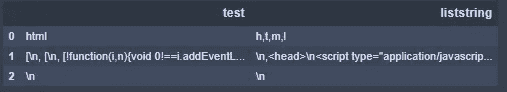

# 如何刮 LinkedIn

> 原文：<https://blog.devgenius.io/how-to-scrape-linkedin-9f3233c6474b?source=collection_archive---------10----------------------->


想要获得一些较大的科技网站变得相当困难，比如 LinkedIn。可能是因为大量的个人信息受到威胁。但我是来搞砸他们努力阻止的一切的。另外，声明一下，这只是为了教育目的。

# 设置步骤

*   图书馆
*   汤类物品
*   CSRF 代币
*   登录请求和 HTML
*   可能会添加更多页面
*   抓取每列的元数据
*   创建列并将其追加到数据帧

# 库和汤对象

这部分有点棘手。首先导入库，然后创建请求会话，然后我只是添加了一些链接变量到不同的 linkedin 页面，然后我创建了 soup 变量，这是有点模糊的地方。您必须使用`csrf`行通过令牌，linkedin 对每个请求都需要这个令牌。然后将它传递到登录请求中。记住，这用的是你的 linkedin！我不知道什么参数或规则最终会让你被封锁，但使用你自己的风险。虽然我从来没有任何问题。

**温馨提示:**

*   如果你卡住了，刷新笔记本就行了(jupyter 有时会被挂掉)。
*   该项目使用一个 url，其中包含查询“有抱负的数据科学家”。
*   如果你害怕，就使用虚拟账户 linkedin Creds。

```
import requests
from bs4 import BeautifulSoup#create a session
client = requests.Session()#create an email and password variable
your_email_here = "some_email"
your_password = "your_password"#create url page variables
HOMEPAGE_URL = ‘[https://www.linkedin.com'](https://www.linkedin.com')
LOGIN_URL = ‘[https://www.linkedin.com/uas/login-submit'](https://www.linkedin.com/uas/login-submit')
CONNECTIONS_URL = ‘[https://www.linkedin.com/mynetwork/invite-connect/connections/'](https://www.linkedin.com/mynetwork/invite-connect/connections/')
ASPIRING_DATA_SCIENTIEST = ‘[https://www.linkedin.com/search/results/people/?keywords=Aspiring%20Data%20Scientist&origin=GLOBAL_SEARCH_HEADER'](https://www.linkedin.com/search/results/people/?keywords=Aspiring%20Data%20Scientist&origin=GLOBAL_SEARCH_HEADER')#get url, soup object and csrf token value
html = client.get(HOMEPAGE_URL).content
soup = BeautifulSoup(html, “html.parser”)
csrf = soup.find(‘input’, dict(name=’loginCsrfParam’))[‘value’]#create login parameters
login_information = {
 ‘session_key’: your_email,
 ‘session_password’: your_password,
 ‘loginCsrfParam’: csrf,
}
```

**结果**:


# 用 Soup 对象创建一个列表

由于 Linkedin(我认为——不要引用我的话)使用 javascript 注入的方式存储数据，`beautifulsoup`就没那么有用了。因此，我抓取了元数据。在我看来，从数据帧中抓取数据要比抓取原始文本容易得多。因此，我将所有内容放在一个列表中，将该列表放在一个数据帧中，然后使用`map`创建一个字符串列。

```
#create dataframe with soup contents
import pandas as pdsoup = list(soup)
soupdf = pd.DataFrame()
df['test'] = soup#Create string column of soup contents 
df['liststring'] = [','.join(map(str, l)) for l in df['test']]df
```

**结果:**



这是一个好看的数据框！

# 解析出有趣的数据

这个项目一直在进行中。抓取文本以解析出实际数据的片段并不光彩。在 regex 中，可能有一种更快的方法来完成这些工作——我一找到工作代码就退出了这一步。

```
#parse out all the text except the interesting stuff
df1 = pd.DataFrame(df.liststring.str.split('{').tolist()).stack().reset_index()
df1.columns = ['level_0','level_1','test']df1 = df1[df1['test'].str.contains("textDirection")]
df1 = df1[df1['test'].str.contains('type":"com.linkedin.voyager.common.TextViewModel"},"type":"PROFILE')]
df1
```

**结果:**


越来越近了！

# 让我们做一些真正的专栏，好吗？

这段代码片段在我们的数据框架中创建了两列:`name`和`shared_connections`，其中包含登录的帐户。

```
pd.set_option('display.max_rows', 500)
pd.set_option('display.max_columns', 500)
pd.set_option('display.width', 1000)
pd.set_option('display.max_colwidth', None)df1 = df1.replace('"textDirection":"USER_LOCALE","text":"', '', regex=True)
df1 = df1.replace(' shared connections","snippetText":', '', regex=True)
df1 = df1.replace('type":"com.linkedin.voyager.search.SearchHitV2","headless":false,"socialProofText":"', '', regex=True)
df1 = df1.replace('","', '', regex=True)
df1 = df1.replace(' shared connectionsnippetText":', '', regex=True)
df1 = df1.replace('type":"com.linkedin.voyager.common.TextViewModel"},"type":"PROFILE', '', regex=True)
df1 = df1.replace('$$1', '', regex=True)
df1 = df1.replace('$$2', '', regex=True)
df1 = df1.replace('$$3', '', regex=True)
df1 = df1.replace('$$4', '', regex=True)
df1 = df1.replace('$$5', '', regex=True)
df1 = df1.replace('$$6', '', regex=True)
df1 = df1.replace('$$7', '', regex=True)
df1 = df1.replace('$$8', '', regex=True)
df1 = df1.replace('$$9', '', regex=True)#drop columns
df1.drop(['level_0'
         ,'level_1']
        ,axis = 1, inplace = True)#Create shared connections column
df1['shared_connections'] = df1['test'].str[-1:]#remove last 3 characters
df1['name'] = df1['test'].str[:-3]#drop test col
df1 = df1.drop(['test'], axis = 1)#rename columns
df1 = df1[['name', 'shared_connections']]df1
```

**结果:**


现在你说话了

# 另一个专栏，关于我的

这段代码创建了一个新的`dataframe`，它有一个名为`test`的列，因为我是最初的那个；这一列是用户的头衔——例如，我的头衔是“数据工程顾问”。

```
df2 = pd.DataFrame(df.liststring.str.split('{').tolist()).stack().reset_index()
df2.columns = ['level_0','level_1','test']df2 = df2[df2['test'].str.contains('"textDirection":"USER_LOCALE","text"')]
df2 = df2[df2['test'].str.contains('"com.linkedin.voyager.common.TextViewModel"},"nameMatch":false,"subline":')]df2 = df2.replace('"textDirection":"USER_LOCALE","text":"', '', regex=True)
df2 = df2.replace('"nameMatch":false,"subline":', '', regex=True)
df2 = df2.replace('com.linkedin.voyager.common.TextViewModel', '', regex=True)
df2['test'] = df2['test'].str[:-11]
df2 = df2.replace('","', '', regex=True)#drop columns
df2.drop(['level_0'
         ,'level_1']
        ,axis = 1, inplace = True)df2
```

**结果:**


亲密兄弟

# 诶诶合并—诶诶不(这是一个朋友位)

让我们快速合并最后两个数据帧。

```
#add title column
title = list(df2.test)
df1['title'] = titledf1
```

**结果:**


不是。也是。寒酸。嘘..艾比(如果你收到这封信，我们应该成为朋友)

# 到处都是枪声！

我真的很喜欢这些帖子。让我们再添加一个名为`test`的栏目——你听到了，这一个将是位置——如果用户在他们的个人资料上提供该信息的话。

```
#filter out location
df3 = pd.DataFrame(df.liststring.str.split('{').tolist()).stack().reset_index()
df3.columns = ['level_0','level_1','test']df3 = df3[df3['test'].str.contains('"textDirection":"USER_LOCALE","text"')]
df3 = df3[df3['test'].str.contains('com.linkedin.voyager.common.TextViewModel"},"trackingId"')]df3 = df3.replace('"textDirection":"USER_LOCALE","text":"', '', regex=True)
df3 = df3.replace('com.linkedin.voyager.common.TextViewModel"}', '', regex=True)
df3 = df3.replace('"trackingId"', '', regex=True)
df3 = df3.replace('$type":"', '', regex=True)
df3 = df3.replace('type":"com.linkedin.voyager.search.BlendedSearchCluster"},', '', regex=True)
df3 = df3.replace('type":",:"G6x05qiqQfO29accDNG79w=="}],"type":"SEARCH_HITS","', '', regex=True)
df3 = df3.replace('$type":",:', '', regex=True)
df3['test'] = df3['test'].str[:-41]df3
```

**结果:**


德州奥斯汀，我看到你了

# 为了完善这段代码

让我们把最后的和原始的数据帧合并在一起，看看我们会得到什么。我们都很兴奋。

```
#create location column
location = list(df3.test)
df1['location'] = locationdf1
```

**结果:**


搞定儿子

# 综上

我们编写了一个脚本，让我们登录 linkedin，抓取特定搜索的第一页，解析出姓名、shared_connections、头衔和位置，并将所有这些数据放入 pandas dataframe。

如果你觉得这很有帮助，请随意订阅或点击按钮！

**来源:**[https://github.com/maxwellbade/linkedin_scraper](https://github.com/maxwellbade/linkedin_scraper)

[](https://www.buymeacoffee.com/31yearoldmoron)