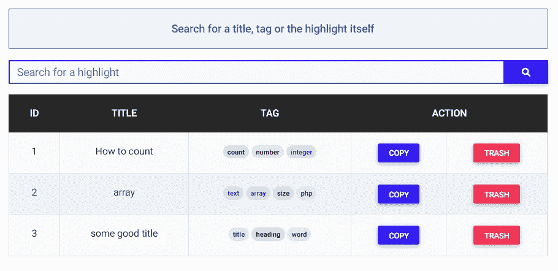
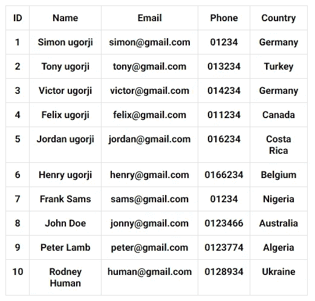
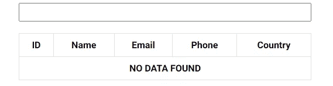
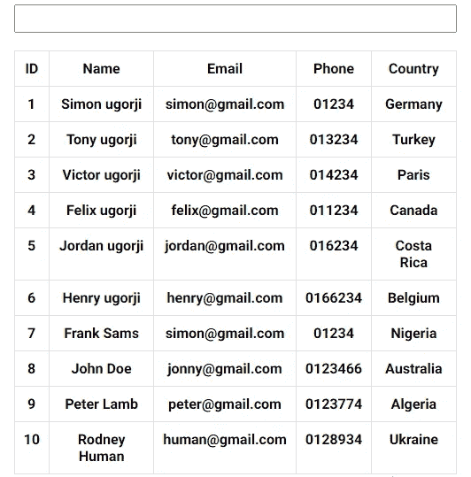
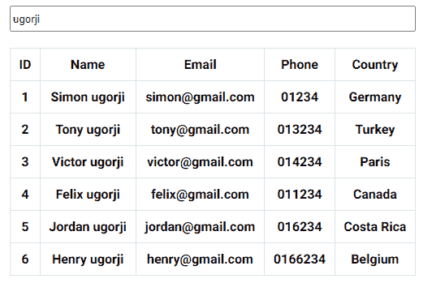
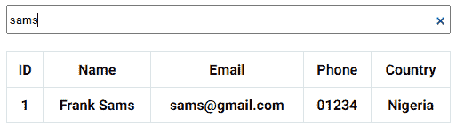
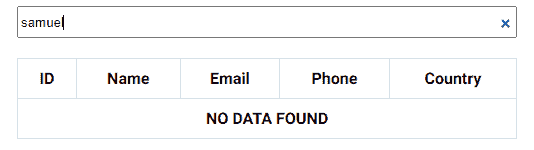
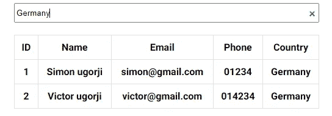
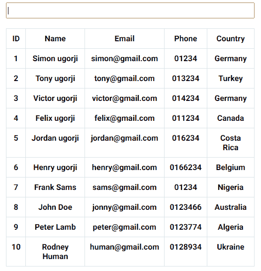

# 如何用 JavaScript 在表格中搜索

> 原文：<https://blog.devgenius.io/how-to-search-through-a-table-with-javascript-b8cbe5ec9757?source=collection_archive---------2----------------------->

在我今天的文章中，我将向您展示如何使用 JavaScript 中的搜索表单来搜索一个表。

假设您有一个列出所有员工联系信息的水平表，并且您需要构建一个搜索表单来搜索该表以找到某个特定的员工，您将如何进行呢？

出于演示的目的，这是我的桌子。

现在你可能有一个比上图更大的表，我们的解决方案仍然可以很好地工作。

# 我们开始吧

为了构建我们的搜索算法，我们需要首先定义要搜索的列。

对于本教程，我决定让算法搜索姓名、电子邮件、电话和国家/地区列中的搜索文本。

为了简洁起见，这里是 HTML 和 CSS，因为我们想把重点放在 JavaScript 方面。

下面是代码的样子

现在我们要声明一个对象来存储表的数据，并声明一个函数来使用已经声明的数据为我们构建表。

# 该功能

下面的函数会有 **1 参数**(我会在本教程后面讲到参数)，函数的目的是生成记录(行和单元格)。

如果我调用这个函数，您会注意到我们的表现在包含了所有的雇员数据。

这是它的样子

# 构建搜索算法

现在，我们想要构建一个非常简单的算法，该算法将搜索用于构建特定查询的表的数据，然后它将返回包含搜索到的查询的记录。

为了构建这个逻辑，我们将为搜索输入附加一个事件监听器，然后我们将检查是否提供了一个值作为搜索查询。

我想在开始打字时就在表上搜索并显示记录。所以我将使用**输入事件监听器**，然后检查搜索查询是否为空。

如果搜索查询不为空，则意味着用户提供了一个值，我们将在整个表中进行搜索，但如果搜索查询为空，则意味着用户没有提供值，然后我们将使用已经声明的数据重新构建表。

# 是解释的时候了

还记得我们声明的 **buildTable** 函数只有一个参数吗？

嗯，这是用法。

表中的所有记录都附有一个 ID。因此，当我们在表中搜索时，我们将存储包含搜索查询的匹配文本的记录的 ID，然后将这些 ID 传递给 **buildTable** 函数，这样它将显示带有此 ID 的记录。

让我们修改 **buildTable** 函数来处理参数(如果提供的话)。

现在，该函数已经过修改，可以重新生成要显示的表:

*   未提供 **matchingIDs** 参数时的所有记录。
*   如果提供了 **matchingIDs** 参数，则包含搜索查询的所有记录。
*   **未找到数据**如果搜索查询未返回结果

现在让我们完成代码来处理用户的搜索查询。

您会注意到，我使用了 **includes()** 方法来检查查询是否存在于特定的属性中。现在我们可以大胆地测试我们的算法了。

将下面的完整代码复制并粘贴到您的页面上，然后搜索一名员工来看看其中的神奇之处

当我输入查询“ **ugorji** ”时，这个表看起来是这样的

当我输入查询“ **sams** ”时，这个表看起来是这样的

当我输入并不存在的查询“ **samuel** ”时，这个表看起来是这样的

还记得我们构建的搜索算法也是为了在 country 列中查找搜索查询吗？

当我输入查询"**德国**"时，这个表看起来是这样的

如果我们不提供任何搜索查询，这个表看起来就像这样

我希望您已经理解了用 JavaScript 构建搜索表单以搜索整个表格的一种方法。

# 更新

注意，在字符串上使用方法 **includes()** 执行区分大小写的搜索，这不是我们需要的。要对字符串执行不区分大小写的搜索，我们需要使用正则表达式。

[在本文](https://simon-ugorji.medium.com/building-a-simple-html-highlighter-with-javascript-8703b7836147)中，我解释了如何构造一个正则表达式来对字符串执行不区分大小写的搜索。

读过这篇文章后，这里有一个对代码的修改。

现在如果你搜索**“frank”**，它会调出客户的名字，而不需要使用大写字母。

有什么建议吗？请在评论区告诉我！

你已经到了我文章的结尾。

# 额外的

我最近发布了一个 JavaScript 包，它使用验证规则、正则表达式和表单输入属性来验证 HTML 表单。

如果你能抽出几秒钟来检查一下，我将不胜感激。

[产品搜寻的 octa validate](https://www.producthunt.com/posts/octavalidate)

谢谢你。