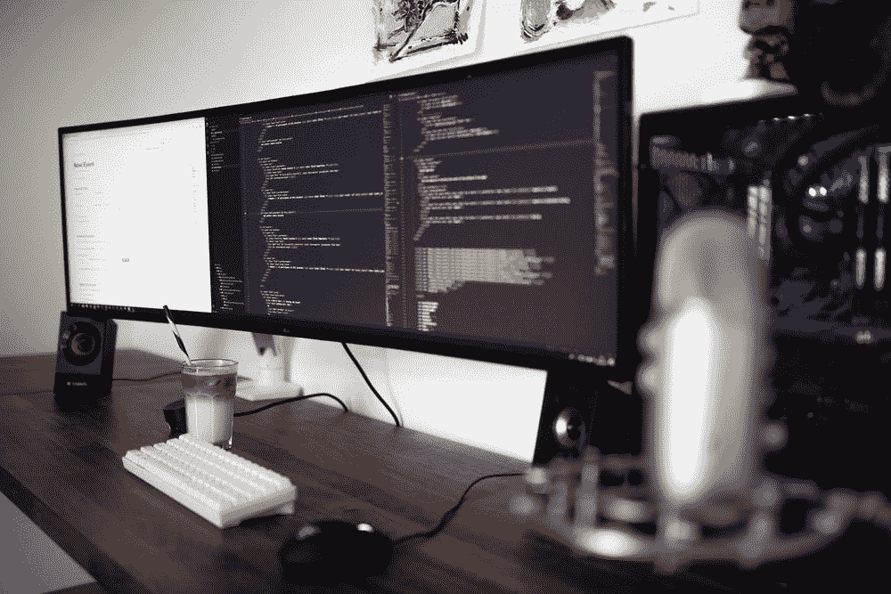

# 如何在疫情找到一份工作

> 原文：<https://blog.devgenius.io/how-to-secure-a-job-in-the-pandemic-b19f9cbd774a?source=collection_archive---------10----------------------->

# 我是怎么做到的，你也能做到！

> 在疫情期间，我做过以下事情:

*   发出了 **300+份工作申请**(我甚至没有夸张，我有一个清单！)
*   **自由职业者**演出
*   开发并销售**多个安卓应用**
*   开始了这个**博客**
*   阅读和听(大量的)书籍和有声读物

# 发出了 300 多份求职申请…

[韦斯利·廷吉](https://unsplash.com/@wesleyphotography)在 [Unsplash](https://unsplash.com/) 上拍摄的照片

是的，所以这是一个非常艰难的决定。我认为，在瞄准一个非常具体的角色和 Covid 之间，有几件事情使这个过程变得困难。你可以从我的 medium story 了解更多我的经历:[https://medium . com/dev-genius/200-job-applications-later-479d 41 dbed 93](https://medium.com/dev-genius/200-job-applications-later-479d41dbed93)

# 自由职业者的演出

[安德鲁·尼尔](https://unsplash.com/photos/cckf4TsHAuw)在 [Unsplash](https://unsplash.com/) 上的照片

自由职业的场景很有趣。以我的经验来看，我认为获得一些经验，解决问题等会很好。在从事自由职业之前，我会从事自己的个人编程项目，以便将我的想法付诸实践，并提高我的技术技能。自由职业使我能够与其他人一起工作，通过解决一些需要技术人员提供解决方案的问题来帮助他们。

具体来说，我做过编程导师，帮助那些想学习编程的人开发自己的应用程序等等。我在旅途中学习了一些我不太熟悉的编程语言，这本身就是一个很好的挑战。我也享受了帮助别人的回报。如果你想做一些自由职业的工作，我会说去做吧，不要担心你是否认为你是某个领域的绝对专家，这就是自由职业可以帮助你的地方。

好吧，你可能不会像更有经验的人那样得到很多自由职业者的工作机会，但是我们都有起点。我已经暂时停止了我的自由职业工作，因为我已经找到了一份全职工作，所以我的时间和精力都在那里，但是我可能会在周末接受一些工作，等等，这取决于机会。

# 开发和营销**多个安卓应用**

卡斯帕·卡米尔·鲁宾在 [Unsplash](https://unsplash.com/) 上的照片

开发我自己的 Android 应用程序是我多年来一直在做的事情。我编写了一些 Android 应用程序，以挑战自己，并希望为他人创造娱乐体验。

我创建了一个特殊的应用程序来帮助那些在封锁期间的人(它是在第一次封锁期间开发的):[https://play.google.com/store/apps/details?id = com . Andreas ward . what now&HL = en _ US&GL = US](https://play.google.com/store/apps/details?id=com.andreasward.whatnow&hl=en_US&gl=US)

我也想尝试营销我的应用程序，所以我在这方面工作，这是有趣的尝试，并获得一些熟悉。

# 开始了这个**博客**

照片由[汉娜·格蕾丝](https://unsplash.com/photos/j9JoYpaJH3A)在 [Unsplash](https://unsplash.com/) 拍摄

开这个博客帮助我把我的经历写成有意义的故事(我希望:)。

> 如果你正试图获得一份实习工作([https://Medium . com/dev-genius/securing-a-software-engineering-interstitution-the-actual-way-to-do-it-e 81 AEF 9c 33 c 5](https://medium.com/dev-genius/securing-a-software-engineering-internship-the-actual-way-to-do-it-e81aef9c33c5))，试图完成一个软件项目([https://Medium . com/dev-genius/how-to-actually-finish-your-software-side-projects-f 8898 b 598180](https://medium.com/dev-genius/how-to-actually-finish-your-software-side-projects-f8898b598180))等等，那么你可能会找到一些

拥有一个博客也有助于我发泄一些沮丧，例如在找工作的时候给其他可能有同样感觉的人。发现你不是唯一一个感到困难的人总是更好的，比如在找工作时，因为当人们互相帮助而不是独自尝试时，这是很好的。交流对你的健康也有好处。

# 阅读和听(大量的)书籍和有声读物

照片由[莎伦·麦卡琴](https://unsplash.com/photos/eMP4sYPJ9x0)在 [Unsplash](https://unsplash.com/) 上拍摄

无论你喜欢阅读、听有声读物还是观看 YouTube 视频，我总是通过消费某种形式的信息来学习，正如他们所说的那样，成为最好的自己。如果你不确定你更喜欢用什么方法来学习新东西，就试着读、听和看一些你喜欢的内容。我完全沉迷于学习新的东西，甚至在我热爱的事情上发展我现有的技能。我认为，通过增加你对事物的了解，肯定有助于做出更好的决定，并将你的想法付诸实践……看看世界上一些最成功的人吧……他们一直在阅读，不断学习。

# 从这个媒介故事中可以得到一些启示

在 [Unsplash](https://unsplash.com/) 上由 [Calum Lewis](https://unsplash.com/photos/8Nc_oQsc2qQ) 拍摄的照片

*   **努力工作**。无法回避的事实是，你需要努力工作才能实现。
*   **平衡一切**。鞭策自己，但不要达到对身体或精神健康有负面影响的程度！
*   **如果你觉得有困难，可以向别人求助**

> 一如既往的感谢阅读。我希望你从中获得一些价值。请随时为这个故事鼓掌和/或在 Medium 上跟随我。 ***如果你喜欢这个内容，请随时加入我的邮件列表:***[https://www.subscribepage.com/x9b5l0](https://www.subscribepage.com/x9b5l0)

# 跟着我看 https://www.tiktok.com/@theinspiringprogrammer?lang=en 抖音⏰