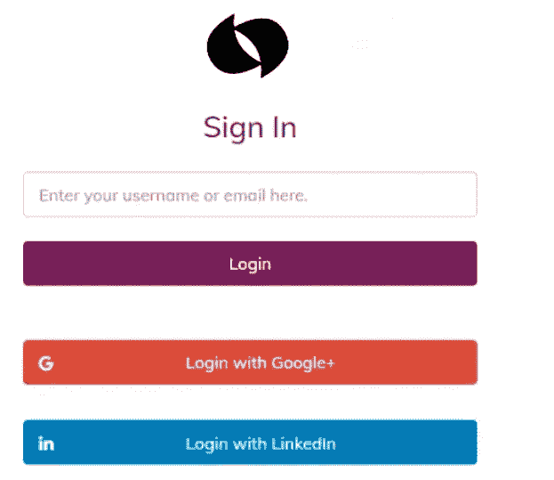

# 如何使用 SSO 保护企业微服务架构

> 原文：<https://blog.devgenius.io/how-to-secure-enterprise-microservice-architecture-with-sso-7ea1e41d0c00?source=collection_archive---------4----------------------->

**什么是安全？**

这是一个重要的方面**照顾系统完整性的安全性**。如果不考虑安全方面，它将传播风险，并可能容易受到其他网站、网络和其他 It 基础架构上的恶意软件攻击。

**什么是单点登录，它是如何工作的？**

*   单点登录(SSO)是一种将几个不同的应用程序登录屏幕结合成一个屏幕的技术。一旦你登录到一个特定的系统，这个声明的登录令牌可以在所有的应用程序中共享，其中它们可以定义信任。

# **认证和授权**

# **认证**:

是检验你是谁的过程。这就是我们根据密码验证用户的方式，以确定这个人是谁。

这方面有两种机制。

1.  **身份代理**:您可以通过社交登录实现登录。比如用谷歌/Facebook/苹果之类的登录。

*   在这里，你点击任何社会链接，然后它会重定向到你的身份提供者，给用户名和密码，它会给你回钥匙锁令牌。现在，Keycloak 可以用特定的用户角色生成自己的令牌，并返回给用户。

**2。身份联盟**:这里 Keycloak 可以针对多个数据源验证用户。我们可以教 Keycloak 如何验证用户，以及在这个过程中应该涉及哪些资源。它是可定制的。

# **授权:**

它有两个方面。

1.  说说你能做什么
2.  说说你能在什么上做到

*   当我们实施票证管理解决方案时，支持工程师能够读取用户的配置文件。他可能有简档读取权限，但不应该有任何简档的访问权限。肯定有一些约束。他应该只能读取配置文件，如果特定用户的支持票分配给他。这些是用户策略。
*   所以用授权服务器实现和维护这些类型的策略有点困难。

让我们看看如何做这些。

*   所以通常我们会创建用户和角色。假设我们已经创建了一个用户管理服务。因此，我们必须确定用户管理可以做什么。
*   它可以读/写/编辑/删除/列出用户。

1.  读取意味着您给出特定的用户 id 并获取该用户信息。
2.  list 意味着你可以获取所有用户的列表。

*   现在，假设我们创建了 5 个以上的权限，现在您将这些权限分配给一个特定的角色，然后将该角色分配给特定的用户。
*   因此，如果用户属于特定角色，那么我们可以看到属于该角色的权限，并应用这些权限。
*   所以用户登录到用户界面。当他们登录到用户界面，它将重定向到认证服务器。
*   假设我们在这里使用 Keycloak(一个开放源码软件产品，允许带有身份和访问管理的单点登录(SSO))。实现 Keycloak 后，用户将被重定向到 Keycloak。在这里，我将验证用户。此后，该令牌将返回到 UI，然后 UI 将提交其服务请求。
*   当服务请求到来时，API 网关识别为比如说用户试图创建一个新用户。然后它会检查这个令牌是否携带创建用户的权限？如果是:将允许流量流入

> 但问题是这个用户在哪个部门下可以创建新用户？

*   所以我们必须证实这一点。为此，我们可以使用策略管理解决方案。(我们可以使用 OPA-Open policy agent，这是一个流行的工具)

> 因此，当流量流动时，就在创建新用户之前，我们联系 OPA，要求*该用户将在部门 d001 上创建一个新用户。允许吗？这里 OPA 验证并返回真或假。*

**让我们看看另一个用例:**

*   假设支持工程师现在要读取用户的配置文件，那么支持工程师属于一个角色，该角色拥有读取用户配置文件的权限。当请求到达 API gateway 时，它将允许请求流入服务，因为他拥有用户读取权限。

> 因此，现在如果我们与 OPA 联系，询问该支持工程师是否从该特定用户处分配了一张票证来尝试读取配置文件？如果是，OPA 将返回 true。否则就是假的。

**活动目录:**当用户已经登录到活动目录，然后如果他们来到我们的应用程序，然后用户界面去 Keycloak。然后与活动目录对话。然后，active directory 确保该用户已经登录。因此 keycloak 将生成令牌。由于这个过程，用户不需要再次登录来访问应用程序，我们称之为 SSO(单点登录)。

> 当我们将这里讨论的所有这些东西放在一起并应用到一个系统中时，我们将能够为我们的应用程序构建更安全的认证和授权解决方案。