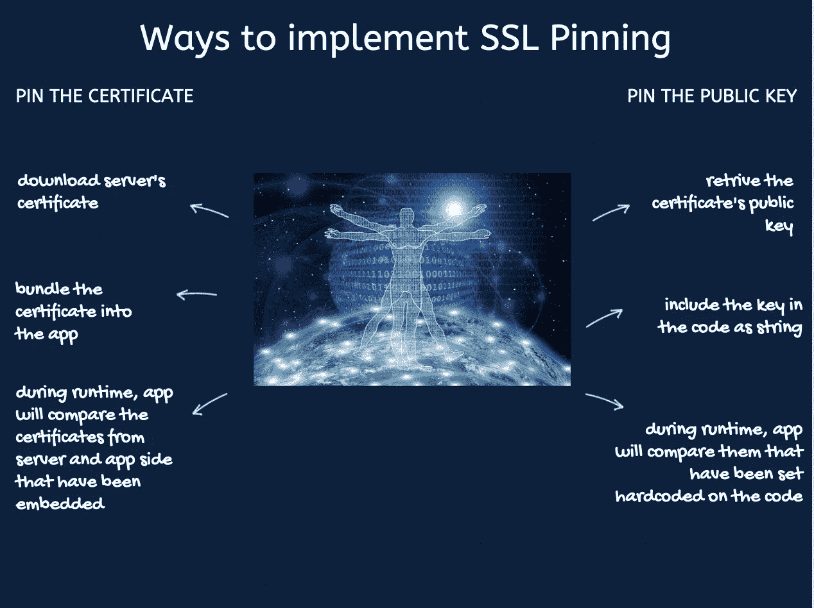
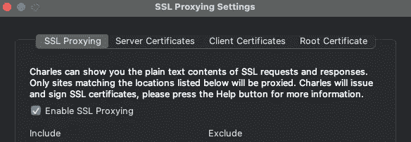
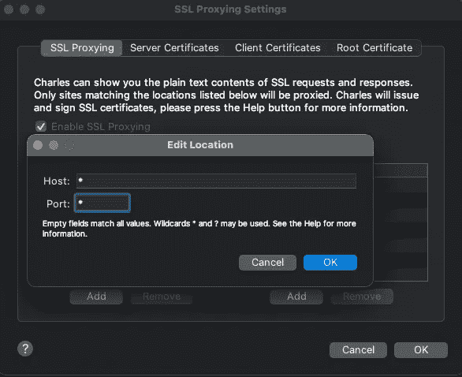

# 如何保护 IOS 应用程序:开发者指南

> 原文：<https://blog.devgenius.io/how-to-secure-ios-application-developers-guide-9a074f980cd1?source=collection_archive---------4----------------------->


我们的大部分日常生活都是在移动应用中度过的。我们有机会在任何时候使用应用程序，我们依赖这些应用程序，如银行，购物，控制家用电器。随着技术的发展，我们可以看到揭示用户重要信息的活动报告。公司的重点是保护移动应用程序和数据不被利用。任何企业移动应用程序开发的主要责任同样是保护移动应用程序和数据不被利用。这篇文章是关于 IOS 开发者如何保护移动应用的。

轮到安全视角时，我们应该了解一些基本术语:TLS、HTTPS、SSL。

**SSL:安全套接字层- >** 负责保持互联网连接的安全。在系统间的任何操作过程中，如传输任何数据(如服务器-客户端/服务器-服务器)，SSL 可防止第三方读取和修改将要传输的数据。

**TLS:传输层安全- >** 负责对来自互联网的应用程序将要传输的数据进行加密。TLS 有助于安全浏览网页，保护电子邮件、VOIP、视频/音频会议、标准文件传输等应用程序的安全。

[红利](https://support.apple.com/en-gb/guide/security/sec100a75d12/web) : iOS、iPadOS、macOS 支持传输层安全(TLS 1.0、TLS 1.1、TLS 1.2、TLS 1.3)和数据报传输层安全(DTLS)。TLS 协议支持 AES128 和 AES256，并优先选择具有前向保密性的密码套件。Safari、Calendar 和 Mail 等互联网应用程序会自动使用此协议来启用设备和网络服务之间的加密通信通道。

**HTTPS:超文本传输协议安全- >** 负责保护浏览器和服务器之间的通信。HTTPS 对 WWW 流量进行机密性和完整性认证。


## 实施 NSAppTransportSecurity (ATS)

自 iOS 9 以来，开发人员能够通过使用苹果的网络安全功能来防止不安全的网络连接:应用传输安全设置(ATS)。

> 在苹果平台上，一种称为应用传输安全(ATS)的网络安全功能改善了所有应用和应用扩展的隐私和数据完整性。为此，它要求您的应用程序建立的网络连接由传输层安全性(TLS)协议使用可靠的证书和密码来保护。ATS 会阻止不符合最低安全要求的连接。来源:[苹果](https://developer.apple.com/documentation/security/preventing_insecure_network_connections)

此功能由 XCode 上的 info.plist 文件控制。让我们来看看变量并解释它们的任务:

```
<key>NSAppTransportSecurity</key>
<dict>
  <key>NSExceptionDomains</key>
  <dict>
    <key>example.com</key>
    <dict>
      <!--Include to allow subdomains-->
      <key>**NSIncludesSubdomains**</key>
      <true/>
      <!--Include to allow HTTP requests-->
      <key>**NSTemporaryExceptionAllowsInsecureHTTPLoads**</key>
      <true/>
      <!--Include to specify minimum TLS version-->
      <key>**NSTemporaryExceptionMinimumTLSVersion**</key>
      <string>TLSv1.1</string>
    </dict>
  </dict>
</dict>
```

ATS 在`**NSAllowsArbitraryLoads**` 键下定义，如果为真/是，表示您的应用程序允许所有不安全的连接。

> 在`[NSAppTransportSecurity](https://developer.apple.com/documentation/bundleresources/information_property_list/nsapptransportsecurity)`字典的第一层的键适用于任何没有在`[NSExceptionDomains](https://developer.apple.com/documentation/bundleresources/information_property_list/nsapptransportsecurity/nsexceptiondomains)`子字典中特别指出的域的连接。例如，通过将`[NSAllowsArbitraryLoads](https://developer.apple.com/documentation/bundleresources/information_property_list/nsapptransportsecurity/nsallowsarbitraryloads)`设置为`YES`，您可以完全禁用所有网络连接的 ATS。来源:[苹果](https://developer.apple.com/documentation/security/preventing_insecure_network_connections)

```
<key>NSAppTransportSecurity</key>
<dict>
  <!--Include to allow all connections (DANGER)-->
  <key>**NSAllowsArbitraryLoads**</key>
      <true/>
</dict>
```

## [奖金](https://www.nowsecure.com/blog/2017/08/31/security-analysts-guide-nsapptransportsecurity-nsallowsarbitraryloads-app-transport-security-ats-exceptions/)

为了更安全，还要检查其他密钥:
**nsallowsarbitraryloadformedia:**此例外适用于受数字版权管理(DRM)或加密保护的媒体内容。当`NSAllowsLoadsForMedia`键设置为`YES`时，ATS 将对使用 [AVFoundation 框架](https://developer.apple.com/documentation/avfoundation)发送的内容禁用(通常是包含视听录制、编辑或回放功能的应用程序)。
**NSAllowsArbitraryLoadsInWebContent:**`NSAllowsArbitraryLoadsInWebContent`默认设置为`NO`。当按键设置为`YES`时，ATS 对 webview 请求禁用。如果在应用程序中使用 webview，您通常会看到此异常。在这种情况下，您需要评估 webview 是否会发送敏感数据。这是因为启用密钥后，数据可以通过 HTTP 或其他不安全的协议或连接发送。
**NSExceptionAllowsInsecureHTTPLoads:**`NSAllowsLocalNetworking`默认设置为`NO`。将其设置为`YES`将禁用 ATS 在本地网络上的连接。这种例外的典型用例可能是在物联网(IoT)场景中连接到本地硬件设备的应用程序。促进本地点对点连接的应用程序也可能使用此例外。


## 实施 SSL 固定

如前所述，SSL 负责保持互联网连接的安全。在系统间的任何操作过程中，如传输任何数据(如服务器-客户端/服务器-服务器)，SSL 可防止第三方读取和修改将要传输的数据。总之，它是一种旨在保护网络通信安全的协议。

SSL pin 是一种保护应用程序免受网络流量攻击或中断的方法。通过 SSL pin 应用程序知道证书的信任和不信任。请注意，攻击者可以生成自签名证书并破解根证书，因此锁定将阻止应用程序并在应用程序和服务器之间创建安全通信。

> [SSL 证书锁定，或简称为锁定，是将主机与其证书或公钥相关联的过程。一旦您知道了主机的证书或公钥，您就可以将其固定到该主机。](https://www.raywenderlich.com/1484288-preventing-man-in-the-middle-attacks-in-ios-with-ssl-pinning)

2 选项可用于实现 SSL pinning 证书，pin 公钥。



如需更多技术和详细的 SSL pin 教程，您可以访问[这里](https://www.raywenderlich.com/1484288-preventing-man-in-the-middle-attacks-in-ios-with-ssl-pinning)。

**奖励**:通过[查理斯](https://www.charlesproxy.com)可以测试 SSL 牵制。下载 Charles 后，从 Charles 菜单进入 SSL 代理-在 IOS 模拟器中安装 Charles 根证书。然后从模拟器转到设置-常规-关于-证书信任设置，然后启用根证书的完全信任。



最后一档..要在 Charles 上启用 SSL 代理，请转到代理- SSL 代理设置-启用 SSL 代理(您应该选择/启用)，然后在位置中选择+以添加新的代理:



之后，当你运行应用程序，在内容部分，如果查尔斯，你会意识到，将有一个关于你正在使用 SSL pin 的信息，而不是看到你的应用程序的 API 调用的内容。

感谢您的阅读！