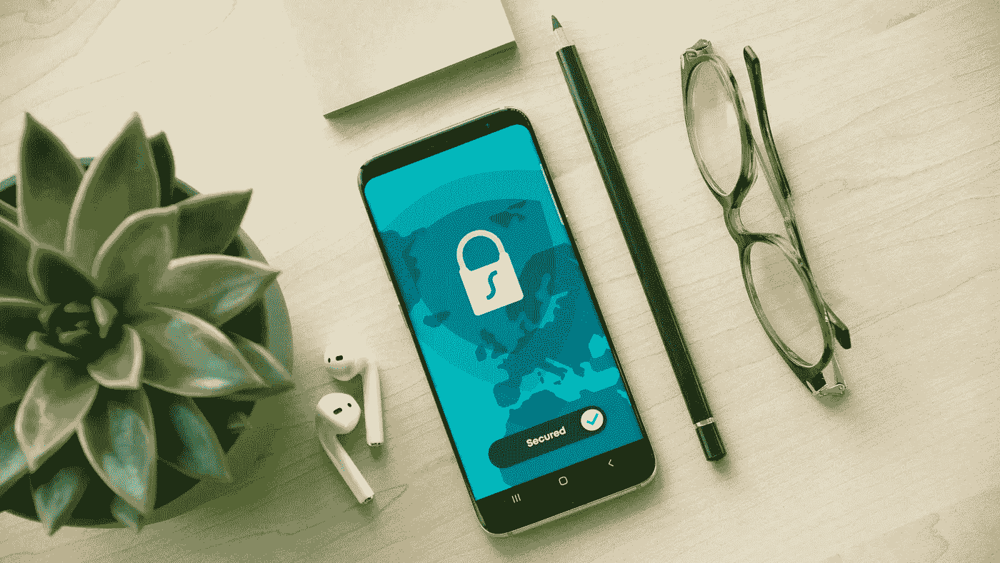

# 当应用程序进入后台时，如何保护您的数据？

> 原文：<https://blog.devgenius.io/how-to-secure-your-data-when-applications-enter-in-the-background-8675970817e2?source=collection_archive---------22----------------------->



我们大多数人在使用应用程序时，或者当我们丢失手机时，或者当我们的手机锁定时，都很关心数据。你从来没有想过:app 在后台会怎么样，我的数据安全吗？嗯，它们可能是，但这取决于我们如何保存数据和您如何使用您的设备的实施。

在移动安全体验中，最看重的是用户如何使用手机。实现高安全性是开发人员和用户之间的终生伙伴关系。他们中没有一个人能够单独保护数据。用户应该对他们使用手机的方式负责，信任 OEM 并为服务付费，而不是欺骗系统来获得更多免费的东西，因为在工业社会没有什么是免费的。

# 当你的手机应用程序进入后台时会发生什么？


在 IOS 中，当应用程序进入后台时，操作系统会拍摄当前屏幕的快照，并保存它，以便在我们打开后台进程时提供实时的应用程序外观。还有一点需要提及的是，当我们将应用程序放在后台时，只要操作系统没有超出我们可以自己做出正确决定的内存，IOS 就不会破坏数据和 ViewController 实例。

```
override func didReceiveMemoryWarning() {<#code#>}
```

# 黑盒里发生了什么？

当你的应用程序在后台移动时，操作系统会给你的当前视图拍一张快照，当你按两次 home 键时，它就可以用在应用程序选择器中。当应用程序在后台运行时，应用程序不应该做任何保留资源的操作。IOS 本身冻结了所有正在进行的活动，并允许我们通过释放我们在这个时间分配的所有资源来这样做，就像 I/O 操作保存正在进行的工作一样。将使用操作系统拍摄的快照，而不是保持应用程序运行，并将在应用程序返回前台或关闭后删除。因为它是保存在我们设备中的快照，所以我们有一些安全隐患。

1.  如果有人能够访问设备，他们可以提取位于应用程序包中的快照。
2.  如果我们与其他人共享该设备，即使由于我们实施的生物识别验证，他们无法打开应用程序，他们也可以通过双击 home 键轻松查看该快照。拍摄的机密数据仍然可见且易于阅读。(见上图)

# 解决办法？

IOS 为我们提供了跟踪应用程序何时进入后台的可能性，因此，我们可以采取措施保护特定数据不被拍摄快照。我们可以用两种方法做到这一点。

*   通过对所有屏幕实施此解决方案来隐藏所有内容
*   当我们认为相关时，通过实施此解决方案仅隐藏敏感数据。

*实现整个 app 的快照数据防止:*

```
lazy var imageView : UIImageView = {let imgView = UIImageView(frame: window!.frame)imgView.image = UIImage(named: "secret")return imgView}()func applicationWillResignActive(_ application: UIApplication) {self.window?.addSubview(imageView)}func applicationWillEnterForeground(_ application: UIApplication) {self.imageView.removeFromSuperview()}
```

为整个应用程序实施快照阻止:

```
override func viewDidLoad() {super.viewDidLoad()// Do any additional setup after loading the view.NotificationCenter.default.addObserver(forName: UIApplication.willResignActiveNotification, object: nil, queue: OperationQueue.main, using: {_ inprint("In Background")self.secureView.text = "I replaced secret Content"})NotificationCenter.default.addObserver(forName: UIApplication.didBecomeActiveNotification, object: nil, queue: OperationQueue.main, using: {_ inprint("In Background")self.secureView.text = "I am very secret content!"})}override func viewWillDisappear(_ animated: Bool) {NotificationCenter.default.removeObserver(self)super.viewWillDisappear(animated)}
```

Android 实现简单，和 IOS 一脉相承。我发现把它们都加在这里很琐碎，但是如果你需要任何帮助，请联系我。

希望这篇文章对你提高应用程序的安全性有所帮助。如果你需要任何帮助或建议，请随时联系我。

实现细节 [GitHub](https://github.com/EsmeraldiBejolli/secure-background-snapshot)

关注我的[链接](https://www.linkedin.com/in/esmeraldi-bejolli/)

如果您想了解更多关于移动安全的信息，欢迎加入[移动安全](https://www.linkedin.com/groups/8839523/)小组