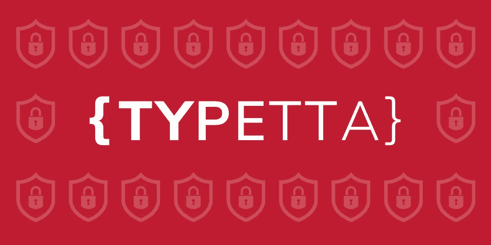

# 如何保护您的 GraphQL API(第 2 部分，Typetta 方式)

> 原文：<https://blog.devgenius.io/how-to-secure-your-graphql-api-part-2-the-typetta-way-70cd7e7f04f2?source=collection_archive---------8----------------------->

在第 1 部分中，我们讨论了**保护 GraphQL API** 的问题。我们引入了一个安全模型，在定义数据模型的同时定义了 ACL 策略，以便将所有的安全检查要求到负责加载和合成数据的层。

在第二部分中，我们将使用 [Typetta](https://twinlogix.github.io/typetta/) 探索这种方法的实现，这是一个现代的 TypeScript ORM 库，它提供了定义这种安全模型的可能性。



# 什么是泰佩塔？

[Typetta](https://twinlogix.github.io/typetta/) 是一个用 TypeScript 编写的**开源 ORM** ，旨在允许所有主要的 **SQL 数据库** (MySQL、PostgreSQL、Microsoft SQL Server、SQLLite3、CockroachDB、MariaDB、Oracle e Amazon Redshift)以及 NoSQL 数据库 **MongoDB** 以类型化的方式无缝访问数据。

使用 Typetta，一切都围绕着数据模型、描述应用程序域的实体以及它们之间的所有底层关系。这个模型用标准的 GraphQL 描述，使用了所有的基本概念(标量、类型、枚举等)和一些自定义指令。

在下面你可以看到一个用户的简单定义，包括名字和姓氏。

```
type User @entity @mongo {
 id: ID! @id
 firstName: String
 lastName: String
}
```

以及如何使用 Typetta 生成的数据访问层与数据库进行交互。

```
const user1 = await daoContext.user.insertOne({
 record: {
  firstName: “Mattia”,
  lastName: “Minotti”
 }
});const user2 = await daoContext.user.insertOne({
 record: {
  firstName: “Edoardo”,
  lastName: “Barbieri”
 }
});const users = await daoContext.user.findAll();users.forEach(user => 
 console.log(`${user.firstName} ${user.lastName}`)
);
```

Typetta 的核心是一个为数据模型定制的**类型安全的、自生成的查询构建器**。每次修改数据模型时，您都可以执行提供的生成器，该生成器创建并更新所有的 TypeScript 类型、一个 *DAOContext* 类和所有相关的*Dao*。

*DAOContext* 是所谓的*Dao*的容器，这些数据访问对象允许你在数据模型的实体上执行所有操作。

# 安全框架

DAOContext 的默认行为是不应用任何安全策略，让 Typetta 用户拥有完全控制权。但是，如果您打算在 Typetta 中管理安全性，您可以通过正确配置 *DAOContext* 来启用这个特性:

```
const daoContext = new DAOContext({
 security: {
  **defaultPermissions: PERMISSION.DENY**
 }
})
```

以这种方式，上下文被告知，除非另外指定，否则对每个实体的访问是完全禁止的。通过这样做，本质上，对数据模型的任何实体的操作都没有被授权。

除了*拒绝*，本库还提供了其他方便的权限配置，特别是:*允许*，*拒绝*，*只读*，*仅创建*，*仅更新*，*仅删除*。但是，您可以通过指定允许的单个操作来获得最大的灵活性，如下例所示:

```
const daoContext = new DAOContext({
 security: {
  defaultPermissions: **{
   create: true,
   read: true,
   update: true,
   delete: false
  }**
 }
})
```

除了为整个上下文指定默认权限之外，还可以为每个实体定义不同的权限，这种情况更常见。下面是一个简单的例子，引用了本博客第一部分中定义的数据模型:

```
const daoContext = new DAOContext({
 security: {
  policies: {
   **user: { defaultPermission: PERMISSION.READ_ONLY },
   userPermission: { defaultPermission: PERMISSION.READ_ONLY },
   post: { defaultPermission: PERMISSION.ALLOW },**
  }
  defaultPermissions: PERMISSION.DENY
 }
})
```

请注意，这些基本上是演示性的配置展示了 Typetta 在安全管理方面的简单性，但并没有涵盖很多真实的案例。实际上，在上面的定义中，对资源的访问权限是固定的，并且不依赖于调用身份。

在接下来的部分中，我们将讨论如何处理这些更复杂的情况。

# 实体投影的权限

我们之前已经看到了如何将单个操作限制到一个资源，明确指定创建、读取、更新和删除的能力。

读取操作通常需要在权限和限制的定义中有更大的粒度。特别是，经常需要为资源的各个字段或部分表示不同的权限。

Typetta 通过提供在 read 参数中指定受影响实体的任何投影的能力来支持这种需求。假设您为用户实体编写了一个安全策略，那么您可以只限制对 *id* 、 *firstName* 和 *lastName* 字段的读访问。

```
const daoContext = new DAOContext({
 security: {
  policies: {
   user: {
    **read: {
     id: true,
     firstName: true,
     lastName: true,
    },**
    write: false,
    update: false,
    delete: false
   },
  }
 }
})
```

# 权限和安全策略

为了对不同的**身份**施加不同的限制，添加**权限**的概念是非常有用的，它能够对各种资源的访问规则进行分组和重用。

可以定义一个 *DAOContext* ，其中对各个实体的访问策略取决于用户的权限:

```
const daoContext = new DAOContext({
 security: {
   // context is generated by authorisation
   **context: [‘MANAGE_POSTS’, ‘VIEW_POSTS’],**
   policies: {
    user: { defaultPermission: PERMISSION.READ_ONLY },
    userPermission: { defaultPermission: PERMISSION.READ_ONLY },
    post: {
     **permissions: {
      MANAGE_POSTS: PERMISSION.ALLOW,
      VIEW_POSTS: PERMISSION.READ_ONLY,
     },**
     defaultPermissions: PERMISSION.DENY,
    },
   },
   defaultPermissions: PERMISSION.DENY
 }
})
```

请特别注意上下文字段的定义，通常在认证过程中加载的呼叫者身份许可将被放置在该字段中。相应地，post 实体的**安全策略**包含几个权限，这些权限根据调用身份来实施。

# 安全域

**安全域**代表一组资源，由一个或多个字段中的一组值来标识。它用于以更大的粒度限制权限的应用。

要使用安全域，您必须:

*   定义一个安全上下文，在该上下文中，为每个当前身份权限指定其应用的域。
*   定义每个安全策略应该适用的域。

以前面例子中的数据模型为例。它定义了一个 post 实体，该实体通过一个 *userId* 字段链接到用户实体。一个用户通常只被允许在他们自己的帖子上执行每个操作，也就是说，那些有一个与他们的 Id 相同的 *userId* 的帖子。所有拥有他们的*用户 Id* 的帖子构成一个安全域。

下面是一个如何配置 *DAOContext* 的示例，这样用户就可以只对自己的帖子拥有 *MANAGE_POSTS* 权限，而对所有其他帖子拥有 *VIEW_POSTS* 权限:

```
const daoContext = new DAOContext({
 security: {
  // context is generated by authorisation
  context: {
   permissions: {
 **‘MANAGE_POSTS’: [{ userId: 2}]**
    ‘VIEW_POSTS’: true
   }
  },
  policies: {
   post: {
    permissions: {
     MANAGE_POSTS: PERMISSION.ALLOW,
     VIEW_POSTS: PERMISSION.READ_ONLY,
    },
    defaultPermissions: PERMISSION.DENY,
   },
  }
  defaultPermissions: PERMISSION.DENY
 }
})
```

请注意，在这种情况下，安全上下文不仅是一个权限数组，而且是一个映射，可以在其中为每个权限限制应用程序域。规格说明*MANAGE _ POSTS:[{ userId:2 }]*应理解为:当前身份拥有对 *userId* 字段等于 2 的所有资源的权限 *MANAGE_POSTS* 。值 *true* 表示特定权限没有域限制。

因此，给定这种配置，系统将授权用户对他们的帖子执行任何操作，而只对所有其他帖子执行读取操作。

# 操作安全域

每当执行一个指定了安全配置的 *DAOContext* 操作时，Typetta 就会应用上述所有规则来确定该操作是被允许还是被禁止。

在对于不同的安全域存在不同的安全策略的情况下，不知道哪个安全域将是操作的目标，库应用为所讨论的实体提供的所有安全策略之间的交集。交集意味着只有在所有安全策略中都允许的操作(或可见字段)才被允许。

让我们假设我们有两个帖子的可见性级别，一个允许阅读整个帖子( *VIEW_POSTS* )，另一个允许您只阅读内容而不阅读作者( *VIEW_POSTS_CONTENT* )。然后，我们假设用户在不同的安全域上拥有这两种权限。下面是 DAOContext 的定义:

```
const daoContext = new DAOContext({
 security: {
  // context is generated by authorisation
  context: {
   permissions: {
    ‘VIEW_POSTS’: [{ userId: 2}],
    ‘VIEW_POSTS_CONTENT’: true
   }
  },
  policies: {
   post: {
    permissions: {
     VIEW_POSTS: PERMISSION.READ_ONLY,
     VIEW_POSTS_CONTENT: {
      read: {
       id: true,
       content: true,
      }
     },
    },
    defaultPermissions: PERMISSION.DENY,
   },
  },
  defaultPermissions: PERMISSION.DENY
 }
})
```

给定这种配置，通过在 post 实体的 *DAO* 上执行简单的 *findAll* 操作，系统应用 *VIEW_POSTS_CONTENT* 权限，因为在没有显式安全域的情况下，它是最受限制的。因此，以下操作:

```
const posts = dao.post.findAll();
```

生成禁止访问错误，因为用户无权访问所有帖子的 userId 字段。相反，以下是允许的，因为无论安全域如何都是允许的:

```
const posts = dao.post.findAll({
 projection: {
  id: true,
  content: true,
 }
});
```

要执行 *findAll* 操作而不将请求限制到某些字段，您必须将请求限制到安全域 *userId = 2* 。为此，Typetta 使用元数据操作机制，允许您为请求指定附加数据:

```
const posts = dao.post.findAll({
 metadata: {
  userId: [2]
 }
});
```

这个请求不会产生任何错误，相反，它会返回用户 2 的所有帖子，以及这些帖子中由 *VIEW_POSTS* 权限允许的所有字段。

# 结论

在这篇博客中，我们展示了如何使用 Typetta 库创建一个安全的数据层，这是一个非常有前途的开发 GraphQL API 的工具。如果你有兴趣了解更多关于这个库的信息，你可以在官方文档中找到所有种类的细节。

除此之外，在这两篇文章中，我们试图定义一种方法来帮助开发人员保护他们的 GraphQL APIs，不仅在他们的系统边缘工作，而且在设计数据模型的同时设计安全性。

请继续关注我们，了解更多有趣的高级编码方法，如果你喜欢这个博客**，请为它鼓掌**。