# 如何选择合适的特征—特征选择

> 原文：<https://blog.devgenius.io/how-to-select-appropriate-features-feature-selection-fc40ae39731f?source=collection_archive---------13----------------------->

了解统计方法中的要素选择过程-相关性和协方差


在 [Unsplash](https://unsplash.com?utm_source=medium&utm_medium=referral) 上 [drown_ in_city](https://unsplash.com/@drown_in_city?utm_source=medium&utm_medium=referral) 拍摄

让我们首先了解相关性，然后我们将继续协方差，然后我会告诉你为什么我们需要它们，以及它们有什么不同。

# 相互关系

根据维基百科的一篇文章:

> *中的* [*统计*](https://en.wikipedia.org/wiki/Statistics)****相关性*** *或* ***依赖性*** *是任意统计关系，无论* [*因果*](https://en.wikipedia.org/wiki/Causality) *与否，两个* [*随机变量*](https://en.wikipedia.org/wiki/Random_variable) *或*尽管在最广泛的意义上，相关性“可以指任何类型的关联，但在统计学中，它通常指一对变量线性相关的程度*。**

*那么我们对这个定义的理解是什么呢？让我们使用虹膜数据集，如果我们创建一个花瓣长度和花瓣宽度之间的图表:*

*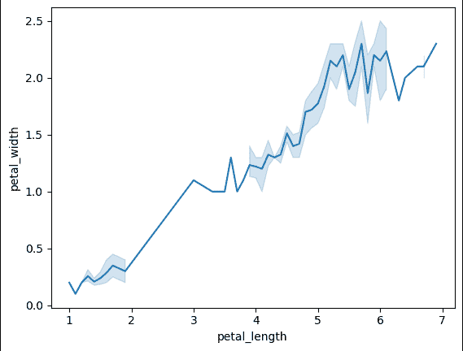*

*花瓣长度和花瓣宽度之间的折线图，图片由作者提供*

*我们可以看到该图大致上升，即随着花瓣长度值的增加，花瓣宽度值也增加。现在，通过查看该图，我们可以说花瓣长度和花瓣宽度正相关，我们不能说在这一点上有多少相关，但我们可以肯定地说，它们都是正相关的，这足以用于特征选择。当然，如果我们知道他们两个有多紧密的联系，我们可以选择其中的一个用于 ML 模型的建立。那么让我们来介绍一下相关系数(r)。*

*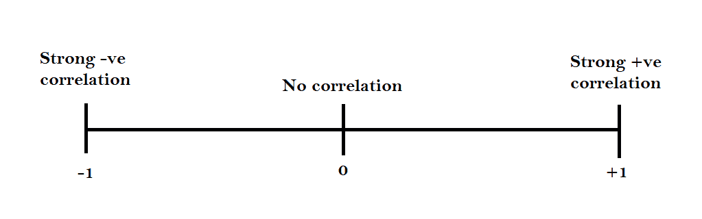*

*相关基础，作者图片*

*因此，如果图形具有正斜率，那么它具有正相关性，如果图形具有负斜率，那么它具有负相关性，如果图形是倾斜的，即没有斜率，那么它意味着变量不相关。*

*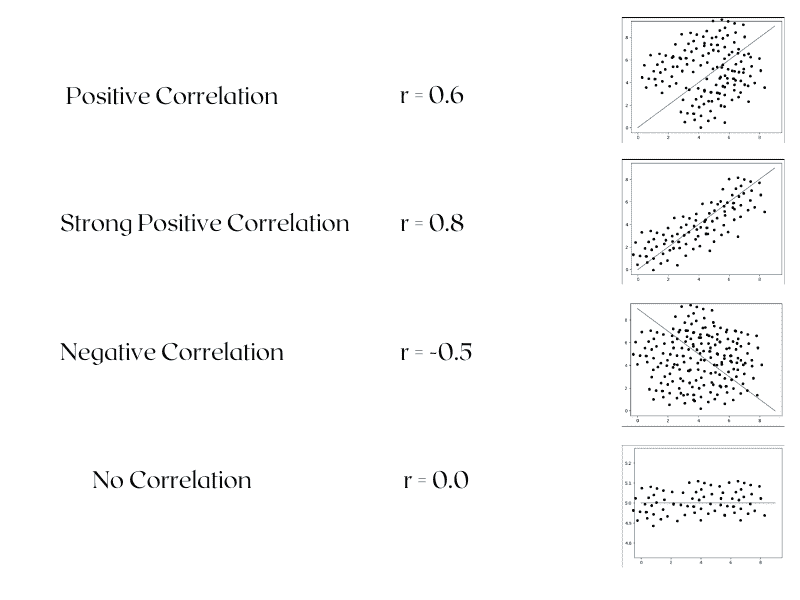*

*图形相关性基础，图片由作者提供*

*现在让我们来看看 iris 数据集中特征的相关系数和散点图。*

*这是一个相关矩阵，显示了每个特征之间的相关系数。*

```
*data.corr()*
```

*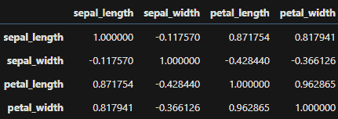*

*虹膜数据集(相关矩阵)特征之间的相关性，按作者分类的图像*

```
*plt.rcParams["figure.figsize"] = (20,12)
plt.subplot(2,2,1)
p = sns.scatterplot(x=data['petal_length'],y=data['petal_width'])
p.set(title = "correlation = 0.962865")
plt.grid()plt.subplot(2,2,2)
p = sns.scatterplot(x=data['sepal_width'],y=data['petal_length'])
p.set(title = "correlation = -0.428440")
plt.grid()plt.subplot(2,2,3)
p = sns.scatterplot(x=data['petal_width'],y=data['sepal_length'])
p.set(title = "correlation = 0.817941")
plt.grid()plt.subplot(2,2,4)
p = sns.scatterplot(x=data['sepal_width'],y=data['sepal_length'])
p.set(title = "correlation = -0.117570")
plt.grid()*
```

*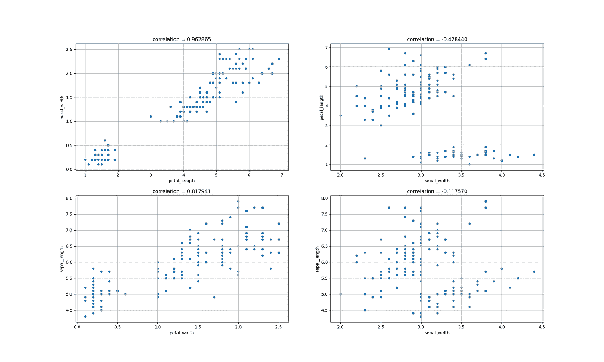*

*虹膜数据集中的相关图，按作者分类的图片*

*为了使相关性直观，我们还可以绘制一个配对图。*

```
*sns.pairplot(data)*
```

*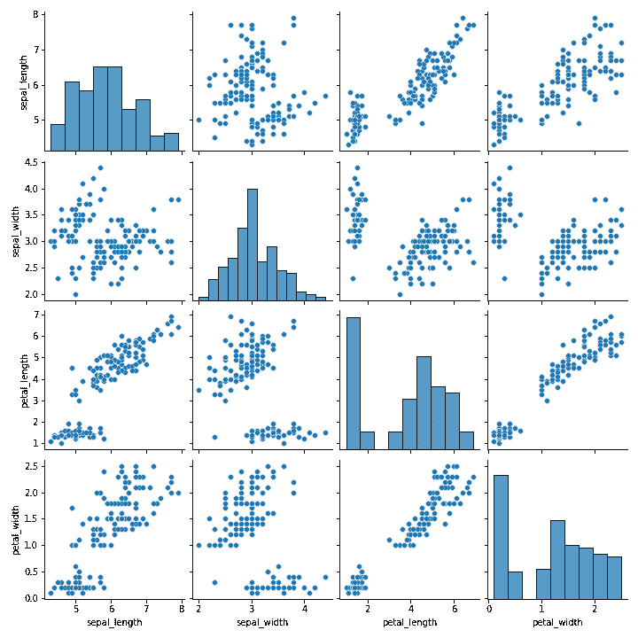*

*虹膜数据集中的配对图，图像由作者提供*

*我们也可以画出同样的热图*

```
*sns.heatmap(data.corr(),annot=True)*
```

*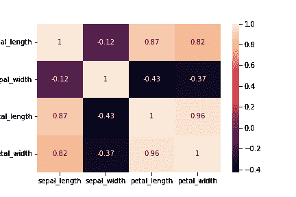*

*iris 数据集中的关联热图，图片由作者提供*

*颜色越浅，相关性越强。*

*现在我们来了解一下协方差。*

# *协方差*

*根据维基百科的一篇文章:*

> **中的* [*概率论中的*](https://en.wikipedia.org/wiki/Probability_theory)*[*统计学中的*](https://en.wikipedia.org/wiki/Statistics) *，* ***协方差*** *是两个* [*随机变量*](https://en.wikipedia.org/wiki/Random_variable) *的联合变异性的度量。如果一个变量的较大值主要与另一个变量的较大值相对应，并且较小值也是如此(即变量往往表现出相似的行为)，则协方差为正。在相反的情况下，当一个变量的较大值主要对应于另一个变量的较小值时，(即变量往往表现出相反的行为)，协方差为负。协方差的符号因此显示了在* [*变量之间的线性关系*](https://en.wikipedia.org/wiki/Linear_relationship) *。***

**一些重要的提示:**

*   **协方差用于量化两个变量变化之间的关系**
*   **当两个变量之间的差值增大时，协方差变为负值，如果差值减小，协方差变为正值**
*   **它与相关系数完全不同**
*   **协方差评估两个随机变量的平均值如何一起移动**

**协方差的公式:**

**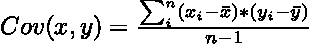**

**协方差公式，作者图像**

*   **xi =一个 x 数据点**
*   **xbar =值的平均值**
*   **yi =一个 y 数据点**
*   **ybar =值的平均值**
*   **n =数据集的样本大小**

**在 python 中我们只用。cov()方法，我们在 iris 数据集上试试。**

```
**import pandas as pd
import seaborn as sns
data = sns.load_dataset('iris')
data.cov()**
```

**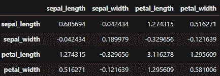**

**虹膜数据集中的协方差矩阵，图片由作者提供**

**我们可以这样理解协方差:**

**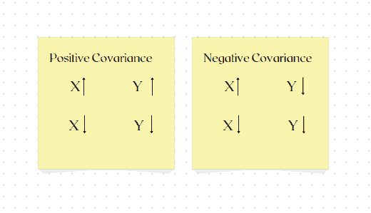**

**协方差的要点，作者的图像**

**如果协方差为零，则变量之间没有关系。**

**为了更好地理解，我们还可以创建自己的函数:**

```
**def cov_custom(x,y,data,n):
    cov1 = 0
    for i in range(len(data[x])):
        cov1 += ((data[x][i]-data[x].mean())*(data[y][i]-data[y].mean())/(n-1))
    return cov1
cov_custom("sepal_length",'sepal_width',data,len(data))**
```

> **-0.042434004474272945**

**而且我们得到的答案是准确的。**

**与相关性类似，我们可以创建协方差图:**

```
**sns.heatmap(data.cov(),annot=True)**
```

**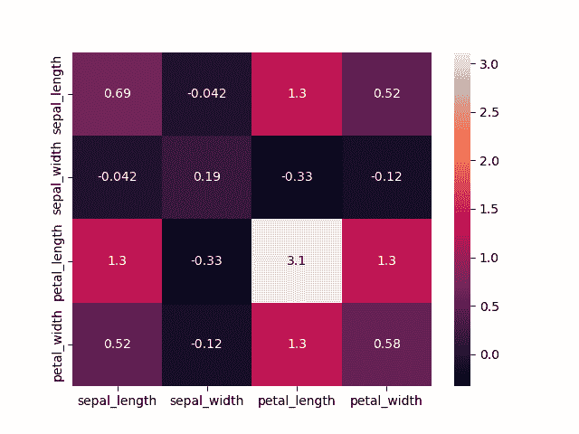**

**虹膜数据集中协方差矩阵的热图，图片由作者提供**

# **不同类型的相关系数**

**这些都使用了相关和协方差的概念**

1.  **皮尔逊相关系数**
2.  **人员等级相关系数**
3.  **皮尔逊积矩相关**
4.  **斯皮尔曼相关系数**
5.  **斯皮尔曼等级相关系数**
6.  **多轴相关系数**

**如果你喜欢这些内容，请留下👏，它激励我写更多这样的文章😊**

**联系人:[https://linktr.ee/a.kayyy](https://linktr.ee/a.kayyy)**