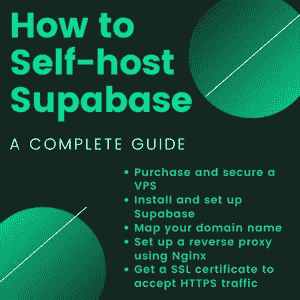

# 如何自主主持 Supabase:完全指南

> 原文：<https://blog.devgenius.io/how-to-self-host-supabase-a-complete-guide-f4c68f449920?source=collection_archive---------6----------------------->

在本指南中，我将解释如何自主机 Supabase。包括如何购买和保护虚拟专用服务器(VPS)，安装和设置 Supabase，使用 Nginx 设置反向代理，以及获取安全套接字层(SSL)证书以接受 HTTPS 流量。



这是我第一次写补充指南，所以如果有什么不清楚的地方，或者你有什么反馈，请在下面的评论中留下。

# 你将取得什么成就

如果您遵循这些步骤，您将最终拥有一个托管在 VPS 上的受密码保护的 Supabase 服务器，VPS 是一个反向代理，它使用 SSL 证书将流量从域名重定向到 Supabase 后端的相应端点。

要继续，您需要:

1.  一个域名，免费或付费，你可以设置一个或 CNAME 记录
2.  一个运行 Ubuntu 20+的 VPS，如果你还没有，这个公会也会推出一个

# 购买 VPS 并设置

显然，要自己托管一个 Supabase 后端，您需要一个 VPS。如果你已经有了一个，你可以转到关于保护 VPS 的部分，看看你还能做些什么来保护你的 VPS 。如果没有，下面的指南就来说说如何选购一台。

# 购买 VPS

我将使用 OxideHost VPS，因为它们相对便宜。我一直在使用它们，它们相当可靠。对于那些感兴趣的人，这是我的[附属链接](https://billing.oxide.host/aff.php?aff=166)。

在选择了 VPS 并购买了安装了 Ubuntu 22.04 的 VPS 之后，会有一封电子邮件告诉我如何连接到我的 VPS。最重要的部分是主机名、IP 和默认密码。

# 连接到它

```
ssh {username}@{ip-address}
```

要连接到我刚刚购买的 VPS，最简单的方法就是在命令行中使用`ssh`命令。但是，使用这种方法，我们每次都必须键入这个命令并输入密码。更好的方法是使用 SSH 客户端，比如免费的 PuTTY T8。我将使用 Termius，因为它有一个很好的界面，对学生来说是免费的。


我将创建一个新的主机，输入电子邮件中给定的主机名，用户名默认为`root`，密码也给了我。它会问你一个关于你想连接到它的问题，点击`yes`。然后我将第一次连接到 VPS。


# 保护 VPS

现在我们已经连接到我们的 VPS，我们想确保我们是唯一可以访问它的人，所以我们需要采取措施来保护它。

```
apt update apt dist-upgrade
```

第一个任务是更新它，因为更新的软件通常有其安全漏洞补丁。这也升级了 Linux 发行版。命令提示符会问你一些问题，你可以输入`y`然后按回车键来回答。而如果是多选，可以按`tab`左右导航，按回车键确认选择。


## 添加另一个用户

现在你获得了 VPS，黑客们也想得到它。互联网上有大量的机器人破解随机 VPS 的密码，他们通常试图以 root 身份登录，因为这是默认配置。因此，我们将添加一个新用户，将 root 权限传递给它，并禁用 root 登录，这样那些坏机器人就无法登录到我们的 VPS。

```
adduser {username} usermod -aG sudo {username}
```

用户名中不能有空格，所以可以使用下划线，如`learn_supabase`或`learnsupabase`。然后它会问我们一些问题，如果我们不想回答，我们可以输入空白。但是我们需要填写一个**安全密码**，我建议使用一些[安全密码生成器](https://www.dashlane.com/features/password-generator)输入一个随机生成的密码，这样任何人都无法猜到。然后我们可以给用户 Sudo 特权。并且**通过创建新的主机并连接它，尝试使用新的用户名和密码**登录。

## 禁用 root 登录

```
nano /etc/ssh/sshd_config
```


现在我们需要把`Port`改成一个随机数，让它更难猜，这个数必须小于 65535。而且我们还把链接`PermitRootLogin`改成了`no`，这样我们就不能再以 root 身份登录了。

做出更改后，我们可以用`ctrl + o`写出更改，用`ctrl + x`退出 nano。然后我们执行下面的命令来重启`sshd`服务，这样新的配置就会生效。

```
systemctl restart sshd
```

# 安装超级数据库

# 安装 docker

我们为此需要 docker，关于如何安装 docker 的教程可以在这里找到。在本教程中，我将总结我们需要运行什么命令。这个命令假设你使用的是 Ubuntu，如果你使用的是其他发行版，请参考上面的教程链接。

```
sudo apt install apt-transport-https ca-certificates curl gnupg lsb-release curl -fsSL https://download.docker.com/linux/ubuntu/gpg | sudo gpg --dearmor -o /usr/share/keyrings/docker-archive-keyring.gpg echo "deb [arch=amd64 signed-by=/usr/share/keyrings/docker-archive-keyring.gpg] https://download.docker.com/linux/ubuntu $(lsb_release -cs) stable" | sudo tee /etc/apt/sources.list.d/docker.list > /dev/null sudo apt update sudo apt install docker-ce docker-ce-cli containerd.io sudo apt install docker-compose-plugin
```

然后，我们还需要使用户能够使用 docker。

```
sudo usermod -aG docker {username}
```

# 克隆超级碱基

然后我们想从 Github 克隆 Supabase。

```
git clone --depth 1 https://github.com/supabase/supabase
```

# 设置超级秘密

```
cd supabase/docker/ cp .env.example .env
```

现在我们进入 docker 目录，复制环境变量的文件。

# 生成密码

我们打开`.env`文件，会看到很多设置。


我们想为上述字段设置密码。对于`POSTGRES_PASSWORD`，可以使用随机生成的密码。对于 JWT 秘密，我们必须使用[自定义密钥生成器](https://supabase.com/docs/guides/self-hosting#api-keys)。您可以复制 JWT 的秘密并将其粘贴到文件中，然后我们可以选择`ANON_KEY`，点击生成，将其复制到`ANON_KEY`字段，然后是`SERVICE_KEY`字段。


```
nano volumes/api/kong.yml
```

然后我们也将相同的键复制到 kong 配置中，粘贴新的`anon`键和`service`键。


# 启动 docker

现在我们打开一个新的屏幕，并给它命名，以便我们以后可以连接到它

在这里你会看到介绍的画面，点击`enter`。然后我们可以做`ctrl + a`然后`ctrl + d`从屏幕上断开。在控制台中，你会看到你的屏幕号`[detached from 3775963.pts-0.hostname]`，`3775963`号就是屏幕号。

```
screen -S {screen_number} -X sessionname supabase screen -r supabase
```

现在我们已经重新连接到屏幕`supabase`，当我们从它断开时，我们使用`ctrl + a`然后使用`ctrl + d`。

```
cd supabase/docker/ docker compose up
```

现在 supabase docker 启动了，它会下载一堆东西，你可以在 3000 端口连接到你的域。

# 领域映射

现在，我想将一个自定义域指向后端。我使用了 Namecheap，并创建了一个 A 记录，将一个子域指向我的 VPS 的 IP 地址。


# 反向代理

反向代理将连接指向正确的端口。这部分在 Linode 的博客文章中解释得很清楚，所以我只简单说说需要运行什么命令，你可以参考他们的博客文章中更详细的解释。

我们首先为反向代理安装 Nginx。

```
sudo apt install nginx sudo systemctl status nginx
```

如果我们连接到我们的域，我们会看到 Nginx 欢迎页面。


```
sudo nano /etc/nginx/sites-available/{your_domain_name}
```

然后，我们将以下内容(来自 [Linode guide](https://www.linode.com/docs/guides/installing-supabase/#using-a-reverse-proxy) )复制到文件中，用您的自定义域替换`example.com`。

```
map $http_upgrade $connection_upgrade {
    default upgrade;
    '' close;
}

upstream supabase {
    server localhost:3000;
}

upstream kong {
    server localhost:8000;
}

server {
    listen 80;
    server_name example.com;

    # REST
    location ~ ^/rest/v1/(.*)$ {
        proxy_set_header Host $host;
        proxy_pass http://kong;
        proxy_redirect off;
    }

    # AUTH
    location ~ ^/auth/v1/(.*)$ {
        proxy_set_header Host $host;
        proxy_pass http://kong;
        proxy_redirect off;
    }

    # REALTIME
    location ~ ^/realtime/v1/(.*)$ {
        proxy_redirect off;
        proxy_pass http://kong;
        proxy_http_version 1.1;
        proxy_set_header Upgrade $http_upgrade;
        proxy_set_header Connection $connection_upgrade;
        proxy_set_header Host $host;
    }

    # STUDIO
    location / {
        proxy_set_header Host $host;
        proxy_pass http://supabase;
        proxy_redirect off;
        proxy_set_header Upgrade $http_upgrade;
    }
} 
```

之后我们可以做`ctrl + o`和`ctrl + x`来写和退出。然后我们可以创建一个从站点可用到站点启用的配置的符号链接，链接默认配置，然后重启 Nginx。

```
sudo ln -s /etc/nginx/sites-available/{your_domain_name} /etc/nginx/sites-enabled/{your_domain_name}
sudo unlink /etc/nginx/sites-enabled/default
sudo systemctl restart nginx
```

现在，我们可以使用域名连接到 Supabase。

# 获取 SSL

在这一部分中，我们将使用 Certbot 给我们的 Supabase 一个 SSL 证书。他们的官方网站有很好的说明，所以你可以照着做。但是我也会让你知道我用了什么命令。

我们先安装`core`，然后安装`certbot`。然后我们配置它，最后尝试它如何自动更新，然后重启 Nginx 使它生效。

```
sudo snap install core; sudo snap refresh core sudo snap install --classic certbot sudo ln -s /snap/bin/certbot /usr/bin/certbot sudo certbot --nginx sudo certbot renew --dry-run sudo systemctl restart nginx
```


# 安全超级数据库

每个人都可以连接到 Supabase 仪表板，为了保护它，我们这样做是为了生成密码。它会要求你输入密码两次，所以你最好从一个安全的密码生成器生成一个密码，然后粘贴到那里两次。

```
sudo htpasswd -c /etc/apache2/.htpasswd {admin_username}
```

然后我们可以用

```
cat /etc/apache2/.htpasswd
```

然后我们编辑 Nginx 配置以进行密码保护

```
sudo nano /etc/nginx/sites-available/{domain name}
```

让它在工作室里

```
 # STUDIO
    location / {
        proxy_set_header Host $host;
        proxy_pass http://supabase;
        proxy_redirect off;
        proxy_set_header Upgrade $http_upgrade;

        auth_basic           "Administrator’s Area";
        auth_basic_user_file /etc/apache2/.htpasswd;
    }
```

在最后重启时

```
sudo service nginx restart
```


在这里你可以填写用户名作为你输入的`{admin_username}`，密码作为你输入的密码。

# 重新配置超级数据库

现在，我们要为 Supabase 后端和外部 API 设置域。

```
screen -r supabase
```

然后我们按`ctrl + c`结束 Supabase docker 实例。然后我们编辑`.env`文件。

我们需要改变

```
...
API_EXTERNAL_URL=https://{your_domain}
...
SUPABASE_PUBLIC_URL=https://{your_domain} # replace if you intend to use Studio outside of localhost
```

然后我们可以执行`ctrl + o`和`ctrl + x`来保存更改，然后执行以下操作来恢复 Supabase。

```
docker compose up
```

然后，我们可以通过执行`ctrl + a`然后`ctrl + d`来断开连接，而不终止内部的进程，从而退出屏幕。

# 结论

恭喜你，你现在有一个工作的 Supabase 后端，受密码保护，在一个认证的域内。希望我的解释是清楚的，如果有任何问题或评论，请随时留下评论。你的下一步是开发你的前端，我将在本指南的下一部分[中介绍。](https://blog.cpbprojects.me/set-up-a-svelte-todo-list-on-self-hosted-supabase-email-sign-up-google-facebook-auth-host-on-github-pages)

*原发布于*[*https://blog . CPB projects . me*](https://blog.cpbprojects.me/how-to-self-host-supabase-a-complete-guide)*。*