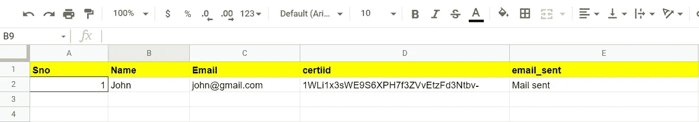

# 如何从 Google 电子表格中使用 Google Apps 脚本发送带有附件的批量电子邮件

> 原文：<https://blog.devgenius.io/how-to-send-bulk-emails-with-attachment-using-google-apps-script-from-a-google-spreadsheet-653a1532233a?source=collection_archive---------6----------------------->


图片来源:Mailtrack

你好，学习者，

在这篇文章中，我们将开发谷歌应用程序脚本，允许我们发送大量的电子邮件与附件的大规模观众一次。这篇文章是我上一篇文章的延续——**[**从谷歌电子表格**](https://dilipkashyap15.medium.com/send-mass-emails-using-google-apps-script-from-a-google-spreadsheet-fc2f79c9febd) **使用谷歌应用套件脚本发送大量电子邮件。****

****让我们来看看为带有附件的批量电子邮件开发 Google 脚本的过程。****

1.  **创建带有所需数据字段的电子表格作为模板。**
2.  **SendEmail 功能，用于自动发送电子邮件。**
3.  **getData 函数从模板中获取 json 格式的数据，这将有助于在发送电子邮件函数中设置数据。**

**当我们继续进行脚本开发时，让我们回顾一下这些步骤。**

****步骤 1:** 在这一步中，我们将创建一个包含所需列的 Google 电子表格。对于该示例，我添加了三列——名称、电子邮件、证书 id 和电子邮件状态。请参见下图中的示例。**

****

****第二步:**创建电子表格模板后打开脚本编辑器，编写下面的**sendmeil()**函数。**

```
function sendEmail(){var ss = SpreadsheetApp.openById("YOUR_SPREADSHEET_ID");var sheet = ss.getSheetByName("main");var json_data = getData(sheet);for(var j=0;j<json_data.length;j++) {var attachment = [DriveApp.getFileById(json_data[j].fileid).getBlob()];var message="Dear "+json_data[j].name+",<br><br>Please find the attachment below.<br><br>";message=message+"Best wishes,<br>"+"Coordinators<br><br>";MailApp.sendEmail({to: json_data[j].email, cc: 'internships@iitgn.ac.in', subject: "CERTIFICATE NOTIFICATION", htmlBody: message, noReply:true, attachments: attachment  } );sheet.getRange(j+2,sheet.getLastColumn() ).setValue("Mail sent");}}
```

**我们已经在示例发送电子邮件函数中定义了**电子表格 id** 和**工作表名称**。我们的下一节将描述调用 **getData()** 函数后会发生什么，该函数以 JSON 格式返回电子表格数据。之后我们编写了一个邮件模板，其中设置了 JSON 参数，如姓名、电子邮件、邮件内容之间的地址，并且调用了 **MailApp** 库函数来发送邮件。对于发送附件，我们使用驱动器链接中的文件 id，或者如果您向所有用户发送相同的附件文件，您可以在电子表格模板或下面的代码中使用直接链接。**

```
var attachment = [DriveApp.getFileById(json_data[j].fileid).getBlob()]
```

**整个过程会在一个等于 JSON 数组长度的循环中被调用，这个长度就是 Google 电子表格中的总人数。**

**第三步:我们需要定义 **getData()** 函数，让我们看看它的代码。编写 **getData()** 函数来获取 JSON 格式的 Google 电子表格数据。**

```
function getData(sheet){  
 var jo = {};  
 var dataArray = [];
// collecting data from 2nd Row , 1st column to last row and last    // column sheet.getLastRow()-1var rows = sheet.getRange(2,1,sheet.getLastRow()-1,sheet.getLastColumn()).getValues();for(var i = 0, l= rows.length; i<l ; i++)
{  var dataRow = rows[i];
     var record = {};
      record['sno'] = dataRow[0];
      record['name'] = dataRow[1];
      record['email'] = dataRow[2];
      record['address']=dataRow[3];
      dataArray.push(record);
   }   jo = dataArray;
   var result = JSON.stringify(jo);
return jo;
}
```

**我们上面声明的函数已经定义了如下几个参数:工作表、最后一行和最后一列的范围，以及数组形式的范围值，它将以 JSON 格式返回完整的范围值。**

****步骤 4:** 这是**奖励**步骤，如果你想运行这个功能或从谷歌电子表格的前端调用发送电子邮件功能，你可以在谷歌应用程序脚本的顶部使用下面的脚本。**

```
function onOpen(e)
 {
// Add a custom menu to the 
spreadsheet.SpreadsheetApp.getUi() 
// Or DocumentApp, SlidesApp, or FormApp.
.createMenu('Custom Menu')
.addItem('Send Emails', 'sendEmail')
.addToUi();
}
```

**在上面的代码中，当执行 **onOpen()** 函数时，一个名为“**自定义菜单**的自定义菜单被添加到电子表格菜单选项的右侧。**senemail()**函数需要在自定义菜单下定义，方法是添加 **addItem** 库函数，作为另一个选项从前端调用它。**

**如果你有兴趣学习 Google Apps 脚本和自动化你的 Google Workspace？必须试试这本**电子书**上的“ [**谷歌应用套件脚本:初学者指南**](https://www.amazon.com/dp/B0BTJC9X5R) ”**

**希望这篇文章能帮助你了解如何发送个性化的群发邮件。如有疑问，欢迎留言评论。我很乐意帮助你。快乐学习！**