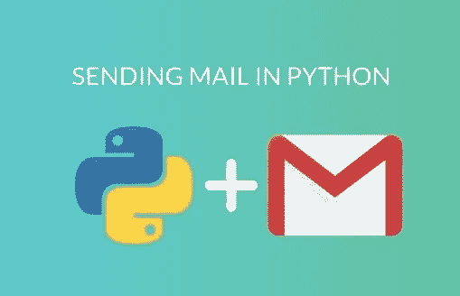
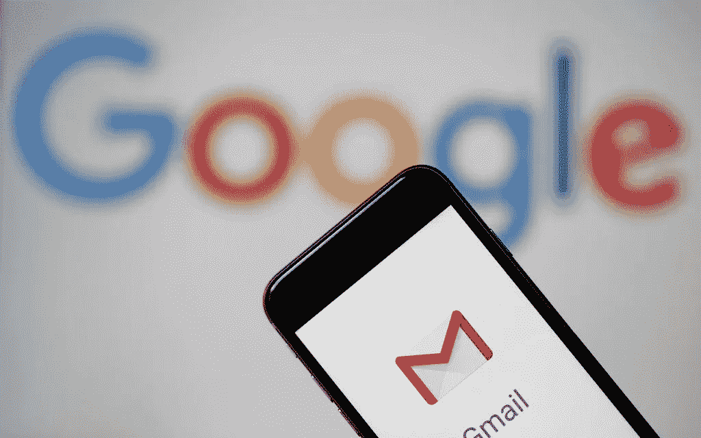
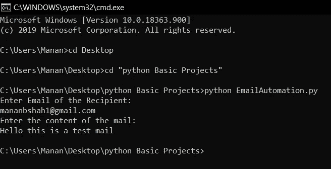

# 如何用 Python 发邮件？

> 原文：<https://blog.devgenius.io/how-to-send-emails-using-python-6b99670b76b8?source=collection_archive---------7----------------------->

> 在这篇博客中，我们将讨论如何用几行代码用 python 发送电子邮件。务必完整详细地阅读博客，以避免执行过程中的错误。让我们来看看今天博客的主要内容。

“作者提供的图像”

# 使用 Python 发送电子邮件的方法？

使用 python 发送电子邮件有两种方法，如下所示:

1.  一个是使用 selenium 的**网络浏览器自动化**。这是一个强大的工具，可以自动处理网页浏览器上的内容。它适用于所有操作系统和浏览器，它的脚本是用各种编程语言编写的，如 Python、c#和许多其他语言

如果你真的想让你的日常工作自动化，selenium 就是你的选择。掌握 selenium 将帮助你自动登录，检查你的推文，自动化你的 Whatsapp，脸书，甚至发送你的邮件。

2.第二种方法是使用 python 的库: **smtplib**

smtplib 模块定义了一个 SMTP 客户端会话对象，该对象可用于通过 SMTP 或 ESMTP 监听器向任何 Internet 机器发送邮件。有关 SMTP 和 ESMTP 操作的详细信息，请参考 RFC 821(简单邮件传输协议)和 RFC 1869(SMTP 服务扩展)。

SMTP 代表简单邮件传输协议。smtplib 模块对于与邮件服务器通信以发送邮件非常有用。使用 SMTP 服务器通过 Python 的 smtplib 发送邮件。

在今天的博客中，我们将使用第二种方法用 python 发送电子邮件。

图片来自 [MasHable](https://sea.mashable.com/tech/3986/running-out-of-cloud-storage-heres-how-to-clear-out-your-gmail-inbox)

# 在我们开始之前设置您的电子邮件帐户

在今天的博客中，我们将使用 Gmail 作为电子邮件服务。我建议每个人在我们开始之前仔细地遵循下面的程序，因为 python 需要 Gmail 安全部门的许可才能运行。步骤如下:

1.  [创建一个新的 Google 帐户](https://accounts.google.com/signup)或使用您现有的帐户

2.转动 [*允许不太安全的应用*到](https://myaccount.google.com/lesssecureapps) 上的*。*

> ***请注意，这可能会危及您 Gmail 帐户的安全。因此，建议使用一个备用的 Gmail 帐户或创建一个新帐户。不要担心，您可以根据自己的选择随时打开和关闭安全功能。因此，一旦你完成了下面的电子邮件自动化，你可以再次打开安全功能恢复正常。***

# 让我们看看使用 python 发送电子邮件的 python 代码

# 说明

1.  首先，我们导入 python 内置库 **smtplib。smtplib 模块定义了一个 SMTP 客户端会话对象，该对象可用于向任何互联网机器发送邮件**
2.  然后我们创建两个变量**收件人**和**消息**，这样收件人将输入收件人的邮件和消息变量以输入要发送的消息。
3.  然后我们定义了一个函数 SendEmail，参数为收件人和消息。
4.  然后，我们告诉 smtp 服务器我们使用哪种电子邮件平台来发送邮件(Gmail ), Gmail 用来发送邮件的端口号是 587，我们需要指定这个端口号
5.  server.ehlo()命令**识别服务器**。
6.  server.starttls()激活传出邮件的传输层安全性。
7.  下一步，我们将使用自己的 gmail 帐户凭据登录→ "SenderEmail@gmail.com" =您的 Gmail 地址" SendersEmailPassword " =您的上述邮件的密码

8.server.sendmail()命令服务器发送邮件，其中→ "SenderEmail@gmail.com" =您的 gmail 地址和发送邮件所需的其他两个参数。

9.关闭服务器，然后使用所需的参数调用函数，然后查看结果。您应在其中输入收件人的邮件和要发送的信息。

# 输出:

“作者提供的图像”

# 参考:

[https://docs.python.org/3/library/smtplib.html](https://docs.python.org/3/library/smtplib.html)

# 结论

> *我们已经学习了使用 python 发送电子邮件的最简单的自动化。如果你想让我写更多关于我们日常生活中无聊事情的自动化的内容，请联系我并告诉我。*

## 喜欢你读过的吗？请务必[查看我们所有的博客](https://pythonmanin.wordpress.com/blog-2/)了解更多信息，并查看以下网站，联系我们关于博客的任何疑问、建议和任何新想法

## 接触

# [https://pythonmanin.wordpress.com](https://pythonmanin.wordpress.com/)