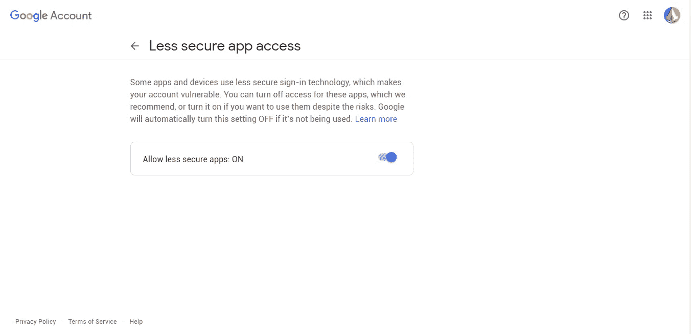

# 如何用 Python 发送 Gmail 分步指南

> 原文：<https://blog.devgenius.io/how-to-send-gmail-with-python-step-by-step-guide-478b07251208?source=collection_archive---------1----------------------->

[Solen Feyissa](https://unsplash.com/@solenfeyissa?utm_source=medium&utm_medium=referral) 在 [Unsplash](https://unsplash.com?utm_source=medium&utm_medium=referral) 上拍照

Gmail 是世界上使用最广泛的个人和商业电子邮件，你在日常生活中会使用 Gmail 来查看学习邮件、进行营销、与人交流等等。这是我们日常生活的一部分，但如果我们想制造一个能自己发送 Gmail 的电脑机器人，我们为什么需要它呢？举一个简单的例子，你是一家商店的老板，你有一些新的股票，你想给你的客户发送关于它的通知，在这种情况下，Gmail 机器人可以用来发送邮件到每个客户的电子邮件，再举一个例子，你刚刚创建了一个程序，删除一个网页，并以 CSV 或 EXCEL 格式存储数据，你希望机器人应该自动将这些数据发送给某人。Gmail 机器人有很多用途。在本文中，我们将使用 `SMTP`模块用 python 构建一个 Gmail 发送机器人。所以在浪费时间之前，让我们直入主题吧。

首先你需要最新版本的 Python，如果你没有，只需根据你的操作系统点击 URL `[https://www.python.org/downloads/](https://www.python.org/downloads/)`下载最新版本，如果你已经完成了这一步，下一步就是创建一个 py 文件并安装我们需要的模块。我在下面添加了模块，只需复制并粘贴到你的命令提示符下 `*Pip bult-in module*`python 会自动下载并安装这些模块。

`pip install smtp
pip install emails`

我们需要设置我们的 Gmail，这样 SMTP 服务器将被 Gmail 服务器拒绝，这一步是必要的，如果你不这样做，你会得到一个错误。当 SMTP 尝试登录 Gmail 时。Gmail 服务器将给出 404 错误以解决这个问题，我们将设置我们的 Gmail 以允许 SMPT 登录过程。点击这个网址[https://myaccount.google.com/security](https://myaccount.google.com/security)向下滚动，找到不太安全的应用程序访问点击它，你会看到一个页面显示允许不太安全的应用程序:谷歌默认关闭，只要打开它。

# 编码:

好了，我们已经完成了 python 及其模块的安装，让我们开始编写机器人代码。在启动时，我们需要使用`import`函数加载 py 文件中的模块。

内联 1 到 5 我们已经将模块导入到您的 py 文件中，smtp 模块用于登录 Gmail 并将邮件发送给收件人，电子邮件模块用于以字节形式制作内容和用户详细信息，以便 SMTP 可以获取它。在接下来的几行中，我们将对发送者和接收者的详细信息进行编码。

第 1 行到第 3 行，我们已经讨论过加载模块，从第 5 行到第 9 行，我添加了发送者和接收者的详细信息。正文是邮件的内容，就像我们想要传递给收件人的文本或消息一样。用户名和密码是必需的，因为 SMTP 服务器需要您的登录信息来登录 Gmail 服务器，如果没有这些信息，他们会在您的程序中抛出一个错误。

多用途互联网邮件扩展(MIME)是一种互联网标准，它扩展了电子邮件的格式，以支持 ASCII 以外的字符集的文本，以及音频、视频、图像和应用程序的附件。从第 11 行到第 15 行，我们使用 MIME 函数来设置我们的电子邮件详细信息。它会将我们的电子邮件详细信息和消息格式化为支持字符集，以便于 smtp 阅读。正如你看到的上面的代码，我们存储了函数 mime multipart()address int eh message 变量，从第 13 行到第 15 行，我们添加了 from、to 和 Subject 到我们的邮件设置中。

在代码行的最后扩展中，我们创建了一个发送 Gmail 的 SMTP 会话。第 19 行显示我们已经使用了 smtplib。SMTP()函数并将它的地址存储在会话中。该函数包含两个参数，一个用于当前位于 smtp.gmail.com 的主机服务器，另一个用于端口号。通常，我们使用端口号 587 或 465，你可以使用任何适合你的。第 20 行显示我们已经使用了`starttls()`函数，这是一个安全启用函数，你也可以选择在你的脚本中使用它，但是如果你使用的是第三方邮件服务器，那么就有必要添加这个安全性。第 21 行我使用了来自 SMTP 的 login()函数，它带有两个参数 email 和 password。Inline 22 我们使用 SMTP 的`as_string()`函数将消息转换成字符串形式。第 23 行显示我使用了 `sendmail()` 函数，绕过了发件人地址、收件人地址和包含 SMTP 将登录的邮件的正文，创建了一封邮件并发送给收件人，在代码的最后一行，我们从 SMTP 服务器注销了 Gmail。

所以我们用 Python 创建了一个完整的电子邮件机器人，你可以根据需要修改代码。希望这篇文章对你以后有所帮助。