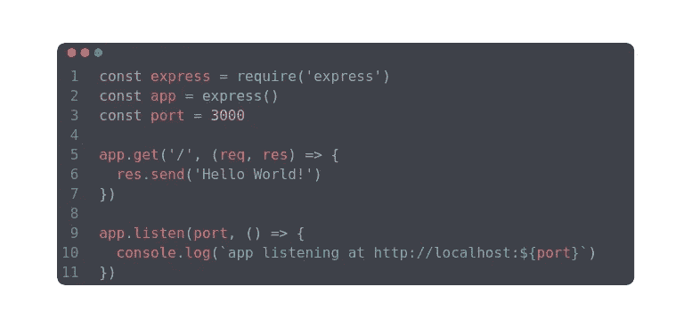
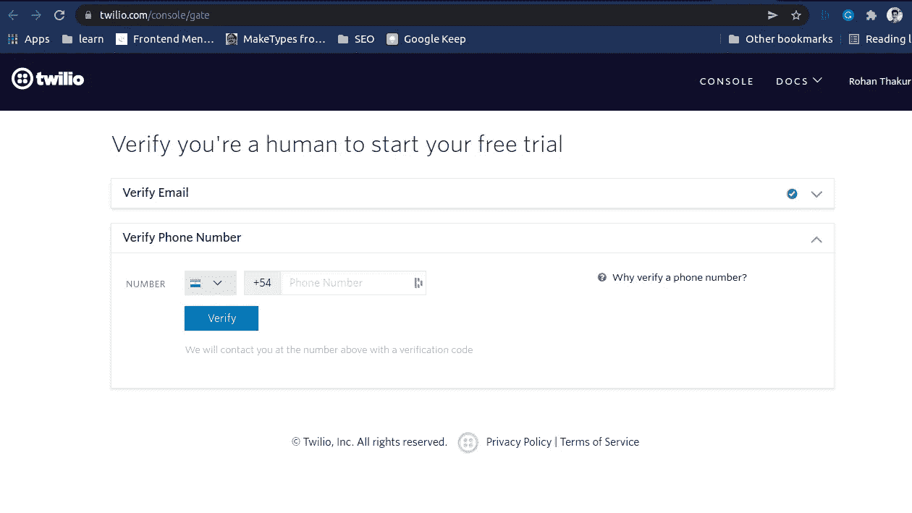
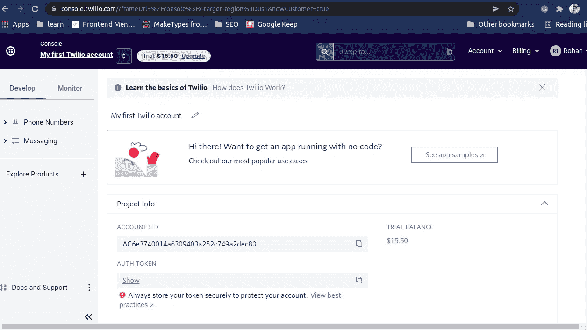
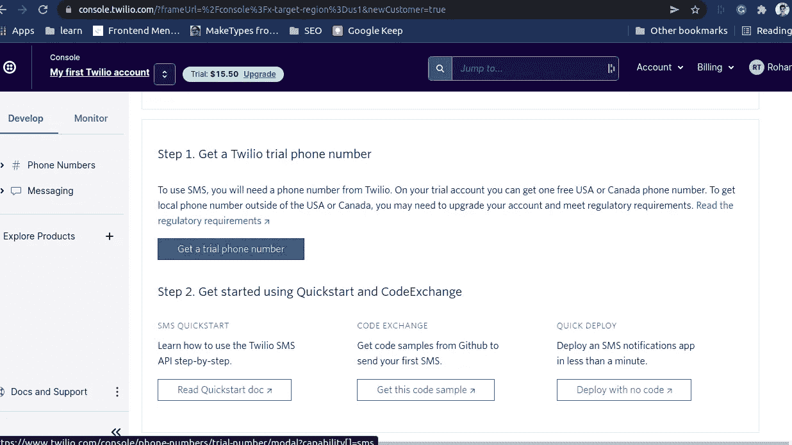
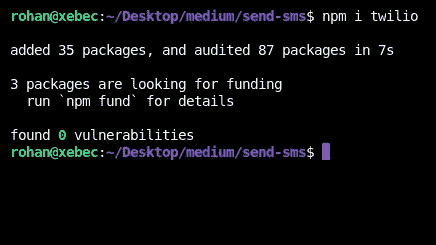
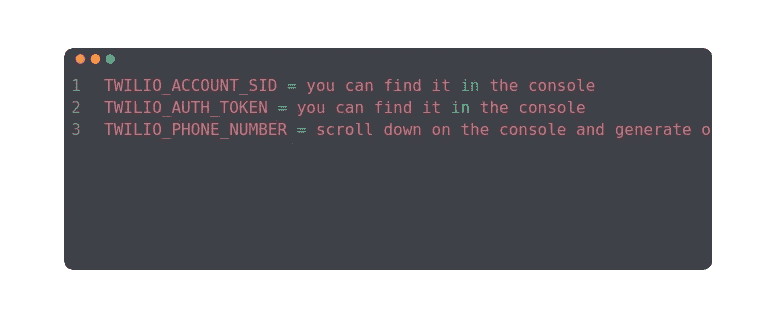
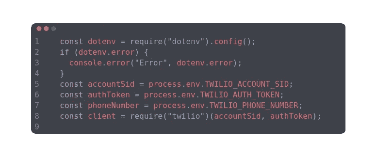
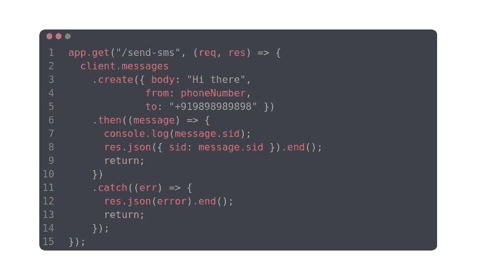
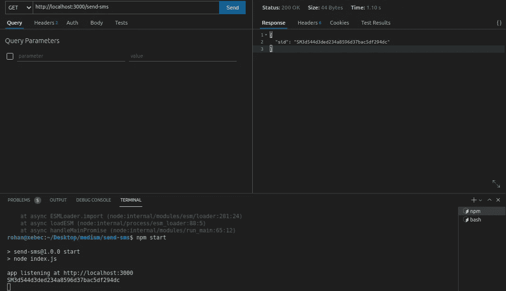
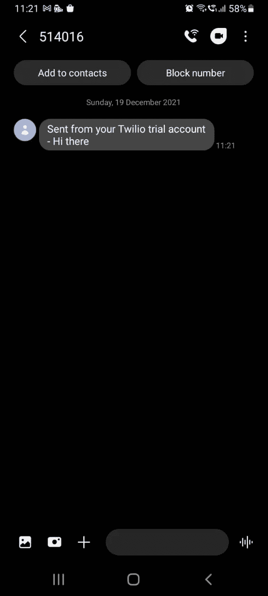

# 如何使用 Twilio 在 NodeJS 中发送短信

> 原文：<https://blog.devgenius.io/how-to-send-sms-in-nodejs-using-twilio-32afabd56f5d?source=collection_archive---------10----------------------->

未提款信用证

发送电子邮件或显示通知很酷，但有时对于简洁和及时的信息，短信被证明是更好的沟通渠道。在本文中，我们将学习如何通过编程从 web 应用程序发送 SMS。

让我们启动代码编辑器，设置一个基本的 node/express 应用程序。

下一步是登录 Twilio 并确认我们的电话号码

设置好 Twilio 帐户后，我们可以前往 Twilio 仪表板右上方的控制台获取 API 密钥。

现在，是时候得到一个 Twilio 的电话号码了。我们需要在控制台上向下滚动，然后单击“获取试用电话号码”选项。

在确认了 Twilio 提供的电话号码后，我们准备编写一些代码。

首先，我们安装 Twilio npm 包

然后，我们将把 Twilio 提供的帐户 sid、auth-token 和电话号码保存在我们的环境文件中。

我们将使用 *dotenv* 来保存我们的环境文件，然后我们将设置我们的 Twilio 客户端。

设置客户端后，我们将创建一个端点，该端点将使用我们的 Twilio 电话号码向给定的接收方电话号码发送 SMS。我们应该注意，收件人的电话号码应该以+(国家代码)为前缀，如+919898989898，其中+91 是印度的国家代码。

让我们检查一下这个端点。

短信发送到给定的电话号码。

万岁！现在，我们准备向用户发送短信。

源代码:【https://github.com/Xebec19/twilio-medium 