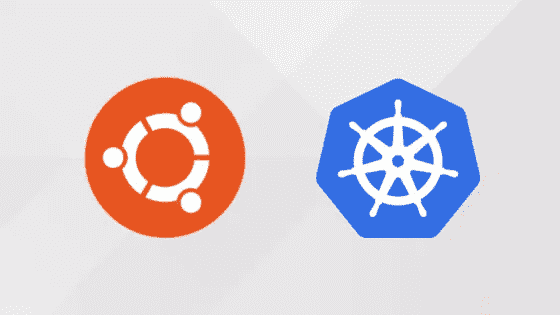

# 如何为 CKA、CKAD 和 CKS 考试设置多节点 Kubernetes 本地集群

> 原文：<https://blog.devgenius.io/how-to-set-up-a-multi-node-kubernetes-local-cluster-for-cka-ckad-cks-exams-ee6ccdb03b9f?source=collection_archive---------6----------------------->

在本地环境中建立 Kubernetes 集群有很多方法，我已经测试了一些工具，在这里我提供了我认为最好的方法，尤其是如果你的目的是为了参加 CKA/CKAD/CKS 认证考试。

我们将需要在我们的 PC/笔记本电脑上创建虚拟机，为此我将使用一个[规范](https://canonical.com/)产品: [**多次**](https://multipass.run/) 。我用了很长时间，在我看来创建 Ubuntu 虚拟机是最好的选择。

对于集群初始化，我们将使用 Kubernetes 官方文档中推荐的 [**kubeadm**](https://kubernetes.io/docs/setup/production-environment/tools/kubeadm/install-kubeadm/) 。

在这里，我引用一些理由来说明为什么使用这个堆栈比使用 minikube、microk8s、k3s、RKE、EKS、AKS、GKE 等其他选项更好:

1.  **主要原因**:不需要安装 ***Docker*** ，您将使用 ***containerd*** 作为容器运行时， ***crictl*** 作为符合 CRI 的容器运行时的 cli，如果您需要构建 Dockerfile，您将使用 ***podman*** 。
2.  没有必要在 Ubuntu 虚拟机上安装额外的依赖项，你需要的是干净的节点，其中只有你需要处理的内容。
3.  您还需要您的集群是干净的，您不需要安装额外的 Kubernetes 资源，比如 CRD、statefulsets、守护进程、服务、部署等等。
4.  ***Multipass*** 和 *Ubuntu* 是由 *Canonical、*开发的，这些都有他们的支持。
5.  您需要完全控制您的集群，尤其是您的控制平面节点。这就是为什么 Kubernetes 托管服务是无用的(EKS，AKS，GKE，等等)。
6.  你需要 Ubuntu 节点来模拟 CKA/CKAD/CKS 考试。

# **要求:**

确保至少有 4 GB 内存、4 个空闲 CPU 内核和 20 Gb 用于虚拟机。

我建议使用这些资源来避免性能和磁盘空间问题:

**控制平面**(主节点):

*   2 Gb 内存
*   2 个 CPU 内核
*   10 Gb 磁盘

**工作者**(工作者节点):

*   2 Gb 内存
*   2 个 CPU 内核
*   10 Gb 磁盘

# Kubernetes 集群配置

这里就不多说了，我附上了一个带有 readme 文件的 Git 存储库，在这里您可以看到 Kubernetes 集群配置的一步一步:

 [## GitHub-stazdx/k8s-local-environment:如何在 10 分钟内创建一个多节点 Kubernetes 集群…

### 对于这个演示，我们将使用 Multipass 创建 2 个 Ubuntu 节点。此外，我们可以使用这个集群环境来练习…

github.com](https://github.com/stazdx/k8s-local-environment) 

***注:*** *本文所应用的是基于我的经验，并不是能够做到的唯一方法。*

# 相关职位

 [## CKA、CKAD 和 CKS 证书的一般和技术

### 韩参加了四个星期的比赛。我建议重新获得认证…

medium.com](https://medium.com/@stazdx/tips-generales-y-t%C3%A9cnicos-para-las-certificaciones-cka-ckad-y-cks-d2bc22d7ba90)